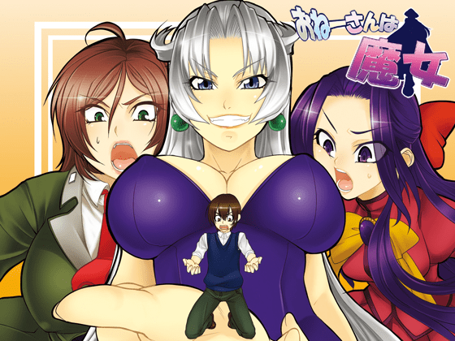

# 谁能把这个游戏改成小说（有奖励点奖励）

作者：hiahia

TID：19589

<title>1</title> <link href="../Styles/Style.css" type="text/css" rel="stylesheet">

# 1

过4000字就有20奖励点，过万字私聊我，可以给漫画奖励，或者是视频、游戏等奖励，希望是温柔系（不用太温柔）的3女主都写，游戏里的气味描写是稍微有点臭的，所以气味描写就往臭写吧（其实楼主喜欢入阴啊。。啊。。。啊。。。。啊）。希望大家能写出好文章。 <title>2</title> <link href="../Styles/Style.css" type="text/css" rel="stylesheet">

# 2

 <ignore_js_op>[560x420.jpg](forum.php?mod=attachment&aid=NTM2OTV8YzEwMjU1NGJ8MTY3NDA2ODE1MXwxODIzMHwxOTU4OQ%3D%3D&nothumb=yes) *(251.65 KB, 下載次數: 20)*

[下載附件](forum.php?mod=attachment&aid=NTM2OTV8YzEwMjU1NGJ8MTY3NDA2ODE1MXwxODIzMHwxOTU4OQ%3D%3D&nothumb=yes)

2015-8-6 14:11 上傳  

就是这个おねーさんは魔女

</ignore_js_op> <title>3</title> <link href="../Styles/Style.css" type="text/css" rel="stylesheet">

# 3

所以說
遊戲下載地址呢 <title>4</title> <link href="../Styles/Style.css" type="text/css" rel="stylesheet">

# 4

···
这个不是老游戏了吗？

所以说这个是地址  [http://pan.baidu.com/s/1o668tia](http://pan.baidu.com/s/1o668tia)
         这个是密码  umu4
链接失效了表找我，谁让你们写文找谁去··· <title>5</title> <link href="../Styles/Style.css" type="text/css" rel="stylesheet">

# 5

> [暗影使者 發表於 2015-8-6 15:48](https://giantessnight.cf/gnforum2012/forum.php?mod=redirect&goto=findpost&pid=264626&ptid=19589)
> ···
> 这个不是老游戏了吗？

我的网盘出问题了，什么也分享不了，感谢分享游戏。 <title>6</title> <link href="../Styles/Style.css" type="text/css" rel="stylesheet">

# 6

很久之前从gtl哪里淘来的，一直就忘了玩...有没有存档啊... <title>7</title> <link href="../Styles/Style.css" type="text/css" rel="stylesheet">

# 7

旧的这种 应该可以直接把文本扣下来翻译成中文就好
改编成文章耗费太大 首先要自己翻译（看得懂的翻译或者看不懂的脑补翻译） 翻译完之后还要改成合理的叙述形式......想想还是直接挂外挂翻译器玩游戏吧，还有图片是不是？ <title>8</title> <link href="../Styles/Style.css" type="text/css" rel="stylesheet">

# 8

我记得魏老爷有过想翻译这个游戏的意向，不过好像沉了 <title>9</title> <link href="../Styles/Style.css" type="text/css" rel="stylesheet">

# 9

*本帖最後由 紫色欧石楠 於 2015-8-7 02:07 編輯*

重温下老作品是不错。。。不过原作不就是小说性质么。。。比起写。。不如说翻译原作吧 囧。。（另外这个游戏可以在论坛里分享么。。） <title>10</title> <link href="../Styles/Style.css" type="text/css" rel="stylesheet">

# 10

【呃。。这个游戏是不是禁止在论坛被分享的（iraf的商业作品系列）。。】
第一，我记得以前有人分享过···
第二，真的已经是老作品了，那时候我可能还上初中或者高中呢。所以我觉得就算现在拿出来分享也没什么事了···

【旧的这种 应该可以直接把文本扣下来翻译成中文就好
改编成文章耗费太大 首先要自己翻译（看得懂的翻译或者看不懂的脑补翻译） 翻译完之后还要改成合理的叙述形式......想想还是直接挂外挂翻译器玩游戏吧，还有图片是不是？】

这个我也想到了，如果找一个会日文的人写可能是一篇贴近原文的文章。可如果是一个压根就不懂日文的人来写的话···
说不定最后踢了死能得到两篇也说不定呢

不过我觉的，没人写的几率可能更大··· <title>11</title> <link href="../Styles/Style.css" type="text/css" rel="stylesheet">

# 11

三个里面貌似就一个是ge线，其他两个怎么选都不怎么好。