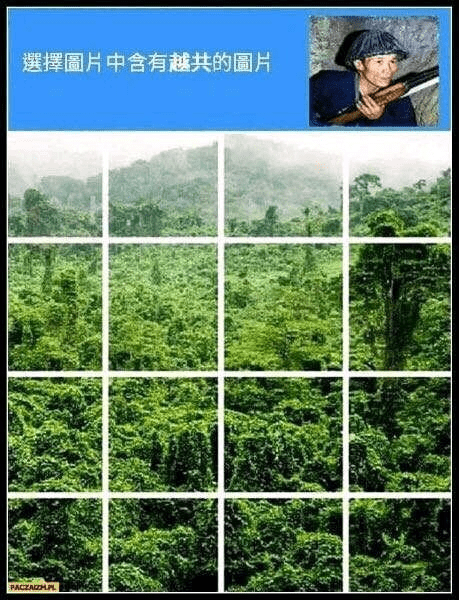

# 调查一下论坛里有多少车车人。。

作者：painkiller

TID：27951

<title>1</title> <link href="../Styles/Style.css" type="text/css" rel="stylesheet">

# 1

换不了头像 不知道为什么 <title>2</title> <link href="../Styles/Style.css" type="text/css" rel="stylesheet">

# 2

我报道

看头像 <title>3</title> <link href="../Styles/Style.css" type="text/css" rel="stylesheet">

# 3

车车人是啥意思啊？
刚刚试了一下，我也换不了头像，罢了，无所谓 <title>4</title> <link href="../Styles/Style.css" type="text/css" rel="stylesheet">

# 4

哪里有什么车车人，只有600越共。（ <title>5</title> <link href="../Styles/Style.css" type="text/css" rel="stylesheet">

# 5

本站应该有不少车万人吧，毕竟翻译了很多东方gts文 <title>6</title> <link href="../Styles/Style.css" type="text/css" rel="stylesheet">

# 6

= = 路过
啥？车车人？那是什么，好吃吗（ <title>7</title> <link href="../Styles/Style.css" type="text/css" rel="stylesheet">

# 7

退坑的车车人算吗？已经两年多没关注车万了 <title>8</title> <link href="../Styles/Style.css" type="text/css" rel="stylesheet">

# 8

不对，不是两年多，已经三年多了，一些角色的名字我都已经忘了 <title>9</title> <link href="../Styles/Style.css" type="text/css" rel="stylesheet">

# 9

我记得我看的第一本本子就是车万的gts本 罪大恶极啊 顺便看看在这里能遇见几个越共   4/600 <title>10</title> <link href="../Styles/Style.css" type="text/css" rel="stylesheet">

# 10

> 我是萝莉控 發表於 2020-2-2 19:14
> 哪里有什么车车人，只有600越共。（

不愧是m子 在这里也能看到你（
翻的帖子越多 见到的越共越多 <title>11</title> <link href="../Styles/Style.css" type="text/css" rel="stylesheet">

# 11

> [leo1223 發表於 2020-2-2 15:24](https://giantessnight.cf/gnforum2012/forum.php?mod=redirect&goto=findpost&pid=424541&ptid=27951)
> 我报道

航哥!（划掉）阿空好! 我是猫车（继续划掉）好吧我是罪袋
<title>12</title> <link href="../Styles/Style.css" type="text/css" rel="stylesheet">

# 12

> [宇宙巨娘大和号 發表於 2020-2-2 22:13](https://giantessnight.cf/gnforum2012/forum.php?mod=redirect&goto=findpost&pid=424561&ptid=27951)
> 不对，不是两年多，已经三年多了，一些角色的名字我都已经忘了

我因为学业好久没看车万了（
<title>13</title> <link href="../Styles/Style.css" type="text/css" rel="stylesheet">

# 13

> [painkiller 發表於 2020-2-2 18:30](https://giantessnight.cf/gnforum2012/forum.php?mod=redirect&goto=findpost&pid=424548&ptid=27951)
> 车车人是啥意思啊？
> 刚刚试了一下，我也换不了头像，罢了，无所谓

东百project（误）
熟悉的猫猫头像 好像经常能见到????
<title>14</title> <link href="../Styles/Style.css" type="text/css" rel="stylesheet">

# 14

车万厨会有的，就是东方的gts资源并不多QAQ <title>15</title> <link href="../Styles/Style.css" type="text/css" rel="stylesheet">

# 15

埋伏的越共从泥坑里拿起了AK.jpg <title>16</title> <link href="../Styles/Style.css" type="text/css" rel="stylesheet">

# 16

钓鱼越共不可取.jpg
（越共++ <title>17</title> <link href="../Styles/Style.css" type="text/css" rel="stylesheet">

# 17

所以有人知道怎么改头像 我要换紫老太bsjsgsjsjgsjejedhsjsbdsj
<title>18</title> <link href="../Styles/Style.css" type="text/css" rel="stylesheet">

# 18

> [紫色欧石楠 發表於 2020-2-2 23:56](https://giantessnight.cf/gnforum2012/forum.php?mod=redirect&goto=findpost&pid=424591&ptid=27951)
> 埋伏的越共从泥坑里拿起了AK.jpg

越共汇合 ？/600
为什么到处都是越共（
<title>19</title> <link href="../Styles/Style.css" type="text/css" rel="stylesheet">

# 19

 <ignore_js_op>[1580480737981.jpeg](forum.php?mod=attachment&aid=ODEyMDZ8OTM5Y2RiZTB8MTY3NDA2NjM5MXwxODIzMHwyNzk1MQ%3D%3D&nothumb=yes) *(89.47 KB, 下載次數: 0)*

[下載附件](forum.php?mod=attachment&aid=ODEyMDZ8OTM5Y2RiZTB8MTY3NDA2NjM5MXwxODIzMHwyNzk1MQ%3D%3D&nothumb=yes)

2020-2-3 11:25 上傳  

</ignore_js_op> <title>20</title> <link href="../Styles/Style.css" type="text/css" rel="stylesheet">

# 20

> [空白酱 發表於 2020-2-3 08:42](https://giantessnight.cf/gnforum2012/forum.php?mod=redirect&goto=findpost&pid=424618&ptid=27951)
> 钓鱼越共不可取.jpg
> （越共++

我认为这是ao的（不
顺遍求头像是谁 好康

<title>21</title> <link href="../Styles/Style.css" type="text/css" rel="stylesheet">

# 21

我算是一直有在关注车车的相关消息吧 <title>22</title> <link href="../Styles/Style.css" type="text/css" rel="stylesheet">

# 22

> [B1Zu 發表於 2020-2-2 23:27](https://giantessnight.cf/gnforum2012/forum.php?mod=redirect&goto=findpost&pid=424581&ptid=27951)
> 东百project（误）
> 熟悉的猫猫头像 好像经常能见到????

还是不懂……
这只猫是流泪猫猫头啊，百度能搜到很多这种猫图片的
<title>23</title> <link href="../Styles/Style.css" type="text/css" rel="stylesheet">

# 23

> 我是萝莉控 發表於 2020-2-2 19:14
> 哪里有什么车车人，只有600越共。（

600越共可还行，这个梗算是过不去了2333 <title>24</title> <link href="../Styles/Style.css" type="text/css" rel="stylesheet">

# 24

俺也是个车万人，请问您有兴趣建群吗？但实际上老一辈们都知道车万吧 <title>25</title> <link href="../Styles/Style.css" type="text/css" rel="stylesheet">

# 25

车车人难道不是无处不在的越共吗 <title>26</title> <link href="../Styles/Style.css" type="text/css" rel="stylesheet">

# 26

"剖开一个边缘ACG爱好者，你就会看到一个越共"( <title>27</title> <link href="../Styles/Style.css" type="text/css" rel="stylesheet">

# 27

想弱弱的问一下，什么是车车人啊