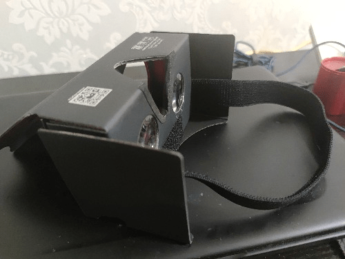

# 谷歌有一款纸壳做的VR，插手机就能看。

作者：饿狼渴望自由

TID：33747

<title>1</title> <link href="../Styles/Style.css" type="text/css" rel="stylesheet">

# 1

VR其实并不复杂，只要有资源有手机，设备的原理就是固定住两片凸透镜就可以了。只需要10多块钱或20多块钱。 <title>2</title> <link href="../Styles/Style.css" type="text/css" rel="stylesheet">

# 2

 <ignore_js_op>[MVIMG_20220725_203402.jpg](forum.php?mod=attachment&aid=OTc4Mzl8M2I5MDcwYTd8MTY3NDA2OTMxOHwxODIzMHwzMzc0Nw%3D%3D&nothumb=yes) *(38.25 KB, 下載次數: 1)*

[下載附件](forum.php?mod=attachment&aid=OTc4Mzl8M2I5MDcwYTd8MTY3NDA2OTMxOHwxODIzMHwzMzc0Nw%3D%3D&nothumb=yes)

2022-7-25 20:38 上傳  

</ignore_js_op> <title>3</title> <link href="../Styles/Style.css" type="text/css" rel="stylesheet">

# 3

但是好像不能调屏幕前后的距离，所以近视的同志可能有点费劲。因为是纸壳的不怎么好固定和微调但好好调调就不怎么模糊了。 <title>4</title> <link href="../Styles/Style.css" type="text/css" rel="stylesheet">

# 4

这款也就图一乐 实际上核心是2个镜片 但是原理和市面上的VR产品也都差不多 <title>5</title> <link href="../Styles/Style.css" type="text/css" rel="stylesheet">

# 5

> wwwnwy 發表於 2022-7-25 22:21
> 这款也就图一乐 实际上核心是2个镜片 但是原理和市面上的VR产品也都差不多  ...

这款的优点就是十分的便宜。我感觉vr目前发展的还是比较鸡肋的，真没必要花多少钱买个一体的，玩不上几次也很费眼睛。这个就十多块钱，可以给没看过VR版的GTS片的人试试。 <title>6</title> <link href="../Styles/Style.css" type="text/css" rel="stylesheet">

# 6

好像是，非常的方便呢。感谢分享先。有机会去试试我也。 <title>7</title> <link href="../Styles/Style.css" type="text/css" rel="stylesheet">

# 7

记得以前用过，好像是google cardboard吧，是我的vr启蒙设备了。之前买来自己装好感觉开启了vr的大门，能看360全景视频和图片，搭配google street view甚至可以自己拍全景照片然后看。因为这个才后来陆续买了go和quest 2。感觉对于想体验vr的人来说是最划算的设备了。 <title>8</title> <link href="../Styles/Style.css" type="text/css" rel="stylesheet">

# 8

> [触碰不到的笑 發表於 2022-7-26 01:51](https://giantessnight.cf/gnforum2012/forum.php?mod=redirect&goto=findpost&pid=510490&ptid=33747)
> 这款的优点就是十分的便宜。我感觉vr目前发展的还是比较鸡肋的，真没必要花多少钱买个一体的，玩不上几次 ...

这个设备的唯一优点就是便宜，它对手机屏幕和手机本身性能的要求太高了，而且常规VR的缺点它也都有。但在它个位数的价格（1688上更便宜甚至还包邮）面前这些都可以忽略。
<title>9</title> <link href="../Styles/Style.css" type="text/css" rel="stylesheet">

# 9

在论坛存了一些vr资源一直没法看
这个位数的价格已经能让我忽略其他缺点了 <title>10</title> <link href="../Styles/Style.css" type="text/css" rel="stylesheet">

# 10

> St2019 發表於 2022-7-26 10:54
> 记得以前用过，好像是google cardboard吧，是我的vr启蒙设备了。之前买来自己装好感觉开启了vr的大门，能看 ...

是的，谷歌这个点子我感觉非常不错。给予那些只想略微体验VR的人很直接帮助。而且就是纸壳与两片凸透镜，成本可能就一瓶矿泉水的钱。 <title>11</title> <link href="../Styles/Style.css" type="text/css" rel="stylesheet">

# 11

很多圈内游戏没有分左右屏的功能，比如resize me和grimm5 inventation <title>12</title> <link href="../Styles/Style.css" type="text/css" rel="stylesheet">

# 12

手机上到时有个VRharpy可以用这种设备玩，除此之外还有吗，求指教 <title>13</title> <link href="../Styles/Style.css" type="text/css" rel="stylesheet">

# 13

> 饿狼渴望自由 發表於 2022-7-27 15:07
> 手机上到时有个VRharpy可以用这种设备玩，除此之外还有吗，求指教

你说的那个是游戏吗？ 这个纸壳vr只是有最基本的功能，也就用来看看视频尝尝鲜，游戏肯定不行。 <title>14</title> <link href="../Styles/Style.css" type="text/css" rel="stylesheet">

# 14

市面上很多VR眼镜虽然可以调视距，但我这种散光的人就非常苦恼 <title>15</title> <link href="../Styles/Style.css" type="text/css" rel="stylesheet">

# 15

这个也是我vr启蒙之一了（甚至可能没有之一），老实说缺点很明显，对手机的性能和屏幕要求很大，假如遇到那种手机解码不了的视频只能转码（熟练打开ffmpeg.jpg），屏幕差的观感也不好。
但优点太大了：便宜，光这一点就能在性价比上完爆市面上的vr设备，可以说用最低的成本完成了基本要求，动手能力好的甚至可以自己整两块镜片后3d打印一个架子自己适配套进去，我是非常推荐暂且囊中羞涩或者先观望vr设备入坑的同好先试试用这种眼镜，对于第一次体验的人来说会带来前所未有的临场感和真实感 <title>16</title> <link href="../Styles/Style.css" type="text/css" rel="stylesheet">

# 16

挺好 有时间买一个，有一些想试试的vr作品一直没试过 <title>17</title> <link href="../Styles/Style.css" type="text/css" rel="stylesheet">

# 17

> 饿狼渴望自由 發表於 2022-7-27 15:06
> 很多圈内游戏没有分左右屏的功能，比如resize me和grimm5 inventation

这些游戏就需要真正的vr头显才能玩了 玩是真的好玩，但是画质还是有很大进步的空间。 <title>18</title> <link href="../Styles/Style.css" type="text/css" rel="stylesheet">

# 18

> s孙晓美 發表於 2022-8-7 15:26
> 这些游戏就需要真正的vr头显才能玩了 玩是真的好玩，但是画质还是有很大进步的空间。 ...

说vr视频里的清晰度要达到16k才能达到和现实差不多的感觉。现在已经有8k视频了，但是其占用的内存已经相当之大了。更何况vr市场并不景气，没人这花大钱搞这个。vr画质提升太缓慢了。 <title>19</title> <link href="../Styles/Style.css" type="text/css" rel="stylesheet">

# 19

这种盒子尺寸和固定都是问题啊 手机放不稳 戴在头上重心也很奇怪 <title>20</title> <link href="../Styles/Style.css" type="text/css" rel="stylesheet">

# 20

> YakumoAmagi 發表於 2022-8-12 21:46
> 这种盒子尺寸和固定都是问题啊 手机放不稳 戴在头上重心也很奇怪

其实手机放上挺稳的。。。附带一些粘贴 贴纸壳上能增大摩擦力。