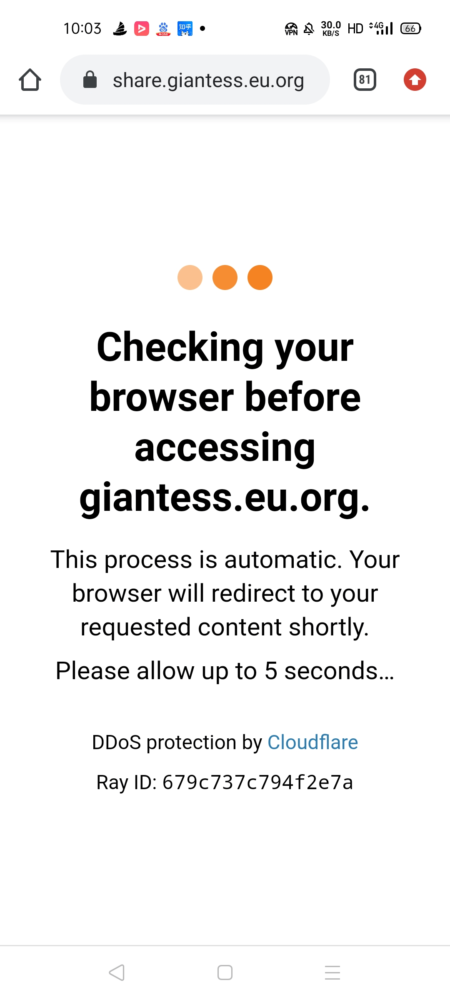

# 资源更新公告（9.2更新上传ResizeMe新版本）

作者：Lcxzyr

TID：31375

<title>1</title> <link href="../Styles/Style.css" type="text/css" rel="stylesheet">

# 1

*本帖最後由 Lcxzyr 於 2021-9-2 12:09 編輯*

嗯，事情是这样的，我维护着一个**公益**资源站点（[网址戳这里](https://giantessnight.com/gnforum2012/forum.php?mod=viewthread&tid=30944)）

我在帖子中承诺资源将持续更新，但我更新以后知道的人不多，得要各位不时翻翻才能发现资源更新了。
所以我想在这里开个帖子，将我在站点中更新的资源在这里贴出来，以便大伙跟进。
**另外再次强调由于微软的限制，不能批量抓取和下载，会导致经常暂时性的不可用！**  
虽然是免费分享的，我目前考虑针对那些不满足于在线看看而想要一次下完的用户，提供云盘拷贝服务，即提供一个包含分享站点所有资源的5T容量的网盘，并针对我的劳动收取一定数额的服务费。
~~目前暂定支持使用虚拟货币支付，暂定价格为8个ERC-USDT。~~

似乎没有找到合适的交易平台¯\_(ツ)_/¯，价格暂定40CYN（不带后期更新支持），80CYN（带长期更新支持），有意者站内私信。

**再次声明：资源是免费分享的，绝对不会出现资源付费观看的情况！**
**添加了线路2，具体请见**[GiantessPan升级体验 - 今夜我們來談天 - GiantessNight - Powered by Discuz!](https://giantessnight.com/gnforum2012/forum.php?mod=viewthread&tid=31594)
所收取费用仅针对所提供的网盘以及拷盘手工
劳动！

++++++++++++++++++++++++++++++++++++++++++++++++

**我写了但是没显示大概率是我自己被节流了，503表示你被节流了！**

++++++++++++++++++++++++++++++++++++++++++++++++

2021.7.31更新内容： 删除图片分区中"mel旧作"文件夹，替换为Mel锁推前发 在MEGA网盘的8G大图包

++++++++++++++++++++++++++++++++++++++++++++++++

2021.8.1更新内容： 同步芊芊（艾彩）两部

同步焰灵姬三部（感谢 @beloved ）

++++++++++++++++++++++++++++++++++++++++++++++++

2021.8.2更新内容： 更新上传鹿宝儿两部（感谢@摸鱼摸鱼）

++++++++++++++++++++++++++++++++++++++++++++++++

2021.8.17更新内容：更新上传 物恋 图包（约100+GB，感谢某群友自购分享）
*内部更新YC图包*
++++++++++++++++++++++++++++++++++++++++++++++++

2021.8.20更新内容：更新上传个人收集散图若干，更新上传游戏禁じられた遊び（简中版）
++++++++++++++++++++++++++++++++++++++++++++++++

2021.8.24更新内容：更新上传神楽坂真冬图集
更新上传蓓蓓VIP足控套图
更新补全 森萝财团JKFUN 图包（136G）
森萝财团系列全面收集完成

++++++++++++++++++++++++++++++++++++++++++++++++

2021.8.30更新内容：更新上传自己汉化的GTSGame Escape

++++++++++++++++++++++++++++++++++++++++++++++++

2021.9.2更新内容：【ResizeMe新版本】Ver.064 (test version)

++++++++++++++++++++++++++++++++++++++++++++++++

<title>2</title> <link href="../Styles/Style.css" type="text/css" rel="stylesheet">

# 2

7.31更新内容：
删除图片分区中“mel旧作”文件夹，替换为Mel锁推前发在MEGA网盘的8G大图包 <title>3</title> <link href="../Styles/Style.css" type="text/css" rel="stylesheet">

# 3

很多点进去都是503 Service Temporarily Unavailable。唯爱足的可以更新抓取到今年的吗 <title>4</title> <link href="../Styles/Style.css" type="text/css" rel="stylesheet">

# 4

> 充气的妹妹 發表於 2021-7-31 22:18
> 很多点进去都是503 Service Temporarily Unavailable。唯爱足的可以更新抓取到今年的吗 ...

503就是被节流了，这个是无解的，资源都在，微软觉得不行我也没有办法。
唯爱足是别人分享的，不是我自己抓取的，这个我也没办法，有机会我也会跟进。 <title>5</title> <link href="../Styles/Style.css" type="text/css" rel="stylesheet">

# 5

感谢大佬的整理！
以后会公开征集资源吗？ <title>6</title> <link href="../Styles/Style.css" type="text/css" rel="stylesheet">

# 6

> [大朱投 發表於 2021-7-31 23:02](https://giantessnight.cf/gnforum2012/forum.php?mod=redirect&goto=findpost&pid=475262&ptid=31375)
> 感谢大佬的整理！
> 以后会公开征集资源吗？

公开征集倒不至于，我一般是从自己的渠道看有啥好东西征得同意就搬过去了，有啥好东西在GN公开分享就成，我喜欢的话会问的
<title>7</title> <link href="../Styles/Style.css" type="text/css" rel="stylesheet">

# 7

2021.8.1更新内容：
同步芊芊（艾彩）两部
同步焰灵姬三部（感谢 @beloved ） <title>8</title> <link href="../Styles/Style.css" type="text/css" rel="stylesheet">

# 8

试着连接了[https://share.giantess.eu.org](https://share.giantess.eu.org)

不过貌似我出现了Error 1020

不知道是不是Chrome插件装太多了 <title>9</title> <link href="../Styles/Style.css" type="text/css" rel="stylesheet">

# 9

还有话说8个ERC-USDT是什么意思？

是说相当于8 USD的Ethereum币么？ <title>10</title> <link href="../Styles/Style.css" type="text/css" rel="stylesheet">

# 10

*本帖最後由 Lcxzyr 於 2021-8-1 10:44 編輯*

> 狐乐 發表於 2021-8-1 07:47
> 还有话说8个ERC-USDT是什么意思？
> 
> 是说相当于8 USD的Ethereum币么？

不是，是8个运行在eth网络上的USDT（泰达币）

另外看到错误1020需要检查是否使用了并非大陆香港或者台湾的IP地址进行了访问，因为海外的访问是违反防火墙规则的

<title>11</title> <link href="../Styles/Style.css" type="text/css" rel="stylesheet">

# 11

> [Lcxzyr 發表於 2021-8-1 10:37](https://giantessnight.cf/gnforum2012/forum.php?mod=redirect&goto=findpost&pid=475304&ptid=31375)
> 不是，是8个运行在eth网络上的USDT（泰达币）
> 
> 另外看到错误1020需要检查是否使用了并非大陆香港或者台湾 ...

啊，我必败了。

因为是海湾党所以没有国内的线路。

难受。
<title>12</title> <link href="../Styles/Style.css" type="text/css" rel="stylesheet">

# 12

> [狐乐 發表於 2021-8-1 12:27](https://giantessnight.cf/gnforum2012/forum.php?mod=redirect&goto=findpost&pid=475307&ptid=31375)
> 啊，我必败了。
> 
> 因为是海湾党所以没有国内的线路。

如果能有固定IP的话倒也不是不可以添加一个例外
<title>13</title> <link href="../Styles/Style.css" type="text/css" rel="stylesheet">

# 13

> [Lcxzyr 發表於 2021-8-1 15:09](https://giantessnight.cf/gnforum2012/forum.php?mod=redirect&goto=findpost&pid=475317&ptid=31375)
> 如果能有固定IP的话倒也不是不可以添加一个例外

嗯……我還真的不知道我是不是固定IP呢……

IPv6: 2001:569:7463:b00:a169:ce46:61fa:a7fd
IPv4: 75.155.136.94

因爲是個房子，而且是自己獨立的綫路，所以説不定可以？
<title>14</title> <link href="../Styles/Style.css" type="text/css" rel="stylesheet">

# 14

*本帖最後由 Lcxzyr 於 2021-8-2 15:01 編輯*

> [狐乐 發表於 2021-8-2 05:06](https://giantessnight.cf/gnforum2012/forum.php?mod=redirect&goto=findpost&pid=475395&ptid=31375)
> 嗯……我還真的不知道我是不是固定IP呢……
> 
> IPv6: 2001:569:7463:b00:a169:ce46:61fa:a7fd

~~添加了放行规则了，应该没啥问题~~

改进了防火墙配置，撤销了针对海外流量的封锁 <title>15</title> <link href="../Styles/Style.css" type="text/css" rel="stylesheet">

# 15

2021.8.2更新内容： 更新上传鹿宝儿两部（感谢@摸鱼摸鱼）

更新了防火墙规则
<title>16</title> <link href="../Styles/Style.css" type="text/css" rel="stylesheet">

# 16

我发的那三部如果感兴趣也可以传上去 <title>17</title> <link href="../Styles/Style.css" type="text/css" rel="stylesheet">

# 17

五秒盾怎么解啊求教每次都是等几分钟五秒盾

<title>18</title> <link href="../Styles/Style.css" type="text/css" rel="stylesheet">

# 18

> JHL12138 發表於 2021-8-4 21:47
> 五秒盾怎么解啊求教每次都是等几分钟五秒盾

你说的是CloudFlare的五秒JS质询吗？ <title>19</title> <link href="../Styles/Style.css" type="text/css" rel="stylesheet">

# 19

> [Lcxzyr 發表於 2021-8-4 23:29](https://giantessnight.cf/gnforum2012/forum.php?mod=redirect&goto=findpost&pid=475657&ptid=31375)
> 你说的是CloudFlare的五秒JS质询吗？

就是这个啊。。。。。。好烦啊真的
<title>20</title> <link href="../Styles/Style.css" type="text/css" rel="stylesheet">

# 20

 <ignore_js_op>[Screenshot_2021-08-05-10-03-45-55_40deb401b9ffe8e1df2f1cc5ba480b12.jpg](forum.php?mod=attachment&aid=OTAxMTJ8NjBlZmRmZmZ8MTY3NDA2NTg5M3wxODIzMHwzMTM3NQ%3D%3D&nothumb=yes) *(303.85 KB, 下載次數: 0)*

[下載附件](forum.php?mod=attachment&aid=OTAxMTJ8NjBlZmRmZmZ8MTY3NDA2NTg5M3wxODIzMHwzMTM3NQ%3D%3D&nothumb=yes)

2021-8-5 10:04 上傳  

</ignore_js_op> <title>21</title> <link href="../Styles/Style.css" type="text/css" rel="stylesheet">

# 21

> [JHL12138 發表於 2021-8-5 10:05](https://giantessnight.cf/gnforum2012/forum.php?mod=redirect&goto=findpost&pid=475687&ptid=31375)
> 就是这个啊。。。。。。好烦啊真的

这个是CloudFlarede Underattact模式，简单来说就是CF认为服务器正在被攻击……建议多骂骂那些不晓得想干啥的人

<title>22</title> <link href="../Styles/Style.css" type="text/css" rel="stylesheet">

# 22

2021.8.11更新内容：更新上传游戏两部（成慧日记，感谢GN用户@小羽毛汉化分享；GTSGame Escape，群友分享 ） <title>23</title> <link href="../Styles/Style.css" type="text/css" rel="stylesheet">

# 23

2021.8.17更新内容：更新上传 物恋 图包（约100+GB，感谢某群友自购分享）
*内部更新YC图包*
<title>24</title> <link href="../Styles/Style.css" type="text/css" rel="stylesheet">

# 24

感谢大佬分享。mel的图包有直接压缩下载的方式吗，还是要点进去批量下载链接？ <title>25</title> <link href="../Styles/Style.css" type="text/css" rel="stylesheet">

# 25

想问下大佬之前那个查看原图的按钮怎么无了 我之前按一下一堆缩略图就扫个大概 有兴趣看两眼点开看大图 没兴趣直接退出来 现在只能一张一张图点进去看 好麻烦。。不知道是不是因为要限流还是什么的原因么？ <title>26</title> <link href="../Styles/Style.css" type="text/css" rel="stylesheet">

# 26

> 摸鱼摸鱼 發表於 2021-8-19 23:39
> 想问下大佬之前那个查看原图的按钮怎么无了 我之前按一下一堆缩略图就扫个大概 有兴趣看两眼点开看 ...

查看原图按钮容易导致瞬间大量请求导致节流，我目前暂时下线了功能，在琢磨怎么改进。再看情况吧 <title>27</title> <link href="../Styles/Style.css" type="text/css" rel="stylesheet">

# 27

> Zhef_ 發表於 2021-8-19 12:58
> 感谢大佬分享。mel的图包有直接压缩下载的方式吗，还是要点进去批量下载链接？ ...

不建议批量下载，会导致节流，建议挑选下载 <title>28</title> <link href="../Styles/Style.css" type="text/css" rel="stylesheet">

# 28

什么意思，怎么付费给你 ，，，，，，， <title>29</title> <link href="../Styles/Style.css" type="text/css" rel="stylesheet">

# 29

> [zrcdx 發表於 2021-8-20 14:39](https://giantessnight.cf/gnforum2012/forum.php?mod=redirect&goto=findpost&pid=477017&ptid=31375)
> 什么意思，怎么付费给你 ，，，，，，，

没找到什么靠谱的交易平台，私聊细说
<title>30</title> <link href="../Styles/Style.css" type="text/css" rel="stylesheet">

# 30

mel的mmd我看过的没几个，但就这些这次图包里都没有，而且上次十几张图有些这次也没有。显然他还有大量精作没流出啊，就这么雪藏了真可惜。不知道为啥他换风格要锁推特。 <title>31</title> <link href="../Styles/Style.css" type="text/css" rel="stylesheet">

# 31

2021.8.24更新内容：更新上传神楽坂真冬图集
更新上传蓓蓓VIP足控套图
更新补全 森萝财团JKFUN 图包（136G）
森萝财团系列全面收集完成 <title>32</title> <link href="../Styles/Style.css" type="text/css" rel="stylesheet">

# 32

> [13641221605 發表於 2021-8-22 02:46](https://giantessnight.cf/gnforum2012/forum.php?mod=redirect&goto=findpost&pid=477162&ptid=31375)
> mel的mmd我看过的没几个，但就这些这次图包里都没有，而且上次十几张图有些这次也没有。显然他还有大量精作 ...

那既然这样就把原来的图包放回来好了
<title>33</title> <link href="../Styles/Style.css" type="text/css" rel="stylesheet">

# 33

2021.8.31更新内容：
更新上传自己汉化的GTSGame Escape <title>34</title> <link href="../Styles/Style.css" type="text/css" rel="stylesheet">

# 34

2021.9.2更新内容：【ResizeMe新版本】Ver.064 (test version)