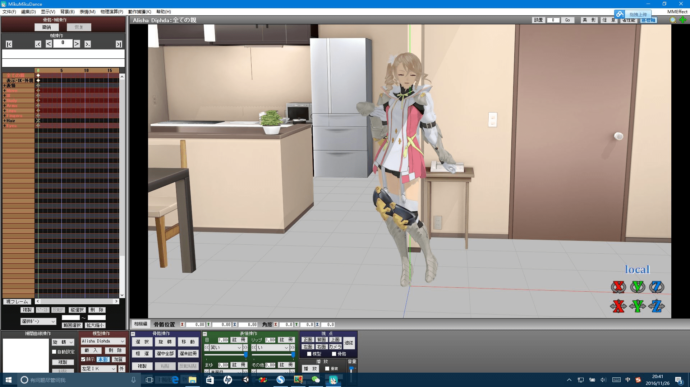
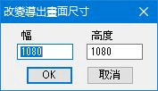
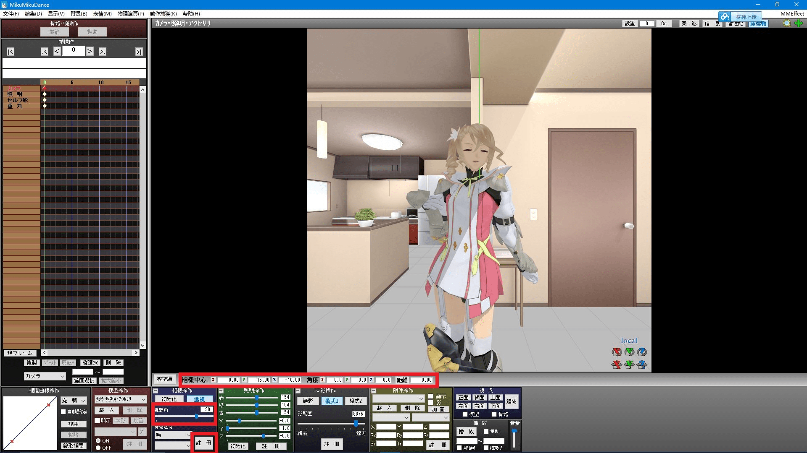
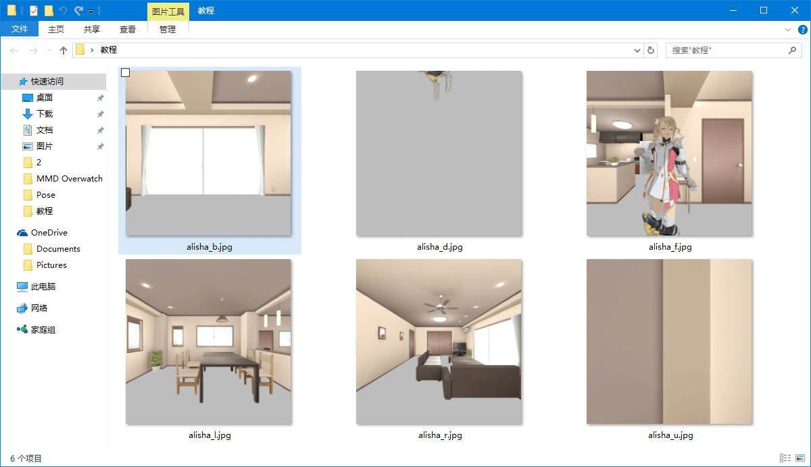
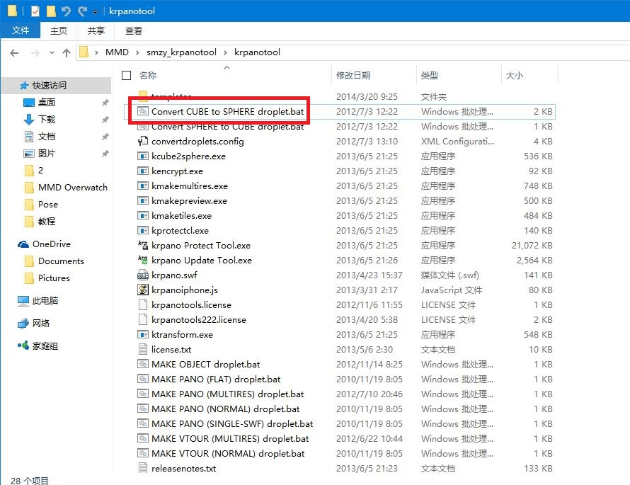
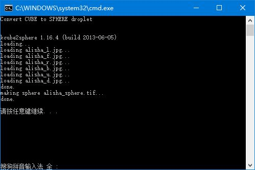
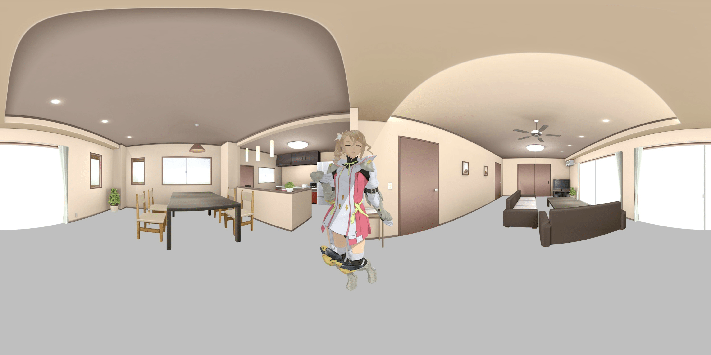
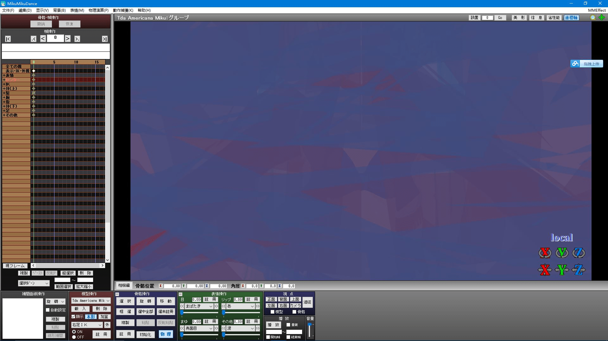

# 超简单的MMD（即各种建模软件）的VR全景图制作方法

作者：界界界界

TID：22211

<title>1</title> <link href="../Styles/Style.css" type="text/css" rel="stylesheet">

# 1

*本帖最後由 界界界界 於 2016-11-27 14:09 編輯*

首先简单介绍一下原理。
我们要制作的是球形全景图。
球形全景图就是一个球形的图像，球本身是一个密闭的空间，在这个密闭的空间里你就可以浏览360度的场景了。
而立方体全景是将全景图分成了前后左右上下六个面，浏览的时候将六个面结合成一个密闭空间来现实整个水平和竖直的360全景。
两种全景图原理近似，所以我们就可以通过一些算法（脚本）来将一个立方体全景图拼接成一个球形全景图。

下面教程正式开始
第一步，打开你使用的建模软件，导入你想要的模型和姿势。
<ignore_js_op>

**1.JPG** *(250.87 KB, 下載次數: 0)*

[下載附件](forum.php?mod=attachment&aid=NjU3MjN8YzczNzE0NzJ8MTY3NDA2OTY3N3wxODIzMHwyMjIxMQ%3D%3D&nothumb=yes)

2016-11-26 20:48 上傳

第二步，点击菜单中的 显示——>导出尺寸，将导出图像设置为正方形。
<ignore_js_op>

**3.JPG** *(13.01 KB, 下載次數: 0)*

[下載附件](forum.php?mod=attachment&aid=NjU3MjV8OGFlNDU0M2F8MTY3NDA2OTY3N3wxODIzMHwyMjIxMQ%3D%3D&nothumb=yes)

2016-11-26 20:48 上傳

第三步，设置相机位置。
相机位置是很关键的一个步骤，为了使我们的图像能够拼接成全景图，要有以下几个步骤。
1.将视野角度调为90度。
2.根据你的想法设置相机位置，这里有两点需要注意。第一点，因为我们我们要制作的是一个全景图，所以调整角度x，z是没有意义的，同时也是错误，你制作的六张正方形图片分别对应前后左右上下，所以角度xyz中的角度x和角度z必须是0，而角度y可以随意。第二点，因为待会我们需要通过调整角度x和角度y制作六张立方体，相机中心的参数距离必须是0。
3.最后记得注册一下相机，否则一切换就相机的位置数据就没了。
<ignore_js_op>

**2.JPG** *(354.19 KB, 下載次數: 0)*

[下載附件](forum.php?mod=attachment&aid=NjU3MjR8NmQzNzU2YmF8MTY3NDA2OTY3N3wxODIzMHwyMjIxMQ%3D%3D&nothumb=yes)

2016-11-26 20:48 上傳

第四步，输出图像。
点击菜单中的 文件——>图像文件导出，将正面的图像命名为xxx_f。
调整角度y为90度，然后图像文件导出，将这个左面的图像命名为xxx_l。
调整角度y为-90度，然后图像文件导出，将这个左面的图像命名为xxx_r。
调整角度y为180度，然后图像文件导出，将这个左面的图像命名为xxx_b。
将角度y调回为0度，调整角度x为90度，然后图像文件导出，将这个左面的图像命名为xxx_d。
调整角度x为-90度，然后图像文件导出，将这个左面的图像命名为xxx_u。
（这几个字母分别对应front，left，right，back，down，up）
这样我们就有了这样的6个正方形图像。
<ignore_js_op>

**3.JPG** *(83.43 KB, 下載次數: 0)*

[下載附件](forum.php?mod=attachment&aid=NjU3MjZ8NWNmNTI1ZDd8MTY3NDA2OTY3N3wxODIzMHwyMjIxMQ%3D%3D&nothumb=yes)

2016-11-26 21:13 上傳

第五步，拼接。
使用一个叫krpanotool的软件中的一个脚本，叫做Convert CUBE to SPHERE droplet.bat的脚本。
<ignore_js_op>

**3.JPG** *(178.49 KB, 下載次數: 0)*

[下載附件](forum.php?mod=attachment&aid=NjU3Mjd8OWM3NzIwOTN8MTY3NDA2OTY3N3wxODIzMHwyMjIxMQ%3D%3D&nothumb=yes)

2016-11-26 21:16 上傳

选中六个正方形图像，将他们拖到脚本上松开鼠标，脚本就会开始拼接，主要如果命名不对的话脚本是无法识别的哦。
<ignore_js_op>

**捕获.JPG** *(29.76 KB, 下載次數: 0)*

[下載附件](forum.php?mod=attachment&aid=NjU3Mjh8NWEwM2FmYWZ8MTY3NDA2OTY3N3wxODIzMHwyMjIxMQ%3D%3D&nothumb=yes)

2016-11-26 21:20 上傳

这样在放六张正方形图像的文件夹里就生成了一个全景图，生成的格式是tif，我一般用画图把它转成jpg，然后用图像编辑软件把它等比缩小到3000×1500，图像太大的话手机上的软件是打不开的。
<ignore_js_op>

**alisha_sphere_mini.jpg** *(407.43 KB, 下載次數: 0)*

[下載附件](forum.php?mod=attachment&aid=NjU3Mjl8ODZmOTc3YmV8MTY3NDA2OTY3N3wxODIzMHwyMjIxMQ%3D%3D&nothumb=yes)

2016-11-26 21:23 上傳

最后我附上M78124大大分享的模型及姿势。模型包括几个脚部十分细腻真实的模型，姿势也都是和gts相关的。
和krpanotool整个软件，就不用大家再找了。
模型及姿势链接：[http://pan.baidu.com/s/1pLq8yLX](http://pan.baidu.com/s/1pLq8yLX) 密码：2ilm
软件链接：[http://pan.baidu.com/s/1c29RGsw](http://pan.baidu.com/s/1c29RGsw) 密码：h2ui

我再说下我现在遇到的几个问题。
第一个是相机穿模的问题，相机不能离模型太近不然会图像里的模型会显示不出来，我认为可能是因为相机本身是有体积的，不是一个点，不知道能不能设置相机为一个点，不然做不出更有震撼力的全景图。
第二个是我使用pmxeditor放大模型之后，在MMD里载入后就出现了迷之黑影，编辑模型且在选择状态的的时候没有，一转到相机或其他模型或是不在选择状态就有了。这个问题在大神那里肯定已经解决或者就没有，比较已经有那么多mega级的MMD图了。
（下面这个就是一个放大1000倍的模型，出现一堆不知道什么玩意的玩意）
<ignore_js_op>

**捕获1.JPG** *(279.45 KB, 下載次數: 0)*

[下載附件](forum.php?mod=attachment&aid=NjU3MzB8OTgzMWVlZmF8MTY3NDA2OTY3N3wxODIzMHwyMjIxMQ%3D%3D&nothumb=yes)

2016-11-26 21:45 上傳

<ignore_js_op>

**捕获2.JPG** *(201.46 KB, 下載次數: 0)*

[下載附件](forum.php?mod=attachment&aid=NjU3MzF8MzIzNTcxMmN8MTY3NDA2OTY3N3wxODIzMHwyMjIxMQ%3D%3D&nothumb=yes)

2016-11-26 21:45 上傳

第三个就是使用我这种方法其实也可以合成全景的视频，但我没找到立方体全景视频拼接球形全景视频的软件，要是有小伙伴找到了一定告诉我一声，谢谢。

使用这个方法任何MMD小白（我就是）都可以制作全景图，同时大神们也可以用原来的工程制作全景图，也可以用C4D渲染出更高质量的全景图这样我就有无限的全景图看啦嘿嘿嘿。
<title>2</title> <link href="../Styles/Style.css" type="text/css" rel="stylesheet">

# 2

卧槽谢谢啊哈哈哈哈，用这个可以做出MMD视频吗 <title>3</title> <link href="../Styles/Style.css" type="text/css" rel="stylesheet">

# 3

> 444666444666 發表於 2016-11-26 22:15
> 卧槽谢谢啊哈哈哈哈，用这个可以做出MMD视频吗

做不出来，因为我没找到拼接视频的软件 <title>4</title> <link href="../Styles/Style.css" type="text/css" rel="stylesheet">

# 4

哟嚯老司机又开车了，厉害了 <title>5</title> <link href="../Styles/Style.css" type="text/css" rel="stylesheet">

# 5

大師果然厲害，不過MMD我沒碰過就是
小弟只有學過一點點maya+一點點點的Unity
<title>6</title> <link href="../Styles/Style.css" type="text/css" rel="stylesheet">

# 6

> [王王 發表於 2016-11-27 20:26](https://giantessnight.cf/gnforum2012/forum.php?mod=redirect&goto=findpost&pid=315968&ptid=22211)
> 大師果然厲害，不過MMD我沒碰過就是
> 小弟只有學過一點點maya+一點點點的Unity
> ...

真巧，我也学过一点Unity
<title>7</title> <link href="../Styles/Style.css" type="text/css" rel="stylesheet">

# 7

前一段时间还想着用建模软件自己做全景图来看，但是因为是小白而且找不到教程...
<title>8</title> <link href="../Styles/Style.css" type="text/css" rel="stylesheet">

# 8

既然这帖子被推到大首页了...我就回答一下，After Effect有个叫Skybox的插件可以把立方体拼成全景视频 <title>9</title> <link href="../Styles/Style.css" type="text/css" rel="stylesheet">

# 9

你们都是怎么琢磨出来的，看起来好复杂 <title>10</title> <link href="../Styles/Style.css" type="text/css" rel="stylesheet">

# 10

好像很厉害的样子顶顶顶顶顶顶顶顶顶顶顶</ignore_js_op></ignore_js_op></ignore_js_op></ignore_js_op></ignore_js_op></ignore_js_op></ignore_js_op></ignore_js_op></ignore_js_op>