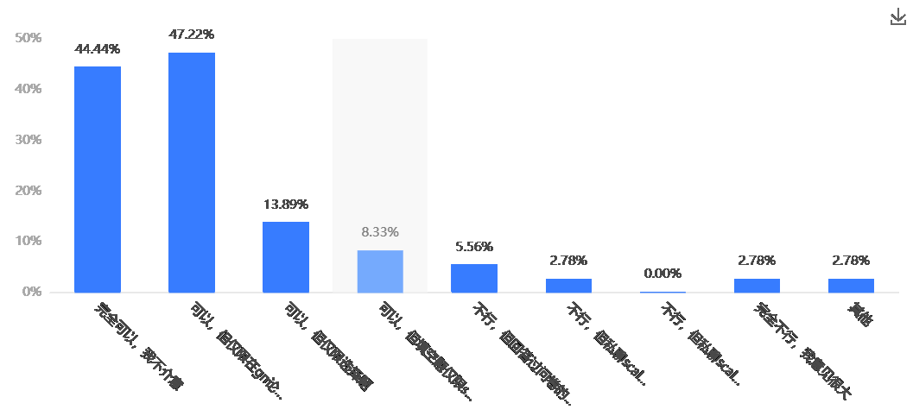
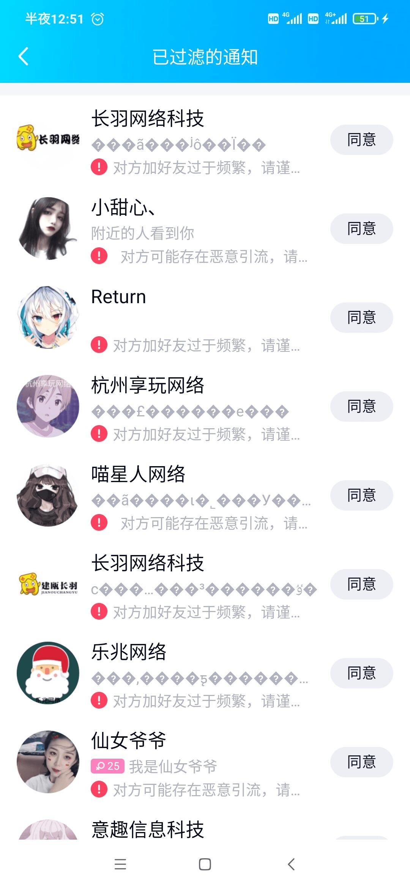
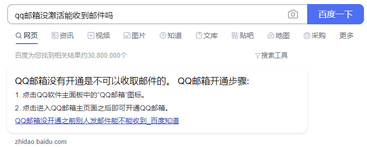
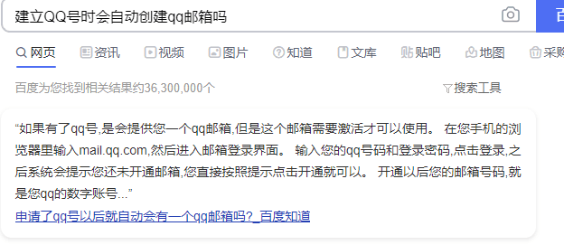

# 超长超详细的gts爱好调查问卷，进来好好了解下自己的XP吧~

作者：zxk135

TID：31306

<title>1</title> <link href="../Styles/Style.css" type="text/css" rel="stylesheet">

# 1

*本帖最後由 scale君 於 2021-8-1 21:34 編輯*

问卷链接：[https://www.wenjuan.com/s/Z3EfAnA/](https://www.wenjuan.com/s/Z3EfAnA/)                     #《对“巨大娘与小人幻想”爱好的调查》，快来参与吧。【问卷网提供支持】
问卷的数据报表出来了！！！
巨大娘扮演者看[这里](https://www.wenjuan.com/r/n/2470b6daee43c7f2bce3514278dc7dae)，小人扮演者看[这里](https://www.wenjuan.com/r/n/5fcd6de9e185be7e37554dc6c82a4258)，我全都要就看[这里](https://www.wenjuan.com/r/n/47315895ff4495180636ec9ab29454f7)。密码统一是giantess，不会有人输入错误吧？（这个会随着大家填写更新，但我估计不会去维护了，容易暴露隐私信息的选项我都剔除了，大家可以放心查看）
本问卷分为巨大娘和小人两条路线，其他路线没有开启，胡乱选择让问卷提前结束的话，重新打开链接，换个选项再填一遍就好了。调查目的？嘛，没有什么具体目的，就是看看大家对自己XP的偏好。（本次问卷中gt，furry，扶她没有涉及，vore占比较少，有考虑不周到的地方还请在题目的”其他“项留下你的宝贵意见，或者直接加我qq交流也可：976271434）
平均答题时间约为20分钟（仔细答题的话，可能30分钟），设置的应该是断点续答，如果答题途中退出，再点进去进度还会停在那里，不用再把前面走一遍（如果想看完小人和gts两条线，请完整答题两次并分别选择小人与gts）
本问卷中含有产生gts与小人幻想的介绍，具体进入方式为在第五题选择"我就只是看着好玩"或"随便吧，我只想ghs"，该介绍仅为本人愚见，如有不当之处还望指出批评。

注意：本问卷并非针对新人的宣传问卷，请勿无脑传至gts圈外（可以给一些已经接触过圈内资源或有明确入圈意愿的人发）。

另外，小小宣传下我的群，论坛坛友可以添加我的qq：976271434，将论坛里用的名字发给我，我会在检查后将各位拉进群聊（进群后请确保足够活跃，本群会不定期清理潜水党，在和大家混熟了以后可以大大降低潜水被踢的风险哦。）
 7.21早上（修改后重新送审了，早起的朋友可能点不开链接，待会儿审核完毕就可以再次看到，移除了完成问卷后的“统计”选项，因为会造成隐私泄露，改为查询界面，查询的网址与数据都在我这里，有需要查询的朋友可以私聊我，虽然最近上班很忙，但是下班后还是会抽时间为大家查询的）

7月21日中午，根据大家在第47题的作答，大多数人都选择了可以公开信息或者可以在gn论坛内公开信息，因此先将信息查询界面公布。
信息查询界面见此，大家可以按照提示进行信息查询（虽然没有很方便，但起码能看）
[https://www.wenjuan.com/setting/result/verify/m222Uf](https://www.wenjuan.com/setting/result/verify/m222Uf)   下方图片没有背景色所以看起来是黑的，点进去就能看到正常图片了
7月22日中午，虽然大家没有在贴子里留言，但答题的数据一直在涨，截至7月22日下午两点，已有47组完整数据（包含我测试用的数据和几条不怎么正经的数据）。
如果没有特殊情况，我应该是7月31日与8月1日连休，我会在8月1日将选择题导出汇总成数据报表并在gn中展示，填空题与“其他”选项中优秀的内容也会挑选后展示，希望到时候能达到100人参与问卷的小目标鸭！（如果觉得本问卷还不错，还请分享给身边的同好哦，感谢大家支持！！）
7月24日上午，这两天调查问卷逐渐陷入瓶颈期，仅新增11人，为此，我决定修改标题让本帖看起来更吸引人，同时将本问卷分发给gn论坛以外的同好，以增加数据量。
截至7月27日晚八点，本调查问卷共收到了111份数据，简单筛查重复与无用数据后也已经达到了预期的100人标准，我将会以该数据作为8月1日公布数据报表的原始数据，后续数据将不计入本次数据报表展示（以后还有数据更新的机会），还望大家知晓。

另外，我也决定在8月1日向大家发放调查结果，到时候我会用我或者朋友的qq添加填写本次调查问卷时留下的qq号（后续留的qq号也会通知到），并私聊发放通知，请大家拭目以待。
7月29日晚，QQ本身自带防骚扰功能，同一个账号不能太频繁添加好友，否则系统会自动将该账号的请求视为垃圾讯息隐藏起来，被添加的好友不主动查看便无法察觉。因此，我选择将调查结果用邮件的方式发送给各位（同时也方便了部分没有qq但是留下了邮箱的港澳台同胞），当然，如果对方已经是我的好友，我会按照原计划将调查结果私聊发送，到时候还请各位注意查收邮箱呢。
7月31日 中午，截至下午1点，累计已经达到148份数据（除去捣乱与重复数据后约130多份），我将于明日，通过邮件，qq私聊，论坛私聊等方式将调查结果发放（后续数据将不发放，8月1日后问卷依然开放，但可能不作更新）。
8月1日 早上，昨晚没睡，想了半晚上还是没能想到解决分发调查结果的事情。
1.原本计划使用qq邮箱将个人回答情况和总的调差结果发送到大家手里，但在批量做邮件时，我注意到了一个关键的问题——并不是每一个qq号都开了邮箱（百度结果见图片），没激活邮箱收不到邮件。而我一方面无法判断大家邮箱是否被qq号主激活，另一方面就算全都发过去，我也不知道有多少人没收到，qq邮箱这条线路算是完全没用了。
2.私聊发送。首先，qq发文件是需要双方好友关系的，而腾讯对短时间内频繁添加好友的帐号作出限制（见图片，这是腾讯为我自动屏蔽的广告小号），我在不清楚腾讯具体规则的前提下，既高效添加好友，又能不被腾讯限制，这根本不可能（而且就算我加了，可能还得等好久对方才有回应）。其次，就算我采用网页的格式让大家点链接接受调查结果，这可以不依赖好友关系做到，但我作为陌生人能够留言，也至少需要对方关闭了腾讯的防骚扰机制（而这机制在默认状态下是开启的）。
3.论坛私聊。大部分人没有留论坛帐号信息，sad。
4.我单独开设一个大家填自己qq号就能领调查报告的网站（笑死，一晚上根本学不会）。
5.大家全部加我qq好友，然后我给大家私发调查结果。这居然是相对来说最可行的方法，但这样做的话，又会出现新的问题——我没法保证这句话能让填了问卷的大家都看到，也没法保证大家看到了就会来加我，毕竟填调查问卷还勉强算新奇好玩，单纯领结果就没啥趣味性也没有收获。

综上所述：我在此表达歉意，暂且决定收回“单独发调查结果”的计划，改为下午或晚上用公共网址公布整体的调查结果，各位当初填的啥还请各位自行回想（或者找过来私聊问我，我私发你）。（该调查结果去除隐私信息，去除胡乱填写，去除重复，请放心查阅，一人一票公平公正）

另：本来这次发调查结果时还准备了点小活动给大家惊喜的，不过现在这样已经是泡汤了。但是，之前收到了我活动邀请的部分朋友还是会在今天收到我私聊发送的调查结果（包含活动内容），还请不要太在意。（没能参与本次活动的坛友也不要伤心，该活动会应用在下一次调查问卷中，没错，下一次调差问卷已经开始企划了，包含“拉新”，“情景细分”等方向，还请大家多多期待）

唔，顶不住，先睡觉了，睡醒再看大家有没有别的意见建议。

<title>2</title> <link href="../Styles/Style.css" type="text/css" rel="stylesheet">

# 2

 <ignore_js_op>[下载.png](forum.php?mod=attachment&aid=ODk4Njd8OTc2ZWI4YTB8MTY3NDA2ODQ1NHwxODIzMHwzMTMwNg%3D%3D&nothumb=yes) *(50.46 KB, 下載次數: 1)*

[下載附件](forum.php?mod=attachment&aid=ODk4Njd8OTc2ZWI4YTB8MTY3NDA2ODQ1NHwxODIzMHwzMTMwNg%3D%3D&nothumb=yes)

2021-7-21 14:57 上傳  

</ignore_js_op> <ignore_js_op>[QQ图片20210801081617.jpg](forum.php?mod=attachment&aid=OTAwNzB8MTM1MjI1NDR8MTY3NDA2ODQ1NHwxODIzMHwzMTMwNg%3D%3D&nothumb=yes) *(209.2 KB, 下載次數: 0)*

[下載附件](forum.php?mod=attachment&aid=OTAwNzB8MTM1MjI1NDR8MTY3NDA2ODQ1NHwxODIzMHwzMTMwNg%3D%3D&nothumb=yes)

2021-8-1 08:16 上傳  

</ignore_js_op> <ignore_js_op>[QQ图片20210801073816.png](forum.php?mod=attachment&aid=OTAwNjl8MmNmM2Y1ZTV8MTY3NDA2ODQ1NHwxODIzMHwzMTMwNg%3D%3D&nothumb=yes) *(11.53 KB, 下載次數: 0)*

[下載附件](forum.php?mod=attachment&aid=OTAwNjl8MmNmM2Y1ZTV8MTY3NDA2ODQ1NHwxODIzMHwzMTMwNg%3D%3D&nothumb=yes)

2021-8-1 07:40 上傳  

</ignore_js_op> <ignore_js_op>[QQ图片20210801073809.png](forum.php?mod=attachment&aid=OTAwNjh8ZWI1YjVjYTN8MTY3NDA2ODQ1NHwxODIzMHwzMTMwNg%3D%3D&nothumb=yes) *(13.19 KB, 下載次數: 1)*

[下載附件](forum.php?mod=attachment&aid=OTAwNjh8ZWI1YjVjYTN8MTY3NDA2ODQ1NHwxODIzMHwzMTMwNg%3D%3D&nothumb=yes)

2021-8-1 07:39 上傳  

</ignore_js_op> <title>3</title> <link href="../Styles/Style.css" type="text/css" rel="stylesheet">

# 3

第二十题到底是要选择要坚守还是要放弃的呢？ <title>4</title> <link href="../Styles/Style.css" type="text/css" rel="stylesheet">

# 4

好寫好了, 在一面選項時自己也一直吐嘈. 有點好奇會在GN中把結果 發佈嗎?  <title>5</title> <link href="../Styles/Style.css" type="text/css" rel="stylesheet">

# 5

大哥 把別人QQ號隱藏一下吧ww別顯示出來啊
<title>6</title> <link href="../Styles/Style.css" type="text/css" rel="stylesheet">

# 6

答完了，答完了对自己的嗜好也有了一个认知，哈哈
 <title>7</title> <link href="../Styles/Style.css" type="text/css" rel="stylesheet">

# 7

选了一个不太知道size和gts的联系我怎么就变成gt了。。。size啥真没听说过 英文不太好 <title>8</title> <link href="../Styles/Style.css" type="text/css" rel="stylesheet">

# 8

反正按照自己的习惯写了写。。。。。 <title>9</title> <link href="../Styles/Style.css" type="text/css" rel="stylesheet">

# 9

*本帖最後由 scale君 於 2021-7-21 04:06 編輯*

> [诸君我喜欢 發表於 2021-7-20 18:19](https://giantessnight.cf/gnforum2012/forum.php?mod=redirect&goto=findpost&pid=474379&ptid=31306)
> 问卷调查表中显示“GT爬” 这样总感觉有点不太友好。。。。。。
> 虽然我对gt也很不感冒，但是我也不会说让gt ...

我写“gt爬”的理由如下：
1.我不喜欢gt，
2.我不想和gt爱好者搞好关系，
3.这里不是为gt爱好者而建设的论坛，我不需要刻意讨好照顾他们
4.相对于gts爱好者，gt爱好者是更加少数的群体，很抱歉，我的能力有限，问卷不能普照大众兼顾天下
我在为gts爱好者建设的论坛里发布了一个以gts爱好为主体的问卷，并在回答问卷前就告知了本问卷没有gt内容，我自认为是不会有gt爱好者进来看的。
但如果万一有呢？那可真是抱歉，这句简单的“gt爬”就是我对他们偷偷来到这个gts爱好者聚集地的回应。
<title>10</title> <link href="../Styles/Style.css" type="text/css" rel="stylesheet">

# 10

点进去之后网站显示问卷仍在审核中？ <title>11</title> <link href="../Styles/Style.css" type="text/css" rel="stylesheet">

# 11

朋友 問卷我進不去QAQ 可能是什麼問題(網頁顯示回應時間過長 <title>12</title> <link href="../Styles/Style.css" type="text/css" rel="stylesheet">

# 12

回答完毕，应该赶上了吧，十分的期待 <title>13</title> <link href="../Styles/Style.css" type="text/css" rel="stylesheet">

# 13

刚刚才看到，好像来晚了点，淦，楼主真是辛苦了，这个问卷挺有意思的 <title>14</title> <link href="../Styles/Style.css" type="text/css" rel="stylesheet">

# 14

（怎么论坛也有嘉心糖的）问卷详细的令人害怕 <title>15</title> <link href="../Styles/Style.css" type="text/css" rel="stylesheet">

# 15

问卷做的真好，好新颖的调查方式，希望能收集到足够的样本做好统计