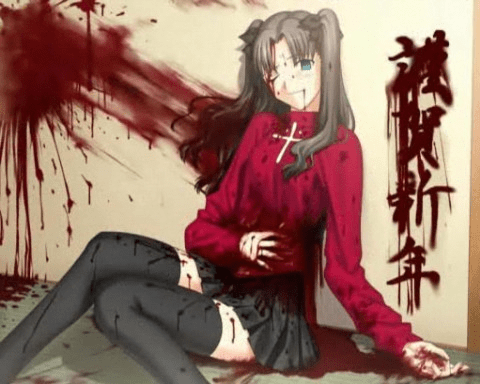

# 踩在蛋大头上的兔子新春致词

作者：lovegts

TID：6667

<title>1</title> <link href="../Styles/Style.css" type="text/css" rel="stylesheet">

# 1

咳咳……新的一年到来了，蛋大的论坛也从之前的旧论坛搬迁到新的老窝
貌似从新家到现在是第一次过春节吧？
嘛，虽然咱不是什么老兔啦，对GN的历程也知之甚少
不过……Don't worry,be happy
大家过春节都是一样快乐的啦，管他第几次春节啦
论坛里都是一堆一堆的人才酱啦
比如勤劳的小蜜蜂——铁奥
最强哲学家——小剑
无敌资源帝——蚱蜢
看起来一事无成——老二的老二等于老四
吐槽制造机——看起来萌网王的家伙
不知原形的——XNR
蓝脸阿凡提……不对，是阿凡达——lovegts
半夜被兔子吵醒的傻大猫——freecat
GN的开山元祖兼伪剑帝——Lanclot
新来的三国坑王——小禽（秦）
往SD丢了很多钱的土豪——阿查
新年右手拿茶杯的——18X
吞食系的圣人——CG18-1=CG17
甚少没冒水的——小D
更少冒水的——皇姐
该死的王妈手撕兔——KARAS
万年潜水党——JOYYSOSOSO
咱认识她她不认识咱的——TK
某GAY马鹿猫——曾经用过阿部头像的忘了名字的家伙
刚认识的东方的懒坑主——freedomice
还有很多很多很多很多很多分散于各个部落的很多不认识的人才酱
当然，还有最终BOSS——蛋大
GN有能力过春节都是靠大家了啦，流水而不腐，有如此鲜活的血液，GN才能健健康康地活下去呢
大家新春要快快乐乐哟，多拿点红包
另外，论坛里谁结了婚的！伸手要红包！赶快拿来！
另外春节了，大家饮食要节制喔，别春节过后男的拉女的胖，这样就不好喔
    祝：
年年有GTS，天天有小人
新春合家欢康！
                                              By 懒兔子雅

[ *本帖最後由 alice 於 2010-2-13 16:30 編輯* ] <title>2</title> <link href="../Styles/Style.css" type="text/css" rel="stylesheet">

# 2

祝大家新年快乐
话说这话应该明天早上说吧..
我明明没有结婚 那些该死的哥哥姐姐都结婚了...还生了娃  这摆明了要我掏钱啊！ <title>3</title> <link href="../Styles/Style.css" type="text/css" rel="stylesheet">

# 3

嗯，小兔子，蛋大还有所有GN的朋友们新年快乐
还有，我的昵称真的不是针对你的，兔子- - <title>4</title> <link href="../Styles/Style.css" type="text/css" rel="stylesheet">

# 4

  新年快樂...............
  老二的老二...................
  兔子你腦袋頂上不就頂著2個兔耳（two 二）么？

<ignore_js_op>

**abbr_11ec82e7f70b9afd4610e12395114c5a.jpg** *(45.68 KB, 下載次數: 0)*

[下載附件](forum.php?mod=attachment&aid=MTczMjF8ZjFiNThkMDl8MTY3NDA2ODk0MHwxODIzMHw2NjY3&nothumb=yes)

2010-2-13 10:35 上傳

獵奇控祝大家過年好，過年最好了，整個世界都是血紅的一片，如果是液體的就更好了。 <title>5</title> <link href="../Styles/Style.css" type="text/css" rel="stylesheet">

# 5

坑遍天下无敌手的坑王小秦祝大家新年快乐 <title>6</title> <link href="../Styles/Style.css" type="text/css" rel="stylesheet">

# 6

不知原型的XNR。。。兔子想跟我视频吗？ <title>7</title> <link href="../Styles/Style.css" type="text/css" rel="stylesheet">

# 7

 大家新年快乐！ <title>8</title> <link href="../Styles/Style.css" type="text/css" rel="stylesheet">

# 8

我发现我被华丽的忽略了....也难怪...我每年起码有一半时间是afk的....我可是元老级人物啊....GN开山之初，女神开山之初都有我啊~ <title>9</title> <link href="../Styles/Style.css" type="text/css" rel="stylesheet">

# 9

昨天开摩托一时失误撞在墙角上，右手光荣负伤。
忍痛敲键盘祝大家新春快乐！

————————————————————
大过年的把医院的绷带当做新年礼物，不幸啊！ <title>10</title> <link href="../Styles/Style.css" type="text/css" rel="stylesheet">

# 10

@@ 哈哈....小兔子妹太抬舉我，好意我心領了。

請問！小兔子妹為何沒有提名殺手(killer9999)與傻大貓(freelycat)
請趕緊補(补)上，否則他們不甘願喔！&gt;///&lt;~ &gt;

新年快樂看GTS過新年.新年快樂看小人好過年

在2010年.你有甚麼願望還沒有實現的嗎?

希望你在2012年.你都能慢慢的實現它!

祝您新年快樂，大家過年好。

<title>11</title> <link href="../Styles/Style.css" type="text/css" rel="stylesheet">

# 11

蚱蜢兄，铁奥就是K9啦 <title>12</title> <link href="../Styles/Style.css" type="text/css" rel="stylesheet">

# 12

謝了！我沒有看過啥這個鳥名字。 <title>13</title> <link href="../Styles/Style.css" type="text/css" rel="stylesheet">

# 13

话说好多人都不认识= = <title>14</title> <link href="../Styles/Style.css" type="text/css" rel="stylesheet">

# 14

:dct 谢兔子祝福咯.....顺便借楼祝福一下大家.....新年里收好图,藏好片,读好文

顺便一说....虽然我QQ爱隐身,论坛爱潜水但是该回复也是还要回复的.....莫非你想不到我有什么别的特点了....悲剧了啊......大春节的我真是悲剧了啊 <title>15</title> <link href="../Styles/Style.css" type="text/css" rel="stylesheet">

# 15

算了....其实我还是很低调的 恭贺新春 <title>16</title> <link href="../Styles/Style.css" type="text/css" rel="stylesheet">

# 16

天,.
来晚了,.

鄙人GN最不受关注但最忠实观众是也,.
特在春晚来临之际牺牲亿万脑细胞来此报道,.
代表党中央,.MTV,.CCTV,.WHTV,.给各位坛油们拜年了,.! <title>17</title> <link href="../Styles/Style.css" type="text/css" rel="stylesheet">

# 17

餵餵餵....難道沒有人吐槽"踩在蛋大頭上"麽= =|||
嘛...春節什麽的基本上與在下無關...
總之...新年快樂 <title>18</title> <link href="../Styles/Style.css" type="text/css" rel="stylesheet">

# 18

.
嗚嗚嗚嗚……（因為被踩住所以話說不清楚，不過大致上是在祝各位新年恭喜  <title>19</title> <link href="../Styles/Style.css" type="text/css" rel="stylesheet">

# 19

还有几分钟就新年咯！！！
每当这个时候，我国就转型成为伊拉克，处处硝烟，声声炮响，作为一名和平主义者，小剑表示压力很大

我已经成功从哲学家跳槽成鱼人大叔了！恭贺新禧 ！ <title>20</title> <link href="../Styles/Style.css" type="text/css" rel="stylesheet">

# 20

什么 你们看见我了吗 <title>21</title> <link href="../Styles/Style.css" type="text/css" rel="stylesheet">

# 21

嗚~~~
想不到竟然有我耶!!!
不過要是有人沒被妳打提到那你不就得罪人了

祝大家新年快樂 <title>22</title> <link href="../Styles/Style.css" type="text/css" rel="stylesheet">

# 22

> 原帖由 *karas* 於 2010-2-13 23:59 發表 
> 什么 你们看见我了吗

他和我們都是一些老人，你是新人的，小兔子妹妹她還沒有認識了。 <title>23</title> <link href="../Styles/Style.css" type="text/css" rel="stylesheet">

# 23

> 原帖由 *michael* 於 2010-2-13 22:05 發表 
> 餵餵餵....難道沒有人吐槽"踩在蛋大頭上"麽= =|||
> 嘛...春節什麽的基本上與在下無關...
> 總之...新年快樂

真.潜水帝出现!!!!!! <title>24</title> <link href="../Styles/Style.css" type="text/css" rel="stylesheet">

# 24

其实我也潜了很久...深夜才出来活动...乌鸦...啊不...渡鸦都这样~ <title>25</title> <link href="../Styles/Style.css" type="text/css" rel="stylesheet">

# 25

 oh no wo tai beiju le !!! <title>26</title> <link href="../Styles/Style.css" type="text/css" rel="stylesheet">

# 26

  我也很老啊...话说我可是看着...蚱蜢兄的号注册到现在完美的超越我这个老人的

[ *本帖最後由 Lanclot 於 2010-2-15 11:22 編輯* ] <title>27</title> <link href="../Styles/Style.css" type="text/css" rel="stylesheet">

# 27

= = 我這幾天一直沉迷在山口山的世界里……
PS：如果不是小螞蚱提醒我，我估計都不會來看這個帖子= = <title>28</title> <link href="../Styles/Style.css" type="text/css" rel="stylesheet">

# 28

【吐槽制造机——看起来萌网王的家伙】
······
于是这个歧义太多了，太多了。
好不容易回来，
各位新年好 <title>29</title> <link href="../Styles/Style.css" type="text/css" rel="stylesheet">

# 29

看完了吳宇森監製的蘋果核戰記
  每次看完大片的感覺總是心情愉快啊
本來以為克隆生化男最後一定因為沒法被安排到一個合適的位置，沒有一個女人來配對要領便當呢，結果堅強的活了下來。
瞳在2裏面明顯淪為了配角，紫藍發男就更慘了，不過換好確定了一個戀愛關係，雖然說不一定還有續集... 你們兩個估計一輩子嗶不到了。
男醫生說話過於陰沉了，一看上去就不像是普通人，結果這便當領的.....

話說80~90年代的OVA還真是毫無力吐糟啊。

  我是來外樓之地灌水的，各位不要在意。</ignore_js_op>