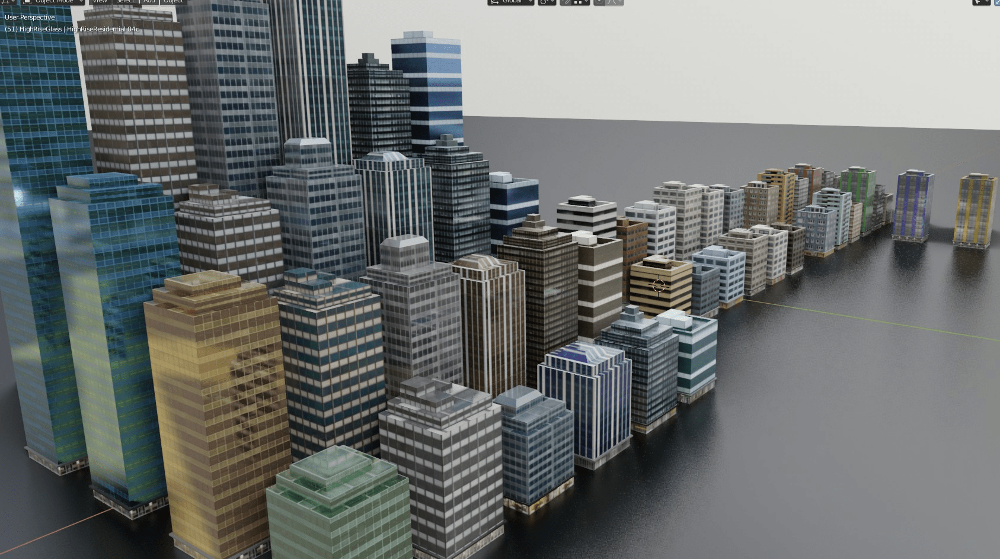

# 踩塌地面效果测试

作者：marycat

TID：27762

<title>1</title> <link href="../Styles/Style.css" type="text/css" rel="stylesheet">

# 1

<ignore_js_op> [giantess shoe print fx.mp4](forum.php?mod=attachment&aid=ODA2NjB8NjU4MGRiMGJ8MTY3NDA2NjY0M3wxODIzMHwyNzc2Mg%3D%3D) *(636.52 KB, 下載次數: 170)* 2019-12-25 19:22 上傳點擊文件名下載附件
附件是个5秒mp4视频，不知道发上来能不能看

刚刚用blender研究出了踩塌陷地面的5毛特效，学习了 dynamic paint 模块之后灵光一闪，就做了这么个玩意，只要鞋子和地面有接触，就自动出现一个坑，可以说相当方便了（懒就直说）。没有弄贴图，暂时用程序纹理生成草地和土地效果。后续应该会加上粒子碎片烟尘效果，大家还有什么建议欢迎留言哦

下个动画打算做破坏城市类型的，但是实际开始做了才发现问题多多，特别是最关键的建筑破坏特效，我就没头绪，因为我把所有建筑都做成了只有几十面的low poly模型（到时候要用粒子系统生成成千上万座，面数太多电脑就要gg了），而破碎效果肯定是要有足够面j数做支撑的，这就成了一个矛盾。其实我也不追求多真实的效果，意思到了差不多就行，坛里有大佬来指点一下吗(＃°Д°)

<ignore_js_op>

**2019-12-25_19-34-47.jpg** *(328.87 KB, 下載次數: 0)*

[下載附件](forum.php?mod=attachment&aid=ODA2NjF8ODcxYWQ5NTF8MTY3NDA2NjY0M3wxODIzMHwyNzc2Mg%3D%3D&nothumb=yes)

2019-12-25 19:52 上傳

<title>2</title> <link href="../Styles/Style.css" type="text/css" rel="stylesheet">

# 2

Dynamic paint用來踩土其實很難做好，土要做到寫實非常麻煩，因為會裂開還會產生新土堆，建議套在棉被之類的地方
至於建築破碎......如果想做出破碎一瞬間的效果，那我真的不知道要怎麼不操爆CPU
可以先考慮踢建築以外的東西啊，像是......紙箱寶特瓶之類的......
簡單講就是......如果沒有很堅持的話，可以先從縮小開始做起
如果踢的是模型建築，那沒有碎開也不會奇怪，踩的東西也不用壞得多精緻
如果就是想要巨大化的效果......那就做一點偷吃步吧，像是踢下去的時候切換鏡頭之類的，不然就去組新電腦 <title>3</title> <link href="../Styles/Style.css" type="text/css" rel="stylesheet">

# 3

> [3213213210 發表於 2019-12-27 03:54](https://giantessnight.cf/gnforum2012/forum.php?mod=redirect&goto=findpost&pid=421295&ptid=27762)
> Dynamic paint用來踩土其實很難做好，土要做到寫實非常麻煩，因為會裂開還會產生新土堆，建議套在棉被之類 ...

对啊，写实的特效需要考虑的细节太多了，对电脑要求也高，我根本没敢往那边想。
不过在YouTube上看到一位大佬gonzres用MMD做的动画，破坏效果也已经做的很棒了，比如这个 [https://www.youtube.com/watch?v=Yt819Odcl2Q&has_verified=1](https://www.youtube.com/watch?v=Yt819Odcl2Q&has_verified=1) 不知道他是怎么做的。（关键这位大佬还迷之高产w(ﾟДﾟ)w）

最后我只能折中一下，绝大部分建筑依旧用超低模，破坏效果用粒子碎片和烟雾等等障眼法混过去，个别有互动的建筑做细致一点，加上物理效果_(:з)∠)_，不过具体在软件里怎么操作还要慢慢研究才行。

缩小类的动画之前做过一个，不过也没有什么物体互动，决定做巨大化类的时候也没多想，以为差不多呢，结果问题接踵而至，但不管怎么说已经开始行动了，不想半途而废吧_(:з)∠)_</ignore_js_op></ignore_js_op>