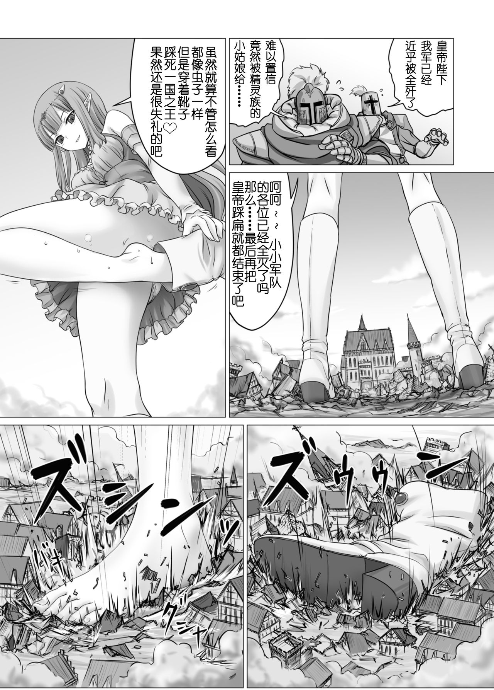

# 踩死国王的时候裸足是礼仪吗？

作者：提高提高123哈

TID：23062

<title>1</title> <link href="../Styles/Style.css" type="text/css" rel="stylesheet">

# 1

<ignore_js_op>

**15.jpg** *(394.7 KB, 下載次數: 22)*

[下載附件](forum.php?mod=attachment&aid=Njc4MjB8N2YzOGY5MzF8MTY3NDA2ODY5MXwxODIzMHwyMzA2Mg%3D%3D&nothumb=yes)

2017-5-11 12:54 上傳

求这一礼仪的出处。。
<title>2</title> <link href="../Styles/Style.css" type="text/css" rel="stylesheet">

# 2

大概因為皇宮是「土足禁止」的

<title>3</title> <link href="../Styles/Style.css" type="text/css" rel="stylesheet">

# 3

白兔的作品很喜欢呢，土足禁止（どそくきんし），好像的确是有这么一回事 <title>4</title> <link href="../Styles/Style.css" type="text/css" rel="stylesheet">

# 4

> [qq1261029704 發表於 2017-5-11 13:58](https://giantessnight.cf/gnforum2012/forum.php?mod=redirect&goto=findpost&pid=331870&ptid=23062)
> 白兔的作品很喜欢呢，土足禁止（どそくきんし），好像的确是有这么一回事 ...

这个规矩真是尴尬，脚上要是有汗水的话裸足走路会出脚印的，天朝古代也有过这个规矩，很烦，好在已经没有了 <title>5</title> <link href="../Styles/Style.css" type="text/css" rel="stylesheet">

# 5

> [冰西瓜 發表於 2017-5-11 16:06](https://giantessnight.cf/gnforum2012/forum.php?mod=redirect&goto=findpost&pid=331871&ptid=23062)
> 这个规矩真是尴尬，脚上要是有汗水的话裸足走路会出脚印的，天朝古代也有过这个规矩，很烦，好在已经没 ...

应该是会换上室内鞋的，或者拖鞋之类的。实在不行不是还有袜子嘛=3=
<title>6</title> <link href="../Styles/Style.css" type="text/css" rel="stylesheet">

# 6

什么奇奇怪怪的风俗，没有听说过 <title>7</title> <link href="../Styles/Style.css" type="text/css" rel="stylesheet">

# 7

這個PTT的發文格式是怎麼回事 <title>8</title> <link href="../Styles/Style.css" type="text/css" rel="stylesheet">

# 8

老老实实的承认这是裸足杀必死不就好了嘛 <title>9</title> <link href="../Styles/Style.css" type="text/css" rel="stylesheet">

# 9

話說這個有完整漫畫版的麻~想知道前面點的劇情w <title>10</title> <link href="../Styles/Style.css" type="text/css" rel="stylesheet">

# 10

想多了，发裸足福利而已
或者你可以脑补是女主的抖S魂犯了 <title>11</title> <link href="../Styles/Style.css" type="text/css" rel="stylesheet">

# 11

我也想求这张图片的出处，给个购买链接哈 <title>12</title> <link href="../Styles/Style.css" type="text/css" rel="stylesheet">

# 12

原來這禮儀不是因為漫畫劇情需要而虛構的啊
 <title>13</title> <link href="../Styles/Style.css" type="text/css" rel="stylesheet">

# 13

当然不可能是礼仪啦。话说这么水帖真的好吗 <title>14</title> <link href="../Styles/Style.css" type="text/css" rel="stylesheet">

# 14

> [C-aki 發表於 2017-5-12 10:58](https://giantessnight.cf/gnforum2012/forum.php?mod=redirect&goto=findpost&pid=331933&ptid=23062)
> 当然不可能是礼仪啦。话说这么水帖真的好吗

你看你看，确实有这个礼仪的啊 <title>15</title> <link href="../Styles/Style.css" type="text/css" rel="stylesheet">

# 15

土足禁止。。。。。。
在中国规矩就没有那么多。
顺便这个漫画我只有未汉化版。
汉化版站内有吗？ <title>16</title> <link href="../Styles/Style.css" type="text/css" rel="stylesheet">

# 16

首先历史上有人踩死过国王吗.........
给你福利你就吃好了, 哪来那么多屁事 <title>17</title> <link href="../Styles/Style.css" type="text/css" rel="stylesheet">

# 17

土足禁止,平民在见一国之君时貌似不许穿带有泥土的鞋子，不过现代这个早就断掉了，非要找的话就是日本那边 <title>18</title> <link href="../Styles/Style.css" type="text/css" rel="stylesheet">

# 18

可能只是增加其中一個高潮點,或原作想走的路線 <title>19</title> <link href="../Styles/Style.css" type="text/css" rel="stylesheet">

# 19

看到有人把舊文翻起來才知道有人在求這篇的出處，雖然可能沒需要了不過還是提供個
這篇是[白兎] 巨人之反擊 有看過漢化版的所以應該找的到
這版好像不能分享連結，所以如果找不到需要檔再私訊好了(只有mega沒有百度就是了)
<title>20</title> <link href="../Styles/Style.css" type="text/css" rel="stylesheet">

# 20

这难道不是作者为了发福利特意弄的仪式吗(笑)</ignore_js_op>