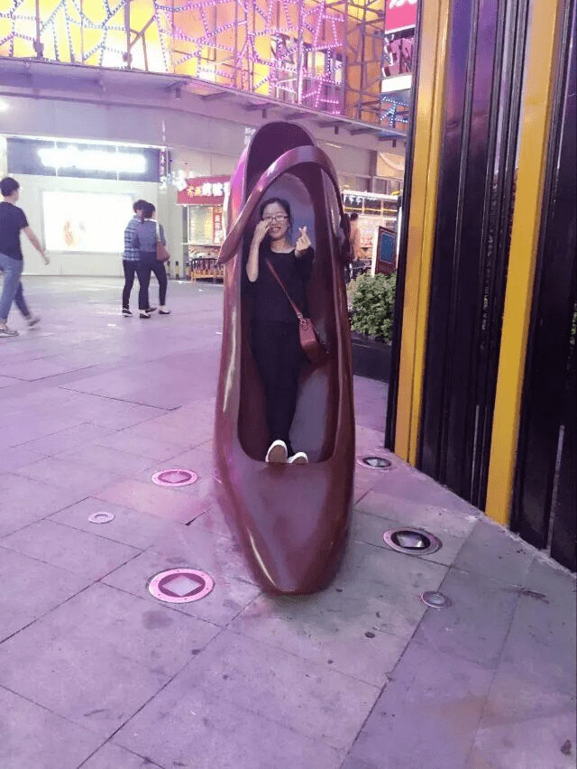

# 躺在巨大高跟鞋里（真图）

作者：充气的妹妹

TID：22021

<title>1</title> <link href="../Styles/Style.css" type="text/css" rel="stylesheet">

# 1

朋友发的照片，好像是哪个广场上的雕塑。很不错

<ignore_js_op>

**QQ图片20161019212207.jpg** *(83.67 KB, 下載次數: 7)*

[下載附件](forum.php?mod=attachment&aid=NjUwNTN8ZDU1OWM5ZWJ8MTY3NDA2OTg1N3wxODIzMHwyMjAyMQ%3D%3D&nothumb=yes)

2016-10-19 21:24 上傳

<title>2</title> <link href="../Styles/Style.css" type="text/css" rel="stylesheet">

# 2

朋友 女性朋友 女朋友 你是脱团狗（一系列莫名其妙的第一反应）这种类型的雕塑挺常见的，不过我记得有些很容易毁坏什么的 <title>3</title> <link href="../Styles/Style.css" type="text/css" rel="stylesheet">

# 3

钻到大帆布鞋里睡觉 <title>4</title> <link href="../Styles/Style.css" type="text/css" rel="stylesheet">

# 4

台灣有個高跟鞋教堂
不過我還沒去過哈哈 <title>5</title> <link href="../Styles/Style.css" type="text/css" rel="stylesheet">

# 5

这里应该是镇江火车站边上的万达广场啊</ignore_js_op>