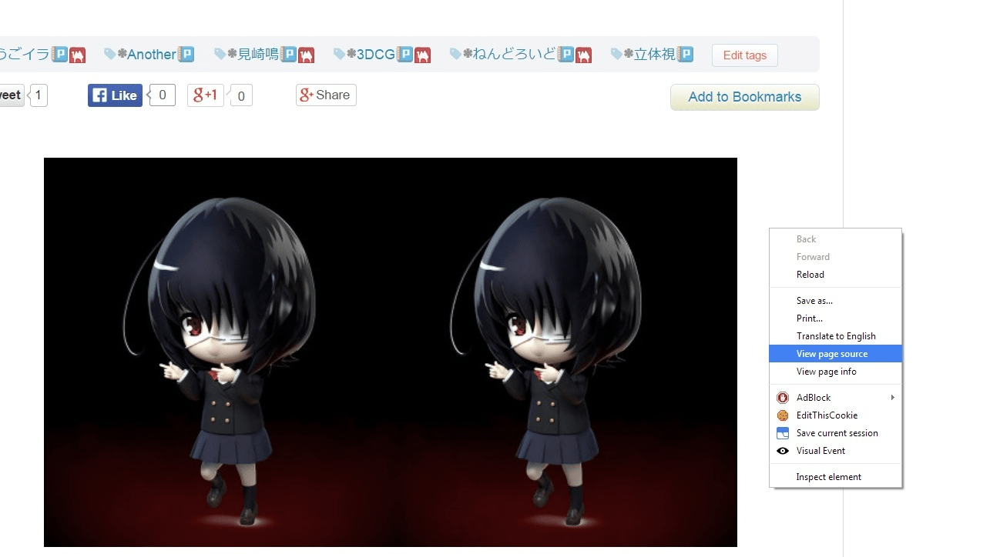
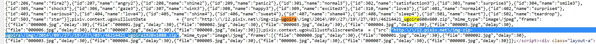
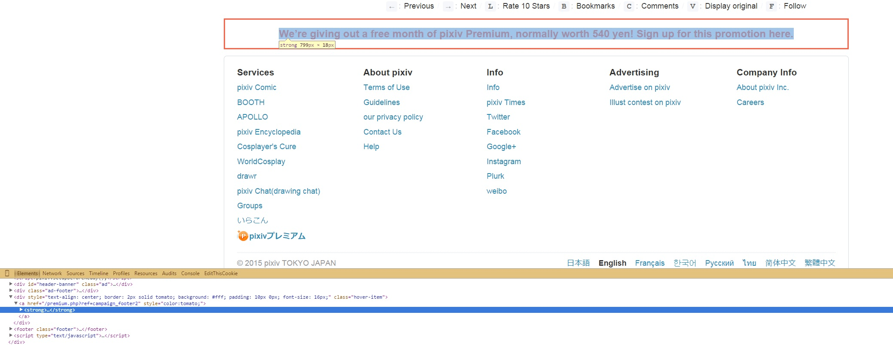
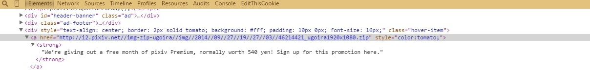

# 转个P站动态图下载工具

作者：ming314159

TID：17822

<title>1</title> <link href="../Styles/Style.css" type="text/css" rel="stylesheet">

# 1

来源：**蔷薇物语工作室吧**
原帖网址：[http://tieba.baidu.com/p/3144156156](http://tieba.baidu.com/p/3144156156)

----------------------------------------------------【注，转载方法需注明来源蔷薇物语工作室吧】

p站新出的うごイラ可以说激发起了一些一些画师的创作欲，才几天就已经有一堆的投稿。不过很多人很头疼怎么保存它，嘛，还是快点开始下文吧

！！！！！！！！！！！！！！！！！！！！！！！！！！！！！！！！！！！！
先说明一下，这うごイラ不是GIF啊。GIF哪能有这么高的色彩表现呢？
！！！！！！！！！！！！！！！！！！！！！！！！！！！！！！！！！！！！

======================================================【以上转自pixiv吧】

本教程使用国人作者制作的PixivAnimatDownloader
各位记得千万不要用作商业用途！！！用者追究法律责任！！
有机会可以关注作者新浪微博magami
岛风GO和舰娘的一些国内软件也是他制作的......

====================================================【以上来自百度知道】

效果图：
<ignore_js_op>

**46214421.gif** *(569.83 KB, 下載次數: 1)*

[下載附件](forum.php?mod=attachment&aid=NDY4NDd8ZGYwZmU4Yjh8MTY3NDA2OTUyMXwxODIzMHwxNzgyMg%3D%3D&nothumb=yes)

2014-9-29 16:56 上傳

网址：[http://yun.baidu.com/s/1hq3iP2s](http://jump.bdimg.com/safecheck/index?url=x+Z5mMbGPAvDeVFDn5esNh3tEqEFWbC4tOatFxkC6cKkrFZ9x3kOPAn17FFv97UmhJDUVQ0SJXVmStHdrta2YTkuFpIdnuLuSR/j3LPoAUDnePhYvBMFC6+KOLCQb7Qb5SAJImnzbm52Pah4egTNMg==)
<title>2</title> <link href="../Styles/Style.css" type="text/css" rel="stylesheet">

# 2

*本帖最後由 sidefx 於 2015-1-9 15:18 編輯*

因爲是相關的內容，就貼這後面好了，雖然隔的時間比較長。

為了方便，那個工具下載完會自動轉為gif， 畫質損失較大。

對比：
<ignore_js_op>

**comparison_.jpg** *(103.46 KB, 下載次數: 0)*

[下載附件](forum.php?mod=attachment&aid=NDk4MTR8NmJhZWE0N2Z8MTY3NDA2OTUyMXwxODIzMHwxNzgyMg%3D%3D&nothumb=yes)

2015-1-8 20:06 上傳

一般需求其實夠了，但是如果是想要收藏的人，還是會希望畫質盡可能地高一些。
实际上只用瀏覽器，不需要專門的工具或者script，也能下載最高畫質：

首先，關於ugoira player([https://github.com/pixiv/zip_player](https://github.com/pixiv/zip_player))：
ugoira player的數據源是一個不帶壓縮的zip文件。

還是用上面這個舉例：

比如你的瀏覽器是Chrome:

頁面上右鍵->view page source
<ignore_js_op>

**001.jpg** *(111.13 KB, 下載次數: 0)*

[下載附件](forum.php?mod=attachment&aid=NDk4MTV8Y2E3MzAyNjB8MTY3NDA2OTUyMXwxODIzMHwxNzgyMg%3D%3D&nothumb=yes)

2015-1-8 20:09 上傳

搜索"ugoira"就會找到類似于這個的zip。
在  pixiv.context.ugokuIllustFullscreenData  = {  之後
<ignore_js_op>

**002.jpg** *(322.03 KB, 下載次數: 0)*

[下載附件](forum.php?mod=attachment&aid=NDk4MTZ8N2U5Yjg0N2F8MTY3NDA2OTUyMXwxODIzMHwxNzgyMg%3D%3D&nothumb=yes)

2015-1-8 20:09 上傳

zip的内容就是動畫全部的幀。
實際分辨率并不总是有後面寫的那麽高，但是選最高的下就好。後面接着是一串類似于"{"file":"000002.jpg","delay":30}"的内容，就是每一幀對應的圖片名和持續時間，如果是非均勻幀速的動畫，想要還原時間綫看這裏就行了，其實一般不用在意。

這兩部分就包括了動畫的全部信息。

具体到这个例子，zip的链接就是：
http:\/\/i2.pixiv.net\/img-zip-ugoira\/img\/2014\/09\/27\/19\/27\/03\/46214421_ugoira1920x1080.zip

直接放到地址栏下載的話，url會變成：
[http://i2.pixiv.net//img-zip-ugoira//img//2014//09//27//19//27//03//46214421_ugoira1920x1080.zip](http://i2.pixiv.net//img-zip-ugoira//img//2014//09//27//19//27//03//46214421_ugoira1920x1080.zip)
但是不能下，會显示 403 Forbidden。

这个很容易解決，因为只是不允許直接訪問此文件，所以只要修改request，加一個referer，或者從可以訪問的頁面鏈接過去就行了。

只用瀏覽器的話，簡單的方式：
隨便打開一個pixiv頁面
再隨便找一個鏈接，比如页面最下方的"**We’re giving out a free month of pixiv Premium**".
在鏈接上右键->inspect element
<ignore_js_op>

**003.jpg** *(214.08 KB, 下載次數: 0)*

[下載附件](forum.php?mod=attachment&aid=NDk4MTd8MDljMmQwYmZ8MTY3NDA2OTUyMXwxODIzMHwxNzgyMg%3D%3D&nothumb=yes)

2015-1-8 20:09 上傳

href的值上右鍵->edit attribute， 把href的值換成剛才那個变化后的url：
<ignore_js_op>

**006.jpg** *(51.28 KB, 下載次數: 0)*

[下載附件](forum.php?mod=attachment&aid=NDk4MTl8ZjZhM2NlYmZ8MTY3NDA2OTUyMXwxODIzMHwxNzgyMg%3D%3D&nothumb=yes)

2015-1-8 20:09 上傳

然后再點"**We’re giving out a free month of pixiv Premium**"的鏈接，就可以下載了。

更簡單的方式：
很多下載工具會自動修改request來通過一些比較弱的訪問控制。
直接把前面变化后的url
[http://i2.pixiv.net//img-zip-ugoira//img//2014//09//27//19//27//03//46214421_ugoira1920x1080.zip](http://i2.pixiv.net//img-zip-ugoira//img//2014//09//27//19//27//03//46214421_ugoira1920x1080.zip)
複製到下載工具比如迅雷，也是可以的。

下載后如果需要，再用FFmpeg或者 PS/AE之類的轉成視頻。

以上。

<title>3</title> <link href="../Styles/Style.css" type="text/css" rel="stylesheet">

# 3

感谢分享！！这个真的很有用～ <title>4</title> <link href="../Styles/Style.css" type="text/css" rel="stylesheet">

# 4

看到鸣酱转手指动图就笑了，结果一转眼动图直接不动了。大晚上的简直不能更阴森 <title>5</title> <link href="../Styles/Style.css" type="text/css" rel="stylesheet">

# 5

看了下效果很好，唉~谢谢楼主分享了 <title>6</title> <link href="../Styles/Style.css" type="text/css" rel="stylesheet">

# 6

感谢分享，很有用 <title>7</title> <link href="../Styles/Style.css" type="text/css" rel="stylesheet">

# 7

支持技術貼~有空去試試呵~如果弄出個女孩反復踩踏高樓什麼的 <title>8</title> <link href="../Styles/Style.css" type="text/css" rel="stylesheet">

# 8

果然是真神啊....
那家伙吐槽折腾这么长时间岛风go，最终火起来的原因是做了迅雷高速通道破解233 <title>9</title> <link href="../Styles/Style.css" type="text/css" rel="stylesheet">

# 9

好东西啊 真是方便极了。</ignore_js_op></ignore_js_op></ignore_js_op></ignore_js_op></ignore_js_op></ignore_js_op>