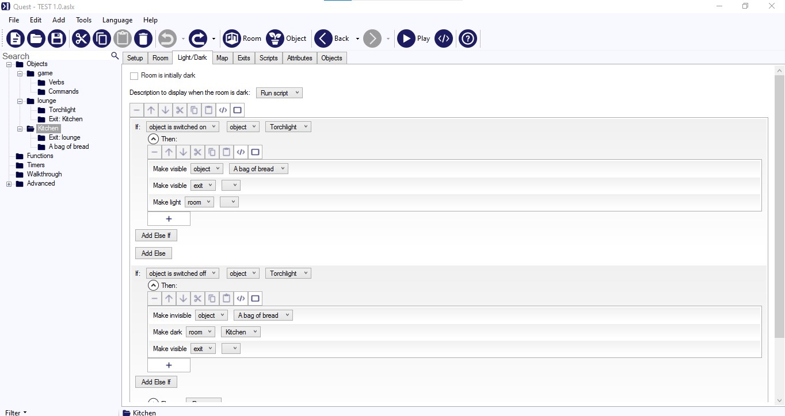

# 软件／网页分享-制作文字冒险游戏的工具

作者：妈的智障

TID：32323

<title>1</title> <link href="../Styles/Style.css" type="text/css" rel="stylesheet">

# 1

*本帖最後由 racer0725 於 2021-12-29 13:31 編輯*

从文件夹里翻出来几个网址，然后记忆如潮水一般回来了，我想起了几个我还没有分享过的资源内容
其中有一个就是文字冒险，文字冒险是个很有趣的存在，他与“鸡皮疙他”系列有相似之处担忧截然不同，因为文字冒险以文字的形式提供了3D的视角，有多个维度的移动，有场景的互动，类似于文字形式的RPG，而不是非常线性的游戏流程，实在是非常特殊。

今天分享的是文字冒险的网站，这个网站上面有着大量的GTS内容，只不过没有直接的搜索引擎，必须一页一页的找游戏，
网址链接：[https://textadventures.co.uk/](https://textadventures.co.uk/)

这个是一个快速链接，TAG是work in progress，简称WIP，前几页高评分的内容都是GTS主题的，后面就少了起来
[https://textadventures.co.uk/games/tag/wip](https://textadventures.co.uk/games/tag/wip)

下面则是分享这个网站专有的软件，免费的，开源的软件，使用的是 MIT License
可以直接在上面玩游戏，但这个桌面版的主要功能是开发文字游戏，非常优秀的工具，现代化的操作页面，和不错的优化这个软件非常的初学者友好，图像化的编程页面，6岁小孩都可以用，友好程度和Scratch有的一拼

功能也是非常的强大的，可以插入视频，图片，文字，YouTube链接，3D效果，如果想要传统的打代码也是有的。
<ignore_js_op>

**01.jpg** *(103.39 KB, 下載次數: 0)*

[下載附件](forum.php?mod=attachment&aid=OTMwNDZ8YjJiNGMxZjd8MTY3NDA2NTcxMXwxODIzMHwzMjMyMw%3D%3D&nothumb=yes)

2021-12-29 13:22 上傳

上面的图片是我制作的一个模板测试
<ignore_js_op>

**02.jpg** *(120.8 KB, 下載次數: 0)*

[下載附件](forum.php?mod=attachment&aid=OTMwNDd8MjYxNDFkN2F8MTY3NDA2NTcxMXwxODIzMHwzMjMyMw%3D%3D&nothumb=yes)

2021-12-29 13:22 上傳

游戏名字，作者等信息
<ignore_js_op>

**03.jpg** *(97.6 KB, 下載次數: 0)*

[下載附件](forum.php?mod=attachment&aid=OTMwNDh8NWY1N2FlZTZ8MTY3NDA2NTcxMXwxODIzMHwzMjMyMw%3D%3D&nothumb=yes)

2021-12-29 13:22 上傳

主角是否有生命值等属性
<ignore_js_op>

**04.jpg** *(103.5 KB, 下載次數: 0)*

[下載附件](forum.php?mod=attachment&aid=OTMwNDl8Y2Q0ZTc0Yjh8MTY3NDA2NTcxMXwxODIzMHwzMjMyMw%3D%3D&nothumb=yes)

2021-12-29 13:22 上傳

游戏大体风格
<ignore_js_op>

**05.jpg** *(106.23 KB, 下載次數: 0)*

[下載附件](forum.php?mod=attachment&aid=OTMwNTB8YjBmOGMxZjR8MTY3NDA2NTcxMXwxODIzMHwzMjMyMw%3D%3D&nothumb=yes)

2021-12-29 13:22 上傳

游戏画面
<ignore_js_op>

**06.jpg** *(105.96 KB, 下載次數: 0)*

[下載附件](forum.php?mod=attachment&aid=OTMwNTF8OGFjOTI1M2F8MTY3NDA2NTcxMXwxODIzMHwzMjMyMw%3D%3D&nothumb=yes)

2021-12-29 13:22 上傳

游戏的指令
<ignore_js_op>

**07.jpg** *(133.84 KB, 下載次數: 0)*

[下載附件](forum.php?mod=attachment&aid=OTMwNTJ8OGI4MDA3YjF8MTY3NDA2NTcxMXwxODIzMHwzMjMyMw%3D%3D&nothumb=yes)

2021-12-29 13:22 上傳

手电筒在物品栏的功能
<ignore_js_op>

**08.jpg** *(102.55 KB, 下載次數: 0)*

[下載附件](forum.php?mod=attachment&aid=OTMwNTN8Y2EzNzc3ZDh8MTY3NDA2NTcxMXwxODIzMHwzMjMyMw%3D%3D&nothumb=yes)

2021-12-29 13:22 上傳

3维的移动和房间的进出
<ignore_js_op>

**09.jpg** *(124.39 KB, 下載次數: 0)*

[下載附件](forum.php?mod=attachment&aid=OTMwNTR8NmJkOWI2MDR8MTY3NDA2NTcxMXwxODIzMHwzMjMyMw%3D%3D&nothumb=yes)

2021-12-29 13:22 上傳

手电筒的功能
<ignore_js_op>

**10.jpg** *(120.62 KB, 下載次數: 0)*

[下載附件](forum.php?mod=attachment&aid=OTMwNTV8YThjNDViM2R8MTY3NDA2NTcxMXwxODIzMHwzMjMyMw%3D%3D&nothumb=yes)

2021-12-29 13:22 上傳

在进入房间时触发的指令
<ignore_js_op>

**11.jpg** *(77.89 KB, 下載次數: 0)*

[下載附件](forum.php?mod=attachment&aid=OTMwNTZ8YjQxMjJiZTR8MTY3NDA2NTcxMXwxODIzMHwzMjMyMw%3D%3D&nothumb=yes)

2021-12-29 13:22 上傳

可以定义一个物体是不是可食用的
<ignore_js_op>

**12.jpg** *(115.36 KB, 下載次數: 0)*

[下載附件](forum.php?mod=attachment&aid=OTMwNTd8N2E2NzljNzB8MTY3NDA2NTcxMXwxODIzMHwzMjMyMw%3D%3D&nothumb=yes)

2021-12-29 13:22 上傳

JAVA script
<ignore_js_op>

**13.jpg** *(143.4 KB, 下載次數: 0)*

[下載附件](forum.php?mod=attachment&aid=OTMwNTh8NDhmMTU0OWJ8MTY3NDA2NTcxMXwxODIzMHwzMjMyMw%3D%3D&nothumb=yes)

2021-12-29 13:22 上傳

可以插入视频，图片，文字，YouTube链接，3D效果

网站直接下载和网上模式的网址
链接：[https://textadventures.co.uk/quest](https://textadventures.co.uk/quest)

Google Drive分流
链接：[https://drive.google.com/file/d/ ... RL/view?usp=sharing](https://drive.google.com/file/d/1qZijYzfIWRRQDjrXjFdrC1xHGMJqF2RL/view?usp=sharing)

百度网盘分流
链接：[https://pan.baidu.com/s/1DL9yHmeXNHytlLcXJeq6GQ](https://pan.baidu.com/s/1DL9yHmeXNHytlLcXJeq6GQ)
提取码：LMAO

<title>2</title> <link href="../Styles/Style.css" type="text/css" rel="stylesheet">

# 2

*本帖最後由 racer0725 於 2021-12-29 13:33 編輯*

个人推荐的游戏，都是可以线上玩的，移动端和电脑端都支持

缩小实验室项目
[https://textadventures.co.uk/gam ... rinking-lab-project](https://textadventures.co.uk/games/view/3hwusdaum0ciwq1jqmzn9w/the-shrinking-lab-project)

在大学被缩小
[https://textadventures.co.uk/gam ... a/shrunk-at-college](https://textadventures.co.uk/games/view/k7faqjnyok2ohpmspxwmna/shrunk-at-college)

在高中被缩小
[https://textadventures.co.uk/gam ... runk-at-high-school](https://textadventures.co.uk/games/view/xgzosn-bvkugcfpnlyyg5a/shrunk-at-high-school)

缩小小偷
[https://textadventures.co.uk/gam ... 17-a-shrinking-game](https://textadventures.co.uk/games/view/hgh_3gcf_u2qlun6y86naw/tiny-thief-0-17-a-shrinking-game)

<title>3</title> <link href="../Styles/Style.css" type="text/css" rel="stylesheet">

# 3

全是外文的，太看的起我们了，大佬 <title>4</title> <link href="../Styles/Style.css" type="text/css" rel="stylesheet">

# 4

> [充气的妹妹 發表於 2021-12-29 13:31](https://giantessnight.cf/gnforum2012/forum.php?mod=redirect&goto=findpost&pid=489072&ptid=32323)
> 全是外文的，太看的起我们了，大佬

还好啦，基本上都是非常简单的英语，不要被长篇幅英文吓到了，读两下就能懂得 <title>5</title> <link href="../Styles/Style.css" type="text/css" rel="stylesheet">

# 5

> [充气的妹妹 發表於 2021-12-29 13:31](https://giantessnight.cf/gnforum2012/forum.php?mod=redirect&goto=findpost&pid=489072&ptid=32323)
> 全是外文的，太看的起我们了，大佬

真的，这个工具和他的网页版非常好用，非常顺手，唯一的障碍就是语言了，只要能克服这个障碍，任何人都可以制作出非常好的GTS文字冒险游戏
<title>6</title> <link href="../Styles/Style.css" type="text/css" rel="stylesheet">

# 6

这个我觉得还不错，我之前就过用这个搞一搞，想做出来个文字冒险，可惜太鸽了，只做了一点owo <title>7</title> <link href="../Styles/Style.css" type="text/css" rel="stylesheet">

# 7

*本帖最後由 Foobarz 於 2021-12-29 16:05 編輯*

还行，话说纯文字的游戏也可以试试 Ink （ [https://www.inklestudios.com/ink/](https://www.inklestudios.com/ink/) ）？虽然就很像一问一答的了（x
<title>8</title> <link href="../Styles/Style.css" type="text/css" rel="stylesheet">

# 8

> [Foobarz 發表於 2021-12-29 15:59](https://giantessnight.cf/gnforum2012/forum.php?mod=redirect&goto=findpost&pid=489087&ptid=32323)
> 还行，话说纯文字的游戏也可以试试 Ink （ https://www.inklestudios.com/ink/ ）？虽然就很像一问一答的了 ...

看了一下，也是很不错的，只不过我用惯图像化的交互页面，单纯的文字上手有些困难

<title>9</title> <link href="../Styles/Style.css" type="text/css" rel="stylesheet">

# 9

> [lcgww 發表於 2021-12-29 15:51](https://giantessnight.cf/gnforum2012/forum.php?mod=redirect&goto=findpost&pid=489084&ptid=32323)
> 这个我觉得还不错，我之前就过用这个搞一搞，想做出来个文字冒险，可惜太鸽了，只做了一点owo ...

咕咕咕，文字冒险确实是需要时间来制作的，很多时候没有灵感就做不下去了，不过我还是想看看你的作品 <title>10</title> <link href="../Styles/Style.css" type="text/css" rel="stylesheet">

# 10

这个玩过一阵子，只能说没有对中文的支持导致整个制作都显得特别特别蛋疼。各种交互基本都是按照英语语法来的，总之看国外大佬的文字游戏就行，自个做还是要自己写源码(´ . .̫ . `)（因此咕咕咕了一个游戏） <title>11</title> <link href="../Styles/Style.css" type="text/css" rel="stylesheet">

# 11

**Slowly you make your way in between Elsa's {object:tits1}.** They tower high above you. Her fingers flit in and out of view as she continues to caress her firm {object:nipples} emphatically. {object:Elsa_Cleavage_Talk} is watching closely, a grin slowly forming on her lips.

To your {exit:e253} is Elsa's Sternum.
To your {exit:e254} is Elsa's Neck.

国外大佬做这个也是感觉没谁了，要操纵这种东西还是要时间适应一下的 <title>12</title> <link href="../Styles/Style.css" type="text/css" rel="stylesheet">

# 12

> 充气的妹妹 發表於 2021-12-29 13:31
> 全是外文的，太看的起我们了，大佬

百度翻译app新版有个悬浮球，可以截图翻译，而且也可以学英语啊hh <title>13</title> <link href="../Styles/Style.css" type="text/css" rel="stylesheet">

# 13

这个确实上头 玩了好长一段时间了，就是手机在线玩容易出bug，有几次玩了挺久出bug没存档就很悲伤</ignore_js_op></ignore_js_op></ignore_js_op></ignore_js_op></ignore_js_op></ignore_js_op></ignore_js_op></ignore_js_op></ignore_js_op></ignore_js_op></ignore_js_op></ignore_js_op></ignore_js_op>