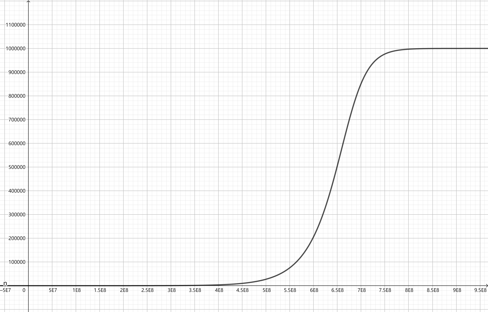
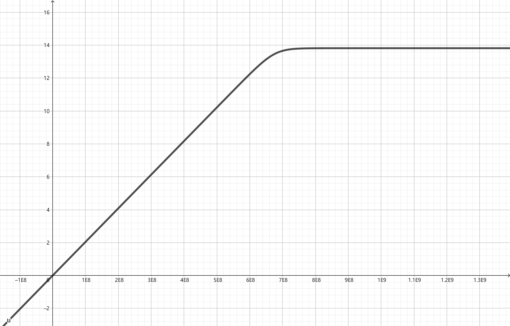

# 辅助动态倍率增长公式

作者：wazhch

TID：33746

<title>1</title> <link href="../Styles/Style.css" type="text/css" rel="stylesheet">

# 1

*本帖最後由 ASQTTR 於 2022-8-1 21:40 編輯*

**辅助动态倍率增长公式**同时也是**缩小公式****摘要***通过两个假设构建出符合增长时放大倍数近似指数上升以及在具体常数变化之前放大倍数可稳定在一个值的倍率增长公式，以辅助坛友们计算增长所需使用时间。***目标及目标设置解释****第一个目标**，放大时呈**指数上升**，主要基于人对数据的感觉。一个商品，从一元增加到两元，价格仅仅增加了一元，却感觉涨价了好多；另一种商品，从一万增加到一万零一，价格增量和前一个商品一样，但却感觉几乎没有怎么涨价。我们对数据的感觉，大多看的是比例，增长的比例不变我们就会认为增长得差不多。通过简单的数学计算，可以发现这样比例相同的情况下，增长呈指数上升。自然，我们的巨大娘在倍率增长的过程中，也应当采取类似于等比增长指数爆炸的形式增长。**第二个目标**，根据所选取的常数，放大到最后会**趋于一个定值**，主要基于各大文章。增长后，一般坛友们都会让此时的巨大娘处于一种暂时稳定的状态：放大倍率增加速度不断降低，直至放大倍率保持不变。因而，我们弄出来的公式在自变量冲向无穷大时，因变量不能冲向无穷大，需要趋于一个定值。**假设及其来源**假设一，单位时间内，增长的放大倍数与此时巨大娘的体积成正比。假设来源与本人空想：如果以身高成正比，明显出来的是指数函数，之后要继续修正范围较小；而更高阶的面积显然不太合理；最终选择体积（或质量）。假设二，假设一中提到的正比系数随时间呈指数下降。来源与 @kloude 大大的《旅行者》，其中提到几率随着增长次数的增加而指数降低。这里为了计算方便，本人采取随时间指数下降。**推导过程**（可直接跳过至结论与应用）：由基本事实易得一开始的倍率为 N_0=1。由基本事实 V=\rho_{V-n}n^3 与假设一可得，dn=\alpha Vdt=\alpha\rho_{V-n}n^3dt将 \alpha、\rho 吸收到 k ，可得kdt=\frac{dn}{n^3}由假设二，可得（\lambda<0）\rho_0e^{\lambda t}dt=\frac{\rho_0}{\lambda}de^{\lambda t}=\frac{dn}{n^3}=-\frac{1}{2}d\left(\frac{1}{n^2}\right)因而，我们可以得到\frac{\rho_0}{\lambda}\left(e^{\lambda t}-1\right)=\frac{1}{2}-\frac{1}{2n^2}n=\frac{1}{\sqrt{1-\sqrt2\frac{\rho_0}{\lambda}\left(e^{\lambda t}-1\right)}}这里，为了确定常数 \rho_0 与 \lambda，需要知道两条初始状态或终结状态。我们选择的是刚开始增长的速度 v_0=\frac{dn}{dt}|_{t=0} 以及最终的终结倍率 N_F。\frac{dn}{dt}=kn^3=\rho_0e^{\lambda t}n^3所以，v_0=\rho_0最终，t\rightarrow+\infty 时，e^{\lambda t}-1\rightarrow0^-，因而，此时，有N_F=\frac{1}{\sqrt{1+\frac{\sqrt2v_o}{\lambda}}}\lambda=\sqrt2\ \frac{v_0N_F^2}{1-N_F^2}**结论与应用**我们得到，**n=\frac{1}{\sqrt{1-\frac{1-N_F^2}{\ N_F^2}\left(e^{\sqrt2\ \frac{v_0N_F^2}{1-N_F^2}t}-1\right)}}**其中，右边，v_0 是一开始的倍率增长速度，N_F 是最终的放大倍率，t 是从 n=1 开始经过的时间；左边，n 是此时对应的放大倍率。例如，@kloude 的《我与世界与永远的一天》中，主角的初始身高为 h_0=1.60，身高增长速度为 v_h=1\frac{cm}{day}=\ 4.63\times{10}^{-8}，因而 v_0=\frac{v_h}{h_0}=2.89\times{10}^{-8}。取最后 h_F=1600000，则N_F={10}^6，我们可以画出 n 随时间的变化关系。**改造补充**如果 v_0 是一个负数，N_F 属于零到一全开，就可以变为缩小公式。其他的情况总是会冲向正无穷大，那就没有意义了…<title>2</title> <link href="../Styles/Style.css" type="text/css" rel="stylesheet">

# 2

 <ignore_js_op>[函数图像.png](forum.php?mod=attachment&aid=OTc4MzV8MTAyMjBkNDB8MTY3NDA2NTQ1M3wxODIzMHwzMzc0Ng%3D%3D&nothumb=yes) *(397.6 KB, 下載次數: 0)*

[下載附件](forum.php?mod=attachment&aid=OTc4MzV8MTAyMjBkNDB8MTY3NDA2NTQ1M3wxODIzMHwzMzc0Ng%3D%3D&nothumb=yes)

2022-7-25 01:18 上傳  

函数图像

</ignore_js_op> <title>3</title> <link href="../Styles/Style.css" type="text/css" rel="stylesheet">

# 3

后注：看起来不像人话的公式请自行放到公式编辑器或类似软件中将其翻译为正常形式。最后的应用过程中的计算数据如没有标注单位，则所用单位一定是国际单位制的主单位及其导出单位。比如，图表中的 7E8 代表 700000000秒 即 8101.85天 也即 22.18个回归年。 <title>4</title> <link href="../Styles/Style.css" type="text/css" rel="stylesheet">

# 4

后生，快乖乖回去写作业论文啦，不要在这里犯拖延症~ <title>5</title> <link href="../Styles/Style.css" type="text/css" rel="stylesheet">

# 5

很，很高级。楼主，很厉害。并不是特别看得懂公式.. <title>6</title> <link href="../Styles/Style.css" type="text/css" rel="stylesheet">

# 6

好强，看到latex公式时dna动了，ptsd犯了，，，
还有捉个虫，我写的起始身高是150cm <title>7</title> <link href="../Styles/Style.css" type="text/css" rel="stylesheet">

# 7

科考区第一人，建议申请科考区版主（不过论坛不支持latex，阅读体验确实过差了） <title>8</title> <link href="../Styles/Style.css" type="text/css" rel="stylesheet">

# 8

> [austin01 發表於 2022-7-25 23:07](https://giantessnight.cf/gnforum2012/forum.php?mod=redirect&goto=findpost&pid=510469&ptid=33746)
> 科考区第一人，建议申请科考区版主（不过论坛不支持latex，阅读体验确实过差了） ...

实际上这样的格式已经算好的了…在推导过程中用到的积分直接改用小量吸收的形式避免使用积分符号，只是其中表示常数的希腊字母拆成这样的形式实在有点恶心；下一次直接用 UNICODE 标记法试一试，就是好像并不是所有的数学软件都支持。
<title>9</title> <link href="../Styles/Style.css" type="text/css" rel="stylesheet">

# 9

可能有人在疑惑，“在前面一段时间里真的是近似指数上升吗？”这里给一张将因变量再取一个对数得到的图像，可以很明显发现前面的增长阶段可以近似看成一条直线，也就是说在增长时的确是近似指数爆炸的。
（取的是自然对数，这样计算机的计算量比较小）
<title>10</title> <link href="../Styles/Style.css" type="text/css" rel="stylesheet">

# 10

 <ignore_js_op>[取个对数.png](forum.php?mod=attachment&aid=OTc4NDZ8OTVmMDdiY2F8MTY3NDA2NTQ1M3wxODIzMHwzMzc0Ng%3D%3D&nothumb=yes) *(510.97 KB, 下載次數: 0)*

[下載附件](forum.php?mod=attachment&aid=OTc4NDZ8OTVmMDdiY2F8MTY3NDA2NTQ1M3wxODIzMHwzMzc0Ng%3D%3D&nothumb=yes)

2022-7-26 00:22 上傳  

取个对数

</ignore_js_op> <title>11</title> <link href="../Styles/Style.css" type="text/css" rel="stylesheet">

# 11

可以 看不懂 太专业了。圈里有各式各样的人才。 <title>12</title> <link href="../Styles/Style.css" type="text/css" rel="stylesheet">

# 12

上一次我看到latex还是在知乎看数学问题...... <title>13</title> <link href="../Styles/Style.css" type="text/css" rel="stylesheet">

# 13

hjh 在这遇见LaTeX
盲猜是刚毕业的理工科大学生 <title>14</title> <link href="../Styles/Style.css" type="text/css" rel="stylesheet">

# 14

> [wazhch 發表於 2022-7-31 01:22](https://giantessnight.cf/gnforum2012/forum.php?mod=redirect&goto=findpost&pid=511064&ptid=33746)
> hjh 在这遇见LaTeX
> 盲猜是刚毕业的理工科大学生

抱着论坛能支持的幻想用了一下…到头来发现自己是小丑
<title>15</title> <link href="../Styles/Style.css" type="text/css" rel="stylesheet">

# 15

有点意思，其实可以做个开源项目可视化一下（？）会比公式和曲线直观的多 <title>16</title> <link href="../Styles/Style.css" type="text/css" rel="stylesheet">

# 16

> [大井 發表於 2022-8-1 01:29](https://giantessnight.cf/gnforum2012/forum.php?mod=redirect&goto=findpost&pid=511216&ptid=33746)
> 有点意思，其实可以做个开源项目可视化一下（？）会比公式和曲线直观的多 ...

emm，不知道要怎么做可视化…等到可以发附件了把 GeoGebra 的源文件发上来？或者你自己把这玩意儿弄上去自己拖拖滑动条玩玩？