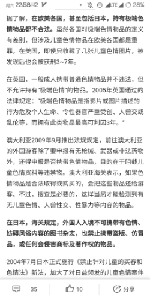

# 过几天要去英国，查了一下过海关之类的事情发现可能和gts内容相关的条例

作者：CEW

TID：27127

<title>1</title> <link href="../Styles/Style.css" type="text/css" rel="stylesheet">

# 1

就是那个极端色情内容啦，危及到生命这一点，好像很多比较巨大级别的gts都可以符合，我有点紧张……虽然我过关前肯定会给手机电脑做更彻底的清查的。 <title>2</title> <link href="../Styles/Style.css" type="text/css" rel="stylesheet">

# 2

 <ignore_js_op>[Screenshot_20190720-225844_Chrome.png](forum.php?mod=attachment&aid=NzkxOTl8NDA5NDFhNWJ8MTY3NDA2Njc3NHwxODIzMHwyNzEyNw%3D%3D&nothumb=yes) *(79.98 KB, 下載次數: 8)*

[下載附件](forum.php?mod=attachment&aid=NzkxOTl8NDA5NDFhNWJ8MTY3NDA2Njc3NHwxODIzMHwyNzEyNw%3D%3D&nothumb=yes)

2019-7-20 23:08 上傳  

</ignore_js_op> <title>3</title> <link href="../Styles/Style.css" type="text/css" rel="stylesheet">

# 3

我靠，手机版上传的这个截图变得好糊 <title>4</title> <link href="../Styles/Style.css" type="text/css" rel="stylesheet">

# 4

不会查你移动设备的，你放心就行了，这么点小事你还那么在意，英国的极端色情网站可比中国丰富的多了 <title>5</title> <link href="../Styles/Style.css" type="text/css" rel="stylesheet">

# 5

海关很忙的，不会管你这个.... <title>6</title> <link href="../Styles/Style.css" type="text/css" rel="stylesheet">

# 6

出国多了就适应啦，留学多年表示这边更黄 <title>7</title> <link href="../Styles/Style.css" type="text/css" rel="stylesheet">

# 7

要是会查你的电脑的话，你想想看，有人电脑里面存了一些自拍的视频会多尴尬。西方对个人隐私还是看得很重的，起码不可能搜查你的电脑 <title>8</title> <link href="../Styles/Style.css" type="text/css" rel="stylesheet">

# 8

要注意的只有一点，CP。

Child Pronography。

基本上任何其他的东西查出来都没有问题，只有CP会有人管。

然后只有是真人的CP才会有法律处理。

不过话是这么说，常识上来讲，是不会检查电脑的。

除非你自己有什么特别可疑的行为。

总体来说没有你在大陆被城管打了一顿的概率大。（并不客观） <title>9</title> <link href="../Styles/Style.css" type="text/css" rel="stylesheet">

# 9

哈哈，我第一次出国还把电脑都清空了，做了防找回，把资源都分小份打包加密存百度网盘，出了几次国之后发现根本不会打开你电脑，用个简易加密软件加密一下就好 <title>10</title> <link href="../Styles/Style.css" type="text/css" rel="stylesheet">

# 10

唔，我主要是看到极端色情这个东西的确可以套到gts上面，也不是主要怕海关查我……也有点好奇为什么国外那么多网站没因为这个原因被查 <title>11</title> <link href="../Styles/Style.css" type="text/css" rel="stylesheet">

# 11

外国网站比咱们国家都多隐藏一下就行了 <title>12</title> <link href="../Styles/Style.css" type="text/css" rel="stylesheet">

# 12

主要把重點放在影響飛安的物品上，即便是有黑客背景，他們也不會找專人保管或檢查你的資訊設備，除非你把走私物藏在機殼裡面這另當別論