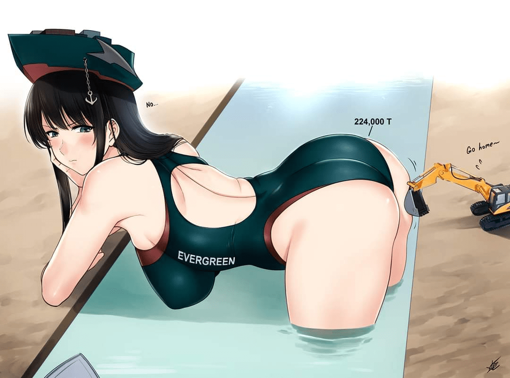

# 运河事件的同人图

作者：camellia

TID：30620

<title>1</title> <link href="../Styles/Style.css" type="text/css" rel="stylesheet">

# 1

运河的同人图，真的绝了，今天刚看到
<title>2</title> <link href="../Styles/Style.css" type="text/css" rel="stylesheet">

# 2

 <ignore_js_op>[23d4b1d23e822da2.jpg](forum.php?mod=attachment&aid=ODgxMDF8ZTZiOWQ0OTV8MTY3NDA2NjA1MnwxODIzMHwzMDYyMA%3D%3D&nothumb=yes) *(52.71 KB, 下載次數: 0)*

[下載附件](forum.php?mod=attachment&aid=ODgxMDF8ZTZiOWQ0OTV8MTY3NDA2NjA1MnwxODIzMHwzMDYyMA%3D%3D&nothumb=yes)

2021-3-28 22:34 上傳  

</ignore_js_op> <title>3</title> <link href="../Styles/Style.css" type="text/css" rel="stylesheet">

# 3

噗，真就万物皆可娘化啊，果然搞hs的动力是最大的
<title>4</title> <link href="../Styles/Style.css" type="text/css" rel="stylesheet">

# 4

按理说这个挖掘机还应该小很多吧，哈哈 <title>5</title> <link href="../Styles/Style.css" type="text/css" rel="stylesheet">

# 5

hhh据说那个船有400多米，起码得千米级的gts才能把它搬起来啊（无端联想） <title>6</title> <link href="../Styles/Style.css" type="text/css" rel="stylesheet">

# 6

好家伙，这都能娘化！？

期待更多娘化图 <title>7</title> <link href="../Styles/Style.css" type="text/css" rel="stylesheet">

# 7

好家伙我直接好家伙就离谱，不过很赞点赞✧٩(ˊωˋ*)و✧ <title>8</title> <link href="../Styles/Style.css" type="text/css" rel="stylesheet">

# 8

<ignore_js_op>

**ExlAuxdWQAoFrz7.jpg** *(68.59 KB, 下載次數: 0)*

[下載附件](forum.php?mod=attachment&aid=ODgxMDZ8ZDExZmY0Yzh8MTY3NDA2NjA1MnwxODIzMHwzMDYyMA%3D%3D&nothumb=yes)

2021-3-29 16:43 上傳

竟然还有第二张

希望可以变成一个风潮
<title>9</title> <link href="../Styles/Style.css" type="text/css" rel="stylesheet">

# 9

[https://exhentai.org/g/1878252/f105ecb570/](https://exhentai.org/g/1878252/f105ecb570/)

这个网址里的大佬收集了很多这次堵运河的gts拟人化图 <title>10</title> <link href="../Styles/Style.css" type="text/css" rel="stylesheet">

# 10

这也能联想到gts呀，真就是万物皆可巨娘？
</ignore_js_op>