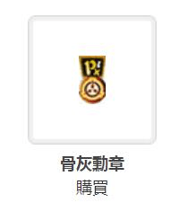

# 这个基金会的勋章是什么鬼。。。

作者：[数据删除]

TID：27005

<title>1</title> <link href="../Styles/Style.css" type="text/css" rel="stylesheet">

# 1

<ignore_js_op>

**QQ截图20190619173138.jpg** *(3.89 KB, 下載次數: 0)*

[下載附件](forum.php?mod=attachment&aid=Nzg4Nzl8Y2U0ZDM0ZDB8MTY3NDA2NjgwM3wxODIzMHwyNzAwNQ%3D%3D&nothumb=yes)

2019-6-19 17:35 上傳

<ignore_js_op>

**QQ截图20190619173353.jpg** *(19.73 KB, 下載次數: 0)*

[下載附件](forum.php?mod=attachment&aid=Nzg4ODB8NDNkMGI5M2F8MTY3NDA2NjgwM3wxODIzMHwyNzAwNQ%3D%3D&nothumb=yes)

2019-6-19 17:36 上傳

就我一个发现的吗（喷
<title>2</title> <link href="../Styles/Style.css" type="text/css" rel="stylesheet">

# 2

可能真的只有楼主你一个人发现。。一般没人会放大盯着看啊！！  我觉得会做这种程度的事的话已经需要被收容了 <title>3</title> <link href="../Styles/Style.css" type="text/css" rel="stylesheet">

# 3

每天都有几个D级人员被拿去煲汤，剩下的就成了骨灰 <title>4</title> <link href="../Styles/Style.css" type="text/css" rel="stylesheet">

# 4

恭喜你發現了,那麼你得到成為D級人員的資格了,給巨大妹子玩弄吧 <title>5</title> <link href="../Styles/Style.css" type="text/css" rel="stylesheet">

# 5

真的沒注意過,馬上買來用用XD
<title>6</title> <link href="../Styles/Style.css" type="text/css" rel="stylesheet">

# 6

收容，被拆，跑路=3=太真实了。D级人员能混到骨灰级感觉某种程度上比绿皮小字混成waaagh boss还难 <title>7</title> <link href="../Styles/Style.css" type="text/css" rel="stylesheet">

# 7

> [archer 發表於 2019-6-19 19:24](https://giantessnight.cf/gnforum2012/forum.php?mod=redirect&goto=findpost&pid=407782&ptid=27005)
> 可能真的只有楼主你一个人发现。。一般没人会放大盯着看啊！！  我觉得会做这种程度的事的话已经需要被收容 ...

没有，我只是被一个逗比勋章的描述吸引住了，所以就挨个看了一遍那些勋章，然后。。。 <title>8</title> <link href="../Styles/Style.css" type="text/css" rel="stylesheet">

# 8

> [peter084 發表於 2019-6-19 20:44](https://giantessnight.cf/gnforum2012/forum.php?mod=redirect&goto=findpost&pid=407788&ptid=27005)
> 真的沒注意過,馬上買來用用XD

啊啊啊，你这丧心病狂的土豪啊，我也想要！可惜好贵。。。
<title>9</title> <link href="../Styles/Style.css" type="text/css" rel="stylesheet">

# 9

厉害了，还有这种东西，论坛大佬还是别有用心啊 <title>10</title> <link href="../Styles/Style.css" type="text/css" rel="stylesheet">

# 10

在基金会喜欢发这种信息是要被人变成D级的( <title>11</title> <link href="../Styles/Style.css" type="text/css" rel="stylesheet">

# 11

。。。楼主看得也太仔细了 <title>12</title> <link href="../Styles/Style.css" type="text/css" rel="stylesheet">

# 12

> [吸水恶魔 發表於 2019-6-19 23:50](https://giantessnight.cf/gnforum2012/forum.php?mod=redirect&goto=findpost&pid=407805&ptid=27005)
> 在基金会喜欢发这种信息是要被人变成D级的(

被你的勋章吓到了。。
<title>13</title> <link href="../Styles/Style.css" type="text/css" rel="stylesheet">

# 13

收容突破跑路并不是什么有趣的梗..... <title>14</title> <link href="../Styles/Style.css" type="text/css" rel="stylesheet">

# 14

一直想要，不过注册天数不够。顺便吐槽一下杀戮地带里赫尔盖斯特的标志把箭头反过来就成了基金会的标志。 <title>15</title> <link href="../Styles/Style.css" type="text/css" rel="stylesheet">

# 15

你这样在基金会是要被丢到拿着scp096照片的scp173房间里的 <title>16</title> <link href="../Styles/Style.css" type="text/css" rel="stylesheet">

# 16

GN專門收容喜愛GTS的SCP
這些SCP會憑空製造體型10倍~1000倍的妹子
當這些SCP處在聖人模式的時候並不會有危險屬於Safe等級
當這些SCP沒有網路可用的時候等級會上升至Keter <title>17</title> <link href="../Styles/Style.css" type="text/css" rel="stylesheet">

# 17

> [[数据删除] 發表於 2019-6-20 12:48](https://giantessnight.cf/gnforum2012/forum.php?mod=redirect&goto=findpost&pid=407834&ptid=27005)
> 被你的勋章吓到了。。

二三四楼那几个大佬勋章比我厉害多了,你应该被他们吓到才对(
<title>18</title> <link href="../Styles/Style.css" type="text/css" rel="stylesheet">

# 18

我倒是都沒注意到過XD
警覺我也是需要被收容的一份子了 <title>19</title> <link href="../Styles/Style.css" type="text/css" rel="stylesheet">

# 19

scp，难不成giantess也曾成为scp收容物中的一员吗，我有机会到相应区域工作吗？（手动滑稽
<title>20</title> <link href="../Styles/Style.css" type="text/css" rel="stylesheet">

# 20

> [超SizeJKGirl 發表於 2019-6-20 19:37](https://giantessnight.cf/gnforum2012/forum.php?mod=redirect&goto=findpost&pid=407864&ptid=27005)
> GN專門收容喜愛GTS的SCP
> 這些SCP會憑空製造體型10倍~1000倍的妹子
> 當這些SCP處在聖人模式的時候並不會有危 ...

2333333333333333333333333333333
字数限制真的烦。。
<title>21</title> <link href="../Styles/Style.css" type="text/css" rel="stylesheet">

# 21

> [freepenguin2 發表於 2019-6-22 09:09](https://giantessnight.cf/gnforum2012/forum.php?mod=redirect&goto=findpost&pid=407964&ptid=27005)
> scp，难不成giantess也曾成为scp收容物中的一员吗，我有机会到相应区域工作吗？（手动滑稽
> ...

参与巨大娘实验的D级人员，请（无慈悲
滑稽</ignore_js_op></ignore_js_op>