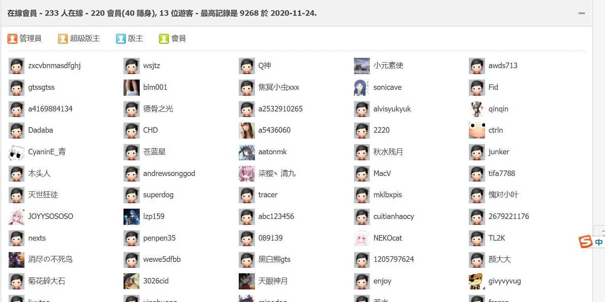

# 这个时间点的人数真没有辜负论坛的名字

作者：lzp159

TID：30626

<title>1</title> <link href="../Styles/Style.css" type="text/css" rel="stylesheet">

# 1

论坛的名字是giantessNight，晚上一两点还真是论坛人数最多最活跃的时候。
<ignore_js_op></ignore_js_op> **截图2021-03-30_01-17-55.jpg** *(173.36 KB, 下載次數: 0)*

[下載附件](forum.php?mod=attachment&aid=ODgxMTZ8OWQwZGY5Y2F8MTY3NDA2NjA0NnwxODIzMHwzMDYyNg%3D%3D&nothumb=yes)

在线人数

2021-3-30 01:21 上傳 
虽然两百多人也不是很多，但是比起白天相对比较多啦。
都是夜猫子吗0.0
<title>2</title> <link href="../Styles/Style.css" type="text/css" rel="stylesheet">

# 2

是不是夜猫子不知道，但白天基本都没空上论坛，所以就集中在晚上了呗 <title>3</title> <link href="../Styles/Style.css" type="text/css" rel="stylesheet">

# 3

最多一次九千，都不知道咋搞出来的 <title>4</title> <link href="../Styles/Style.css" type="text/css" rel="stylesheet">

# 4

我也是大部分时候都是晚上一两点钟上论坛 <title>5</title> <link href="../Styles/Style.css" type="text/css" rel="stylesheet">

# 5

有的上学有的上班谁都不想社死不是吗 <title>6</title> <link href="../Styles/Style.css" type="text/css" rel="stylesheet">

# 6

> [smilth 發表於 2021-3-30 22:58](https://giantessnight.cf/gnforum2012/forum.php?mod=redirect&goto=findpost&pid=464127&ptid=30626)
> 有的上学有的上班谁都不想社死不是吗

说的对呀，等我以后要是退圈了我一定要把电脑里所有的浏览记录和资源都删干净了

<title>7</title> <link href="../Styles/Style.css" type="text/css" rel="stylesheet">

# 7

hhh大部分坛友国内白天要工作学习也不好翻墙上啊，海外党倒是还好一点 <title>8</title> <link href="../Styles/Style.css" type="text/css" rel="stylesheet">

# 8

啊，这种事情晚上不是最好吗？确保没有人来打扰之后不久很舒服吗？