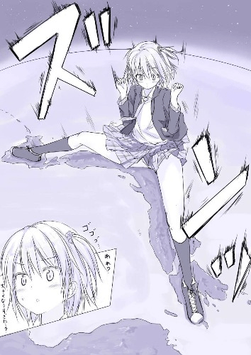
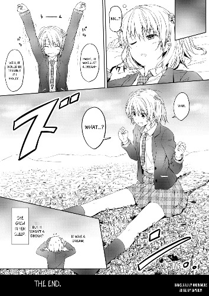

# 这个漫画在哪里看

作者：触碰不到的笑

TID：33665

<title>1</title> <link href="../Styles/Style.css" type="text/css" rel="stylesheet">

# 1

我搜了很多内容但是都没找到。我知道了这个作者叫honey，找到了他的推特但是推特上只有一些其他作品的图片。在gs上倒是找到了他其他的作品没有发现这个。然后又去注册了ehentai这个网站甚至都没找到漫画都是讨论类的帖子。。。本站现在积分才1千 去不了漫画区 <title>2</title> <link href="../Styles/Style.css" type="text/css" rel="stylesheet">

# 2

 <ignore_js_op>[54BF8015C8D36C2D0F57E20560EC16A6.jpg](forum.php?mod=attachment&aid=OTc1ODV8NWY0NmI2MzV8MTY3NDA2NTQ4NXwxODIzMHwzMzY2NQ%3D%3D&nothumb=yes) *(60.5 KB, 下載次數: 1)*

[下載附件](forum.php?mod=attachment&aid=OTc1ODV8NWY0NmI2MzV8MTY3NDA2NTQ4NXwxODIzMHwzMzY2NQ%3D%3D&nothumb=yes)

2022-7-12 01:16 上傳  

</ignore_js_op> <title>3</title> <link href="../Styles/Style.css" type="text/css" rel="stylesheet">

# 3

在贴吧居然找到了几张图，但是不全。应该是一个里的，因为女主长得一样。 <title>4</title> <link href="../Styles/Style.css" type="text/css" rel="stylesheet">

# 4

 <ignore_js_op>[CA00E4A0102A07E55D088479E60D8EB1.jpg](forum.php?mod=attachment&aid=OTc1ODd8OGVmOWQzYjh8MTY3NDA2NTQ4NXwxODIzMHwzMzY2NQ%3D%3D&nothumb=yes) *(79.11 KB, 下載次數: 0)*

[下載附件](forum.php?mod=attachment&aid=OTc1ODd8OGVmOWQzYjh8MTY3NDA2NTQ4NXwxODIzMHwzMzY2NQ%3D%3D&nothumb=yes)

2022-7-12 02:25 上傳  

</ignore_js_op> <title>5</title> <link href="../Styles/Style.css" type="text/css" rel="stylesheet">

# 5

蜂蜜大大的商业图，外面都看不到完整的，还是赞助去FANBOX上面看吧 <title>6</title> <link href="../Styles/Style.css" type="text/css" rel="stylesheet">

# 6

*本帖最後由 s孙晓美 於 2022-7-12 16:22 編輯*

能看到的地方基本就三个 1e站 2作者twitter fantia 3大妈之家 （作者的图虽然不错但是重点是配在一起的文章）dre也是这种模式，每月一更几个图配文章，文章应该有不少翻译的 <title>7</title> <link href="../Styles/Style.css" type="text/css" rel="stylesheet">

# 7

你在E站搜honey lounge或者hachimitsu应该就能找到不少了，漫画和图集都有，但想要全部的话可能还是得像楼上上说的那样去赞助 <title>8</title> <link href="../Styles/Style.css" type="text/css" rel="stylesheet">

# 8

这个角色是原创角色かりん，开头这个是很上古的一个[单图](https://gs-uploader.jinja-modoki.com/upld-index.php?uname=hachimitsu&dorder_by=time_disp.DESC&doffset=15)，（现在一众画师都不去jinja modoki了…）（链接： [https://gs-uploader.jinja-modoki.com/upld-index.php?uname=hachimitsu&dorder_by=time_disp.DESC&doffset=15](https://gs-uploader.jinja-modoki.com/upld-index.php?uname=hachimitsu&dorder_by=time_disp.DESC&doffset=15) ）
然后这个角色出剧情本，一个是honey lounge团《ハニーピース》，一个是NeonSign团《えふさん！》。
后续就没出过本了，然后就到20年开twitter开fantia在里面月费偶尔更片段
<title>9</title> <link href="../Styles/Style.css" type="text/css" rel="stylesheet">

# 9

> 咕咕的攸栗 發表於 2022-7-12 07:22
> 蜂蜜大大的商业图，外面都看不到完整的，还是赞助去FANBOX上面看吧

感谢 找到看的地方就行  我还是第一次听过fanbox 赞助支持原创 <title>10</title> <link href="../Styles/Style.css" type="text/css" rel="stylesheet">

# 10

> s孙晓美 發表於 2022-7-12 16:20
> 能看到的地方基本就三个 1e站 2作者twitter fantia 3大妈之家 （作者的图虽然不错但是重点是配在一起的文章 ...

非常感谢 我第一次知道推特这个fantia 我找到了 而且里面的漫画很全啊  赞助是小事 我很支持原创的 <title>11</title> <link href="../Styles/Style.css" type="text/css" rel="stylesheet">

# 11

> エスト 發表於 2022-7-13 00:25
> 这个角色是原创角色かりん，开头这个是很上古的一个单图，（现在一众画师都不去jinja modoki了…）（链接： ...

非常感谢  找到了  这个画师的画风给人简洁干净的感觉  这个女主也十分漂流。非常符合我的审美！