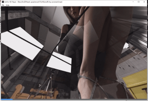
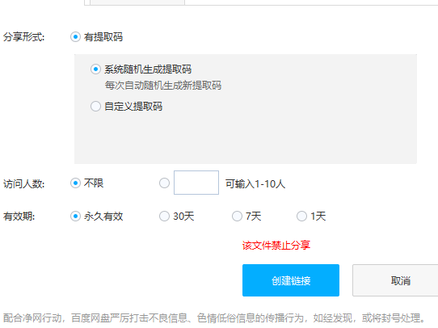

# 这个视频没法再给大家补了，这个改怎么办啊

作者：沼跃鱼xy

TID：30740

<title>1</title> <link href="../Styles/Style.css" type="text/css" rel="stylesheet">

# 1

*本帖最後由 1291626994 於 2021-4-21 13:15 編輯*

这个视频没法再给大家补了，这个改怎么办啊，没办法了吗哈哈 <title>2</title> <link href="../Styles/Style.css" type="text/css" rel="stylesheet">

# 2

 <ignore_js_op>[012005pk8wzr3wyp8tq440.png.thumb.jpg](forum.php?mod=attachment&aid=ODg0MzZ8MTRjNDc1NTR8MTY3NDA2NjAyMXwxODIzMHwzMDc0MA%3D%3D&nothumb=yes) *(79.27 KB, 下載次數: 19)*

[下載附件](forum.php?mod=attachment&aid=ODg0MzZ8MTRjNDc1NTR8MTY3NDA2NjAyMXwxODIzMHwzMDc0MA%3D%3D&nothumb=yes)

2021-4-21 13:10 上傳  

</ignore_js_op> <ignore_js_op>[微信截图_20210421131513.png](forum.php?mod=attachment&aid=ODg0Mzd8Njk0NDdkN2R8MTY3NDA2NjAyMXwxODIzMHwzMDc0MA%3D%3D&nothumb=yes) *(15.38 KB, 下載次數: 4)*

[下載附件](forum.php?mod=attachment&aid=ODg0Mzd8Njk0NDdkN2R8MTY3NDA2NjAyMXwxODIzMHwzMDc0MA%3D%3D&nothumb=yes)

2021-4-21 13:15 上傳  

</ignore_js_op> <title>3</title> <link href="../Styles/Style.css" type="text/css" rel="stylesheet">

# 3

当然是改用天翼网盘拉，干净又卫生 <title>4</title> <link href="../Styles/Style.css" type="text/css" rel="stylesheet">

# 4

压缩完（最好二次压缩）再传一次 <title>5</title> <link href="../Styles/Style.css" type="text/css" rel="stylesheet">

# 5

资源被和谐百分之九十五都是因为在线解压，压缩几十遍也没用，总有人图方便给百度网盘当内鬼
要么用别途径，要么挂了就算了我是无奈了 <title>6</title> <link href="../Styles/Style.css" type="text/css" rel="stylesheet">

# 6

看来只能用百度秒传了，或者别的链接来下载 <title>7</title> <link href="../Styles/Style.css" type="text/css" rel="stylesheet">

# 7

带密码压缩之后再共享或是换其他网盘
<title>8</title> <link href="../Styles/Style.css" type="text/css" rel="stylesheet">

# 8

带密码压缩，然后再压缩，就可以啦，记得压缩后重新命名为一些乱输入的就好 <title>9</title> <link href="../Styles/Style.css" type="text/css" rel="stylesheet">

# 9

试试蓝奏云 这个代替百度云的好东西 <title>10</title> <link href="../Styles/Style.css" type="text/css" rel="stylesheet">

# 10

唉，下次还是打包两次两个密码吧
<title>11</title> <link href="../Styles/Style.css" type="text/css" rel="stylesheet">

# 11

用别的网盘吧，不然只能指望之前有下载的同好上传了
<title>12</title> <link href="../Styles/Style.css" type="text/css" rel="stylesheet">

# 12

可以用mega网盘试试，国外的速度还挺快的～ <title>13</title> <link href="../Styles/Style.css" type="text/css" rel="stylesheet">

# 13

随便改个后缀再压缩，度盘就认不出来了
<title>14</title> <link href="../Styles/Style.css" type="text/css" rel="stylesheet">

# 14

带密码压缩之后再共享或是换其他网盘 <title>15</title> <link href="../Styles/Style.css" type="text/css" rel="stylesheet">

# 15

改个后缀名，我们下下来再改回压缩包格式，他们也没办法在线解压了 <title>16</title> <link href="../Styles/Style.css" type="text/css" rel="stylesheet">

# 16

*本帖最後由 冷雨夜 於 2021-4-28 16:07 編輯*

啊这。。。百度盘还是尽量少用吧，mega盘也不太需要压缩几层这么麻烦 <title>17</title> <link href="../Styles/Style.css" type="text/css" rel="stylesheet">

# 17

可以试试用mega分享吗，没有度盘那么多限制 <title>18</title> <link href="../Styles/Style.css" type="text/css" rel="stylesheet">

# 18

换网盘或者改名字带密码压两次吧。。这有人在线解压是真遭不住 <title>19</title> <link href="../Styles/Style.css" type="text/css" rel="stylesheet">

# 19

本地有的话，二次压缩再重新上传网盘还有救 <title>20</title> <link href="../Styles/Style.css" type="text/css" rel="stylesheet">

# 20

呜呜呜，来迟了一步，确实是有点想看了，小可惜
<title>21</title> <link href="../Styles/Style.css" type="text/css" rel="stylesheet">

# 21

一般来说都是在线解压的锅，只能先打压缩包然后改后缀要不总有人图方便当内鬼 <title>22</title> <link href="../Styles/Style.css" type="text/css" rel="stylesheet">

# 22

这个基本无解只能说是加密码改名字 垃圾百度 <title>23</title> <link href="../Styles/Style.css" type="text/css" rel="stylesheet">

# 23

大佬，再挣扎一下啊，球球了，好想看