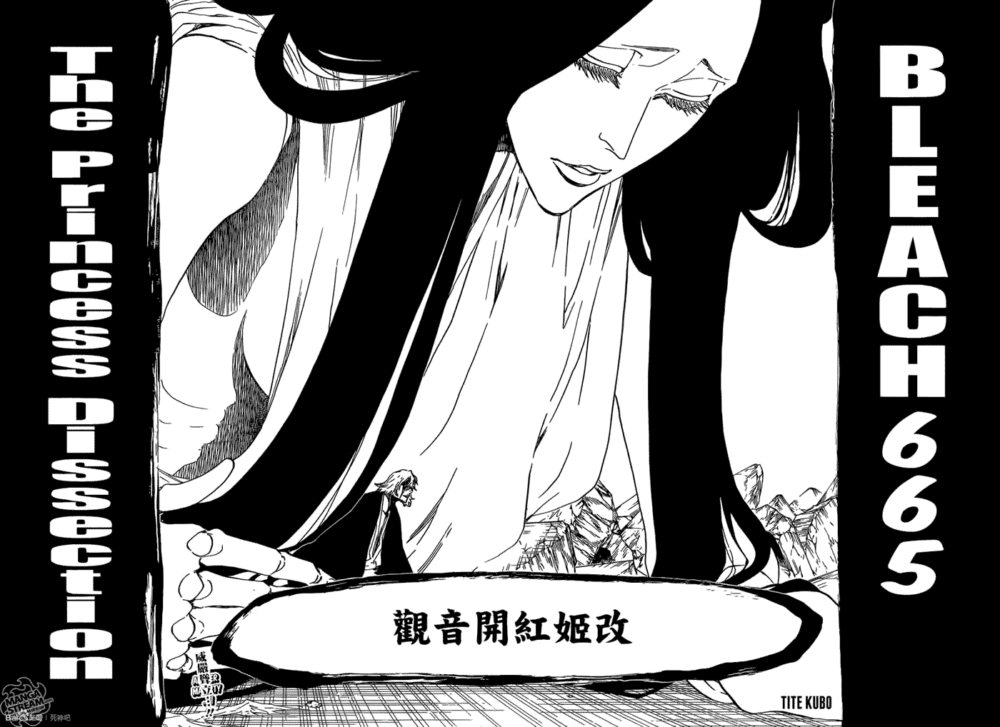
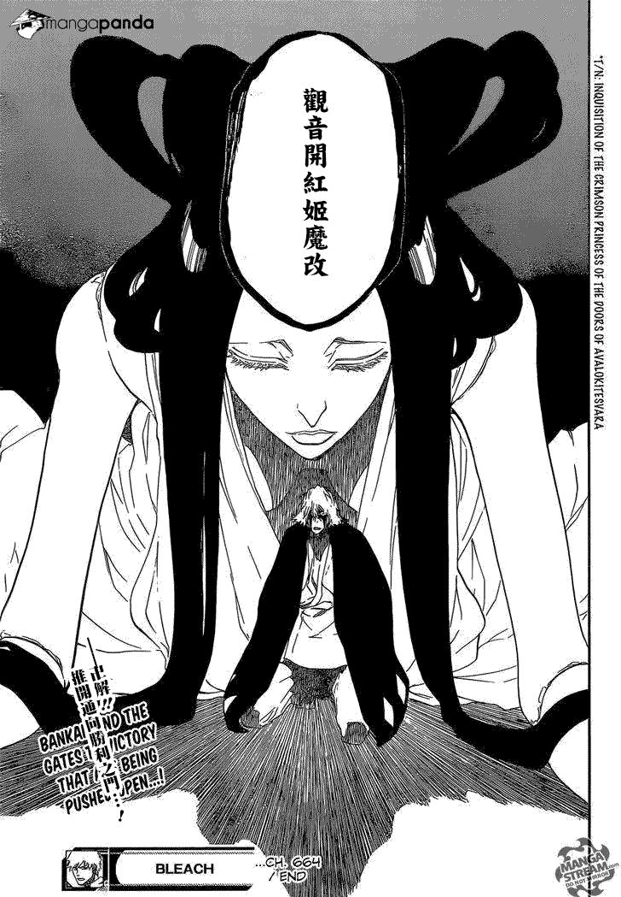

# 这也可以算是一个擦边

作者：hunj

TID：20771

<title>1</title> <link href="../Styles/Style.css" type="text/css" rel="stylesheet">

# 1

死神新一话漫画，浦原喜助的卍解！ <title>2</title> <link href="../Styles/Style.css" type="text/css" rel="stylesheet">

# 2

 <ignore_js_op>[14577027525731.jpg](forum.php?mod=attachment&aid=NTk5NjN8OTNjYzIwMmV8MTY3NDA2ODA1NnwxODIzMHwyMDc3MQ%3D%3D&nothumb=yes) *(94.29 KB, 下載次數: 6)*

[下載附件](forum.php?mod=attachment&aid=NTk5NjN8OTNjYzIwMmV8MTY3NDA2ODA1NnwxODIzMHwyMDc3MQ%3D%3D&nothumb=yes)

2016-3-15 00:55 上傳  

</ignore_js_op> <ignore_js_op>[145655735323516.jpg](forum.php?mod=attachment&aid=NTk5NjR8NmNhZjc1MDZ8MTY3NDA2ODA1NnwxODIzMHwyMDc3MQ%3D%3D&nothumb=yes) *(93.85 KB, 下載次數: 0)*

[下載附件](forum.php?mod=attachment&aid=NTk5NjR8NmNhZjc1MDZ8MTY3NDA2ODA1NnwxODIzMHwyMDc3MQ%3D%3D&nothumb=yes)

2016-3-15 00:55 上傳  

</ignore_js_op> <title>3</title> <link href="../Styles/Style.css" type="text/css" rel="stylesheet">

# 3

我被劇透了

現在一堆熱門少年動漫連載都出現GTS

繼妖尾之後又來死神

海賊王和火影好像還沒有過？

<title>4</title> <link href="../Styles/Style.css" type="text/css" rel="stylesheet">

# 4

> [s77512sf 發表於 2016-3-15 20:09](https://giantessnight.cf/gnforum2012/forum.php?mod=redirect&goto=findpost&pid=287341&ptid=20771)
> 我被劇透了
> 
> 現在一堆熱門少年動漫連載都出現GTS

我怎麼覺得海賊王蠻常出現的
巨人族啊人魚公主啊還有那個電視版縮小果實(?)的那個

<title>5</title> <link href="../Styles/Style.css" type="text/css" rel="stylesheet">

# 5

海賊王出現正宗巨大娘只是時間問題
雖然作者的畫風無感不過二創值得期待 <title>6</title> <link href="../Styles/Style.css" type="text/css" rel="stylesheet">

# 6

火影有啊,巨大化小樱,海贼王多的去了,死神除了这个还有一个,动漫已经出了,就是一护修炼完现术期间,被一女的关进一个娃娃屋里,忘了是多少集了 <title>7</title> <link href="../Styles/Style.css" type="text/css" rel="stylesheet">

# 7

可能我海賊王只看漫畫版

忘記把人魚也算進去了

因為人魚沒有下半身...

火影年代太久遠提醒後才想起來

死神之前倒是有

完現術篇那個女的不知道還會不會出現 <title>8</title> <link href="../Styles/Style.css" type="text/css" rel="stylesheet">

# 8

> s77512sf 發表於 2016-3-16 23:41
> 可能我海賊王只看漫畫版
> 
> 忘記把人魚也算進去了

完现术那个肯定会出现的,也才刚出没多久 <title>9</title> <link href="../Styles/Style.css" type="text/css" rel="stylesheet">

# 9

我也希望她再出現

但我覺得她出來也是跑龍套的

可能比井上織姬還要醬油

話說死神很多原創角色都滿有趣的

但是都沒留下來滿可惜的

像是那些布偶後面都鬼影了