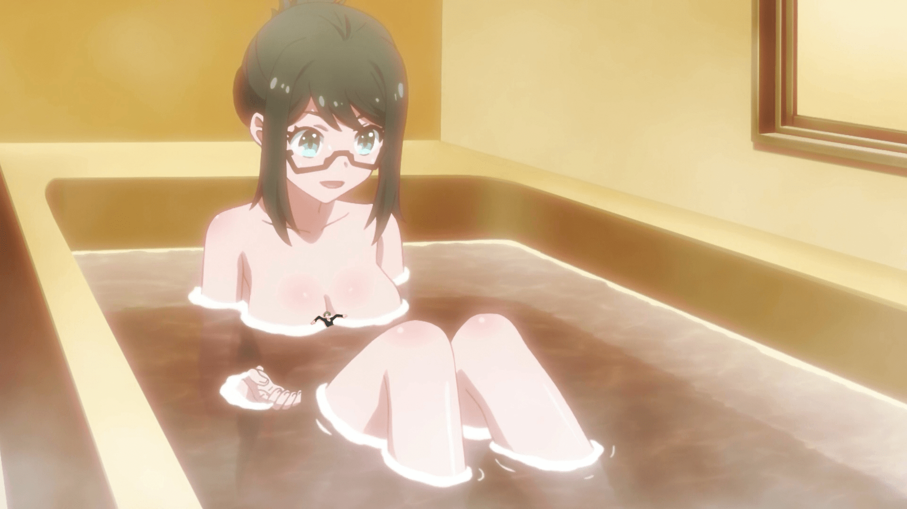

# 这是个神马

作者：琉璃灬岁月

TID：20665

<title>1</title> <link href="../Styles/Style.css" type="text/css" rel="stylesheet">

# 1

*本帖最後由 Sword 於 2016-2-23 23:59 編輯*

<ignore_js_op>

**203793 - bath breasts brunette cleavage color drawing gentle glasses nude relaxi.jpg** *(809.9 KB, 下載次數: 0)*

[下載附件](forum.php?mod=attachment&aid=NTk2MDd8ODQ2MTQ4NTB8MTY3NDA2NzczNXwxODIzMHwyMDY2NQ%3D%3D&nothumb=yes)

这哪个动漫的

2016-2-23 23:58 上傳

如题，求出处
<title>2</title> <link href="../Styles/Style.css" type="text/css" rel="stylesheet">

# 2

这乳房下面的小人和这个不属于一个画风，估计是P的了 <title>3</title> <link href="../Styles/Style.css" type="text/css" rel="stylesheet">

# 3

感觉是p的，水纹还要小人的样子明显有问题 <title>4</title> <link href="../Styles/Style.css" type="text/css" rel="stylesheet">

# 4

这应该幸福逻辑里的吧，记得好像没有类似的福利，应该是P的 <title>5</title> <link href="../Styles/Style.css" type="text/css" rel="stylesheet">

# 5

画风完全不一样，这渣p... <title>6</title> <link href="../Styles/Style.css" type="text/css" rel="stylesheet">

# 6

。。。。。。。。。。。。 <title>7</title> <link href="../Styles/Style.css" type="text/css" rel="stylesheet">

# 7

感觉是p的，画风不对啊 <title>8</title> <link href="../Styles/Style.css" type="text/css" rel="stylesheet">

# 8

猛一看　还以为是一寸法师 <title>9</title> <link href="../Styles/Style.css" type="text/css" rel="stylesheet">

# 9

太明显是P的吧，不过算擦边 <title>10</title> <link href="../Styles/Style.css" type="text/css" rel="stylesheet">

# 10

不是这p图痕迹略明显。。 <title>11</title> <link href="../Styles/Style.css" type="text/css" rel="stylesheet">

# 11

画风完全不一样，这渣p... <title>12</title> <link href="../Styles/Style.css" type="text/css" rel="stylesheet">

# 12

多P些，我很喜欢。。。。 <title>13</title> <link href="../Styles/Style.css" type="text/css" rel="stylesheet">

# 13

我刚刚看到也以为是一寸法师
<title>14</title> <link href="../Styles/Style.css" type="text/css" rel="stylesheet">

# 14

这个貌似看过了，但感谢楼主分享 <title>15</title> <link href="../Styles/Style.css" type="text/css" rel="stylesheet">

# 15

哇都说是p的，但仔细看小人的水纹的确像是p的</ignore_js_op>