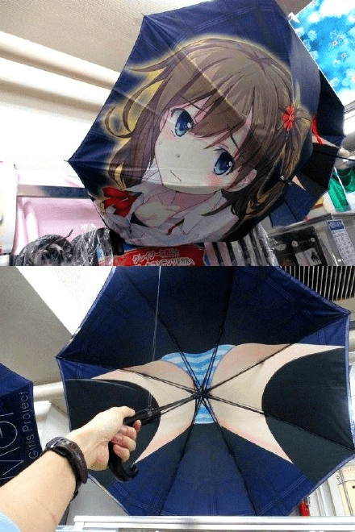
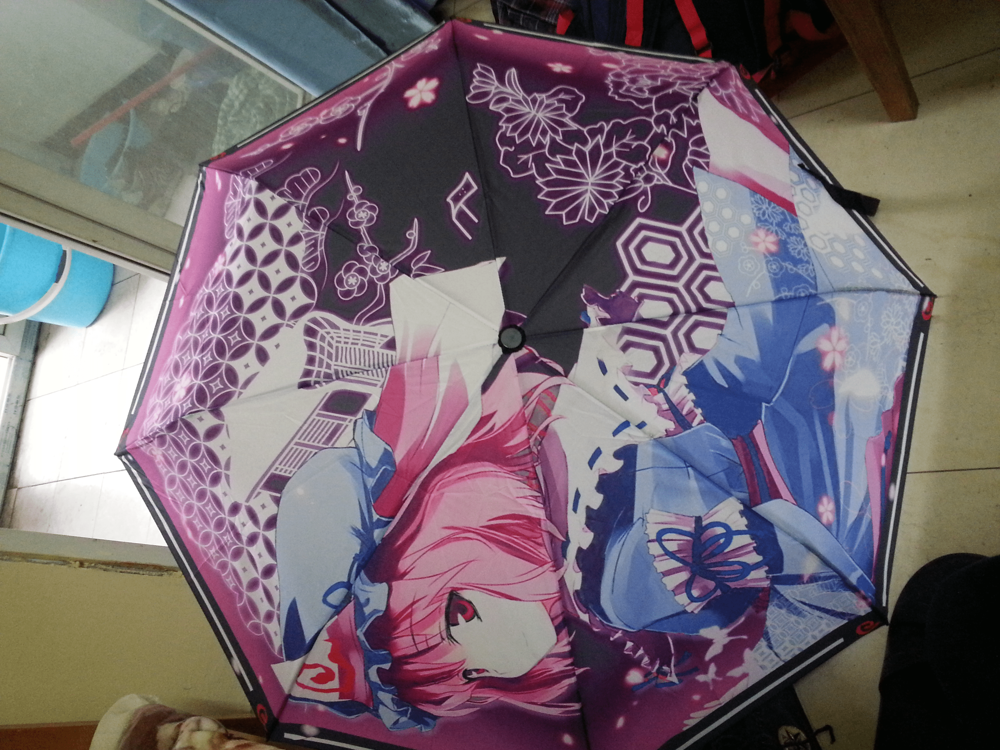

# 这样的雨伞你们会买吗？？

作者：充气的妹妹

TID：20355

<title>1</title> <link href="../Styles/Style.css" type="text/css" rel="stylesheet">

# 1

果断买买买！！！ <ignore_js_op>

**a1a7dbbdgw1ezobemxugpj20go0p0tdu.jpg** *(95.6 KB, 下載次數: 2)*

[下載附件](forum.php?mod=attachment&aid=NTgyODl8NmQzZmI3NzF8MTY3NDA2NzgyNHwxODIzMHwyMDM1NQ%3D%3D&nothumb=yes)

2016-1-5 09:05 上傳

<title>2</title> <link href="../Styles/Style.css" type="text/css" rel="stylesheet">

# 2

。。。如果没记错的话这个话题两个月前有人提过233 <title>3</title> <link href="../Styles/Style.css" type="text/css" rel="stylesheet">

# 3

还不如直接把圈内的图片给老板叫他帮你定制一把伞 <title>4</title> <link href="../Styles/Style.css" type="text/css" rel="stylesheet">

# 4

好久不见的XX星战况如何系列。。。 <title>5</title> <link href="../Styles/Style.css" type="text/css" rel="stylesheet">

# 5

不會
覺得太花俏了
不過傘內的角度倒是很讚 <title>6</title> <link href="../Styles/Style.css" type="text/css" rel="stylesheet">

# 6

想体验被这样的雨伞夹住的感觉 <title>7</title> <link href="../Styles/Style.css" type="text/css" rel="stylesheet">

# 7

  如果没记错这个话题被提过两次了。。不过之前在淘宝看到有过冲动。。想想羞耻度还是算了。。我能买个抱枕已经不容易了 <title>8</title> <link href="../Styles/Style.css" type="text/css" rel="stylesheet">

# 8

我怎么觉得以前有看到过？？？      <title>9</title> <link href="../Styles/Style.css" type="text/css" rel="stylesheet">

# 9

> [caoshuhao123456 發表於 2016-1-5 11:20](https://giantessnight.cf/gnforum2012/forum.php?mod=redirect&goto=findpost&pid=279010&ptid=20355)
> 还不如直接把圈内的图片给老板叫他帮你定制一把伞

這樣不是暴露了嗎？ <title>10</title> <link href="../Styles/Style.css" type="text/css" rel="stylesheet">

# 10

有勇气买下来和有勇气拿出去是两种不同的概念XD <title>11</title> <link href="../Styles/Style.css" type="text/css" rel="stylesheet">

# 11

> [clivic 發表於 2016-1-5 19:28](https://giantessnight.cf/gnforum2012/forum.php?mod=redirect&goto=findpost&pid=279067&ptid=20355)
> 這樣不是暴露了嗎？

说的有道理啊，毕竟不好意思拿出手
<title>12</title> <link href="../Styles/Style.css" type="text/css" rel="stylesheet">

# 12

这种伞拿出去其实也没什么吧，只要不看里面别人顶多觉得你很宅。像我这种没有可以共撑一把伞的人的屌丝根本不会在乎这些的 <title>13</title> <link href="../Styles/Style.css" type="text/css" rel="stylesheet">

# 13

一年前买的幽幽子，每次下雨都会带上，用了一年了，没什么问题，雨天走在路上特别骄傲，你们路人的雨伞都这么难看，只有我是与众不同的！
<title>14</title> <link href="../Styles/Style.css" type="text/css" rel="stylesheet">

# 14

 <ignore_js_op>[20150316_171447.jpg](forum.php?mod=attachment&aid=NTgyOTN8NTRiMmVjMWV8MTY3NDA2NzgyOHwxODIzMHwyMDM1NQ%3D%3D&nothumb=yes) *(2.43 MB, 下載次數: 0)*

[下載附件](forum.php?mod=attachment&aid=NTgyOTN8NTRiMmVjMWV8MTY3NDA2NzgyOHwxODIzMHwyMDM1NQ%3D%3D&nothumb=yes)

2016-1-6 09:43 上傳  

</ignore_js_op> <title>15</title> <link href="../Styles/Style.css" type="text/css" rel="stylesheet">

# 15

11区的人，脑洞真心大，科技各种点歪 <title>16</title> <link href="../Styles/Style.css" type="text/css" rel="stylesheet">

# 16

要有更大的勇气才能拿到大街上用啊。。 <title>17</title> <link href="../Styles/Style.css" type="text/css" rel="stylesheet">

# 17

肯定会批量购买的！ <title>18</title> <link href="../Styles/Style.css" type="text/css" rel="stylesheet">

# 18

在比较远离二次元的地区下雨天撑开这个东西是很有自豪感的 <title>19</title> <link href="../Styles/Style.css" type="text/css" rel="stylesheet">

# 19

买过狂三款，休日的时候用一用还算大丈夫，但是如果是上课的时候，，，你把伞和大家一起放在门口晾，再加上如果你学的是类似法律这种妹子数量压倒性多数的专业，你会连死的心都有的ww别问我怎么知道的QwQ</ignore_js_op>