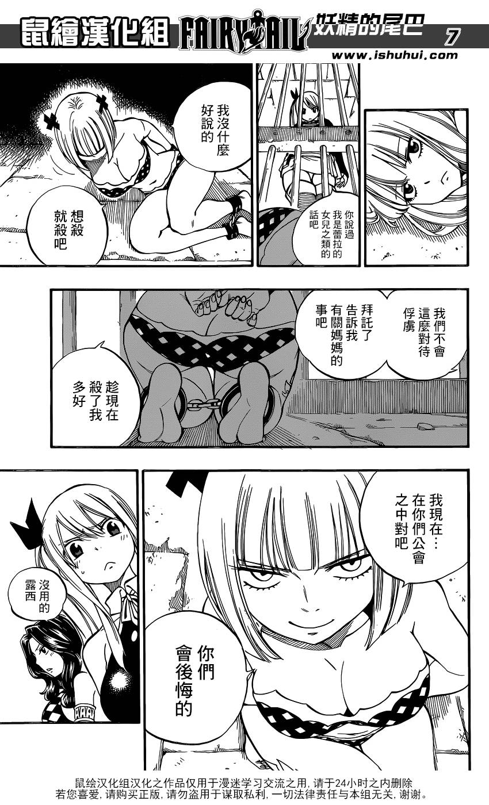

# 这次可不是翻译差距了！

作者：月月月月食

TID：20140

<title>1</title> <link href="../Styles/Style.css" type="text/css" rel="stylesheet">

# 1

<ignore_js_op>

**07.jpg** *(236.88 KB, 下載次數: 0)*

[下載附件](forum.php?mod=attachment&aid=NTYyNjR8ZmUzNGY2YWF8MTY3NDA2Nzk4MHwxODIzMHwyMDE0MA%3D%3D&nothumb=yes)

2015-11-16 22:03 上傳

要不再给我找另个版本的翻译？
<title>2</title> <link href="../Styles/Style.css" type="text/css" rel="stylesheet">

# 2

超级期待之后剧情，希望真岛浩能画点符合咱们的剧情出来 <title>3</title> <link href="../Styles/Style.css" type="text/css" rel="stylesheet">

# 3

-  -不不不 不是他手下有瞬间传送的功能 分分钟把妖尾总部传到敌方大本营？ <title>4</title> <link href="../Styles/Style.css" type="text/css" rel="stylesheet">

# 4

......只有我想吐槽這神速展開嗎............. <title>5</title> <link href="../Styles/Style.css" type="text/css" rel="stylesheet">

# 5

现在是满怀期待啊，巴不得每天都更！！！ <title>6</title> <link href="../Styles/Style.css" type="text/css" rel="stylesheet">

# 6

很喜欢那个妹子，不过这里没有gts吧? <title>7</title> <link href="../Styles/Style.css" type="text/css" rel="stylesheet">

# 7

其实我觉得妖尾的作者是个足控 <title>8</title> <link href="../Styles/Style.css" type="text/css" rel="stylesheet">

# 8

嗯嗯，不错的
............</ignore_js_op>