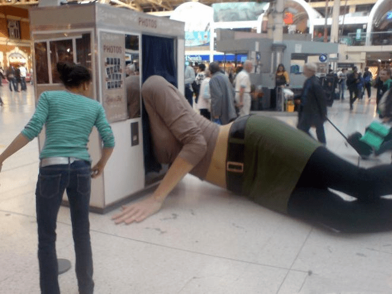

# 这真的是一个雕像

作者：hccbook

TID：22755

<title>1</title> <link href="../Styles/Style.css" type="text/css" rel="stylesheet">

# 1

比较好奇是在哪里的，粗略看，细致还做的可以。 <ignore_js_op>

**76E01FCBE920.jpg** *(41.41 KB, 下載次數: 4)*

[下載附件](forum.php?mod=attachment&aid=NjcxOTZ8ODk3Y2U2M2Z8MTY3NDA2OTg0NHwxODIzMHwyMjc1NQ%3D%3D&nothumb=yes)

2017-3-14 08:47 上傳

<title>2</title> <link href="../Styles/Style.css" type="text/css" rel="stylesheet">

# 2

Giant Woman Lying in a Photo Booth
Appears: A real woman lying in photo Booth
Wear: Beautiful dress
Located: London, England <title>3</title> <link href="../Styles/Style.css" type="text/css" rel="stylesheet">

# 3

确实蛮有味道，不得不说歪果仁脑洞就是大 <title>4</title> <link href="../Styles/Style.css" type="text/css" rel="stylesheet">

# 4

挺久前的了，好像是德国还是哪的 <title>5</title> <link href="../Styles/Style.css" type="text/css" rel="stylesheet">

# 5

好像在英国的某一个火车站吧 <title>6</title> <link href="../Styles/Style.css" type="text/css" rel="stylesheet">

# 6

这个雕像做成这个姿势的有什么特殊的意义吗 <title>7</title> <link href="../Styles/Style.css" type="text/css" rel="stylesheet">

# 7

这个真的厉害了老铁66666666666666666666 <title>8</title> <link href="../Styles/Style.css" type="text/css" rel="stylesheet">

# 8

厉害，外国人真会玩... <title>9</title> <link href="../Styles/Style.css" type="text/css" rel="stylesheet">

# 9

这是雕像？  我还以为是真人呢 <title>10</title> <link href="../Styles/Style.css" type="text/css" rel="stylesheet">

# 10

看懂了一点里头的意思，貌似是吐槽拍大头照233333333333333 <title>11</title> <link href="../Styles/Style.css" type="text/css" rel="stylesheet">

# 11

伦敦的后现代雕塑艺术，很久以前的事情了 <title>12</title> <link href="../Styles/Style.css" type="text/css" rel="stylesheet">

# 12

这是要表达什么吗？还是说单纯的是作者兴趣 <title>13</title> <link href="../Styles/Style.css" type="text/css" rel="stylesheet">

# 13

的确很有真实感，刷一波666
顶下面foreign friend</ignore_js_op>