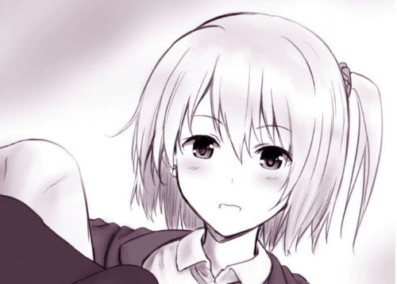

# 这种图片有完整版全图的吗

作者：西園寺リリナ

TID：34427

<title>1</title> <link href="../Styles/Style.css" type="text/css" rel="stylesheet">

# 1

非常感谢 这个看起来是蜂蜜大佬的人物，但是我翻过蜂蜜的推特和fintia并没有找到。 <title>2</title> <link href="../Styles/Style.css" type="text/css" rel="stylesheet">

# 2

 <ignore_js_op>[main_c82a915f-917c-43d5-a1d0-1299cb082885.jpg](forum.php?mod=attachment&aid=MTAwNTExfGM4ZDg1OWNlfDE2NzQwNjkyNTJ8MTgyMzB8MzQ0Mjc%3D&nothumb=yes) *(37.54 KB, 下載次數: 5)*

[下載附件](forum.php?mod=attachment&aid=MTAwNTExfGM4ZDg1OWNlfDE2NzQwNjkyNTJ8MTgyMzB8MzQ0Mjc%3D&nothumb=yes)

2022-11-18 15:06 上傳  

</ignore_js_op> <title>3</title> <link href="../Styles/Style.css" type="text/css" rel="stylesheet">

# 3

好像是散图或是截图，蜂蜜大大的风格不假，我自己的资源收藏里嘛没有这个 <title>4</title> <link href="../Styles/Style.css" type="text/css" rel="stylesheet">

# 4

> 大撸若愚 發表於 2022-11-18 18:15
> 好像是散图或是截图，蜂蜜大大的风格不假，我自己的资源收藏里嘛没有这个 ...

难道是时间非常久的画的草图？ 这个标致的发型就是蜂蜜画的角色 卡琳 啊 <title>5</title> <link href="../Styles/Style.css" type="text/css" rel="stylesheet">

# 5

这个图很早很早了.....
[https://exhentai.org/g/1892066/0a0e6f3671/](https://exhentai.org/g/1892066/0a0e6f3671/)
这个的99张就是 <title>6</title> <link href="../Styles/Style.css" type="text/css" rel="stylesheet">

# 6

> AlexYuan 發表於 2022-11-19 00:28
> 这个图很早很早了.....
> https://exhentai.org/g/1892066/0a0e6f3671/
> 这个的99张就是

大哥们，为啥我现在打不开这网站了 <title>7</title> <link href="../Styles/Style.css" type="text/css" rel="stylesheet">

# 7

好像就是早期散图而已，不是啥复杂的系列..不确定 <title>8</title> <link href="../Styles/Style.css" type="text/css" rel="stylesheet">

# 8

因为你翻错人了，这是DRE的画，在fantia上赞助就可以获得了。链接在这里：https://fantia.jp/posts/97837 <title>9</title> <link href="../Styles/Style.css" type="text/css" rel="stylesheet">

# 9

> 西園寺リリナ 發表於 2022-11-19 10:44
> 因为你翻错人了，这是DRE的画，在fantia上赞助就可以获得了。链接在这里：https://fantia.jp/posts/97837 ...

啊  和蜂蜜是一个人吗？ 怎么画的角色都有重复的？画风也差不多。。 <title>10</title> <link href="../Styles/Style.css" type="text/css" rel="stylesheet">

# 10

> AlexYuan 發表於 2022-11-19 00:28
> 这个图很早很早了.....
> https://exhentai.org/g/1892066/0a0e6f3671/
> 这个的99张就是

十分 十分感谢。你是咋找到的啊，这么冷门的图片我都没报太大幻象能找到，十分谢谢你，同志。 <title>11</title> <link href="../Styles/Style.css" type="text/css" rel="stylesheet">

# 11

DRE早期和蜂蜜的画风差不多，确实有点难分出来 <title>12</title> <link href="../Styles/Style.css" type="text/css" rel="stylesheet">

# 12

> 触碰不到的笑 發表於 2022-11-19 12:14
> 啊  和蜂蜜是一个人吗？ 怎么画的角色都有重复的？画风也差不多。。

俩人，俩角色，只是画风有点相似。但我感觉他俩画风差别蛮大的，反正我一眼就能认出来