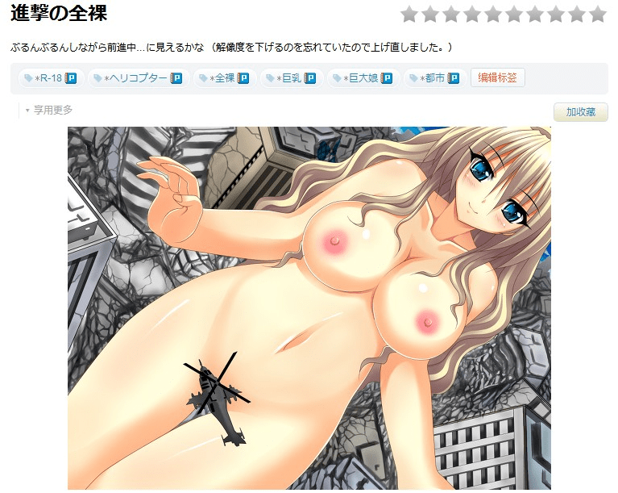

# 进击的巨人火了，GTS也可以看得明目张胆些了

作者：K.Parker

TID：14559

<title>1</title> <link href="../Styles/Style.css" type="text/css" rel="stylesheet">

# 1

优酷上现在都有相关视频了[http://v.youku.com/v_show/id_XNTcwMzQxMTQw.html](http://v.youku.com/v_show/id_XNTcwMzQxMTQw.html) <title>2</title> <link href="../Styles/Style.css" type="text/css" rel="stylesheet">

# 2

对呀 P站上也有好多进击 进击 <title>3</title> <link href="../Styles/Style.css" type="text/css" rel="stylesheet">

# 3

 <ignore_js_op>[QQ截图20130615190626.jpg](forum.php?mod=attachment&aid=MzQ3NTJ8MWUzZjFhYTh8MTY3NDA2ODQ4MXwxODIzMHwxNDU1OQ%3D%3D&nothumb=yes) *(119.71 KB, 下載次數: 18)*

[下載附件](forum.php?mod=attachment&aid=MzQ3NTJ8MWUzZjFhYTh8MTY3NDA2ODQ4MXwxODIzMHwxNDU1OQ%3D%3D&nothumb=yes)

2013-6-15 19:09 上傳  

</ignore_js_op> <title>4</title> <link href="../Styles/Style.css" type="text/css" rel="stylesheet">

# 4

这是大好事啊 确实感觉可以淡定的看了 感谢进击的巨人 <title>5</title> <link href="../Styles/Style.css" type="text/css" rel="stylesheet">

# 5

昨把进击的巨人全看了。。。挺漂亮一姑凉，变巨人就悲剧了 <title>6</title> <link href="../Styles/Style.css" type="text/css" rel="stylesheet">

# 6

現在許多同學也在討論進擊的巨人，可以開始慢慢的推坑啦~~ <title>7</title> <link href="../Styles/Style.css" type="text/css" rel="stylesheet">

# 7

只要冠上近級的就好了 <title>8</title> <link href="../Styles/Style.css" type="text/css" rel="stylesheet">

# 8

[http://www.bilibili.tv/video/av546073/](http://www.bilibili.tv/video/av546073/)  
B站也有了，进击的巨乳，感兴趣的可以看下，做的还不错
[http://www.bilibili.tv/topic/90.html](http://www.bilibili.tv/topic/90.html)
这个是B站进击合集，也可以参考下
<title>9</title> <link href="../Styles/Style.css" type="text/css" rel="stylesheet">

# 9

.
現在確實什麼東西都可以冠上「進擊的」三個字。
不過我個人感覺已經快要被玩爛了……
至少我現在看到那些硬要與巨人梗扯上關係的素材已經笑不出來了。

坦白講我覺得就算巨人不紅了，GTS也還是可以繼續明目張膽下去。
反正，沒有人會搭理我們嘛（苦笑） <title>10</title> <link href="../Styles/Style.css" type="text/css" rel="stylesheet">

# 10

大进击时代么..... <title>11</title> <link href="../Styles/Style.css" type="text/css" rel="stylesheet">

# 11

不過拜巨人所賜，現在搜索里都會混進一堆進擊的巨人的東西 <title>12</title> <link href="../Styles/Style.css" type="text/css" rel="stylesheet">

# 12

早就关注进击的巨人漫画了- -没想到我们gtser的春天来的这么快 <title>13</title> <link href="../Styles/Style.css" type="text/css" rel="stylesheet">

# 13

进击的巨人这部作品意味深长呀！这个作者有可能是日本民族主义者，故事中的巨人指的是日本的邻国还有美国 <title>14</title> <link href="../Styles/Style.css" type="text/css" rel="stylesheet">

# 14

感谢进击的巨人...但我认为还是不要太明目张胆比较好... <title>15</title> <link href="../Styles/Style.css" type="text/css" rel="stylesheet">

# 15

还是先低调一点
希望后面巨人能在长大的话
就好玩了
<title>16</title> <link href="../Styles/Style.css" type="text/css" rel="stylesheet">

# 16

希望可以借由这个机会让世界都能了解我们的世界 <title>17</title> <link href="../Styles/Style.css" type="text/css" rel="stylesheet">

# 17

巨人穿上点衣服再好看点就太OK了