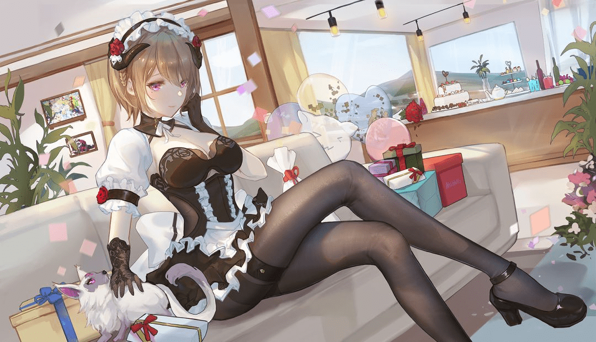
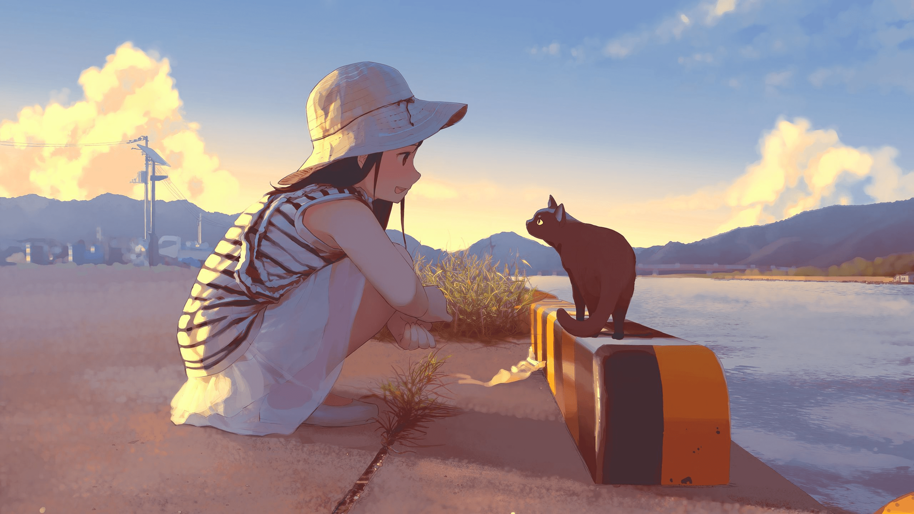

# 进论坛或者其他GTS网站浏览后能心平气和出去吗

作者：stgpoco

TID：34716

<title>1</title> <link href="../Styles/Style.css" type="text/css" rel="stylesheet">

# 1

我在圈内多年，基本都是在想要满足欲望的时候进入论坛或是其他与GTS相关的网站或视频，或者进入后都要忍不住导一次。有时我会想着当作逛B站或者抖音一样浏览一下圈内网站视频，可发现基本都是欲望越来越强，好奇心越来越重，最后都要导一次。
我想问一下有没有人把论坛或者圈内其他网站视频没事看一看，就像刷抖音一样，然后心平气和出去。 <ignore_js_op>

**1984868801.jpeg** *(121.57 KB, 下載次數: 0)*

[下載附件](forum.php?mod=attachment&aid=MTAxNDA1fDBkODM1MjYzfDE2NzQwNjUwMTl8MTgyMzB8MzQ3MTY%3D&nothumb=yes)

2023-1-5 20:43 上傳

<ignore_js_op>

**1669891671571.jpeg** *(247.75 KB, 下載次數: 0)*

[下載附件](forum.php?mod=attachment&aid=MTAxNDA2fDQ1ZjdmZTZhfDE2NzQwNjUwMTl8MTgyMzB8MzQ3MTY%3D&nothumb=yes)

2023-1-5 20:44 上傳

<title>2</title> <link href="../Styles/Style.css" type="text/css" rel="stylesheet">

# 2

能 因为你的兴奋阈值还不算高 等你兴奋阈值拉高之后 你就会感觉到  

活着 真没意思 <title>3</title> <link href="../Styles/Style.css" type="text/css" rel="stylesheet">

# 3

年轻气盛还好，但是要注意节制，久不久一次还好，经常手艺活的话克制力就不太行了，要注意修心了 <title>4</title> <link href="../Styles/Style.css" type="text/css" rel="stylesheet">

# 4

可能看多了之后，口味才会越来越刁钻吧。
或许楼主可以试试贤者时间刷论坛？ <title>5</title> <link href="../Styles/Style.css" type="text/css" rel="stylesheet">

# 5

兴奋阈值会随着你看的内容越来越多而抬高，你的口味可能会越来越重，然后你大部分时候逛论坛就都会心平气和的出去了~ <title>6</title> <link href="../Styles/Style.css" type="text/css" rel="stylesheet">

# 6

一般都是从口味淡到口味重，应该说是看的多了接受阈值上升了捏
<title>7</title> <link href="../Styles/Style.css" type="text/css" rel="stylesheet">

# 7

可以是可以，但我一般是为了导才来看这些相关内容的 ｡◕‿◕｡ <title>8</title> <link href="../Styles/Style.css" type="text/css" rel="stylesheet">

# 8

时间久了以后就越来越平淡，合口的很少 <title>9</title> <link href="../Styles/Style.css" type="text/css" rel="stylesheet">

# 9

只要我想，我就能做到                      <title>10</title> <link href="../Styles/Style.css" type="text/css" rel="stylesheet">

# 10

欲望确实容易越来越强，甚至于无法控制。只能说确实是年轻气盛吧...一定要节制才好。想想办法...我也在整... <title>11</title> <link href="../Styles/Style.css" type="text/css" rel="stylesheet">

# 11

有因必有果，你冲着满足欲望来自然就得把欲望满足了才会出去。
像我一样冲着____观察来就会收获一堆乐子（不是）  <title>12</title> <link href="../Styles/Style.css" type="text/css" rel="stylesheet">

# 12

> 7509 發表於 2023-1-5 22:45
> 可能看多了之后，口味才会越来越刁钻吧。
> 或许楼主可以试试贤者时间刷论坛？ ...

问题是谁会贤者时间来看论坛啊（ <title>13</title> <link href="../Styles/Style.css" type="text/css" rel="stylesheet">

# 13

倒也不是每次都会吧，来gn有时候是看看新闻找找乐子什么的。但是我去E站的话就很容易hhh <title>14</title> <link href="../Styles/Style.css" type="text/css" rel="stylesheet">

# 14

得精准命中G点吧，不然一般不会嗯那么快。
<title>15</title> <link href="../Styles/Style.css" type="text/css" rel="stylesheet">

# 15

还可以的，可能会碰上那个特别兴奋的点会来一发 <title>16</title> <link href="../Styles/Style.css" type="text/css" rel="stylesheet">

# 16

能的，你只要提前手冲一次在打开网站就可以兴平气和的看了 <title>17</title> <link href="../Styles/Style.css" type="text/css" rel="stylesheet">

# 17

年轻真好...我现在资源屯太多反而兴致不高了，看不过来反而成了负担
对了，导太多还是要注意前列腺健康 <title>18</title> <link href="../Styles/Style.css" type="text/css" rel="stylesheet">

# 18

你都来论坛了，要是想看看聊天区还好，开文图区不是有欲望了才来的吗，再者你逛B站这种地方还能心平气和出去不高血压那你是真的牛逼。 <title>19</title> <link href="../Styles/Style.css" type="text/css" rel="stylesheet">

# 19

哎，说实话不能，尤其搜到新的感兴趣的作品后，所以要养生尽量不要逛  <title>20</title> <link href="../Styles/Style.css" type="text/css" rel="stylesheet">

# 20

我口味越来越重了，一般的文根本导不出 <title>21</title> <link href="../Styles/Style.css" type="text/css" rel="stylesheet">

# 21

哎，说实话不能，尤其搜到新的感兴趣的作品后，所以要养生尽量不要逛  <title>22</title> <link href="../Styles/Style.css" type="text/css" rel="stylesheet">

# 22

我口味越来越重了，一般的文根本导不出 <title>23</title> <link href="../Styles/Style.css" type="text/css" rel="stylesheet">

# 23

我不觉得看的越多口味会越重，虽然越来越难兴奋是真的，但更重要的是品味变高了，看多大手子的作品，就很难对粗制滥造的作品起星语了 <title>24</title> <link href="../Styles/Style.css" type="text/css" rel="stylesheet">

# 24

当然不能，尤其是看到感兴趣的作品的时候 <title>25</title> <link href="../Styles/Style.css" type="text/css" rel="stylesheet">

# 25

可以的，口味越来越重后的状态就是，我常因太过变态而与你们格格不入 <title>26</title> <link href="../Styles/Style.css" type="text/css" rel="stylesheet">

# 26

还好吧 我现在除了marusyamo 那个级别的作品基本不会冲，用朋友的一句话就是，还不如对着群友的巨大模型冲。 <title>27</title> <link href="../Styles/Style.css" type="text/css" rel="stylesheet">

# 27

可以的，久了就佛系了，我的片子现在几乎都是拿来收藏了

<title>28</title> <link href="../Styles/Style.css" type="text/css" rel="stylesheet">

# 28

那就想导了再去看呗，不过看久了真的就没多大感觉了
<title>29</title> <link href="../Styles/Style.css" type="text/css" rel="stylesheet">

# 29

有啊，目前就是，状态良好，节制确实很重要的，多做点其他事，劳逸结合好一点。 <title>30</title> <link href="../Styles/Style.css" type="text/css" rel="stylesheet">

# 30

能的，只要是决定节制的时候，就算是看到了很戳自己的图文也能忍下来不冲 <title>31</title> <link href="../Styles/Style.css" type="text/css" rel="stylesheet">

# 31

这取决于该站的内容是否戳中了你，对不对？ <title>32</title> <link href="../Styles/Style.css" type="text/css" rel="stylesheet">

# 32

太真实了，哥们是说出我一直想问但是不敢问的话啊，佩服┐(‘～`；)┌ <title>33</title> <link href="../Styles/Style.css" type="text/css" rel="stylesheet">

# 33

确实是阈值的问题，提高了阈值之后，再看到很多东西就不会产生特别强的欲望了。毕竟现实中很难有女人在戳中你的性癖 <title>34</title> <link href="../Styles/Style.css" type="text/css" rel="stylesheet">

# 34

虽然看到资源会比较兴奋 但是我不导 <title>35</title> <link href="../Styles/Style.css" type="text/css" rel="stylesheet">

# 35

就拿漫画小说举例嘛，入坑比较久了，当初入坑的时候看什么都觉得涩，现在很少能有勾起欲望的了hhh，因为好多情节都能猜到然后就索然无味了（能心平气和出去的那种）。个人比较喜欢那种从没有见到过的情节~ <title>36</title> <link href="../Styles/Style.css" type="text/css" rel="stylesheet">

# 36

等导到导不动了自然就不想导了（） <title>37</title> <link href="../Styles/Style.css" type="text/css" rel="stylesheet">

# 37

不就跟逛推特一样吗？上来还不是为了看黄色的 <title>38</title> <link href="../Styles/Style.css" type="text/css" rel="stylesheet">

# 38

阈值上升+1，口味确实越来越刁了，现在直接全程平静.jpg</ignore_js_op></ignore_js_op>