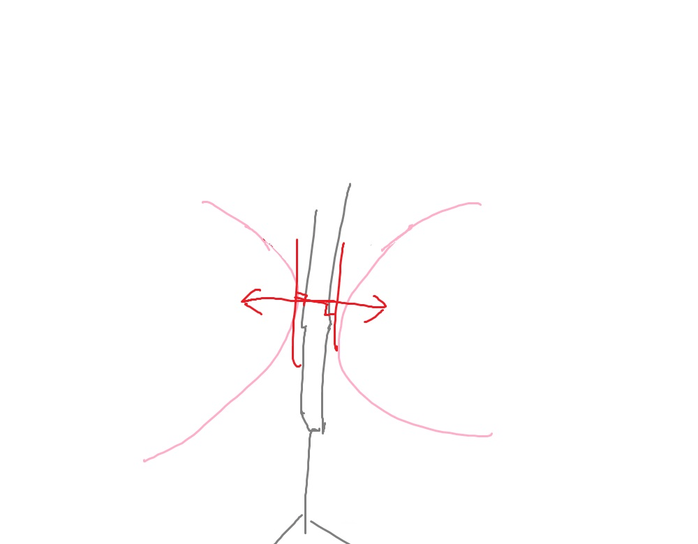
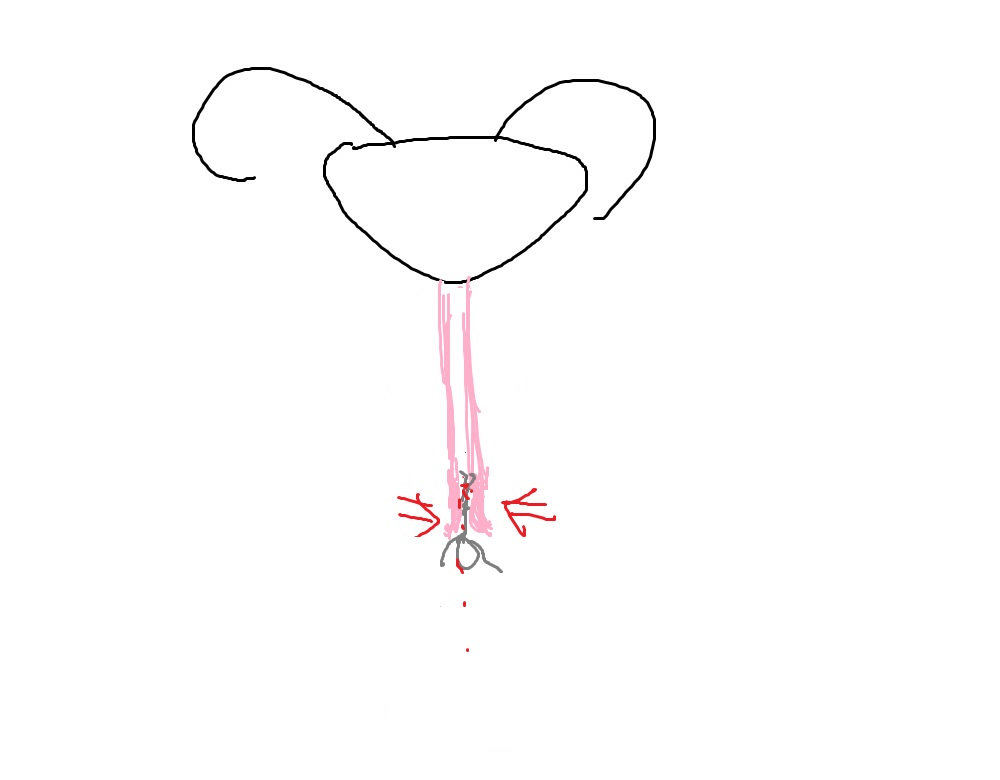

# 這樣的強力陰道,小人會怎樣？

作者：chatina

TID：25984

<title>1</title> <link href="../Styles/Style.css" type="text/css" rel="stylesheet">

# 1

[http://tw.aboluowang.com/2013/0309/289509.html](http://tw.aboluowang.com/2013/0309/289509.html)

能吊起14公斤的東西,
那如果變成5cm小人,會不會一支腳踩下去就抽不出來,
不用手壓真接把小人吞進去, 然後小人肋骨被壓碎?
<title>2</title> <link href="../Styles/Style.css" type="text/css" rel="stylesheet">

# 2

*本帖最後由 phone2345 於 2018-10-19 11:49 編輯*

與物體粗細有關，夾的碎直徑2cm蛋捲的人不一定夾的碎直徑1cm卷心酥。因此5cm高的小人的腳，粗細約為1~2mm如同牙籤般細的物體，假設密度為正常人參數的情況下應該是不至於夾碎，但不同物理設定(小人肌肉骨骼密度，力量等等)可能有不同結果。

一般來說「夾」可視為摩擦力抵抗物體移動的一種形式，摩擦力與垂直表面的正向力呈正相關，正向力大小與施力的接觸面積有關，假設表面施加應力為定值，則越粗的物體有越大的表面積，因此可產生的正向力越大，亦即(靜)摩差力極限值越大，而能抵抗物體移動(抽出)的力量越多。

因此，該位女力士需要一顆「木蛋」來增加接觸表面積，讓抵抗物體移動的力量最大話。如果身邊有使用棉條的女性友人，或許你會聽到他抱怨量多時「非常難」把棉條拿出來，因為吸收經血而膨脹的棉條增加了與陰道壁的摩差力導致難以取出。
(如果有男性想體驗，可以試著用用棉條止鼻血...保證終生難忘) <title>3</title> <link href="../Styles/Style.css" type="text/css" rel="stylesheet">

# 3

[https://www.youtube.com/watch?v=vo_RTeBRwZI](https://www.youtube.com/watch?v=vo_RTeBRwZI)

我感想只有一個
JESUS FUCKING CRIST
超級噁爛，不過還是試試看能不能分析......
你的問題其實不好回答，因為用到的力不一樣
她的作法是緊緊收縮不讓綁著重物的木球被拉出去，這個主要是考驗陰道的收縮力
她不講沒人會知道球是在前中後段哪裡，就假設在中段好了
<ignore_js_op>

**嘔嘔嘔嘔嘔嘔.jpg** *(38.36 KB, 下載次數: 0)*

[下載附件](forum.php?mod=attachment&aid=NzUyMzZ8YWI2YTczMmN8MTY3NDA2Njg4NHwxODIzMHwyNTk4NA%3D%3D&nothumb=yes)

2018-10-19 11:53 上傳

要把球卡在那邊，就需要把重力抵銷掉，而且陰道壁兩邊的力也得互相抵消，球的受力最後會長這樣
<ignore_js_op>

**嘔嘔嘔嘔嘔嘔2.jpg** *(45.23 KB, 下載次數: 0)*

[下載附件](forum.php?mod=attachment&aid=NzUyMzd8OGIyOGRhMDJ8MTY3NDA2Njg4NHwxODIzMHwyNTk4NA%3D%3D&nothumb=yes)

2018-10-19 11:53 上傳

那麼如果今天是小人呢?
<ignore_js_op>

**嘔嘔嘔嘔嘔嘔3.jpg** *(29.98 KB, 下載次數: 0)*

[下載附件](forum.php?mod=attachment&aid=NzUyMzl8N2U1YTk0Yjd8MTY3NDA2Njg4NHwxODIzMHwyNTk4NA%3D%3D&nothumb=yes)

2018-10-19 12:02 上傳

把腳放進去，然後陰道收縮，問題就來了
<ignore_js_op>

**嘔嘔嘔嘔嘔嘔4.jpg** *(32.89 KB, 下載次數: 0)*

[下載附件](forum.php?mod=attachment&aid=NzUyNDB8OGU1YmIyMzF8MTY3NDA2Njg4NHwxODIzMHwyNTk4NA%3D%3D&nothumb=yes)

2018-10-19 12:02 上傳

如果小人的腿是平行的，受力也會是左右垂直來的，沒有向內的力可以推他/她進去
因為記住，受力會垂直於接觸面，圓球之所以能卡在裡面是因為它有弧度
<ignore_js_op>

**嘔嘔嘔嘔嘔嘔6.jpg** *(32.13 KB, 下載次數: 0)*

[下載附件](forum.php?mod=attachment&aid=NzUyNDJ8ZWQ5NzZmMjV8MTY3NDA2Njg4NHwxODIzMHwyNTk4NA%3D%3D&nothumb=yes)

2018-10-19 12:12 上傳

(左右抵銷後，球獲得向上的力)
但是小人，沒有這麼漂亮的弧度來接受壓力
<ignore_js_op>

**嘔嘔嘔嘔嘔嘔7.jpg** *(31.26 KB, 下載次數: 0)*

[下載附件](forum.php?mod=attachment&aid=NzUyNDN8ZThlYWNlNTl8MTY3NDA2Njg4NHwxODIzMHwyNTk4NA%3D%3D&nothumb=yes)

2018-10-19 12:12 上傳

最後力就會被抵銷掉，附加粉碎性骨折
就算把小人腳捏碎製造曲折，繼續吞也會卡在腰部
<ignore_js_op>

**嘔嘔嘔嘔嘔嘔5.jpg** *(33.46 KB, 下載次數: 0)*

[下載附件](forum.php?mod=attachment&aid=NzUyNDF8ZjFjMzM5MDN8MTY3NDA2Njg4NHwxODIzMHwyNTk4NA%3D%3D&nothumb=yes)

2018-10-19 12:11 上傳

想想看，就算食物進食道後就能無視重力方向，你還是得想辦法把食物送進去

所以，結論是，如果小人雙手張開雙腿夾緊，想要單靠陰道力量把人吸進去基本上不可能
你可能得讓陰道口朝向天空，讓地心引力幫忙，但這樣就跟有沒有練過重訓沒關係了
不過人已經進去就是另一回事了，可以卡超緊
但下一個問題是能卡多緊，說不定因為小人的直徑超小她就必需長時間緊繃陰道，那樣考慮的就是持久力而非爆發力了

......媽的我到底在寫三洨

<title>4</title> <link href="../Styles/Style.css" type="text/css" rel="stylesheet">

# 4

我的天啊，这也太猛了，别说小人，就是鸡鸡放进去也会碎吧
<title>5</title> <link href="../Styles/Style.css" type="text/css" rel="stylesheet">

# 5

楼上讨论的都是太小的小人了，试想如果头的大小和木球差不多呢？大概可以直接挤碎吧，刚刚好 <title>6</title> <link href="../Styles/Style.css" type="text/css" rel="stylesheet">

# 6

youtube上有好多这个的视频</ignore_js_op></ignore_js_op></ignore_js_op></ignore_js_op></ignore_js_op></ignore_js_op></ignore_js_op>