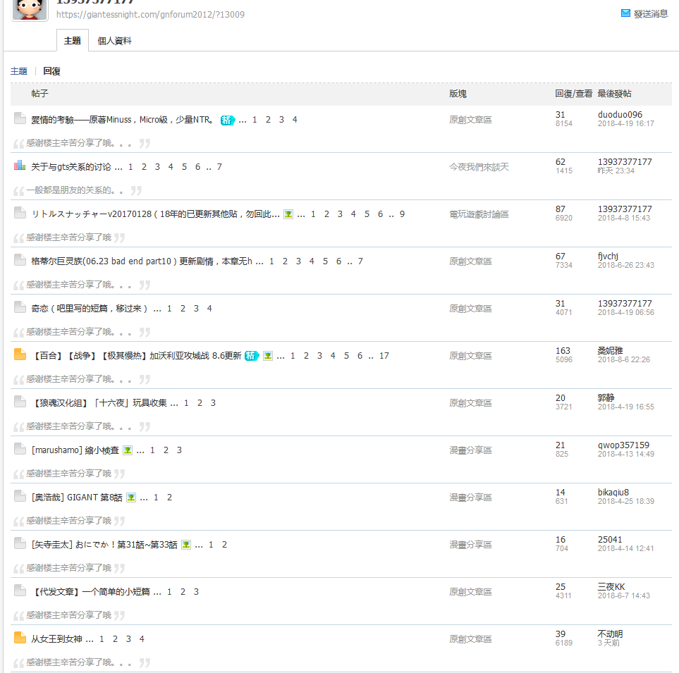
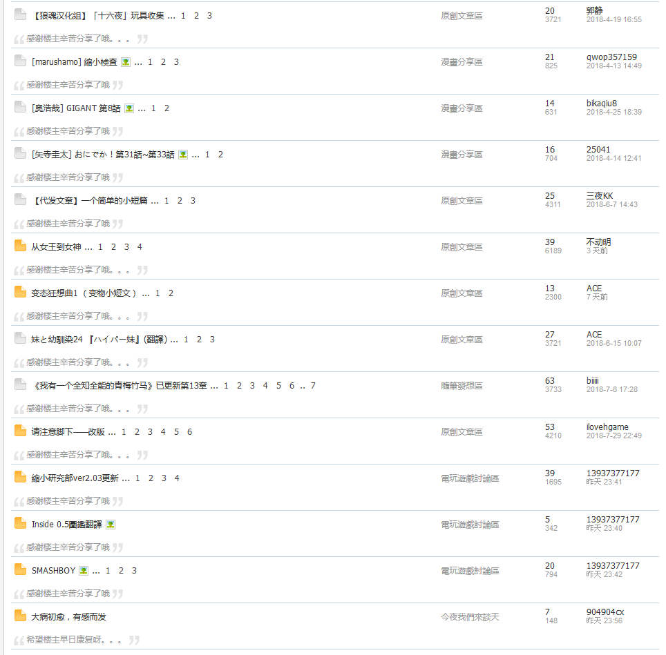
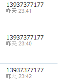
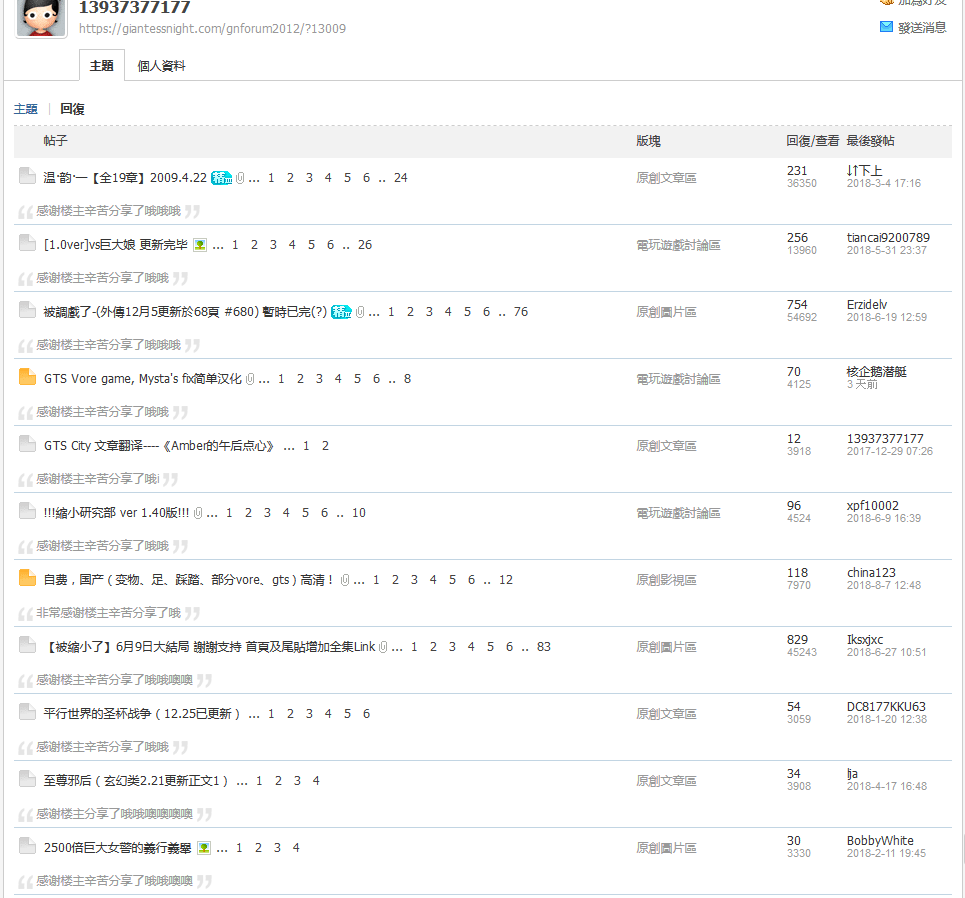
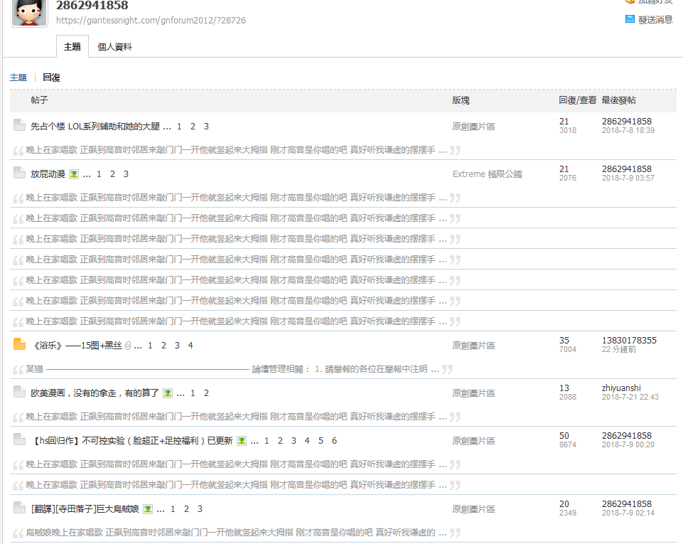

# 這樣算是灌水嗎

作者：ccccccccccc

TID：25692

<title>1</title> <link href="../Styles/Style.css" type="text/css" rel="stylesheet">

# 1

好吧 我自己幹了一篇[小東西](https://giantessnight.com/gnforum2012/forum.php?mod=viewthread&tid=25615)出來
然後我看到這傢伙 <ignore_js_op>

**139scrce.png** *(22.4 KB, 下載次數: 0)*

[下載附件](forum.php?mod=attachment&aid=NzM4MzR8MGM5Njg0Y2N8MTY3NDA2ODcxMHwxODIzMHwyNTY5Mg%3D%3D&nothumb=yes)

2018-8-16 02:00 上傳

"感謝分享哦哦哦"

我心就在想"我花時間弄出這東西你這樣'感謝分享哦哦哦'害我感覺好像不是我做出來的是從別人那裡拿過來的" 有點不開心
我也挺好奇這傢伙是怎麼弄到60獎勵點的

然後我就點進這傢伙發帖紀錄看

兩個主題 都沒什麼大不了 也沒加分
我就走去看他的回帖紀錄看
一看
<ignore_js_op>

**13937rub2.png** *(60 KB, 下載次數: 0)*

[下載附件](forum.php?mod=attachment&aid=NzM4MzZ8ODdjOTk4Yzh8MTY3NDA2ODcxMHwxODIzMHwyNTY5Mg%3D%3D&nothumb=yes)

2018-8-16 02:00 上傳

<ignore_js_op>

**13937rub1.png** *(55.34 KB, 下載次數: 0)*

[下載附件](forum.php?mod=attachment&aid=NzM4MzV8NWY1MTZiOGZ8MTY3NDA2ODcxMHwxODIzMHwyNTY5Mg%3D%3D&nothumb=yes)

2018-8-16 02:00 上傳

一連串的"感謝分享哦哦哦"
<ignore_js_op>

**13937rub4.png** *(1.76 KB, 下載次數: 0)*

[下載附件](forum.php?mod=attachment&aid=NzM4Mzh8ZTgzN2VkOTF8MTY3NDA2ODcxMHwxODIzMHwyNTY5Mg%3D%3D&nothumb=yes)

2018-8-16 02:00 上傳

天啊有沒有再統一一點的回復
然後第二頁
<ignore_js_op>

**13937rub3.png** *(59.66 KB, 下載次數: 0)*

[下載附件](forum.php?mod=attachment&aid=NzM4Mzd8MjJhMjMzYWZ8MTY3NDA2ODcxMHwxODIzMHwyNTY5Mg%3D%3D&nothumb=yes)

2018-8-16 02:00 上傳

"感謝分享哦哦噢噢噢噢"
他到底是怎麼拿到60獎勵點的???
我再看了他以前的回復
早一點還是有花樣的
現在大多都統一"感謝辛苦分享哦哦哦"
分享還會辛苦呢
這傢伙還比我早註冊呢
也許有很多人也和他差不多吧
也許很多作者缺的就是這種回復(不管質只要有回復就有動力
但不是我 <title>2</title> <link href="../Styles/Style.css" type="text/css" rel="stylesheet">

# 2

我獎勵點才5
積分規則裡，獎勵點獲得方式只有「加精華+30」
那兩篇文也沒有精華
那他是怎麼弄到62的？？

<title>3</title> <link href="../Styles/Style.css" type="text/css" rel="stylesheet">

# 3

> [allocen 發表於 2018-8-16 03:04](https://giantessnight.cf/gnforum2012/forum.php?mod=redirect&goto=findpost&pid=384877&ptid=25692)
> 感谢楼主分享了哦哦哦

忍不住想吐槽一下，gn大陆有三十年的历史吗？难道说你在但丁之前就开创了新的纪元？(ಥ_ಥ)
<title>4</title> <link href="../Styles/Style.css" type="text/css" rel="stylesheet">

# 4

如果是很久之前就注册的人的话似乎是有送过奖励点。。我记得但丁有送过一次，是为了鼓励大家使用这个来着？ <title>5</title> <link href="../Styles/Style.css" type="text/css" rel="stylesheet">

# 5

会不会自己本来就有 大号 因为核心会员可以给奖励点。。然后 自己小号回复 大号给奖励点？ <title>6</title> <link href="../Styles/Style.css" type="text/css" rel="stylesheet">

# 6

> [ww69 發表於 2018-8-16 12:31](https://giantessnight.cf/gnforum2012/forum.php?mod=redirect&goto=findpost&pid=384913&ptid=25692)
> 会不会自己本来就有 大号 因为核心会员可以给奖励点。。然后 自己小号回复 大号给奖励点？ ...

也许是大号给足小号积分之后，然后在其他地方把小号卖给萌新，卖号时先用几张论坛的作品忽悠一下 <title>7</title> <link href="../Styles/Style.css" type="text/css" rel="stylesheet">

# 7

怀疑了一下文章区的随笔库专贴 然后去搜了一圈并没有发现这个老哥 我印象中我一开始有点想去梦想的银河铁道（现在已经没了） 那时候也是想看看有什么办法弄到奖励点 然而萌新能弄到的资源毕竟有限 途径也比较单一 只会从大妈之家搞点擦边的漫画过来 那会还没像最近这么疯狂 但偶尔还是有找到一点的 后来看着看着就找到了随笔库专贴 看着回帖写随笔有奖励点硬是用我的小学生文笔写了点东西 18大佬也给了点奖励点 然而后来发现还是差很远加上自己又憋不出什么东西 最后进铁道的梦想还是作罢了

ps：闲着无聊去搜这个ID 居然发现有重名的 一个初级会员 一个已经禁访 <title>8</title> <link href="../Styles/Style.css" type="text/css" rel="stylesheet">

# 8

*本帖最後由 ccccccccccc 於 2018-8-16 14:09 編輯*

轉一個頭又發現[一個](https://giantessnight.com/gnforum2012/home.php?mod=space&uid=23316&do=thread&view=me&from=space&type=reply)...
還抄過我的回復呢...
連發4個毫無意義的水帖...
GN到底有什麼值得去灌水啊...
-----
這傢伙上面還有[一個](https://giantessnight.com/gnforum2012/home.php?mod=space&uid=28726&do=thread&view=me&from=space&type=reply)...
竟然還抄過自由貓大的簽名(BOOM
<ignore_js_op>

**286.png** *(73.79 KB, 下載次數: 0)*

[下載附件](forum.php?mod=attachment&aid=NzM4Mzl8MWE1N2M5OGN8MTY3NDA2ODcxMHwxODIzMHwyNTY5Mg%3D%3D&nothumb=yes)

2018-8-16 14:08 上傳

雖然已經是一個月前的了...
不過在同一個帖重復水這麼多次沒人發現嗎???
看來GN的水比我想像中要多數百倍... <title>9</title> <link href="../Styles/Style.css" type="text/css" rel="stylesheet">

# 9

很多人注册时间都早（奸笑），老同好年纪大了，能偷偷上论坛就不错了，哪能灌水23333333</ignore_js_op></ignore_js_op></ignore_js_op></ignore_js_op></ignore_js_op></ignore_js_op>