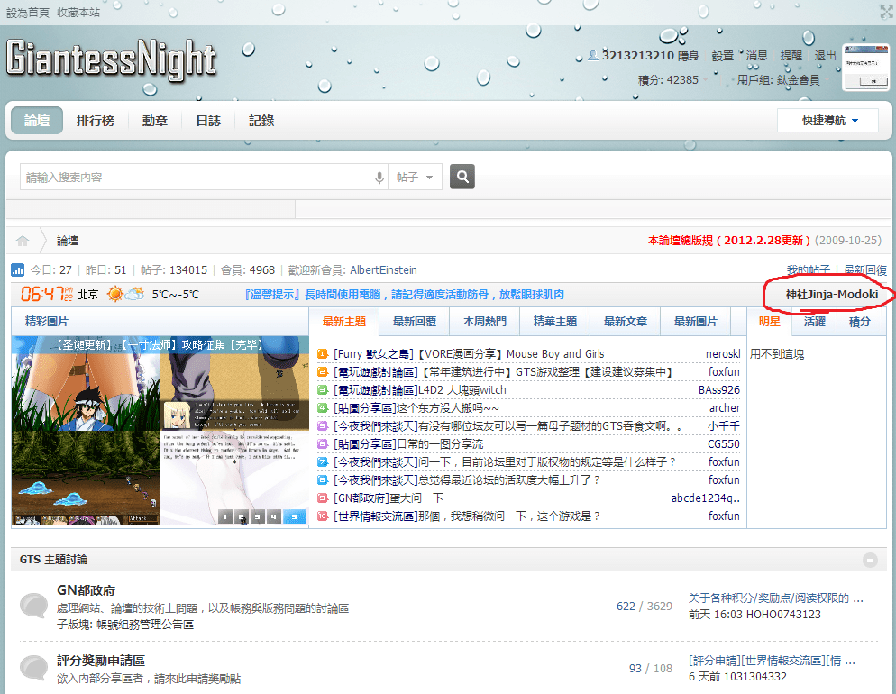

# 這連結什麼時候擺的.........

作者：3213213210

TID：16346

<title>1</title> <link href="../Styles/Style.css" type="text/css" rel="stylesheet">

# 1

<ignore_js_op>

**未命名.png** *(377.82 KB, 下載次數: 0)*

[下載附件](forum.php?mod=attachment&aid=NDEyMzl8NjU0OTk3M2V8MTY3NDA2ODQ0MnwxODIzMHwxNjM0Ng%3D%3D&nothumb=yes)

2014-2-27 18:49 上傳

通常我都先上GN，看e紳士，
搜尋「巨大娘 神社」看過再確認pixiv和deviantart
現在少一步了！
感謝管理員！)
<title>2</title> <link href="../Styles/Style.css" type="text/css" rel="stylesheet">

# 2

那是什么？ <title>3</title> <link href="../Styles/Style.css" type="text/css" rel="stylesheet">

# 3

能告诉我吗？ <title>4</title> <link href="../Styles/Style.css" type="text/css" rel="stylesheet">

# 4

就是那个图片是什么  游戏？ <title>5</title> <link href="../Styles/Style.css" type="text/css" rel="stylesheet">

# 5

> [huhuhu 發表於 2014-2-27 21:54](https://giantessnight.cf/gnforum2012/forum.php?mod=redirect&goto=findpost&pid=217050&ptid=16346)
> 就是那个图片是什么  游戏？

趁你的号还在回复一下吧...
[http://giantessnight.com/gnforum2012/forum.php?mod=viewthread&tid=15476&extra=page%3D1](http://giantessnight.com/gnforum2012/forum.php?mod=viewthread&tid=15476&extra=page%3D1)
知道你看到游戏激动 也别发3个帖子 = =
<title>6</title> <link href="../Styles/Style.css" type="text/css" rel="stylesheet">

# 6

不提醒还真没发现。
论坛改版之后就是人性化多了，点赞

我就发现了右下角有个小黑屋而已。</ignore_js_op>