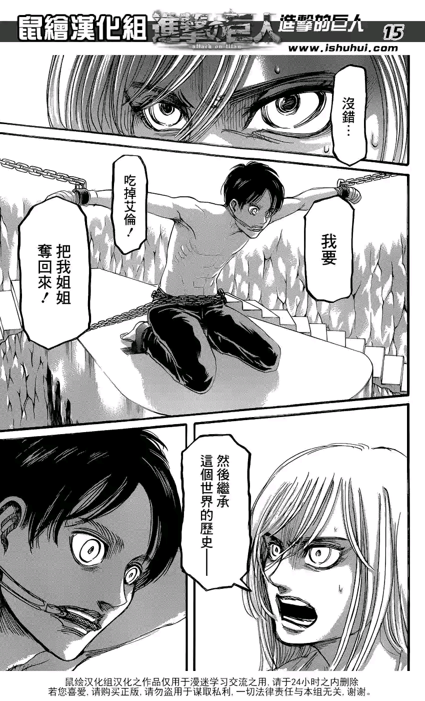
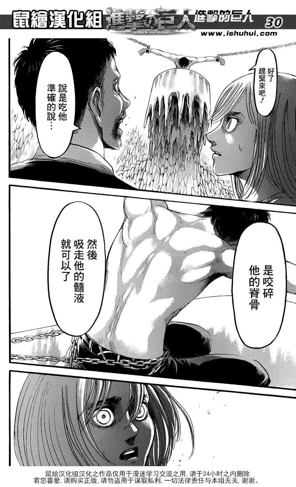
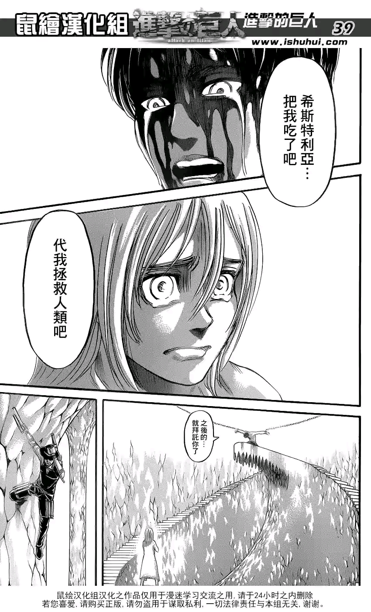
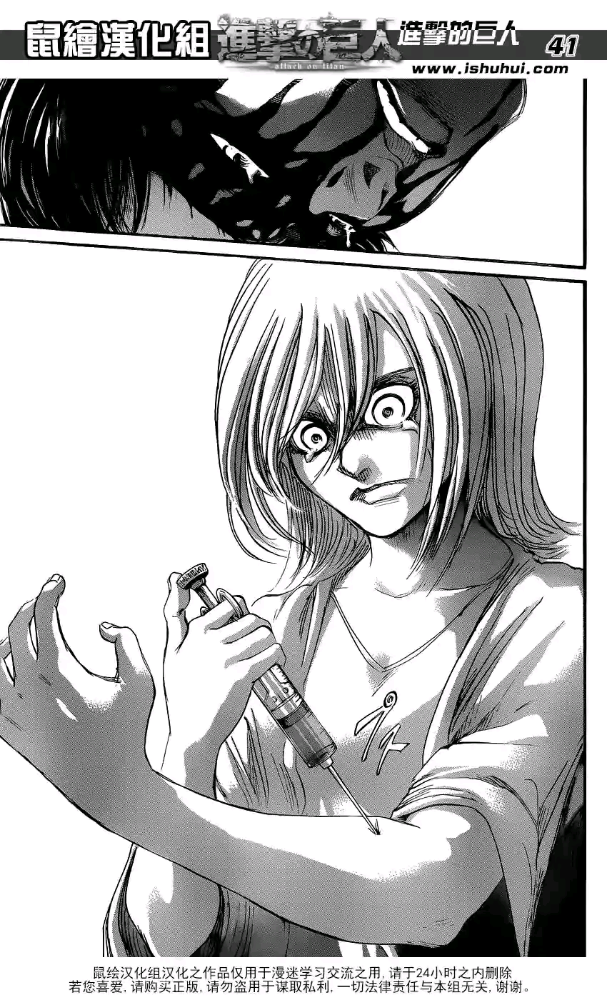
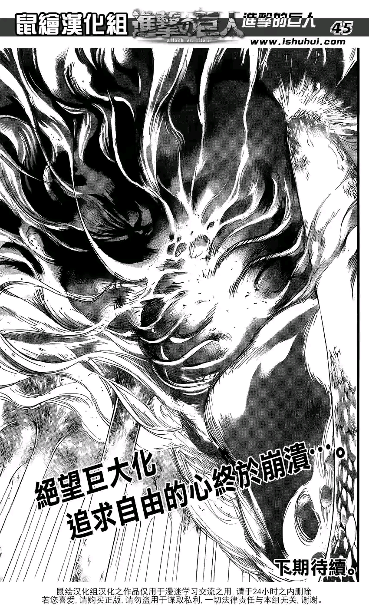
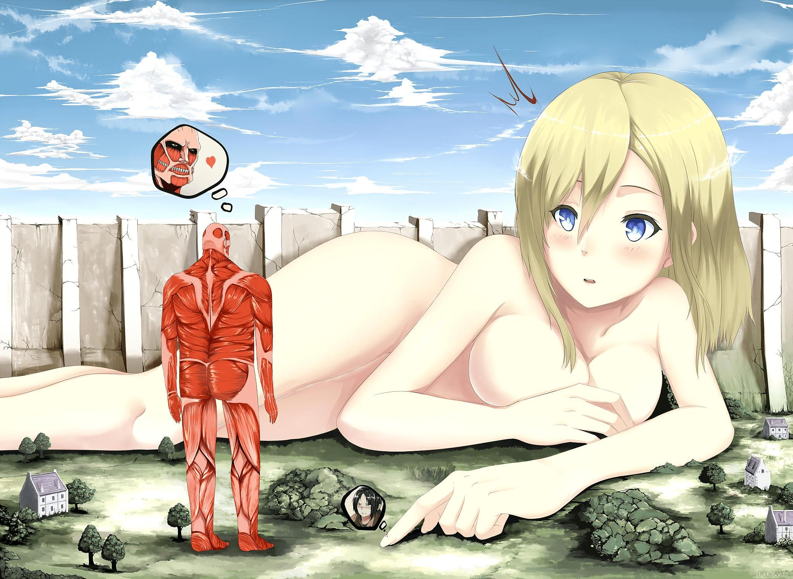

# 進擊的巨人第三個女巨人準備出現了嗎-.-....

作者：小小教授

TID：18373

<title>1</title> <link href="../Styles/Style.css" type="text/css" rel="stylesheet">

# 1

*本帖最後由 iloveyou8 於 2015-1-9 22:41 編輯*

隔了很久也沒怎追看   剛剛有點悶便看看進擊的巨人  看完最新的一話後....突然說到**克里斯塔·連茲 (**希斯特莉亞·雷斯) 和男主艾倫的 ''關係'....
**克里斯塔**說自己的使命是食掉男主為姐報復-.-.(被老爸洗了腦-.-?)
在一場路人甲和**克里斯塔X她父親**無聊的罵劇後,神奇路人甲放棄說服**克里斯塔  **而讓他們各自巨大化來戰鬥  (果然是路人-.-)
在男主''後悔'到不肯巨人化來戰鬥,而說希望**克里斯塔****吃掉自己來代他拯救人類**的情況下,,,
**克里斯塔**便一針剌入手來'巨人化'  .....
(雖我還不知她是否真的巨人化了...算了我已不知自己在說什麼)
反正我有點期待下期**克里斯塔**的巨人化造型是怎樣呢0.0

漫畫傳送點 
[http://www.dm5.com/m186718/#ipg12](http://www.dm5.com/m186718/#ipg12)

<title>2</title> <link href="../Styles/Style.css" type="text/css" rel="stylesheet">

# 2

 <ignore_js_op>[进击的巨人_第65话_第15页.png](forum.php?mod=attachment&aid=NDk4NDZ8MTYxYjliYjZ8MTY3NDA2ODA4NnwxODIzMHwxODM3Mw%3D%3D&nothumb=yes) *(1.15 MB, 下載次數: 2)*

[下載附件](forum.php?mod=attachment&aid=NDk4NDZ8MTYxYjliYjZ8MTY3NDA2ODA4NnwxODIzMHwxODM3Mw%3D%3D&nothumb=yes)

2015-1-9 22:33 上傳  

</ignore_js_op> <ignore_js_op>[进击的巨人_第65话_第30页.png](forum.php?mod=attachment&aid=NDk4NDd8YTlkNWE2NDd8MTY3NDA2ODA4NnwxODIzMHwxODM3Mw%3D%3D&nothumb=yes) *(1021.07 KB, 下載次數: 0)*

[下載附件](forum.php?mod=attachment&aid=NDk4NDd8YTlkNWE2NDd8MTY3NDA2ODA4NnwxODIzMHwxODM3Mw%3D%3D&nothumb=yes)

2015-1-9 22:33 上傳  

</ignore_js_op> <ignore_js_op>[进击的巨人_第65话_第39页.png](forum.php?mod=attachment&aid=NDk4NDh8NjRmMjQxYTF8MTY3NDA2ODA4NnwxODIzMHwxODM3Mw%3D%3D&nothumb=yes) *(1023.21 KB, 下載次數: 0)*

[下載附件](forum.php?mod=attachment&aid=NDk4NDh8NjRmMjQxYTF8MTY3NDA2ODA4NnwxODIzMHwxODM3Mw%3D%3D&nothumb=yes)

2015-1-9 22:33 上傳  

</ignore_js_op> <ignore_js_op>[进击的巨人_第65话_第41页.png](forum.php?mod=attachment&aid=NDk4NDl8NWYwYjM3Nzl8MTY3NDA2ODA4NnwxODIzMHwxODM3Mw%3D%3D&nothumb=yes) *(1.1 MB, 下載次數: 0)*

[下載附件](forum.php?mod=attachment&aid=NDk4NDl8NWYwYjM3Nzl8MTY3NDA2ODA4NnwxODIzMHwxODM3Mw%3D%3D&nothumb=yes)

2015-1-9 22:33 上傳  

</ignore_js_op> <ignore_js_op>[进击的巨人_第65话_第44页.png](forum.php?mod=attachment&aid=NDk4NTB8ZTg4NjQ5NzV8MTY3NDA2ODA4NnwxODIzMHwxODM3Mw%3D%3D&nothumb=yes) *(1.44 MB, 下載次數: 4)*

[下載附件](forum.php?mod=attachment&aid=NDk4NTB8ZTg4NjQ5NzV8MTY3NDA2ODA4NnwxODIzMHwxODM3Mw%3D%3D&nothumb=yes)

2015-1-9 22:33 上傳  

</ignore_js_op> <title>3</title> <link href="../Styles/Style.css" type="text/css" rel="stylesheet">

# 3

默默的吐槽：这是第三个女巨人。。。 <title>4</title> <link href="../Styles/Style.css" type="text/css" rel="stylesheet">

# 4

> [嵐-ARASHI 發表於 2015-1-9 22:39](https://giantessnight.cf/gnforum2012/forum.php?mod=redirect&goto=findpost&pid=243697&ptid=18373)
> 默默的吐槽：这是第三个女巨人。。。

是嗎0_0""  我沒怎細心看也許miss了-_-"  好~
<title>5</title> <link href="../Styles/Style.css" type="text/css" rel="stylesheet">

# 5

虽然可能刚开始很多人看不出来但尤弥尔是妹子。。。 <title>6</title> <link href="../Styles/Style.css" type="text/css" rel="stylesheet">

# 6

*本帖最後由 泡面 於 2015-1-10 11:22 編輯*

第一个阿妮，第二个尤米尔，第三个是她姐，她老爸给她注册的是战斗血清，结合最后一画的模样，没有特别大的期待 <title>7</title> <link href="../Styles/Style.css" type="text/css" rel="stylesheet">

# 7

你看看尤弥尔也是妹子啊但尤弥尔的巨人化没有什么女性特征
所以不要有太大的期望 <title>8</title> <link href="../Styles/Style.css" type="text/css" rel="stylesheet">

# 8

> [嵐-ARASHI 發表於 2015-1-9 22:55](https://giantessnight.cf/gnforum2012/forum.php?mod=redirect&goto=findpost&pid=243704&ptid=18373)
> 你看看尤弥尔也是妹子啊但尤弥尔的巨人化没有什么女性特征
> 所以不要有太大的期望 ...

主要是尤弥尔正常形态也不像个妹子
<title>9</title> <link href="../Styles/Style.css" type="text/css" rel="stylesheet">

# 9

*本帖最後由 克里亞 於 2015-1-9 23:20 編輯*

算第4個吧XD 你忘了尤彌爾嗎
亞妮.尤彌爾.弗麗達.加克里斯塔..
雷伊斯家血脈是女的的話應該都能算
硬扯的話柯尼(小平頭)他媽母親也有出現過一下.但應該都略過吧

[上圖連結](http://www.dm5.com/m179836/#ipg11)
艾倫也算是承襲父親的絕學對女巨人進行強攻ww

雖然說後製要畫也是女神比較養眼
<ignore_js_op>

**M5xhkio.jpg** *(390.54 KB, 下載次數: 0)*

[下載附件](forum.php?mod=attachment&aid=NDk4NTF8YWI5Mjk2N2Z8MTY3NDA2ODA4NnwxODIzMHwxODM3Mw%3D%3D&nothumb=yes)

2015-1-9 23:04 上傳

<title>10</title> <link href="../Styles/Style.css" type="text/css" rel="stylesheet">

# 10

我擦勒...阿尼...雀斑女...又出来一个么.............................. <title>11</title> <link href="../Styles/Style.css" type="text/css" rel="stylesheet">

# 11

最后一张为何我觉得不是一个人的形状..... <title>12</title> <link href="../Styles/Style.css" type="text/css" rel="stylesheet">

# 12

不过说实话闭嘴里的巨人感觉口味都有点重，不太好接受QAQ <title>13</title> <link href="../Styles/Style.css" type="text/css" rel="stylesheet">

# 13

我希望变的超级大……超越60公尺的男巨人…！！ <title>14</title> <link href="../Styles/Style.css" type="text/css" rel="stylesheet">

# 14

尤弥尔的巨人形态比较小只，而且基本上不像人型了 <title>15</title> <link href="../Styles/Style.css" type="text/css" rel="stylesheet">

# 15

這部裡面的巨人都不怎麼有型啊。。。
沒什麼感覺 <title>16</title> <link href="../Styles/Style.css" type="text/css" rel="stylesheet">

# 16

不会有暂时不会有的，公主不会吃艾伦的，恩，多分.... <title>17</title> <link href="../Styles/Style.css" type="text/css" rel="stylesheet">

# 17

我总觉得巨人化后的女巨人没啥感觉，不好看啊 <title>18</title> <link href="../Styles/Style.css" type="text/css" rel="stylesheet">

# 18

雖然說進擊的巨人的畫風不是很好

但是提供了很好的創作題材 也帶起了不少風潮 <title>19</title> <link href="../Styles/Style.css" type="text/css" rel="stylesheet">

# 19

呃...原来还有第三个女巨人...动漫停播那么久也没看漫画... <title>20</title> <link href="../Styles/Style.css" type="text/css" rel="stylesheet">

# 20

結果她好像沒有變成巨人~而成為了人類的女王~ <title>21</title> <link href="../Styles/Style.css" type="text/css" rel="stylesheet">

# 21

楼主可以追下新的漫画，可惜公主没变啊！不过之后的剧情兵长可能会变哦！ <title>22</title> <link href="../Styles/Style.css" type="text/css" rel="stylesheet">

# 22

热血漫的巨大化我觉得也看不出什么感觉来吧。。。我看了楼主发的图片以后反倒期待下一章的剧情发展 <title>23</title> <link href="../Styles/Style.css" type="text/css" rel="stylesheet">

# 23

非常期待女神的巨大化~</ignore_js_op>