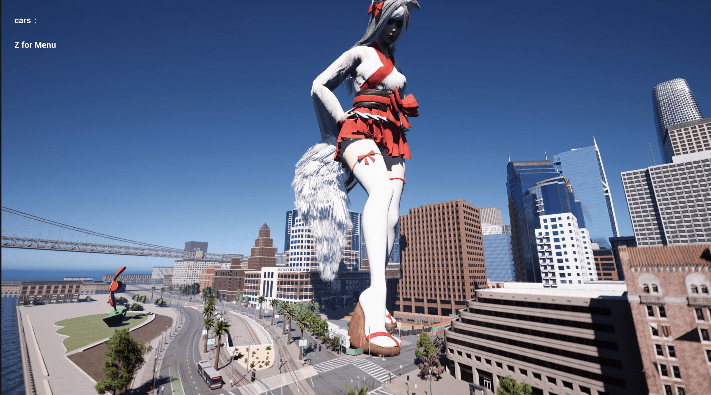

# 遊戲設計指引，Part 0：做就對了

作者：3213213210

TID：33508

<title>1</title> <link href="../Styles/Style.css" type="text/css" rel="stylesheet">

# 1

*本帖最後由 3213213210 於 2022-7-3 15:45 編輯*

前情提要：[https://giantessnight.com/gnforu ... iewthread&tid=33487](https://giantessnight.com/gnforum2012/forum.php?mod=viewthread&tid=33487)
Part 1：[https://giantessnight.com/gnforu ... iewthread&tid=33520](https://giantessnight.com/gnforum2012/forum.php?mod=viewthread&tid=33520)
Part 2：[https://giantessnight.com/gnforu ... iewthread&tid=33562](https://giantessnight.com/gnforum2012/forum.php?mod=viewthread&tid=33562)
Part 3：[https://giantessnight.com/gnforu ... iewthread&tid=33591](https://giantessnight.com/gnforum2012/forum.php?mod=viewthread&tid=33591)

9：7：5，或許再等下去能讓戰況出現變化，但是管他的
遊戲設計系列GOOOOO

＝＝＝＝＝＝＝＝＝＝＝＝＝＝＝＝＝＝＝＝＝＝＝＝＝＝＝＝＝＝＝＝＝＝＝＝＝＝＝＝
那麼，是時候來解釋遊戲設計了。
遊戲設計與其他創作設計無異，就是如何使用手上的工具，給予接收端想要的體驗與效果。
不過，在講任何設計或製作理論前，我有一件非強調不可的事：
**實做比什麼都還重要。**

雖然接下來我會花很多時間解釋各式各樣的作法、各種製作時的注意事項，
但是這個系列的目的不是讓你可以做出完美的遊戲製作計畫，
而是**輔助你釐清製作過程中的疑惑**，
讓你更加清楚自己的目標，以及可以利用的手段。

遊戲設計是非常複雜的，再多事前計畫也不可能涵蓋到所有可能性，
所以**直接做是最有用的**。
這世界上有許多遊戲的核心重點都是開發到一半才想到的，
因為某個互動細節、因為某個程式錯誤、因為某個測試人員意外很喜歡的地方，
**遊戲經常生於意外，而不是縝密的事前計畫。**
就算是任天堂這種超級老牌的遊戲開發商，
他們也是在巨量的試誤中才能緩慢掌握遊戲具體的樣貌，
**你一定會撞牆，所以早點開始撞，你會比較早抵達終點。**

至於要怎麼開始、要使用什麼工具，一樣，先開始做再慢慢想就好。
許多獨立遊戲開發者都接觸過不只一個遊戲引擎，
從RPGMaker換到Unity的，從Unity換到Unreal的，
從CTF換到GMS的，從GMS換到Godot的，
只要學過任何一個，學下一個引擎的效率都會越來越高。
**遊戲開發最重要的是****掌握****邏輯與****工具****的****應用****方式，這只能靠實做學習**，
你能用最先進的引擎做出最無聊的垃圾，你也可以用RPGMaker2003做出縮小學園，
問題永遠在人的身上，所以千萬不要覺得選錯引擎會有什麼萬劫不復的後果。
講極端點，只要有紙跟筆，就已經夠做簡單的遊戲雛型了，
如果你的想法夠有趣，說不定能拐到個志願者來幫你寫程式呢。

當然，這也不是說你就該一直漫無目標的亂撞。
作到某個階段時總會得開始檢討遊戲內容、總會得開始作詳盡的計畫，
否則架構逐漸長歪、系統越來越雜亂、一致性越來越糟，好玩完整的遊戲就永遠作不出來了，
界線到底該畫在哪？什麼時候只管做就好，什麼時候得靜下心來作長遠規劃？

其實這是「投資過多心力到單一專案」才容易顯現的問題，
**只要有意識地壓抑單一作品的規模，就能有效防止自己的創作逐漸失控。**
**把遊戲作小，然後不停重作，作到滿意就好。**
把遊戲作小，遊戲裡的元素如何交互作用就能變得很好懂，
失敗時可以輕易拋棄，往下個遊戲發進的間隔也能縮短；
從零重新開始製作，可以逼迫自己重新審視遊戲裡的每個元素，
哪些東西真的很重要、哪些東西其實不要也沒差，對你來說會越來越明顯。
在有了實做經驗以後，你的計畫將不再是基於幻想，而是確確實實的問題與障礙，
要發展哪些東西、要拋棄哪些東西都能有明確的基礎了。
**作到當你覺得「就算我再重作也不會有什麼有意義的改動了」，你的遊戲就完成了。**

「重作」聽起來很可怕，但只要實踐過一次，你會發現花費的時間遠小於自己的想像。
遊戲開發最耗時間的就是學習新技術與各式各樣的點子嘗試，
每一次的重新製作你都會對手段與目標有更明確的理解與想像，
依據遊戲類型，在一天內重新做出先前一個月的開發內容都有可能。
第二次做會比第一次快，第三次又會比第二次快，
**等你對從零開始製作駕輕就熟，你就可以用極高的效率產出大量的新作品了。**

引用Jesse Schell的話：**「*你的前十個遊戲都會是爛遊戲，所以趕快做完會比較好。*」**
這當然不是什麼基於科學統計所作的發言，只是鼓勵你快點動手做而已，
**不要害怕失敗，失敗是肯定的，問題只在你怎麼面對而已。**
就算你其實根本不是作遊戲的料，你也該試試看，
光是「有嘗試過創作」這件事情本身，就有著無法量化也不可取代的價值。

再次強調，接下來我會講解各式各樣的遊戲實做細節，
但請務必不要等待教學系列完結、不要等待完美的靈感出現，
只要想到好像有點有趣的點子就馬上試試看，用什麼工具都無所謂，
**你的失誤經驗將比我接下來的任何建議還有用、**
**我的建議需要你的失誤經驗才能有用**，
所以，最後再總結一次：
**做就對了。**

<title>2</title> <link href="../Styles/Style.css" type="text/css" rel="stylesheet">

# 2

讲一讲所必须的软件 硬件和 下载安装流程吧
很多人都死在这里了
Unit怎么安装 找到能用的 就是个大问题    <title>3</title> <link href="../Styles/Style.css" type="text/css" rel="stylesheet">

# 3

> [晋越时空 發表於 2022-6-20 15:23](https://giantessnight.cf/gnforum2012/forum.php?mod=redirect&goto=findpost&pid=507153&ptid=33508)
> 讲一讲所必须的软件 硬件和 下载安装流程吧
> 很多人都死在这里了
> Unit怎么安装 找到能用的 就是个大问题   ...

用你習慣的搜尋引擎找「Unity 新手教學」啊 這又不是什麼GTS社群才能找到資源的問題
Unity和Unreal基本上都是免費的 你要有一大筆收入他們才會開始跟你要抽成
如果跑不動 那就刪掉啊 至少嘗試過了 又沒花錢

RPGMaker要錢 但Steam上就有的東西也沒多難取得
Godot徹底而且永遠免費 但不會英文大概馬上就卡死了
不然乾脆用Switch玩《附帶導航！一做就上手第一次的遊戲程式設計》
然後做出來以後把Demo影片丟上來看有沒有人願意用汎用引擎Remake

只是要試試看作遊戲的話
拿張幾紙來 上面畫格子和事件觸發點 拿橡皮擦當玩家 你就已經能做個RPG雛型了
真的有心要開始的話 方法多得是

<title>4</title> <link href="../Styles/Style.css" type="text/css" rel="stylesheet">

# 4

前排占位打个广告！！！有没有人想一起做UE5游戏开发的？快来戳我！！！
目前游戏缺人手，有预算！！！（Patreon上有不错的热度+收入），需要有一定时间精力投入，且有热情的小伙伴加入，我可以教简单的入门内容，剩下的可能要一起摸索。
如果你想做游戏然后还没有付诸实践的话欢迎先来和我的项目一起跑一下呢！
<ignore_js_op>

**1250D983-E05E-45BF-A349-71C6979E5BBD.jpeg** *(383.24 KB, 下載次數: 0)*

[下載附件](forum.php?mod=attachment&aid=OTcxMjl8MjEzYWYxZjB8MTY3NDA2NTUxNHwxODIzMHwzMzUwOA%3D%3D&nothumb=yes)

2022-6-20 16:00 上傳

<title>5</title> <link href="../Styles/Style.css" type="text/css" rel="stylesheet">

# 5

> [晋越时空 發表於 2022-6-20 15:23](https://giantessnight.cf/gnforum2012/forum.php?mod=redirect&goto=findpost&pid=507153&ptid=33508)
> 讲一讲所必须的软件 硬件和 下载安装流程吧
> 很多人都死在这里了
> Unit怎么安装 找到能用的 就是个大问题   ...

unity直接用unity hub安装，如果你是大陆用户请不要安装document和中文包（不然会卡住），但是个人不太推荐unity，奇葩的软件引擎，自己都不能向前兼容，甚至2个小版本之间都存在大量不兼容的问题。看教学视频也经常因为版本不同而干脆卡住。

UE在我上手之后强烈推荐，安装简单，蓝图对于无开发经验的人友好，且整个开发逻辑极其清晰。
从epic market就可以安装。

<title>6</title> <link href="../Styles/Style.css" type="text/css" rel="stylesheet">

# 6

> [3213213210 發表於 2022-6-20 15:36](https://giantessnight.cf/gnforum2012/forum.php?mod=redirect&goto=findpost&pid=507155&ptid=33508)
> 用你習慣的搜尋引擎找「Unity 新手教學」啊 這又不是什麼GTS社群才能找到資源的問題
> Unity和Unreal基本上 ...

大陆的模式是 找到了
跑不动 卡死

下载完了  卡死  
下载完了  无法安装
下载完了  是个病毒

我当然知道怎么找  问题是

找到了 下载完了  但是用不了

楼下说的很对 和我遇见的情况一模一样  
问题不在怎么找到 是找到之后怎么能用   可能是我没描述清晰
不过谢了   
我知道除了Unit以外的软件了
<title>7</title> <link href="../Styles/Style.css" type="text/css" rel="stylesheet">

# 7

> [willjilu 發表於 2022-6-20 16:03](https://giantessnight.cf/gnforum2012/forum.php?mod=redirect&goto=findpost&pid=507159&ptid=33508)
> unity直接用unity hub安装，如果你是大陆用户请不要安装document和中文包（不然会卡住），但是个人不太推 ...

感谢
你说的 正是我遇到的问题
踩过坑了  
感谢分享
<title>8</title> <link href="../Styles/Style.css" type="text/css" rel="stylesheet">

# 8

> [晋越时空 發表於 2022-6-20 16:11](https://giantessnight.cf/gnforum2012/forum.php?mod=redirect&goto=findpost&pid=507160&ptid=33508)
> 大陆的模式是 找到了
> 跑不动 卡死

其实也没有啦……我用unity3年了……这个软件对于小应用开发是挺快的，只是对于初学者很不友好，上手路径模糊，天天乱更新内容，前后不兼容，以及混乱的官方教程体系。大陆也是可以用的，只要别去奇怪的网站下载到奇怪的版本就可以了

如果入门做游戏，想独立开发的话，rpg maker是不错的选择。如果有编程基础的话又不想做大游戏，gamemakerstudio甚至都是可以考虑的
如果和我一样上头了，建议尝试UE5，极其强大的效果你会上瘾的
<title>9</title> <link href="../Styles/Style.css" type="text/css" rel="stylesheet">

# 9

*本帖最後由 3213213210 於 2022-6-20 17:53 編輯*

> [晋越时空 發表於 2022-6-20 16:11](https://giantessnight.cf/gnforum2012/forum.php?mod=redirect&goto=findpost&pid=507160&ptid=33508)
> 大陆的模式是 找到了
> 跑不动 卡死

Unity的更新相容性破壞還挺有名的，只要你的作品稍微有點規模，就會建議你用LTS版本，
但畢竟Unity是遊戲業界標準，相關的開發資源和社群非常充沛，
如果想認真走遊戲這塊，Unity可以說是保值性最高的選擇

Unreal的優點也是他的缺點，就是可以很輕易地製造出視覺效果十足的畫面，
你會需要很好的電腦、很大的容量，你的玩家受眾也會因此受限
然後……這只是我聽說的，但是「Unreal的開發總感覺像是在給FPS或TPS裝模組」，
如果你想要玩特別的機制或是強烈美術風格的話，反而比其他引擎來的痛苦

至於RPGMaker這種非常限制但預設功能多、專門產特定種類遊戲的引擎，
可以讓你非常快速地建立起遊戲雛型，或者快速產出大量小品

另外也有GDevelope、Construct、CTF這種不需要程式的汎用2D引擎，
有些要錢有些不用，應該有很多網路專文在作這種列表

最後我個人是用Godot，因為我也不喜歡Unity……</ignore_js_op>