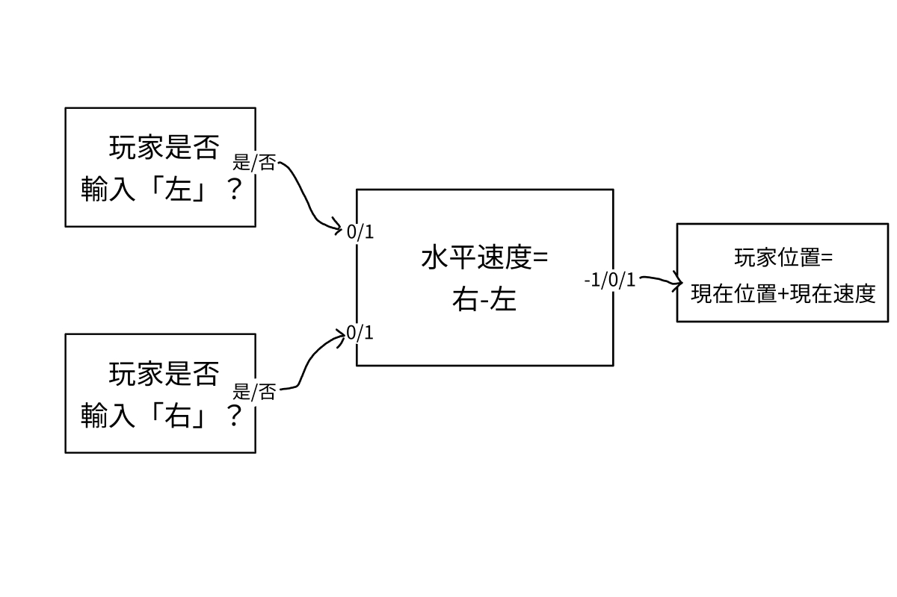

# 遊戲設計指引，Part 2：遊戲機制

作者：3213213210

TID：33562

<title>1</title> <link href="../Styles/Style.css" type="text/css" rel="stylesheet">

# 1

*本帖最後由 3213213210 於 2022-7-3 15:44 編輯*

前情提要：
Part 0：[https://giantessnight.com/gnforu ... iewthread&tid=33508](https://giantessnight.com/gnforum2012/forum.php?mod=viewthread&tid=33508)
Part 1：[https://giantessnight.com/gnforu ... iewthread&tid=33520](https://giantessnight.com/gnforum2012/forum.php?mod=viewthread&tid=33520)
Part 3：[https://giantessnight.com/gnforu ... iewthread&tid=33591](https://giantessnight.com/gnforum2012/forum.php?mod=viewthread&tid=33591)
現在發文大概會馬上被元宵文海沖下去
但不管了 我想趕快結束這個東西

＝＝＝＝＝＝＝＝＝＝＝＝＝＝＝＝＝＝＝＝＝＝＝＝＝＝＝＝＝＝＝＝＝＝＝＝＝

那麼，今天就讓我們來拆解遊戲作為遊戲的最基礎運作單位：
**遊戲機制。**

先告訴各位，「遊戲機制」目前並不存在公認的定義，
所以我在這裡的形容方式，不見得會是其他人對這個詞的理解，
我在這裡提供的只是一種切入遊戲製作的思考方法而已。
不需要太努力釐清什麼是遊戲機制、什麼樣算機制怎麼樣又不算，
**遊戲設計的依歸終究是玩家體驗**，
所以請務必不用太糾結在本文的內容上。
（非常歡迎留言試著做重新解釋，光看這篇文大概真的很難懂。）

好，總之，承著上一篇的脈絡：
遊戲作為遊戲的根本，就是能針對玩家的輸入做出動態的反應。
所以**遊戲如何理解玩家的輸入、如何做對應的處理、又如何把結果反映給玩家**，
就是理解遊戲運作的最基礎部份。

要理解這種**輸入、處理、輸出（IPO）**的流程，
有個相對容易的切入點：
玩家可影響的**變數**。

首先，什麼是**變數**呢？
就是字面上的意思，可以變的數值。
舉例來說，你要檢查玩家有沒有完成事件，
你會設立一個事件是否完成的「*真假值*」，並且在事件完成時切換數值；
你希望玩家的尺寸可以被更改，
你可以設立一個控制玩家比例的「*小數*」，並讓玩家的外型綁著此數字的增減；
你要一個可以移動的遊戲角色，
他就得有可以改變的「*座標*」，以及一套調整此座標的運算方法；
你希望根據狀況顯示不同的CG，
你可以設定並更改即將出現的「*圖像檔案*」，讓系統隨時有個可以讀取的影像。
有些遊戲引擎沒有這麼多種類的變數，那沒關係，
技術上只要有整數與小數就能應付絕大部分的狀況了，
我只是希望各位可以以這種「可以變動的數值」為單位，來理解遊戲運作的方式。

遊戲機制，基本上就是**調整與應用這些變數的規則**。
讓我簡單用「玩家移動」舉個例子：
<ignore_js_op>

**ipo_newest_1.jpg** *(78.29 KB, 下載次數: 0)*

[下載附件](forum.php?mod=attachment&aid=OTcyODB8MTFiOTVmMmF8MTY3NDA2NTUwNHwxODIzMHwzMzU2Mg%3D%3D&nothumb=yes)

2022-6-30 06:58 上傳

當玩家「按下方向鍵右」，
變數「*輸入右*」從「否」變成「是」，
變數「*角色水平速度*」從「0」變成「1」，
變數「*角色水平位置*」因此不停地增加，
這些變數的值都因為玩家的行為而改變了，
而改變的結果也透過在螢幕上的位置呈現給了玩家，
這就是我希望各位理解遊戲機制的方式。

所以，為什麼「按右就可以往右移動」這麼理所當然的事情，
我要特地分成好幾個階段，和各種數學來敘述呢？
既然遊戲設計的重點就是玩家體驗，我們有必要對運作方式這麼鑽牛角尖嗎？
這個嘛，確實沒有必要，我只是提供一種機制拆解方法而已，
你絕對可以在一輩子不畫這種圖的前提下做出好遊戲。
但是，**嘗試觀察與拆解規則運作的細節，可以幫助我們在設計上獲得相當的優勢，**
無論使用什麼方法，我都希望各位能研究「與玩家互動的系統」是如何構成的。

首先，**遊戲建立在規則之上，本身就是由邏輯所構成的。**
對於自己的遊戲運作有更明確的理解、
對於可以新增剃除或調整的規則有更深層的掌握，
不但增加了可以利用的工具，也能讓你更有信心的使用工具。

就像我強調過的，機制的多寡不是問題，問題永遠在應用與體驗。
針對同一套機制，也會有各式各樣不同的圖表畫法，
要如何應用這些機制分析來調整遊戲內容、追求遊玩體驗，
也是一個各位得自己靠實做邊做邊學的事。

不過，倒是有句話，我希望各位可以無時無刻放在心上：
**會互相牽引的三個機制，遠比平行運作的九個機制來得有深度。**

簡單舉個例，假設我們今天有三個變數：「玩家位置」、「玩家尺寸」、「玩家跳躍」，
玩家位置用來處理玩家移動、玩家尺寸用來決定與NPC互動的結果、玩家跳躍用來翻越障礙物，
然後我們要選擇接下來遊戲開發要怎麼發展。
*附加系統1：玩家可以按Shift奔跑，玩家需要與野生敵人進行戰鬥，玩家遭遇事件時會進入QTE……
附加系統2：玩家每移動三次位置會改變一次尺寸，玩家無法在小型尺寸進行跳躍，並且跳躍也算是一種移動。*
*系統1*是一直不停地加新機制，*系統2*是讓現有的機制交互影響，
那麼*系統2*的開發方向更能做出有深度、有密度的遊玩體驗。
例如，把NPC擺在需要跳躍的高台上，玩家需要讓爬上去互動，
但是太快縮小，就會因跳躍障礙而無法抵達NPC，
若靠近NPC時沒有縮小，就會被發現而就無法觸發期望事件，這樣的解謎遊戲；
或是稍微改變規則，移動造成的縮小只要再次移動就能變回來，
但是跳躍的能力必須在縮小狀態取得，在普通尺寸才能使用，
如此一來又可以做出完全不同的關卡布局與故事背景……

如果機制總是互相牽引，不僅對玩家來說每個元素都變得重要，
對開發者來說，只要稍微調整一下細部規則，就可以對遊戲整體產生巨大的影響。
**如果遊戲運作的基本邏輯就已經環環相扣，****尋找有潛力的互動體驗就能事半功倍。**

有時太理所當然而沒有被注意到的變數，也能在試著接上玩家互動以後變成機制的一部分。
「每秒鐘時間都會流動一秒」、「角色的圖像會跟著角色走」、「場景的光照強度」，
都可以變成「可以影響時間速度與流向」、「可以製造角色外貌幻影」、「在特定情況削弱場景光源」等遊戲機制。
如果再想想，空間跳躍、時間輪迴這種奇幻要素，也都是將基本時空變數列入簡單數學運算以後的結果……
事實上，「尺寸」這種東西本身就已經是一般開發者會徹底忽略的變數了，
但我們都很清楚這種小變數能有多大的體驗影響對吧？
**可以成為遊戲核心機制的要素其實一直都近在眼前，只是我們沒有注意到罷了。**

但最後也得再次強調，更有深度的遊戲不見得是更有樂趣的體驗。
如果你製造九個處處牽引的機制，就算你自己撐得住，玩家也容易暈頭轉向，
做成三組三個牽引機制可能會比較好。（……並且考慮要不要做成三個獨立的遊戲就好。）

那麼，簡單總結：
遊戲的根本是可以應對玩家的輸入而有輸出，
負責進行接收輸入、進行處理、推送輸出的基本單位就是遊戲機制。
有個簡單的機制理解方法，就是找出在過程中被影響的變數。
這個變數可能是玩家位置、玩家尺寸、移動速度、甚至是NPC的情緒與對應圖像，
**找出這些變數是依據什麼邏輯在變動的，就可以掌握遊戲機制。**
找出遊戲機制後，要如何與遊玩體驗交叉對照，是各位自己的功課，
但是別忘了：少量但交錯的機制，比起大量但平行的機制，
更容易尋找互動的樂趣、更容易創造有密度的體驗。

……最後再次強調，理論終究只是理論，這個教學系列還是需要你的實做才能有意義。
這篇之所以卡這麼久，是因為我一開始的計畫是畫一堆IPO圖表，
解釋「你可以用什麼樣的單位來形成節點」、「你應該試著把不同的Output接到別的Input上」，
越做越覺得，這也太耗費心神，而且看的人大概也不會得到多少幫助，
所以把切入點改成「變數」以後重寫了一遍，應該有比較好懂了吧……
……不過真的做好了機制，還是有編排的問題呢。
下一篇……希望週末就能寫完……或是這個月內，誰知道呢。</ignore_js_op>