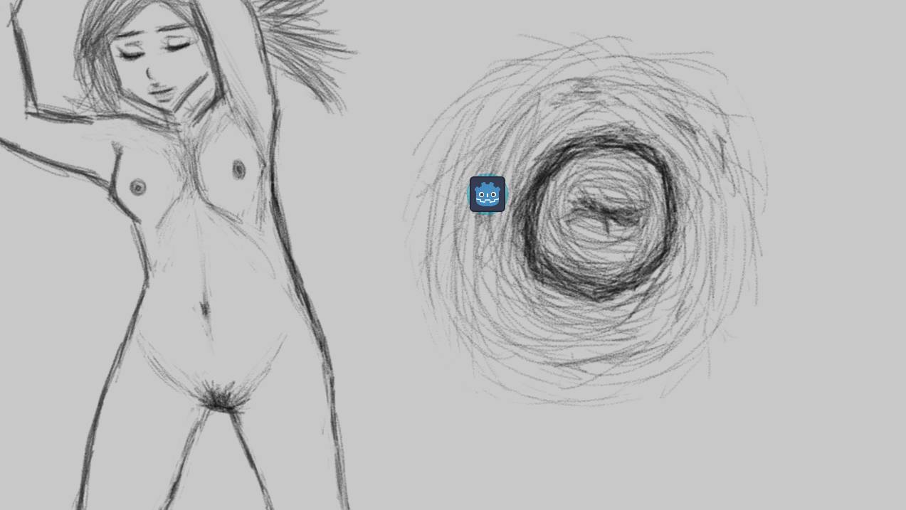
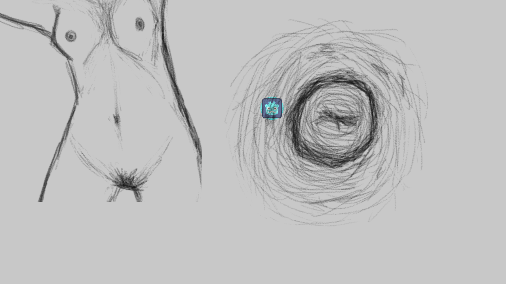
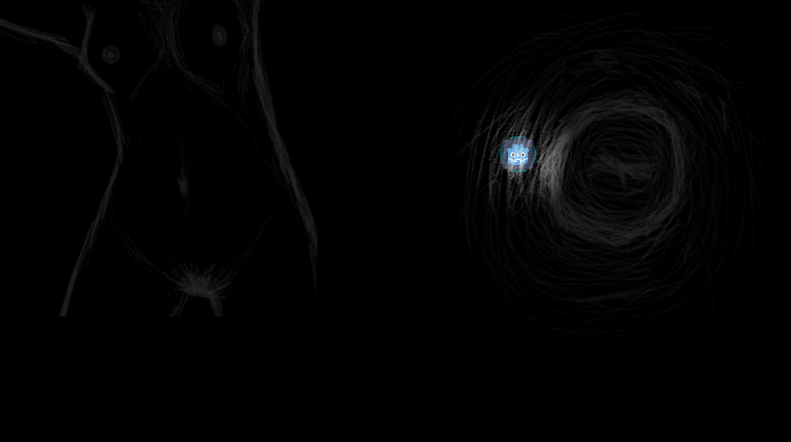
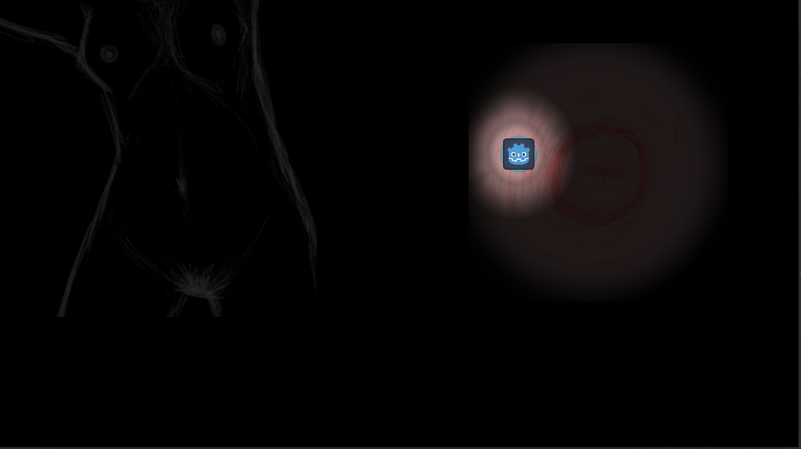
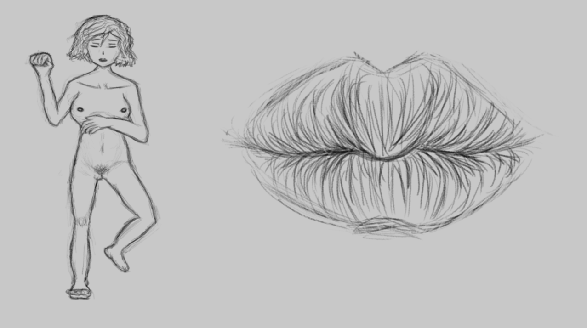
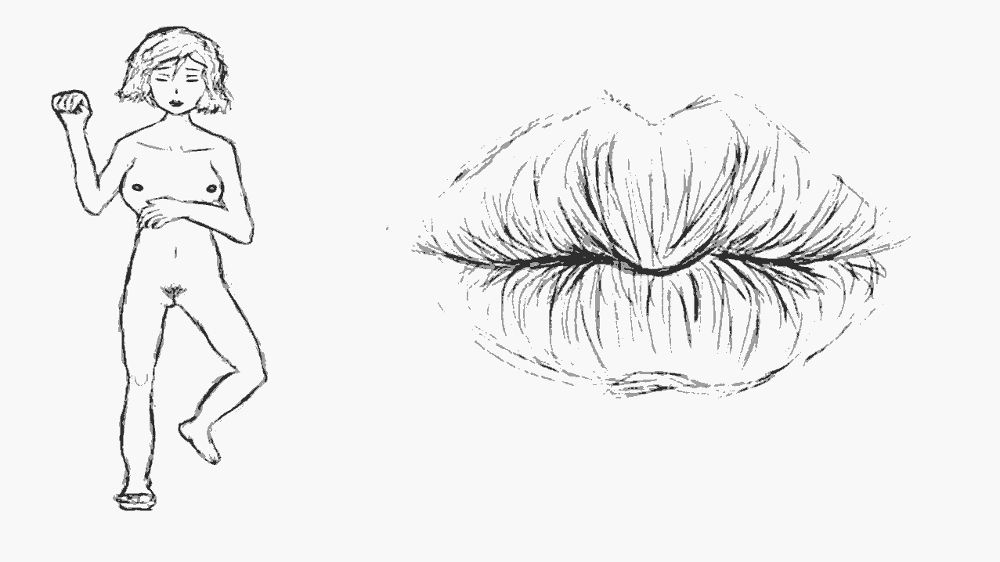
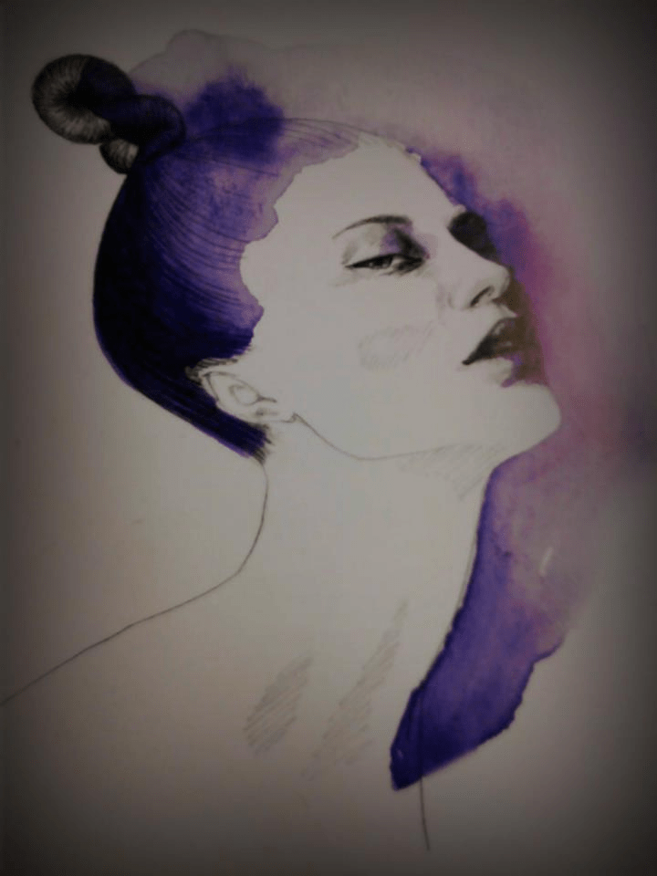
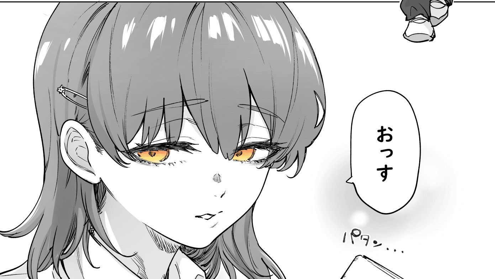

# 遊戲開發狀況：我果然太天真了

作者：3213213210

TID：34602

<title>1</title> <link href="../Styles/Style.css" type="text/css" rel="stylesheet">

# 1

*本帖最後由 3213213210 於 2022-12-22 20:08 編輯*

前情提要：[https://giantessnight.com/gnforu ... iewthread&tid=34523](https://giantessnight.com/gnforum2012/forum.php?mod=viewthread&tid=34523)
如各位所見，「全景和特寫同步呈現」的那項贏了，我要把那個作品擠出來……
遵照自己以前寫過得指引，我先做了簡單的Tech Demo，
做個分割畫面，右邊放個大張圖片、讓畫面永遠置中在圖片上，左邊有個小圖片能等比例移動，
在YouTube隨便找個小地圖製作教學就完成了，下一步該測什麼呢

首先我開始想遊戲核心和流程，
「要怎麼使用巨觀與微觀的交錯來製造遊戲體驗？」
「使用全景圖才能走出的迷宮」、「微觀畫面才能取得的密碼」、
「在微觀畫面的互動會影響環境」、「要靠觀察環境才能迴避的事件」……
……然後我想起來，我在做GTS遊戲欸，這樣搞下去就變解謎小品了

所以我把重心轉移到單純的GTS互動上，首先做個素材來測試效果吧……
<ignore_js_op>

**1.png** *(344.05 KB, 下載次數: 1)*

[下載附件](forum.php?mod=attachment&aid=MTAxMTM0fGYwMTc3NWRifDE2NzQwNjUxNjl8MTgyMzB8MzQ2MDI%3D&nothumb=yes)

2022-12-22 15:11 上傳

rr
……喔對，我還是不會畫畫
如果你覺得「看起來沒那麼糟啊」，別忘了這是大概兩三個工作天以後得出來的結果……

我「可以」畫，只要有充分的參考影像和時間，我是畫得出東西的，
但構圖要自己想、參考圖要自己找、呈現效果要自己抓的狀況下，
目前這種「缺什麼找什麼」的做事方法導致的就是無止盡的分心
「來上個Danbooru找臥躺姿勢參考吧」，兩個小時過去了什麼都沒做……

畫畫實在太沒效率了，所以我把腦筋動到了後製效果上
曾經聽說「打光經常是最有效的視覺增強方法」，我幫玩家角色加上光源，然後往素材照……
<ignore_js_op>

**2.png** *(291.42 KB, 下載次數: 0)*

[下載附件](forum.php?mod=attachment&aid=MTAxMTM1fDRkOGZlMjIxfDE2NzQwNjUxNjl8MTgyMzB8MzQ2MDI%3D&nothumb=yes)

2022-12-22 15:11 上傳

……2D光是加乘像素的顏色，所以黑色的像素點不會被光照影響，唯一發光的是玩家Placeholder……
沒關係，把圖片素材反轉成白色，再把背景轉成全黑……
<ignore_js_op>

**3.png** *(188.08 KB, 下載次數: 1)*

[下載附件](forum.php?mod=attachment&aid=MTAxMTM2fDdlNmVhNGUwfDE2NzQwNjUxNjl8MTgyMzB8MzQ2MDI%3D&nothumb=yes)

2022-12-22 15:11 上傳

……效果很微妙
或許問題在線畫不適合這種手法，如果幫奶頭上色呢？
<ignore_js_op>

**4.png** *(151.1 KB, 下載次數: 1)*

[下載附件](forum.php?mod=attachment&aid=MTAxMTM3fGUwY2Y2YmYyfDE2NzQwNjUxNjl8MTgyMzB8MzQ2MDI%3D&nothumb=yes)

2022-12-22 15:11 上傳

糟到不行……

總之我暫時拋棄了打光的想法，
然後因為奶頭看膩了，決定來畫個嘴巴
這次也想固定一下姿勢，之後再想個可以探索同一身體不同部位的流程，
於是這次花了兩個多小時畫個更完整的全身照……
<ignore_js_op>

**5.png** *(263.25 KB, 下載次數: 1)*

[下載附件](forum.php?mod=attachment&aid=MTAxMTM4fGUyMWU5NjdmfDE2NzQwNjUxNjl8MTgyMzB8MzQ2MDI%3D&nothumb=yes)

2022-12-22 15:11 上傳

……看起來好像比之前的更糟？？
不，不要怕，我還有後製的魔法可以用
顯然鉛筆筆刷的髒污太多了，所以如果我套個Palette Filter設成三階灰階……
<ignore_js_op>

**6.png** *(53.5 KB, 下載次數: 1)*

[下載附件](forum.php?mod=attachment&aid=MTAxMTM5fGU5NjU1OTM0fDE2NzQwNjUxNjl8MTgyMzB8MzQ2MDI%3D&nothumb=yes)

2022-12-22 15:11 上傳

……也是救不了歪掉的骨架
也嘗試了使用雜訊材質做移動霧氣overlay，確實有動畫效果，但角色看起來變得像沉在水底一樣……

……目前這就是所有的進度了，一堆放棄的想法和一個自動去邊的濾鏡
很明顯地，我是沒辦法單靠「好想看到下一張性感圖片」作遊戲推進力的，
素材也大幅地限制了寫作的自由度，「開場讓主角走在街道上，搭配全景衛星圖片」這種想法會被光速退件……
不過寫了這篇文也讓我多少整理好了思緒，
我覺得看到了自己用更偷懶的方法做完遊戲的道路了……

發這篇只是想維持做事動力而已，不過依舊歡迎任何留言或意見，就這樣

<title>2</title> <link href="../Styles/Style.css" type="text/css" rel="stylesheet">

# 2

只要思想不滑坡，办法总比困难多。楼主加油吧..只能给一些言语上的支持了. <title>3</title> <link href="../Styles/Style.css" type="text/css" rel="stylesheet">

# 3

連看了三十多集光美感覺腦袋鈍鈍的，可能有點顛三倒四

網路上有各種無版權免費素材網站可以運用，也有不少付費資源，之前在DL有瞥見不少

個人認為圖像挺代感的，有時候當下覺得很糟，但事反倒會覺得不錯

遇到瓶頸時可以休息並審視一下，逼得太緊反而會陷入死循環，自己不開心是很難持續下去的

上色的部分或許可以隨意上一下，營造出素描風格之類的，或是只上部分，譬如五官和三點

之前看過一些歐美畫家只上嘴唇和瞳孔，好像是叫矇矓美來著，不過目前只能找到一點

<ignore_js_op>

**02.jpg** *(30.67 KB, 下載次數: 0)*

[下載附件](forum.php?mod=attachment&aid=MTAxMTU3fGI4MjBmMGJkfDE2NzQwNjUxNjl8MTgyMzB8MzQ2MDI%3D&nothumb=yes)

2022-12-24 00:02 上傳

<ignore_js_op>

**01.jpg** *(168.83 KB, 下載次數: 0)*

[下載附件](forum.php?mod=attachment&aid=MTAxMTU2fDFjZjFmZGZlfDE2NzQwNjUxNjl8MTgyMzB8MzQ2MDI%3D&nothumb=yes)

2022-12-24 00:02 上傳

背景可以少畫幾張，由遠到近放大或縮小背景，一張至多應該可以用五個場景吧，還有適時地調整角度

再來提點雲建議，也許加些小人的限制(?，像是時限(天亮)，不能有太大的動靜否則會吵醒GTS

需要透過觀察GTS的表情和動作來避免這些的事件，也翻身或抓癢什麼的，或許會改變環境

最後分享下「香蕉與槍」和「地下城堡2」，這兩個遊戲興許會有幫助

<title>4</title> <link href="../Styles/Style.css" type="text/css" rel="stylesheet">

# 4

> [花丸一生推 發表於 2022-12-24 00:02](https://giantessnight.cf/gnforum2012/forum.php?mod=redirect&goto=findpost&pid=522629&ptid=34602)
> 連看了三十多集光美感覺腦袋鈍鈍的，可能有點顛三倒四

因為我打算把專案檔一起丟上來，付費素材不在考慮之內
然後對，圖片放到網頁上以後，看起來的確沒那麼糟了，
不過繪畫對我依舊是個無法「先打開程式再想要幹麻」的領域
關鍵部位上色嘛……是個方法，有時間會實驗看看，套色盤濾鏡效果可能不錯

至於遊戲本身，我已經想往點擊遊戲的方向做了
想只靠固定特寫鏡頭做的話，移動其實沒什麼自由空間，
不如做把滑鼠移到全景部位上時自動切換特寫，按滑鼠就會觸發某種事件，
操作會變簡單，但互動的寫法反而自由不少
我本來完全掰不出為什麼角色會想要爬進嘴唇，現在直接寫個「按了滑鼠空投小人」之類的就好
然後再用不同地方的事件來製造狀態，可能按兩下滑鼠才會把人吃下去，
只按一下就去攻擊其他部位，嘴裡的那個就會被擠死之類的……
那樣實際成品應該兩分鐘以內就玩完了，不過應該會挺有趣的</ignore_js_op></ignore_js_op></ignore_js_op></ignore_js_op></ignore_js_op></ignore_js_op></ignore_js_op></ignore_js_op>