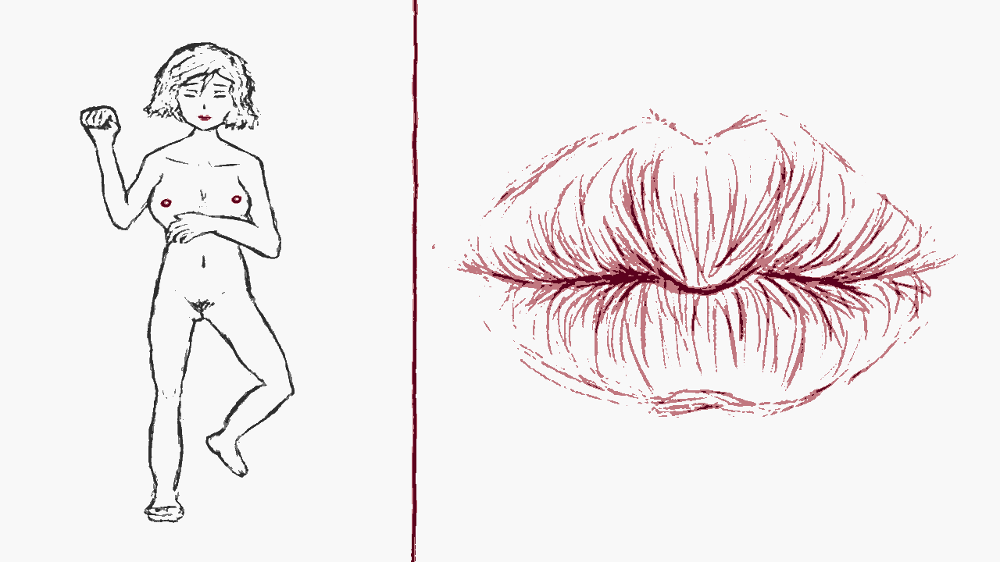

# 遊戲開發狀況：準備砍掉重練，但是過完年再說

作者：3213213210

TID：34765

<title>1</title> <link href="../Styles/Style.css" type="text/css" rel="stylesheet">

# 1

*本帖最後由 3213213210 於 2023-1-11 16:38 編輯*

前情提要：[https://giantessnight.com/gnforu ... iewthread&tid=34602](https://giantessnight.com/gnforum2012/forum.php?mod=viewthread&tid=34602)

Windows執行檔： [https://mega.nz/file/9x1l0QJD#3i ... B7YSwgE3smdECldT1-k](https://mega.nz/file/9x1l0QJD#3iOyAOWMVdzcjRAU0FPyU6LkB7YSwgE3smdECldT1-k)

過去半個月斷斷續續地打開，雖然不能說毫無進度，但實際的進度該是一個下午能推完的程度
現在終於到了個「或許這條路行不通」的階段了，
不過在砍掉重來之前，先分享和簡單講一下目前的成品

首先，畫面左邊是全景圖，
然後滑鼠移動到位置上，右邊會出現相應的特寫圖
跨下：
<ignore_js_op>

**1.png** *(67.45 KB, 下載次數: 0)*

[下載附件](forum.php?mod=attachment&aid=MTAxNTIwfGMxZDNhYWYxfDE2NzQwNjUwMTl8MTgyMzB8MzQ3NjU%3D&nothumb=yes)

2023-1-11 13:46 上傳

奶頭：
<ignore_js_op>

**2.png** *(72.42 KB, 下載次數: 0)*

[下載附件](forum.php?mod=attachment&aid=MTAxNTIxfDJhMjk0MWQ4fDE2NzQwNjUwMTl8MTgyMzB8MzQ3NjU%3D&nothumb=yes)

2023-1-11 13:46 上傳

嘴巴：
<ignore_js_op>

**3.png** *(62.33 KB, 下載次數: 0)*

[下載附件](forum.php?mod=attachment&aid=MTAxNTIyfDg5NTE1MjFjfDE2NzQwNjUwMTl8MTgyMzB8MzQ3NjU%3D&nothumb=yes)

2023-1-11 13:46 上傳

……基本上就這樣
當初做這個姿勢是為了讓腳跟手也有發揮空間，不過畫畫好麻煩

為什麼這麼簡單的互動可以拖半個月呢？
因為最開始的偷懶想法，「直接在素材上套濾鏡就好」，反而製造了一堆麻煩
濾鏡的運作邏輯是挑起螢幕上的像素，轉換成指定色盤裡最接近的顏色，
而有兩種素材要用不同的色盤時，後出現的色盤會蓋掉已經套完的色盤
簡而言之，幫嘴巴套個紅色濾鏡，已經套完灰階濾鏡的下巴也會跟著變紅色
（上面的三張圖裡，只有嘴巴特寫的分隔線是紅的，就是因為範圍太大了）
這還是先理解了「SCREEN_TEXTURE要有BackCopyBuffer才能讓兩個Shader同時作用，不設z_index的話得考慮到節點運算順序」才面對的問題，
不過太技術細節的東西就不講了，有人有興趣再回覆解釋

……如果我一開始直接幫素材修圖再丟進遊戲引擎，這些問題通通不會存在
當然，嘗試不同的做事方法，以後總有機會用到，
不過對這個遊戲來講，我就像是用叉子吃飯一樣，非常不對症下藥
而且我還手賤用了Beta版本的引擎，讓自己撞上更多無所謂的技術障礙……

最後說一下，原本預定的遊戲內容，就是按滑鼠互動而已
如果嘴巴在畫面上，按一下滑鼠/Enter/空白鍵……
<ignore_js_op>

**4.png** *(61.23 KB, 下載次數: 0)*

[下載附件](forum.php?mod=attachment&aid=MTAxNTIzfGQxNjY4ZmEzfDE2NzQwNjUwMTl8MTgyMzB8MzQ3NjU%3D&nothumb=yes)

2023-1-11 13:46 上傳

……會有一個小人從天上掉下來掉進嘴巴
（小人因為前面講的色盤問題也是紅色的）
**但是！**
有1/7的機會，小人不是直接掉進去，而是彈起來、在空中翻一圈，然後才掉進去！
（已知Bug：如果一個動畫還沒播完卻觸發另一種動畫，前一個動畫就會卡在那裡）
其實按起來有點上癮，不過樂趣不會超過一分鐘

……然後我就不知道要幹麻了
嘴巴能把東西變不見，所以可以輕易達成無限循環，其他部位就沒這種好事了
往跨下狂塞東西卻不給任何回饋絕對行不通，丟東西進乳腺……有點噁……
如果點擊造成的影響是On/Off呢？點一下丟東西，點第二下收回來？
單純這樣也不會有趣，至少得讓不同部位能交叉影響
奶頭上有東西時嘴巴才會打開？小人丟到嘴巴，隔一段時間就會從跨下出現？
然後可以收集起來……呃……再丟回嘴巴？？
排出來的跟丟進去的會有某種型態差別，所以可以製造事件？遊戲目標是啥，鍊成超級小人？？

或許再拖下去會有更多想法，但接下來就要過年了，
半個月以後再回來看這個亂成一團的災難，大概只會引發更多拖延症

所以是時候按下自爆按鈕了，
把亂無章法的專案拋棄掉，用目前為止得到的經驗來重新開始，製造更有希望的前進方向
……有大概七成的問題在放棄後製濾鏡的瞬間就不存在了，這些經驗可能沒什麼價值可言

下面附上專案檔
<ignore_js_op>

**5.png** *(207.84 KB, 下載次數: 0)*

[下載附件](forum.php?mod=attachment&aid=MTAxNTI1fGI0MzMyOGMwfDE2NzQwNjUwMTl8MTgyMzB8MzQ3NjU%3D&nothumb=yes)

2023-1-11 15:03 上傳

並且說明一下，引擎的4.0 Beta 8版本把我的測試場景弄壞了，所以前期的測試已經開不了了
現在最新版本是4.0 Beta 11，如果要打開請去官網載測試版
[https://downloads.tuxfamily.org/godotengine/4.0/beta11/](https://downloads.tuxfamily.org/godotengine/4.0/beta11/)
雖然我不覺得會有人想研究這陀災難就是……

<title>2</title> <link href="../Styles/Style.css" type="text/css" rel="stylesheet">

# 2

 <ignore_js_op>

[RealTimeMicro.zip](forum.php?mod=attachment&aid=MTAxNTE1fDkyOTA0N2YwfDE2NzQwNjUwMTl8MTgyMzB8MzQ3NjU%3D)

2023-1-11 13:37 上傳

點擊文件名下載附件

2.93 MB, 下載次數: 1</ignore_js_op> <title>3</title> <link href="../Styles/Style.css" type="text/css" rel="stylesheet">

# 3

其实真的可以偷偷懒，什么ai绘画辅助一下，有些能找到的素材可以利用，未必要太过用引擎啥的做到完美，我感觉大佬你这工程最起码已经是工作室级别的了，这样下去别说继续下去的动力，感觉精神都要炸 <title>4</title> <link href="../Styles/Style.css" type="text/css" rel="stylesheet">

# 4

> [titiwong 發表於 2023-1-11 19:17](https://giantessnight.cf/gnforum2012/forum.php?mod=redirect&goto=findpost&pid=524521&ptid=34765)
> 其实真的可以偷偷懒，什么ai绘画辅助一下，有些能找到的素材可以利用，未必要太过用引擎啥的做到完美，我感 ...

AI繪圖沒那麼萬能 我有試過用Anything V3和Waifu DIffusion生成奶頭特寫 怎樣都生成不了特寫
「乳頭」作為關鍵字幾乎怎樣都會帶出「乳房」 一直給我奶子
其他圖也是 如果要精準控制結果 就要用img2img 最後還是要自己生出參考圖來

然後這個如果要稱為工作室等級 那應該是超級混的工作室
最關鍵的Palette Filter Shader我是從素材庫抓的
[https://godotshaders.com/shader/palette-filter-for-3d-and-2d/](https://godotshaders.com/shader/palette-filter-for-3d-and-2d/)
除了裡面有一個變數名稱因為引擎版本要改以外 其餘通通都是複製貼上 裡面有一半的式子完全看不懂
實際的運作邏輯大概就也只有「這塊區域偵測到滑鼠時，把這東西取消隱藏，另外兩個隱藏」，
按滑鼠執行的部份則只是「如果按了滑鼠而且嘴巴沒有被隱藏，播放動畫」，
全部加起來好像還不到十行

我不找素材就是因為麻煩啊 要讓不同來源的素材和諧共處 變數反而更多啊
什麼可以偷偷懶 我一直都是以偷懶為前提在做的
反而是太偷懶才遭到各種報應……

<title>5</title> <link href="../Styles/Style.css" type="text/css" rel="stylesheet">

# 5

唉，虽然是期待，但并不是那么的着急。楼主自己把握好合适的节奏，不影响正常生活地来整吧。来日方长昂 <title>6</title> <link href="../Styles/Style.css" type="text/css" rel="stylesheet">

# 6

> [freepenguin2 發表於 2023-1-12 00:10](https://giantessnight.cf/gnforum2012/forum.php?mod=redirect&goto=findpost&pid=524559&ptid=34765)
> 唉，虽然是期待，但并不是那么的着急。楼主自己把握好合适的节奏，不影响正常生活地来整吧。来日方长昂 ...

討厭啦 講期待 害我的「了不起交差了事」的勇氣下降了5% <title>7</title> <link href="../Styles/Style.css" type="text/css" rel="stylesheet">

# 7

> [3213213210 發表於 2023-1-12 00:32](https://giantessnight.cf/gnforum2012/forum.php?mod=redirect&goto=findpost&pid=524561&ptid=34765)
> 討厭啦 講期待 害我的「了不起交差了事」的勇氣下降了5%

哈哈哈，一开始就说是期待啊。只是觉得没必要透支来赶工而已。让健康的体魄代替5%的勇气损失！</ignore_js_op></ignore_js_op></ignore_js_op></ignore_js_op></ignore_js_op>