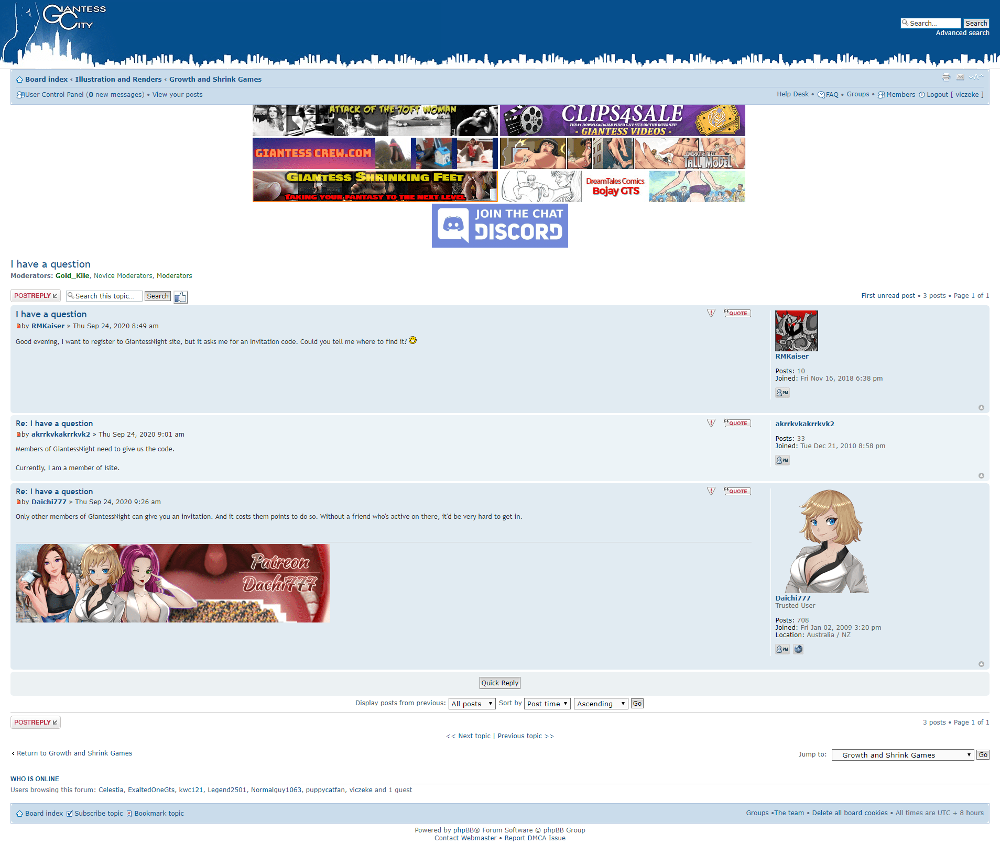

# 邀请码制度是不是应该解除了？

作者：Vanmilos

TID：29460

<title>1</title> <link href="../Styles/Style.css" type="text/css" rel="stylesheet">

# 1

当初好像是因为有个gt老哥不停的来搞事所以被迫设置了邀请码制度，不过现在那个gt老哥已经走了吧（也许）。邀请码确实可以阻挡一些来搞事情的人，但是同时阻挡了新人的加入，2000的价格对于大部分人来说过于昂贵，而且还有降级的风险。只有一些元老才能担负得起，但是新人接触到这些元老的机会少的可怜，就算有一些新人和gn用户有联系，但昂贵的邀请码导致除非关系特别铁，不然不可能搞到的，再加上本来gn就是被墙的状态，导致gn无法及时补充新鲜血液。所以为了论坛的未来，请各位管理大大们考虑一下吧。
<title>2</title> <link href="../Styles/Style.css" type="text/css" rel="stylesheet">

# 2

然而那个人并没有走，甚至还有小号藏在这里，而且除了gt还有巨兽来贴吧搞事
[https://www.macrophiliafan.me/thread-25319-1-2.html](https://www.macrophiliafan.me/thread-25319-1-2.html) <title>3</title> <link href="../Styles/Style.css" type="text/css" rel="stylesheet">

# 3

因为那边开了全尺寸爱好所以GT和furry都敢跑到这边冲塔了还以为我们不够开放，啧啧啧 <title>4</title> <link href="../Styles/Style.css" type="text/css" rel="stylesheet">

# 4

我就不是很懂了，这两个人怎么把自己冲塔说的这么理直气壮，就像你玩游戏不看规则开挂一样，被封了不是很正常的事，自己不去了解规则就是他的问题了 <title>5</title> <link href="../Styles/Style.css" type="text/css" rel="stylesheet">

# 5

> [茶道赛高 發表於 2020-9-12 22:36](https://giantessnight.cf/gnforum2012/forum.php?mod=redirect&goto=findpost&pid=447492&ptid=29460)
> 然而那个人并没有走，甚至还有小号藏在这里，而且除了gt还有巨兽来贴吧搞事
> https://www.macrophi ...

看了看里面一些人还是明白事儿的，不过里面也有一些说的对，就是部分用户言语过激的问题，gw和大超萌都遇到过同种问题，但至少gw平稳的解决了，这个也许应该反思一下
<title>6</title> <link href="../Styles/Style.css" type="text/css" rel="stylesheet">

# 6

> [诸君我喜欢 發表於 2020-9-12 22:49](https://giantessnight.cf/gnforum2012/forum.php?mod=redirect&goto=findpost&pid=447498&ptid=29460)
> 建议举行一个全论坛公投，让全体坛友决定是否重启论坛！当然了，必须要在管理团队的许可下进行 ...

我觉得可行，让管理大大们开个投票来决定。
<title>7</title> <link href="../Styles/Style.css" type="text/css" rel="stylesheet">

# 7

我觉得可以换一种方式来通过新人，答题什么的我觉得可以是一种解决方式。

<title>8</title> <link href="../Styles/Style.css" type="text/css" rel="stylesheet">

# 8

> [诸君我喜欢 發表於 2020-9-12 23:08](https://giantessnight.cf/gnforum2012/forum.php?mod=redirect&goto=findpost&pid=447503&ptid=29460)
> 话说之前到底是怎么一回事啊？我是后来才加入gn的，能说一下事件详细经过吗？我只是在同好Q群听人说是gl ...

之前gn的版面要好看的多，主页左边还有论坛新图的缩略图。然后突然蹦出来一个gt老哥发一堆gt内容，还在一楼就贴上gt的图片，导致一进论坛就能看到gt的缩略图。管理再三警告后将其封号，然后他又开了小号继续发。无奈之下gn开启了邀请码制度，同时删除了主页缩略图显示。
这gt老哥纯粹就是过来搞事的，我不喜欢gt但我尊重gt爱好者的性癖，我不会跑到gt论坛宣传gts，同理gt爱好者也不应该跑到gn这个gts论坛宣传gt。因为他被封了好几次号，而且当时很多gn用户怒气比较大，导致许多不明就里的人觉得是gn论坛“不尊重gt”“没有包容性”，是“垃圾论坛”
<title>9</title> <link href="../Styles/Style.css" type="text/css" rel="stylesheet">

# 9

我个人觉得，论坛有一定的门槛是好事，但门槛太高并不利于发展 <title>10</title> <link href="../Styles/Style.css" type="text/css" rel="stylesheet">

# 10

是挺麻烦的……虽然讨喜欢gt但是因为这个而导致新人少也不是好事 <title>11</title> <link href="../Styles/Style.css" type="text/css" rel="stylesheet">

# 11

*本帖最後由 wxy112300 於 2020-9-13 01:50 編輯*

本来我觉得开放一下也挺好，直到我点开了那个贴子...
得，原来这里都成垃圾场了
GT爬
不过说起来邀请码确实让门槛高了太多了，有没有什么类似的审核制度呢？
<title>12</title> <link href="../Styles/Style.css" type="text/css" rel="stylesheet">

# 12

*本帖最後由 St2019 於 2020-9-13 02:07 編輯*

这不是这几天还有去大超萌吧捣乱的结果被删帖了嘛，搞了个投票贴说如果大部分吧友不喜欢除gts外的其他巨物就不会打扰了，结果自己选择性无视200多个不喜欢的票数，还说大超萌吧迟早会被他们渗透到手， 在回复里叫人闭嘴，吧主亲自给了他几个相关的贴吧也被他无视了还叫着除了大超萌就没有其他去处了。
这里也是一样，论坛名大大的GIANTESS字样就是看不见，一厢情愿的认为这里接受其他巨物，被坛友反对后屡教不改搞刷贴，被封了就跑去装可怜。
要我说，这种人就是脑积水导致颅压过大压迫了大脑组织和视神经，导致脑子和眼睛都不好使。
（既然都说这边是垃圾场了也就没有必要对这种人客气什么了）
邀请码制度个人认为可以换成反正只要不会让人随便能注册的其他审核方式也好，全面开放的话就是在发展和秩序之间做选择，需要管理大大仔细考虑才能得出比较好的结论。
最后说一句，GT给爷爬。
<title>13</title> <link href="../Styles/Style.css" type="text/css" rel="stylesheet">

# 13

> [我属于被称为 發表於 2020-9-12 23:07](https://giantessnight.cf/gnforum2012/forum.php?mod=redirect&goto=findpost&pid=447502&ptid=29460)
> 我觉得可以换一种方式来通过新人，答题什么的我觉得可以是一种解决方式。
> 
> ...

我也支持答题。去掉分数邀请，注册时增加答题流程。在网页左侧显示版规，右侧显示题目，让新用户在版规中找答案回答，这样至少可以避免无恶意的违规事件。
<title>14</title> <link href="../Styles/Style.css" type="text/css" rel="stylesheet">

# 14

那人就是和跑到西餐馆喊着要炸酱面要狗不理包子被厨师撵出来后还去告状不多元化是一路人 <title>15</title> <link href="../Styles/Style.css" type="text/css" rel="stylesheet">

# 15

> [茶道赛高 發表於 2020-9-12 22:36](https://giantessnight.cf/gnforum2012/forum.php?mod=redirect&goto=findpost&pid=447492&ptid=29460)
> 然而那个人并没有走，甚至还有小号藏在这里，而且除了gt还有巨兽来贴吧搞事
> https://www.macrophi ...

tmd笑死lz了，什么人啊这么浅显的道理都不懂，这是性取向的问题，而不是你沾个巨大就能和这边沾边
<title>16</title> <link href="../Styles/Style.css" type="text/css" rel="stylesheet">

# 16

既然这样子那我们反向恶心他们就好了，我就不信他们的包容性能够接受全部xp <title>17</title> <link href="../Styles/Style.css" type="text/css" rel="stylesheet">

# 17

有一说一，gt老哥没有咱们gts这边这样团结有组织，他们到现在都是一盘散沙，现在最能收容他们的地方就是gl论坛。且不说gl论坛环境如何，有些人在gl就是坐不住，也不愿意自己开个专门的gt论坛，还总觉得去别的地盘搞事很好玩，总之就是觉得哪都没有自己的容身之所。就连在贴吧，他们明明有自己的吧也不愿意去看看，真的一点凝聚力都没有。
另外，咱觉得gn是做不到gl那样收容gt，毕竟gl已经是一个尺寸xp的论坛了，gt和gts想要共存并不是一定要靠gl那样收容，不然gn的性质就变了，想要两者共存那重要的一定是相互尊重理解。但是咱说句直白的，gt老哥真的是一盘散沙，没组织没纪律，也没太大凝聚力，如果这些人真的团结应该会尽力创建自己的论坛，而不是靠别人的收留。
最后，关于gn的邀请码制度，咱也觉得太昂贵了，要是可以减轻一点价格或者换一种注册的制度或许会好一点，咱也希望gn可以多一些新鲜血液。 <title>18</title> <link href="../Styles/Style.css" type="text/css" rel="stylesheet">

# 18

> [茶道赛高 發表於 2020-9-12 22:36](https://giantessnight.cf/gnforum2012/forum.php?mod=redirect&goto=findpost&pid=447492&ptid=29460)
> 然而那个人并没有走，甚至还有小号藏在这里，而且除了gt还有巨兽来贴吧搞事
> https://www.macrophi ...

这种弱智言论还有人支持他我是没有想到的，其中看起来好像还有有头有脸的大人物（误）
还是把邀请码留着吧，这种tnt混进来可受不了
<title>19</title> <link href="../Styles/Style.css" type="text/css" rel="stylesheet">

# 19

> [箭头君7号 發表於 2020-9-12 23:14](https://giantessnight.cf/gnforum2012/forum.php?mod=redirect&goto=findpost&pid=447504&ptid=29460)
> 之前gn的版面要好看的多，主页左边还有论坛新图的缩略图。然后突然蹦出来一个gt老哥发一堆gt内容，还在一 ...

你这话说的有语病，你先回答一下，gn论坛为什么要“尊重gt”？？？就是不尊重甚至厌恶排斥在我看来都是很正常

<title>20</title> <link href="../Styles/Style.css" type="text/css" rel="stylesheet">

# 20

看了隔壁的发言，还是先别降门槛吧 <title>21</title> <link href="../Styles/Style.css" type="text/css" rel="stylesheet">

# 21

我觉得可以适当降低门槛，2000积分确实是有点贵了，毕竟那事儿之后回复的奖励也从50下调到15了
但是门槛是绝对绝对要有的，不然那种人病态的心理，是绝对会来搞事的，而且那边的帖子也看到了，对gn抱有敌意的人并不少（当然明事理的人也很多）
不过gn说到底是但大的个人论坛，所以我无条件支持管理员的决定 <title>22</title> <link href="../Styles/Style.css" type="text/css" rel="stylesheet">

# 22

> [箭头君7号 發表於 2020-9-12 23:14](https://giantessnight.cf/gnforum2012/forum.php?mod=redirect&goto=findpost&pid=447504&ptid=29460)
> 之前gn的版面要好看的多，主页左边还有论坛新图的缩略图。然后突然蹦出来一个gt老哥发一堆gt内容，还在一 ...

这个说一下缩略图的取消不是因为GT,是因为那边有可能刷出R18的图,为了安全所以论坛管理组把他去掉了
<title>23</title> <link href="../Styles/Style.css" type="text/css" rel="stylesheet">

# 23

看大家都发言总结起来大概就是：门槛不能取消，但可以降低，降低到部分人，嗯...金牌会员，或者高级会员不会感觉这么肉疼的程度。
<title>24</title> <link href="../Styles/Style.css" type="text/css" rel="stylesheet">

# 24

这个门槛太因噎废食了。难道加入的新人很多吗？也没有吧 <title>25</title> <link href="../Styles/Style.css" type="text/css" rel="stylesheet">

# 25

> [dindin 發表於 2020-9-13 19:57](https://giantessnight.cf/gnforum2012/forum.php?mod=redirect&goto=findpost&pid=447618&ptid=29460)
> 这个门槛太因噎废食了。难道加入的新人很多吗？也没有吧

圈内新人、找不到组织的人比想象中要多，以前是被墙挡，现在是被墙和邀请码挡，有时候真是有心无力啊
<title>26</title> <link href="../Styles/Style.css" type="text/css" rel="stylesheet">

# 26

收到了，会研讨 <title>27</title> <link href="../Styles/Style.css" type="text/css" rel="stylesheet">

# 27

我个人觉得应该降低门槛 想当初其实12年还是13年左右吧 应该就已经知道gn的存在了 但是印象中不知道被什么门槛挡住了 也进不来 直到15年高考完那个暑假 求那篇1212123大佬写的成为宁宁玩具的日子才再次抱着试试的心理来试试注册论坛 结果成功了并留到了现在 作为新鲜血液也试着去为论坛做出了一点点贡献 不算大佬 但是作为一个平凡的坛友应该还算合格 我是想说其实有新鲜血液进来其实也是一场赌博 新人可能潜水 可能写文 可能弄来漫画资源一起分享 这些我认为都是可以接受的 但是也有一些新人会做出一些十分不合理的行为 那毕竟林子大了什么鸟都有 这时候就需要辛苦管理把这些搞事的新人请离这个论坛了 赌博有输有赢 但我觉得有新鲜血液应该是件好事 没有新鲜血液虽然不是不行 多点坛友为论坛做贡献总归是件好事 人多力量大 也盼望着论坛能够越来越好（随便写写 文笔差 日常不知道怎么收尾） <title>28</title> <link href="../Styles/Style.css" type="text/css" rel="stylesheet">

# 28

> [咯咯 發表於 2020-9-13 22:47](https://giantessnight.cf/gnforum2012/forum.php?mod=redirect&goto=findpost&pid=447631&ptid=29460)
> 收到了，会研讨

感谢ing~管理大大们辛苦了 <title>29</title> <link href="../Styles/Style.css" type="text/css" rel="stylesheet">

# 29

我觉得可以搞一个买漫画区勋章就送邀请码这样.
毕竟现在论坛里头的大部分人ducat都是拿去买勋章了 <title>30</title> <link href="../Styles/Style.css" type="text/css" rel="stylesheet">

# 30

> 吸水恶魔 發表於 2020-9-14 20:24
> 我觉得可以搞一个买漫画区勋章就送邀请码这样.
> 毕竟现在论坛里头的大部分人ducat都是拿去买勋章了 ...

我反对，可以适当降低价格，你这样搞反而门槛更高，180天一个用户只能邀请一人，漫画勋章又不带重复购买的 <title>31</title> <link href="../Styles/Style.css" type="text/css" rel="stylesheet">

# 31

> [神父桑 發表於 2020-9-14 22:04](https://giantessnight.cf/gnforum2012/forum.php?mod=redirect&goto=findpost&pid=447707&ptid=29460)
> 我反对，可以适当降低价格，你这样搞反而门槛更高，180天一个用户只能邀请一人，漫画勋章又不带重复购买 ...

180天只能邀请一个看起来很不合理,但是其实在我们论坛并不是什么很难以让人接受的事情.具体你可以打开排行榜→用户排名→邀请排名
可以看到只有[呵呵呵还07](https://giantessnight.com/gnforum2012/home.php?mod=space&uid=19592)  [维团子](https://giantessnight.com/gnforum2012/home.php?mod=space&uid=24424) [phone2345](https://giantessnight.com/gnforum2012/home.php?mod=space&uid=4109)三个用户是邀请了两个以上的人的(其中只有[呵呵呵还07](https://giantessnight.com/gnforum2012/home.php?mod=space&uid=19592)邀请了三人).邀请码制度从今年二月开始实施.

然后本日新增用户是0个,昨天应该是一个(具体看邀请里头的本周排名目前只有一个人送出了邀请码)
门槛问题,我觉得一千块一个的漫画勋章门槛怎么说都算不上高,更何况漫画区勋章应该是论坛最畅销的勋章了(这里没有数据统计,不一定正确)
<title>32</title> <link href="../Styles/Style.css" type="text/css" rel="stylesheet">

# 32

这个邀请码确实好贵。我今年就遇见5个萌新问gn在哪，给了网址他们说进不去哈。然后我看了下自己微薄的积分，对他们说声再见⊙ω⊙ <title>33</title> <link href="../Styles/Style.css" type="text/css" rel="stylesheet">

# 33

<ignore_js_op>

**• View topic - I have a question.png** *(904.95 KB, 下載次數: 1)*

[下載附件](forum.php?mod=attachment&aid=ODUyMTd8MGE1NDc0M2F8MTY3NDA2ODU1MnwxODIzMHwyOTQ2MA%3D%3D&nothumb=yes)

2020-9-24 12:42 上傳

city上都有人求教如何获得了，
<title>34</title> <link href="../Styles/Style.css" type="text/css" rel="stylesheet">

# 34

> [紫色欧石楠 發表於 2020-9-24 12:43](https://giantessnight.cf/gnforum2012/forum.php?mod=redirect&goto=findpost&pid=448291&ptid=29460)
> city上都有人求教如何获得了，

建议再发一贴，这个贴怕是没人看了（大概）
<title>35</title> <link href="../Styles/Style.css" type="text/css" rel="stylesheet">

# 35

> [147c147 發表於 2020-9-25 09:17](https://giantessnight.cf/gnforum2012/forum.php?mod=redirect&goto=findpost&pid=448344&ptid=29460)
> 建议再发一贴，这个贴怕是没人看了（大概）

啊，那个帖子因为发在不相干区域已经被版主锁了，所以无关我事，摊手
<title>36</title> <link href="../Styles/Style.css" type="text/css" rel="stylesheet">

# 36

其实就好比去百合论坛发BL一个道理 <title>37</title> <link href="../Styles/Style.css" type="text/css" rel="stylesheet">

# 37

> 诸君我喜欢 發表於 2020-9-12 22:49
> 建议举行一个全论坛公投，让全体坛友决定是否重启论坛！当然了，必须要在管理团队的许可下进行 ...

很多吃瓜坛友都不知道发生了什么吧。。。（比如我）???? <title>38</title> <link href="../Styles/Style.css" type="text/css" rel="stylesheet">

# 38

门槛问题暂且不提……
首页左上角的缩略图啥时候能回来……
热图功能被去掉之后整个首页显得空荡荡的…… <title>39</title> <link href="../Styles/Style.css" type="text/css" rel="stylesheet">

# 39

嘛...其實這問題不是邀請碼撤掉或改用其他方式這麼簡單，主要是撤掉後，管理員們要增加許多工作，包含新進用戶審核，處理新人紛爭，甚至讓內部資源更容易被流出，初期灌水拿漫畫勳章的人更多...

我想這些潛在增加的管理成本，才是讓管理選擇保留邀請碼制度的主因，畢竟對他們或對論壇來說，目前管理工作跟以前差不多，每日訪問人數也在穩定增加(今年開始穩定超過1500人/日)。

因此，看起來論壇也有在持續成長，一切都非常順利，管理何必給自己整活呢?

更別說這個論壇的程式碼或插件功能設定繼承自舊版，要是沒改好可能還會整個崩了。 <title>40</title> <link href="../Styles/Style.css" type="text/css" rel="stylesheet">

# 40

感觉要是真的有厉害的新人 这边优秀的管理员也会联系到的 加qq啊 贴吧私信啥的

一点一点成长就好， gt老哥这种人还是少一点好了。 <title>41</title> <link href="../Styles/Style.css" type="text/css" rel="stylesheet">

# 41

以前还到隔壁逛，现在进去就辣眼睛 <title>42</title> <link href="../Styles/Style.css" type="text/css" rel="stylesheet">

# 42

加上入站测试啥的会好一点？像b站那样</ignore_js_op>