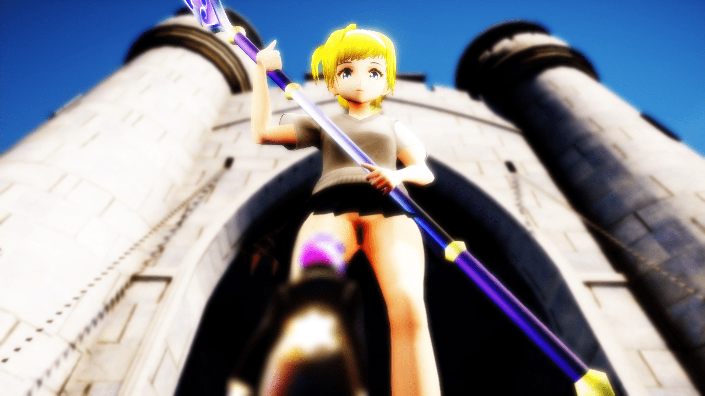
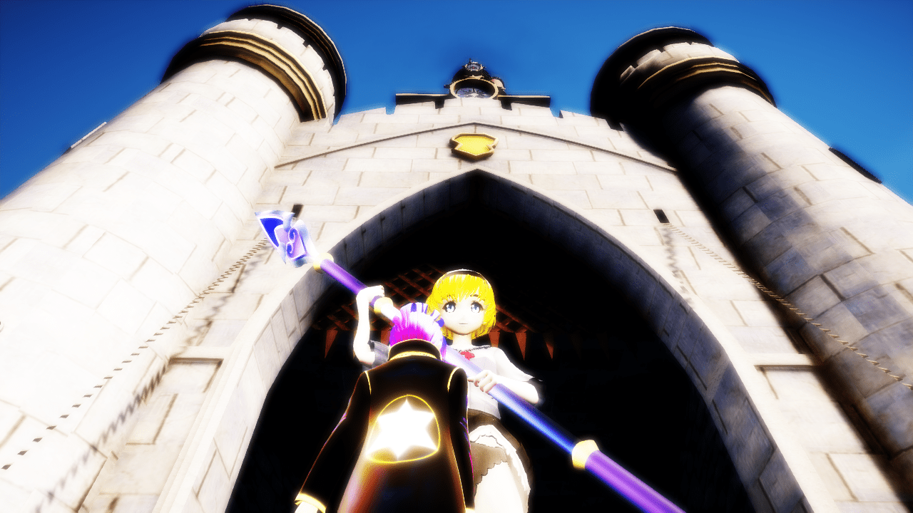
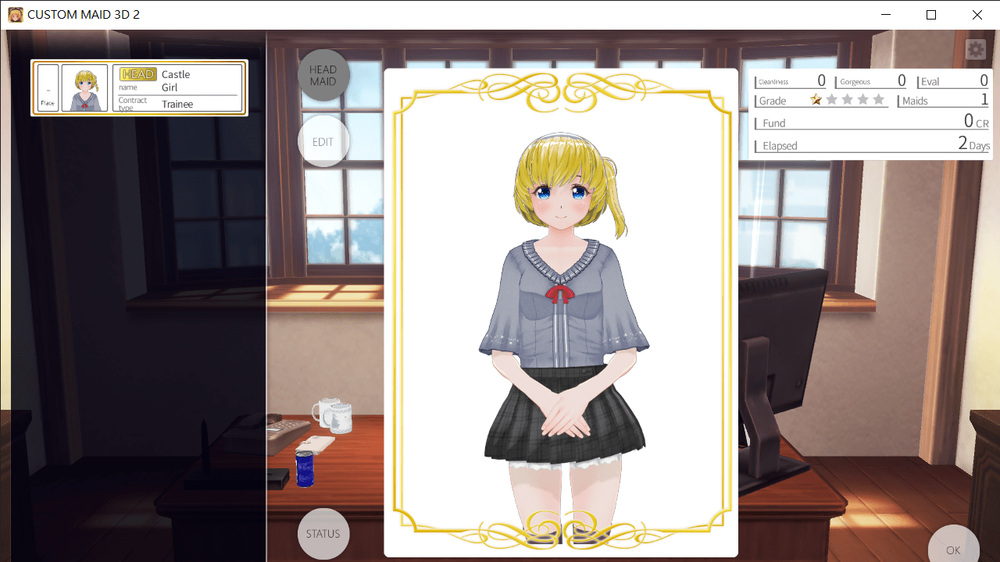

# 那个 我冒个泡 收集点意见 顺便发个超短视频

作者：(别）看我的

TID：31566

<title>1</title> <link href="../Styles/Style.css" type="text/css" rel="stylesheet">

# 1

大家好
我是之前稍微活跃了一点 然后又潜水了的
制图萌新 捏脸萌新 程序萌新 游戏制作萌新 总之什么技能树都是萌新的萌新
这次又来收集点意见

最近我开始掌握了CM3D2这门绝活（x）

感觉做出来的模型比起Vroid更加精致
因为Vroid毕竟是拿来做Vtuber的 下半身真的粗糙的不行
连脚趾头都分不开
腿部的连接也很奇怪

而CM3D2的模型天然自带阴道 屁眼 还可以开合的
而且 大腿啊 白丝啊 黑丝啊 鞋子啊 都可以分开给Material
感觉更棒了

但是我已经用Vroid的建模做了一点点动画了
现在就有点纠结
到底以后的视频 是该直接全换CM3D2的建模
还是说 CM3D2 和 Vroid 交替使用？
毕竟我觉得只论颜值 好像Vroid略胜一筹
但是如果涉及到色色的场面 或者POV 应该是CM3D2好一点的
所以想问问你们意见
你们会介意我在游戏里一直换模型吗？

**这是Vroid建模**
<ignore_js_op>

**Original.bmp** *(3.52 MB, 下載次數: 0)*

[下載附件](forum.php?mod=attachment&aid=OTA2MDd8ZDdjMmY4OWV8MTY3NDA2OTU5NnwxODIzMHwzMTU2Ng%3D%3D&nothumb=yes)

2021-8-27 22:44 上傳

可以见到下体处理非常糟糕...
不过脸我觉得好看（毕竟是我自己捏出来的亲女儿）

**这是CM3D2建模**
<ignore_js_op>

**CM3D2.bmp** *(3.52 MB, 下載次數: 0)*

[下載附件](forum.php?mod=attachment&aid=OTA2MDh8OWI3NjI0YjV8MTY3NDA2OTU5NnwxODIzMHwzMTU2Ng%3D%3D&nothumb=yes)

2021-8-27 22:44 上傳

（抱歉 角度有点差 我忘了存档啊啊啊啊）（就当是拿角度守护我女儿的小裤裤吧）
脸有点难看
可能是因为眼睛稍微有点太大了
但是还是能看到大腿 小裤裤之类的比Vroid好很多了
眼睛我是故意把Vroid建模搬过来 所以可能怪怪的
如果她在原本的CM3D2是这样的
<ignore_js_op>

**CUSTOM MAID 3D 2 27_8_2021 22_36_59.png** *(856.21 KB, 下載次數: 0)*

[下載附件](forum.php?mod=attachment&aid=OTA2MDl8ZTNmYmNmMjN8MTY3NDA2OTU5NnwxODIzMHwzMTU2Ng%3D%3D&nothumb=yes)

2021-8-27 22:45 上傳

所以 现在应该怎么做好呢？ 拜托给点意见吧

还有 预告一下
我越是写游戏剧本 越觉得自己文笔好差哦...
他日游戏完成（不知何年何月）
封测的时候如果有大佬能帮我润色一下文本就好了

最后发个超短视频吧 当作感谢一下看到这里的奖励 不过不要有太大期望就是了ww
<ignore_js_op> [Castle.Deathstomp.webm](forum.php?mod=attachment&aid=OTA2MTB8YjZhNzY4NTZ8MTY3NDA2OTU5NnwxODIzMHwzMTU2Ng%3D%3D) *(283.45 KB, 下載次數: 1)* 2021-8-27 22:45 上傳點擊文件名下載附件

<title>2</title> <link href="../Styles/Style.css" type="text/css" rel="stylesheet">

# 2

我感觉吧 整体模型来说CM3D2体验更好 毕竟身体带锯齿的话 瞬间就没兴趣了 不过如果在做上半身互动 比如桌子上游戏这种 用Vroid建模会更好 <title>3</title> <link href="../Styles/Style.css" type="text/css" rel="stylesheet">

# 3

很好奇Vroid图片奇怪的发光效果是怎么回事 <title>4</title> <link href="../Styles/Style.css" type="text/css" rel="stylesheet">

# 4

> [Lcxzyr 發表於 2021-8-28 12:07](https://giantessnight.cf/gnforum2012/forum.php?mod=redirect&goto=findpost&pid=477868&ptid=31566)
> 很好奇Vroid图片奇怪的发光效果是怎么回事

你是说VROID在物品周围的那个淡淡的光圈吗?
那个应该是我Selfoverlay和Diffusion开太大了
<title>5</title> <link href="../Styles/Style.css" type="text/css" rel="stylesheet">

# 5

> [Lcxzyr 發表於 2021-8-28 12:07](https://giantessnight.cf/gnforum2012/forum.php?mod=redirect&goto=findpost&pid=477868&ptid=31566)
> 很好奇Vroid图片奇怪的发光效果是怎么回事

追问一下 你是喜欢还是不喜欢那个发光效果?
<title>6</title> <link href="../Styles/Style.css" type="text/css" rel="stylesheet">

# 6

> [(别）看我的 發表於 2021-8-28 14:06](https://giantessnight.cf/gnforum2012/forum.php?mod=redirect&goto=findpost&pid=477884&ptid=31566)
> 追问一下 你是喜欢还是不喜欢那个发光效果?

说实话看起来怪怪的，毕竟人的表面应该是漫反射，除非在极强光线的照射下，否则不应该出现如此强烈的反光。 <title>7</title> <link href="../Styles/Style.css" type="text/css" rel="stylesheet">

# 7

> [Lcxzyr 發表於 2021-8-28 14:47](https://giantessnight.cf/gnforum2012/forum.php?mod=redirect&goto=findpost&pid=477890&ptid=31566)
> 说实话看起来怪怪的，毕竟人的表面应该是漫反射，除非在极强光线的照射下，否则不应该出现如此强烈的反光 ...

明白了
谢谢大佬提醒啊
我再修改一下看看
<title>8</title> <link href="../Styles/Style.css" type="text/css" rel="stylesheet">

# 8

> [Lcxzyr 發表於 2021-8-28 14:47](https://giantessnight.cf/gnforum2012/forum.php?mod=redirect&goto=findpost&pid=477890&ptid=31566)
> 说实话看起来怪怪的，毕竟人的表面应该是漫反射，除非在极强光线的照射下，否则不应该出现如此强烈的反光 ...

找到了
是Diffusion 的锅
修复之后好多了
感谢大佬
<title>9</title> <link href="../Styles/Style.css" type="text/css" rel="stylesheet">

# 9

> [(别）看我的 發表於 2021-8-28 23:22](https://giantessnight.cf/gnforum2012/forum.php?mod=redirect&goto=findpost&pid=477953&ptid=31566)
> 找到了
> 是Diffusion 的锅
> 修复之后好多了

修复问题总是令人高兴 （ '▿ ' ）</ignore_js_op></ignore_js_op></ignore_js_op></ignore_js_op>