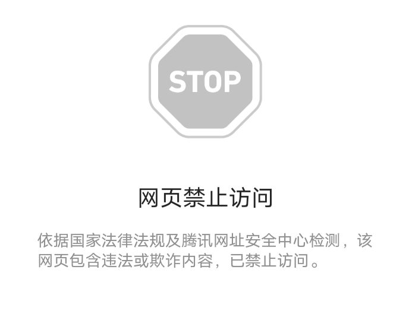

# 那个VPixiv网站怎么关了？？还有什么可以免费看的地方了吗

作者：lovett

TID：34027

<title>1</title> <link href="../Styles/Style.css" type="text/css" rel="stylesheet">

# 1

之前一直都看那个vPixiv的，还以为服务器维修，没想到网站直接404了，诸位坛友们可有其他渠道之类的？我知道那个kemono 什么的可以看patreon付费的，但还有没有什么网站可以免费看Pixiv付费的？
<title>2</title> <link href="../Styles/Style.css" type="text/css" rel="stylesheet">

# 2

vpixiv盗版被日本作者发现了，集体咏唱“魔法咒语”干倒了 <title>3</title> <link href="../Styles/Style.css" type="text/css" rel="stylesheet">

# 3

*本帖最後由 NPC23336666 於 2022-9-2 12:20 編輯*

> [开朗的地缚灵 發表於 2022-9-2 12:14](https://giantessnight.cf/gnforum2012/forum.php?mod=redirect&goto=findpost&pid=514511&ptid=34027)
> vpixiv盗版被日本作者发现了，集体咏唱“魔法咒语”干倒了

呃，一个星期前还能上的，那如果风头过了，这个网站还能恢复运营吗？我还是比较关心的
<ignore_js_op>

**IMG_20220902_121759.jpg** *(54.51 KB, 下載次數: 0)*

[下載附件](forum.php?mod=attachment&aid=OTg5ODR8YzkwYjgwMzB8MTY3NDA2NTMxNnwxODIzMHwzNDAyNw%3D%3D&nothumb=yes)

2022-9-2 12:19 上傳

现在一打开，就是这样，不仅404，好像网站就没了

好多资源早知道就保存下来了，几天没上网站就没了，真的哭死了我

<title>4</title> <link href="../Styles/Style.css" type="text/css" rel="stylesheet">

# 4

看到中意的资源没及时保存，血亏，还有那个kemono好像只能看到几个月前的作品。。。没有vPixiv那样即时更新，什么付费的都可以了，真的可惜了 那样个网站，我还充了五十块钱 <title>5</title> <link href="../Styles/Style.css" type="text/css" rel="stylesheet">

# 5

我第一次听说过这个网站。看名字是P站的盗版？ <title>6</title> <link href="../Styles/Style.css" type="text/css" rel="stylesheet">

# 6

*本帖最後由 CMSSserver 於 2022-9-2 12:47 編輯*

[日本](https://game.udn.com/game/tag/%E6%97%A5%E6%9C%AC)最大社群網站 Twitter 今（9/1）天流行趨勢關鍵突然出現「vpixiv」，這個與安利美特旗下藝術交流服務平台 pixiv 相似的詞彙，竟與「*****」「****」等政治敏感詞彙同時出現，讓人不禁一頭霧水，這些東西的關聯性究竟在哪？原來 vpixiv 是一個向 pixiv 「致敬」的鏡像網站，[根據開發者 AWM 透露](https://hostloc.com/thread-1039411-1-1.html?fbclid=IwAR0YD7xv7LarX8Jci-NS68ggYVeZN1QFiTig8IKURy7Bt35xMNjtODXmcD0)，該網站提供了 pixiv（後稱 P 站避免混淆）平台上的插畫、動圖、[漫畫](https://game.udn.com/game/tag/%E6%BC%AB%E7%95%AB)與小說等等創作內容，還具備 P 站原有的查詢與瀏覽功能，收錄的內容還會「實時更新」，講難聽一點，其實就是抄襲 P 站，連內容都無情地即時同步搬運。該網站開發者 AWM 最後公告更新時間[在 7 月 24 日](https://hostloc.com/thread-1051157-1-1.html?fbclid=IwAR3LAptSVfUL-WJi48pl2gjU6HoFk8PZtcdz4WLUNtGso9LonKHaKkmq8gw)，即便之後就沒有消息，但根據[中國](https://game.udn.com/game/tag/%E4%B8%AD%E5%9C%8B)網友反饋，該網站與之前存在過的搬運網 pixivc 類似，只是前者沒有開源，AWM 則表示等使用者系統做出來才考慮開源，而自己開發的 vpixiv「屏蔽了 R18 與敏感內容」，明顯是為了規避網路[審查](https://game.udn.com/game/tag/%E5%AF%A9%E6%9F%A5)。這個搬運 P 站的平台持續營運，至今終於被日本藝術創作社群發現，並在網路上炸開來。很多創作者紛紛驚覺原創的作品被複製，甚至明明沒有在 vpixiv 註冊，該網站卻出現帳號 ID 與自我介紹一模一樣的帳號。其實就像 [vpixiv 站長 AWM](https://hostloc.com/home.php?mod=space&uid=53451)說的，這是一個鏡像網站（mirror sites），根據我國國家圖書館資料，鏡像網站是一個專門複製及維護另一常用網站的內容與檔案，以加速擴大其資源的利用的伺服器，以減少對國際資料傳輸的需求。而當日本創作者發現自己在 P 站標籤 18 禁的作品沒有同步出現 vpixiv，他們便想出一個方法：在個人介紹或標籤放入「魔法咒語」，也就是敏感關鍵字，包括*****、****、***、**等等，這個方法十分有效，「就目前來看，vpixiv 本身伺服器失聯是真的，但不知是否臨時或之後會起死回生，或是天安門事件的 TAG 會繼續起作用。」對於中國網友來說，免去用 VPN 翻牆瀏覽境外網站的服務固然方便，但部分網友也意識到侵權疑慮，在分享這類資源的同時，也害怕吸引更多人使用而增加關站風險，[「還是小範圍知道最好，祝大家用得開心。」](https://2huoqingnian.com/?id=3238)面對 vpixiv 一度關站，中國網友可能對此習以為常，但日本創作者自然非常高興，Twitter 彙整服務網站 [Togetter 號召創作者群起反制的主題頁面](https://togetter.com/li/1938552)，在短短幾個小時內累積超過 12 萬人次瀏覽。這起日本藝術創作社群與中國鏡站的網路攻防戰掀起軒然大波，即便前者看似獲得短暫勝利，但也有人呼籲 P 站官方能正視這個問題，避免未來再度發生伺服器資料被同步複製、完整流出的事件。本文选自：[https://game.udn.com/game/story/122089/6581419](https://game.udn.com/game/story/122089/6581419)本人对此不作过多评价
<title>7</title> <link href="../Styles/Style.css" type="text/css" rel="stylesheet">

# 7

等等，vPixiv是……把Pixiv主站上的东西直接搬运到国内的一个网站么？

厉害，我竟然完全没听说过。

Kemono姑且是收集收费内容的网站。Pixiv Fanbox也有做。 <title>8</title> <link href="../Styles/Style.css" type="text/css" rel="stylesheet">

# 8

> [触碰不到的笑 發表於 2022-9-2 12:39](https://giantessnight.cf/gnforum2012/forum.php?mod=redirect&goto=findpost&pid=514514&ptid=34027)
> 我第一次听说过这个网站。看名字是P站的盗版？

差不多吧，是一个国人老哥AWM开的网站，不用翻墙，因为服务器就在国内，而且只用花点点钱就可以看遍fanbox上的各种付费作品，我之前就是一直用vPixiv看的，比较方便，没想到直接被强制关了，是真的可惜了
<title>9</title> <link href="../Styles/Style.css" type="text/css" rel="stylesheet">

# 9

VPIXIV的运营方式本质上是在未经他人授权的情况下，搬运他人作品谋取商业利益，你真要看何不自己去Fanbox上赞助作者
<title>10</title> <link href="../Styles/Style.css" type="text/css" rel="stylesheet">

# 10

> [juliazhu1978 發表於 2022-9-2 15:08](https://giantessnight.cf/gnforum2012/forum.php?mod=redirect&goto=findpost&pid=514524&ptid=34027)
> VPIXIV的运营方式本质上是在未经他人授权的情况下，搬运他人作品谋取商业利益，你真要看何不自己去Fanbox上 ...

太贵了兄弟，国人建的vPixiv只用付一点点钱，就能看很多付费的，而且不用翻墙，一个墙外的Pixiv我还要挂VPN而且很卡加载图片很慢，你会选择哪个？
<title>11</title> <link href="../Styles/Style.css" type="text/css" rel="stylesheet">

# 11

> NPC23336666 發表於 2022-9-2 15:47
> 太贵了兄弟，国人建的vPixiv只用付一点点钱，就能看很多付费的，而且不用翻墙，一个墙外的Pixiv我还要挂VP ...

挂vpn要不了多少钱吧，一个月几块钱 <title>12</title> <link href="../Styles/Style.css" type="text/css" rel="stylesheet">

# 12

> [尤格萨隆 發表於 2022-9-2 16:01](https://giantessnight.cf/gnforum2012/forum.php?mod=redirect&goto=findpost&pid=514527&ptid=34027)
> 挂vpn要不了多少钱吧，一个月几块钱

你看fanbox不花钱吗？每个作者都要订阅，为什么不去国人的网站给少量的钱就能看？
<title>13</title> <link href="../Styles/Style.css" type="text/css" rel="stylesheet">

# 13

还有这种事，也就是类似exhentai那样的网站吗 <title>14</title> <link href="../Styles/Style.css" type="text/css" rel="stylesheet">

# 14

*本帖最後由 437619 於 2022-9-2 17:24 編輯*

> [NPC23336666 發表於 2022-9-2 16:09](https://giantessnight.cf/gnforum2012/forum.php?mod=redirect&goto=findpost&pid=514528&ptid=34027)
> 你看fanbox不花钱吗？每个作者都要订阅，为什么不去国人的网站给少量的钱就能看？
> ...

你这说的跟做的怎么完全不一样啊
<title>15</title> <link href="../Styles/Style.css" type="text/css" rel="stylesheet">

# 15

 <ignore_js_op>[6$)4F`UZTFV_V8@$KE%3LDT.png](forum.php?mod=attachment&aid=OTg5ODV8YWRkMGFkNmN8MTY3NDA2NTMyMHwxODIzMHwzNDAyNw%3D%3D&nothumb=yes) *(47.16 KB, 下載次數: 7)*

[下載附件](forum.php?mod=attachment&aid=OTg5ODV8YWRkMGFkNmN8MTY3NDA2NTMyMHwxODIzMHwzNDAyNw%3D%3D&nothumb=yes)

2022-9-2 17:22 上傳  

[4F`UZTFV_V8@$KE%3LDT.png")](javascript:;)</ignore_js_op> <title>16</title> <link href="../Styles/Style.css" type="text/css" rel="stylesheet">

# 16

> 437619 發表於 2022-9-2 17:23
> 你这说的跟做的怎么完全不一样啊

很多原因的，最主要的还是经济原因。。。 <title>17</title> <link href="../Styles/Style.css" type="text/css" rel="stylesheet">

# 17

對於這類網站的運作模式不作任何評價

可是目睹這個個例的遭遇

我心裏只想狂笑
<title>18</title> <link href="../Styles/Style.css" type="text/css" rel="stylesheet">

# 18

可惜知道晚了，不知道上面小说资源多吗 <title>19</title> <link href="../Styles/Style.css" type="text/css" rel="stylesheet">

# 19

看到一半还以为这个是和e站一样的免费分享平台，结果是借此盈利的，那确实该封，只要盈利在国内也是犯法的貌似
日本那边版权意识一向挺强，只希望他们不会哪天魔怔了把e站n站之类的搞掉吧（不过非国内网站几句咒语应该封不掉），果然还是要屯本子到电脑上 <title>20</title> <link href="../Styles/Style.css" type="text/css" rel="stylesheet">

# 20

在其他网站刷到这个贴第一时间前来嘲笑哈哈哈哈哈哈                                                          <title>21</title> <link href="../Styles/Style.css" type="text/css" rel="stylesheet">

# 21

> van♂ 發表於 2022-9-3 09:03
> 看到一半还以为这个是和e站一样的免费分享平台，结果是借此盈利的，那确实该封，只要盈利在国内也是犯法的 ...

哎，那个站长AWM说也不是为了盈利，他说主要还是赚点维护服务器的钱，所以价格定的也非常非常低 <title>22</title> <link href="../Styles/Style.css" type="text/css" rel="stylesheet">

# 22

这不活该吗？偷别人的东西盈利还有理了？ <title>23</title> <link href="../Styles/Style.css" type="text/css" rel="stylesheet">

# 23

> lovett 發表於 2022-9-10 12:02
> 这不活该吗？偷别人的东西盈利还有理了？

那老哥没有盈利，只是单纯赚点服务器运营的钱。。。而且国人不都是这样过来的吗？还在意版权？ <title>24</title> <link href="../Styles/Style.css" type="text/css" rel="stylesheet">

# 24

草，才知道有这么一个站子，还有类似的站子嘛 <title>25</title> <link href="../Styles/Style.css" type="text/css" rel="stylesheet">

# 25

> [NPC23336666 發表於 2022-9-2 12:23](https://giantessnight.cf/gnforum2012/forum.php?mod=redirect&goto=findpost&pid=514513&ptid=34027)
> 看到中意的资源没及时保存，血亏，还有那个kemono好像只能看到几个月前的作品。。。没有vPixiv那样即时更新 ...

你好，请问Kemono网站有网址吗在站里没找到</ignore_js_op>