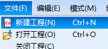
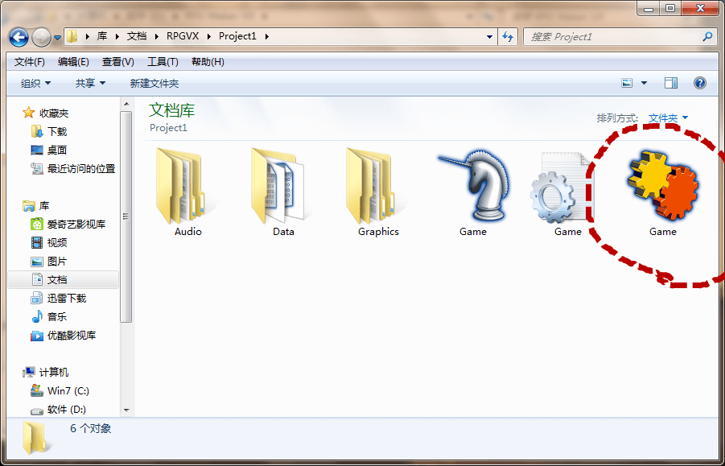
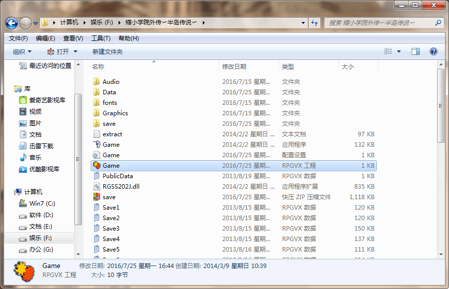
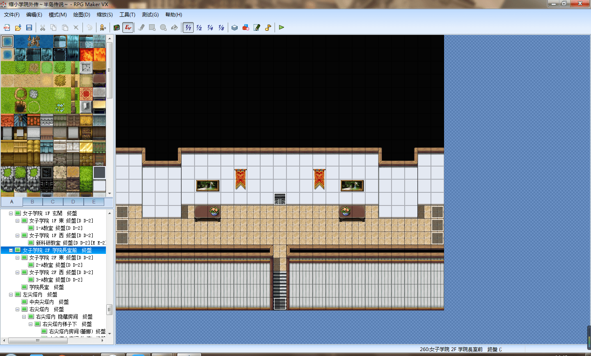
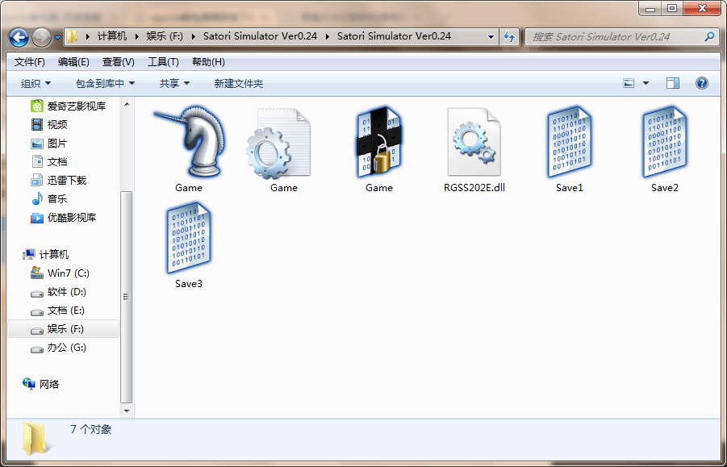
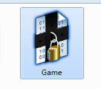
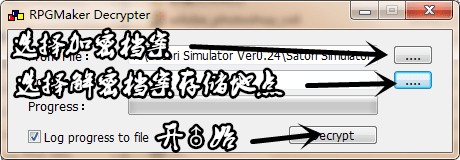
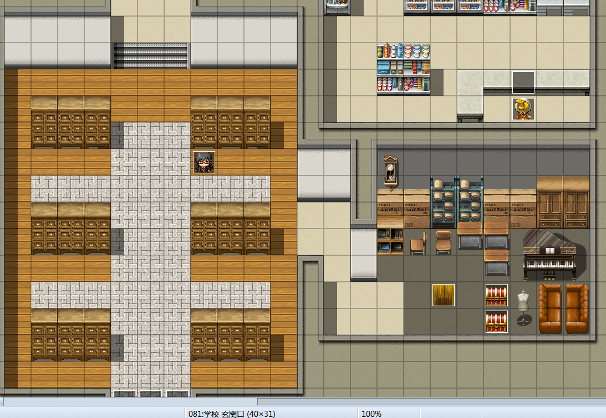
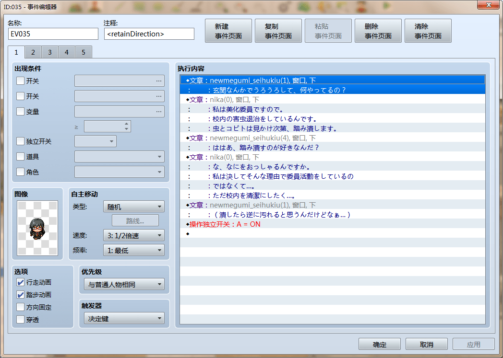
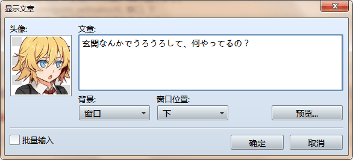

# 那些大大们的RPG游戏是怎么翻译的？

作者：BigDog小海

TID：21501

<title>1</title> <link href="../Styles/Style.css" type="text/css" rel="stylesheet">

# 1

最近有想翻译小型RPG游戏的想法，来学习一点知识。

<title>2</title> <link href="../Styles/Style.css" type="text/css" rel="stylesheet">

# 2

*本帖最後由 zsd 於 2016-8-5 14:58 編輯*

以缩小学院外传为例，现在大部分RPG都是以VX系统制作的

<ignore_js_op>

**搜狗截图16年08月05日1438_1.png** *(11.34 KB, 下載次數: 0)*

[下載附件](forum.php?mod=attachment&aid=NjI2NzN8MzIwMmIxN2N8MTY3NDA2Nzk2MXwxODIzMHwyMTUwMQ%3D%3D&nothumb=yes)

2016-8-5 14:42 上傳

首先你需要一个RPG MARKR VX

打开RMVX，新建一个工程
<ignore_js_op>

**搜狗截图16年08月05日1439_2.png** *(4.81 KB, 下載次數: 0)*

[下載附件](forum.php?mod=attachment&aid=NjI2NzR8ZmQ0MGI4MzJ8MTY3NDA2Nzk2MXwxODIzMHwyMTUwMQ%3D%3D&nothumb=yes)

2016-8-5 14:42 上傳

打开新工程文件夹，找到这个文件
<ignore_js_op>

**搜狗截图16年08月05日1439_3.png** *(185.48 KB, 下載次數: 0)*

[下載附件](forum.php?mod=attachment&aid=NjI2NzV8MTNhYTI0ZmV8MTY3NDA2Nzk2MXwxODIzMHwyMTUwMQ%3D%3D&nothumb=yes)

2016-8-5 14:42 上傳

复制它，把它拖到你要修改的游戏本体的文件夹里
<ignore_js_op>

**搜狗截图16年08月05日1440_4.png** *(176.75 KB, 下載次數: 0)*

[下載附件](forum.php?mod=attachment&aid=NjI2NzZ8Njg5MDU2ZDl8MTY3NDA2Nzk2MXwxODIzMHwyMTUwMQ%3D%3D&nothumb=yes)

2016-8-5 14:42 上傳

打开它
<ignore_js_op>

**搜狗截图16年08月05日1440_5.png** *(457.78 KB, 下載次數: 0)*

[下載附件](forum.php?mod=attachment&aid=NjI2Nzd8MzlmYTZkYTN8MTY3NDA2Nzk2MXwxODIzMHwyMTUwMQ%3D%3D&nothumb=yes)

2016-8-5 14:42 上傳

大功告成
<ignore_js_op>

**QQ图片20160805145249.jpg** *(44.57 KB, 下載次數: 0)*

[下載附件](forum.php?mod=attachment&aid=NjI2Nzh8N2M0YmIxMWZ8MTY3NDA2Nzk2MXwxODIzMHwyMTUwMQ%3D%3D&nothumb=yes)

2016-8-5 14:53 上傳

那么问题又来了

有些游戏文件夹里面的文件寥寥无几，工程文件放进去也没有反应

<ignore_js_op>

**搜狗截图16年08月05日1447_6.png** *(167.33 KB, 下載次數: 0)*

[下載附件](forum.php?mod=attachment&aid=NjI2Nzl8MTJmMTA5N2F8MTY3NDA2Nzk2MXwxODIzMHwyMTUwMQ%3D%3D&nothumb=yes)

2016-8-5 14:53 上傳

【↑这个游戏是[cxcwl163](http://www.giantessnight.com/gnforum2012/home.php?mod=space&uid=728)的模拟觉生喔，绝赞好评，GN电玩区可以下。】

那不是因为这部游戏修炼成功超凡入圣已经不需要任何素材的支持，素材与工程依然还在，只是被锁成了一个加密文件

<ignore_js_op>

**搜狗截图16年08月05日1448_7.png** *(12.63 KB, 下載次數: 0)*

[下載附件](forum.php?mod=attachment&aid=NjI2ODB8Y2RkZDMyZWF8MTY3NDA2Nzk2MXwxODIzMHwyMTUwMQ%3D%3D&nothumb=yes)

2016-8-5 14:53 上傳

这个时候你就需要一个工具
【Rgss3a解包器】

<ignore_js_op> [rgss3ajiebao.rar](forum.php?mod=attachment&aid=NjI2ODJ8NjgxMWEzODJ8MTY3NDA2Nzk2MXwxODIzMHwyMTUwMQ%3D%3D) *(371.09 KB, 下載次數: 8)* 2016-8-5 14:57 上傳點擊文件名下載附件
下载点

使用方法
<ignore_js_op>

**搜狗截图16年08月05日1448_8.png** *(46.78 KB, 下載次數: 0)*

[下載附件](forum.php?mod=attachment&aid=NjI2ODF8M2ZiNWJkZWN8MTY3NDA2Nzk2MXwxODIzMHwyMTUwMQ%3D%3D&nothumb=yes)

2016-8-5 14:53 上傳

解包之后，再按照开头的流程再来一遍

大功告成

<ignore_js_op>

**602f67d98d1001e9e65b98ddbe0e7bec56e797e5.jpg** *(26.9 KB, 下載次數: 0)*

[下載附件](forum.php?mod=attachment&aid=NjI2ODN8MDA4ZDQ0NTR8MTY3NDA2Nzk2MXwxODIzMHwyMTUwMQ%3D%3D&nothumb=yes)

2016-8-5 14:58 上傳

<title>3</title> <link href="../Styles/Style.css" type="text/css" rel="stylesheet">

# 3

> [zsd 發表於 2016-8-5 14:44](https://giantessnight.cf/gnforum2012/forum.php?mod=redirect&goto=findpost&pid=302479&ptid=21501)
> 以缩小学院外传为例，现在大部分RPG都是以VX系统制作的

复制了以后打开什么都没有就只有下面文件名变了。
<title>4</title> <link href="../Styles/Style.css" type="text/css" rel="stylesheet">

# 4

 <ignore_js_op>[QQ图片20160806010719.png](forum.php?mod=attachment&aid=NjI2OTB8ZWI5OTBkNWZ8MTY3NDA2Nzk2MXwxODIzMHwyMTUwMQ%3D%3D&nothumb=yes) *(360.3 KB, 下載次數: 0)*

[下載附件](forum.php?mod=attachment&aid=NjI2OTB8ZWI5OTBkNWZ8MTY3NDA2Nzk2MXwxODIzMHwyMTUwMQ%3D%3D&nothumb=yes)

2016-8-6 01:07 上傳  

</ignore_js_op> <title>5</title> <link href="../Styles/Style.css" type="text/css" rel="stylesheet">

# 5

> [BigDog小海 發表於 2016-8-6 01:08](https://giantessnight.cf/gnforum2012/forum.php?mod=redirect&goto=findpost&pid=302544&ptid=21501)
> 复制了以后打开什么都没有就只有下面文件名变了。

我顺序弄反了。。。2333
<title>6</title> <link href="../Styles/Style.css" type="text/css" rel="stylesheet">

# 6

> [zsd 發表於 2016-8-5 14:44](https://giantessnight.cf/gnforum2012/forum.php?mod=redirect&goto=findpost&pid=302479&ptid=21501)
> 以缩小学院外传为例，现在大部分RPG都是以VX系统制作的

那么游戏文本在哪？解压出来的Data那个文件里吗？

<title>7</title> <link href="../Styles/Style.css" type="text/css" rel="stylesheet">

# 7

一直佩服翻译的人，有特殊爱好还有才华。。。 <title>8</title> <link href="../Styles/Style.css" type="text/css" rel="stylesheet">

# 8

先把RGSS的文件末尾改为AD，再用解包器解包，之后再把那个文件放到游戏目录就可以了 <title>9</title> <link href="../Styles/Style.css" type="text/css" rel="stylesheet">

# 9

> [BigDog小海 發表於 2016-8-6 01:40](https://giantessnight.cf/gnforum2012/forum.php?mod=redirect&goto=findpost&pid=302546&ptid=21501)
> 那么游戏文本在哪？解压出来的Data那个文件里吗？

以这个uru的游戏为例

打开游戏工程之后，你会看到如下界面
<ignore_js_op>

**搜狗截图16年08月06日1830_1.png** *(441.27 KB, 下載次數: 0)*

[下載附件](forum.php?mod=attachment&aid=NjI3MTR8OGU1NzQ5ZGF8MTY3NDA2Nzk2MXwxODIzMHwyMTUwMQ%3D%3D&nothumb=yes)

2016-8-6 18:33 上傳

<ignore_js_op>

**搜狗截图16年08月06日1830_2.png** *(6.32 KB, 下載次數: 0)*

[下載附件](forum.php?mod=attachment&aid=NjI3MTV8YzFkZTEwY2N8MTY3NDA2Nzk2MXwxODIzMHwyMTUwMQ%3D%3D&nothumb=yes)

2016-8-6 18:33 上傳

没有错，这个就是传说中的【事件】

双击打开它，你就可以窥见作者所编辑的这个事件的全貌
<ignore_js_op>

**搜狗截图16年08月06日1830_4.png** *(159.9 KB, 下載次數: 0)*

[下載附件](forum.php?mod=attachment&aid=NjI3MTZ8ZjI1YWY3ZTB8MTY3NDA2Nzk2MXwxODIzMHwyMTUwMQ%3D%3D&nothumb=yes)

2016-8-6 18:33 上傳

有【文章】二字的就是对话文稿了

<ignore_js_op>

**搜狗截图16年08月06日1830_5.png** *(57.9 KB, 下載次數: 0)*

[下載附件](forum.php?mod=attachment&aid=NjI3MTd8MGUwYzllMzJ8MTY3NDA2Nzk2MXwxODIzMHwyMTUwMQ%3D%3D&nothumb=yes)

2016-8-6 18:33 上傳

<ignore_js_op>

**文章.jpg** *(107.57 KB, 下載次數: 0)*

[下載附件](forum.php?mod=attachment&aid=NjI3MTh8MDBiYzMyYzV8MTY3NDA2Nzk2MXwxODIzMHwyMTUwMQ%3D%3D&nothumb=yes)

2016-8-6 18:36 上傳

【可以，这很文章】

至于VX的进一步操作方法，可以参考这个站点

[http://rm.66rpg.com/misc.php?mod=faq&action=faq&id=2](http://rm.66rpg.com/misc.php?mod=faq&action=faq&id=2)
<title>10</title> <link href="../Styles/Style.css" type="text/css" rel="stylesheet">

# 10

> [zsd 發表於 2016-8-6 18:37](https://giantessnight.cf/gnforum2012/forum.php?mod=redirect&goto=findpost&pid=302655&ptid=21501)
> 以这个uru的游戏为例
> 
> 打开游戏工程之后，你会看到如下界面

谢谢您的细心指导！要20字符才能发出去。。。</ignore_js_op></ignore_js_op></ignore_js_op></ignore_js_op></ignore_js_op></ignore_js_op></ignore_js_op></ignore_js_op></ignore_js_op></ignore_js_op></ignore_js_op></ignore_js_op></ignore_js_op></ignore_js_op></ignore_js_op></ignore_js_op>