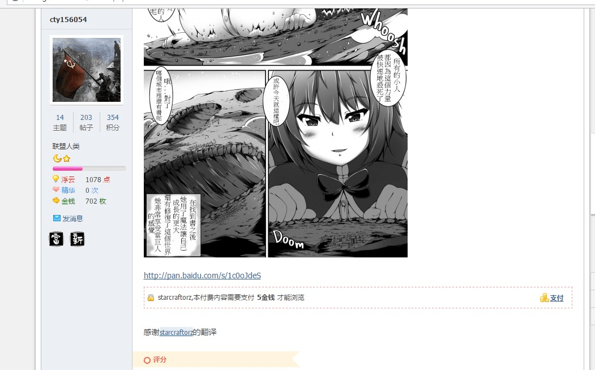

# 鄭重警告盜圖者自己來自首，否則查明會找管理員處理

作者：maker13

TID：20221

<title>1</title> <link href="../Styles/Style.css" type="text/css" rel="stylesheet">

# 1

*本帖最後由 starcraftorz 於 2015-12-2 18:42 編輯*

今天去逛隔壁棚有點傻眼，光明正大的拿別人的東西來賣錢
那我也不知道說什麼好，只是我不希望我弄出來的東西被別人拿去賣
反正都這麼囂張了，那我也去亂搞算了(?)
<ignore_js_op>

**999999.jpg** *(128.92 KB, 下載次數: 1)*

[下載附件](forum.php?mod=attachment&aid=NTY3Njl8YTdiMzBkZDF8MTY3NDA2ODg4MXwxODIzMHwyMDIyMQ%3D%3D&nothumb=yes)

2015-12-2 18:20 上傳

反正我也懶的說了，誰自己盜的自己出來自首，我也不是很在乎，只是不打招呼就擅自拿去賣這一點我實在非常不爽你最好趁道歉可以解決以前自己來私下聊
不然不自首被我抓到一定找管理員刪你帳號

<title>2</title> <link href="../Styles/Style.css" type="text/css" rel="stylesheet">

# 2

那什么缩小女论坛吗    从来没去过  我们这儿如果说什么资源在那边我也懒得去   觉得肯定不合我口味 <title>3</title> <link href="../Styles/Style.css" type="text/css" rel="stylesheet">

# 3

刚想说LZ这个是发布在E站上的，结果一看E站的发布者就是作者本人 <title>4</title> <link href="../Styles/Style.css" type="text/css" rel="stylesheet">

# 4

 那边老是在做这种事的。。。 <title>5</title> <link href="../Styles/Style.css" type="text/css" rel="stylesheet">

# 5

还好我并不能进入漫画分享区，（哈哈，被劝退QQ的台湾同好，你好） <title>6</title> <link href="../Styles/Style.css" type="text/css" rel="stylesheet">

# 6

隔壁有不少都是这边搬过去的 <title>7</title> <link href="../Styles/Style.css" type="text/css" rel="stylesheet">

# 7

.
這種事情多了，之前C88的時候辦團購，有順便賣過舊刊的電子檔。
大約一個月之後，全都被貼到E紳士上面。
而且E紳士的圖源也是轉貼的，追查之後才發覺，更早之前就已經被貼在某些分享本子的論壇上。
所以說這種事情根本是避免不了的。 <title>8</title> <link href="../Styles/Style.css" type="text/css" rel="stylesheet">

# 8

又是這種無端轉載啊
連個招呼都不打
又不是他漢化的
連個地址也不放

實在氣不過的話
暫時就不要漢化了
漢化了還會被人拿走
就不信沒人漢化之後
對面能有自己的漢化出來 <title>9</title> <link href="../Styles/Style.css" type="text/css" rel="stylesheet">

# 9

那位同好是不是因为新来的不懂规矩啊？ <title>10</title> <link href="../Styles/Style.css" type="text/css" rel="stylesheet">

# 10

这个我见了，也许有的新人不知道呢，我刚入行的时候就不动，转卖了被举报了 <title>11</title> <link href="../Styles/Style.css" type="text/css" rel="stylesheet">

# 11

我挺好奇又是哪一位做的这种事 <title>12</title> <link href="../Styles/Style.css" type="text/css" rel="stylesheet">

# 12

为什么不直接联系管理员删他账号，这帖子我看根本没必要发 <title>13</title> <link href="../Styles/Style.css" type="text/css" rel="stylesheet">

# 13

楼主可以联系那边的管理员删掉吧。嗯，这样金币或许也能退回来？ <title>14</title> <link href="../Styles/Style.css" type="text/css" rel="stylesheet">

# 14

别人的付出凭什么你拿出去卖呢？？ 这种人确实素质太低劣了。。。 <title>15</title> <link href="../Styles/Style.css" type="text/css" rel="stylesheet">

# 15

有点意思=0 ===================================== <title>16</title> <link href="../Styles/Style.css" type="text/css" rel="stylesheet">

# 16

那边的小白和新人比较多，很多都是贴吧的伸手党过去的，素质低很正常 <title>17</title> <link href="../Styles/Style.css" type="text/css" rel="stylesheet">

# 17

我写的《巨大的美狄亚》貌似也被拿去卖了 <title>18</title> <link href="../Styles/Style.css" type="text/css" rel="stylesheet">

# 18

转载前起码通知一下原作者啊，如果原作者不同意就不要转了啊。隔壁也是各种搬，肯定有很多没有授权的 <title>19</title> <link href="../Styles/Style.css" type="text/css" rel="stylesheet">

# 19

原来还有盗图这么一说啊。。。图有什么好偷的啊 <title>20</title> <link href="../Styles/Style.css" type="text/css" rel="stylesheet">

# 20

表示应该把这样的人踩扁才对。。。

不过说句题外话，，楼楼你的原贴在哪里，好像观摩一下。。（这个是？翻译？还是自己做的呢。。总之，先膜拜）</ignore_js_op>