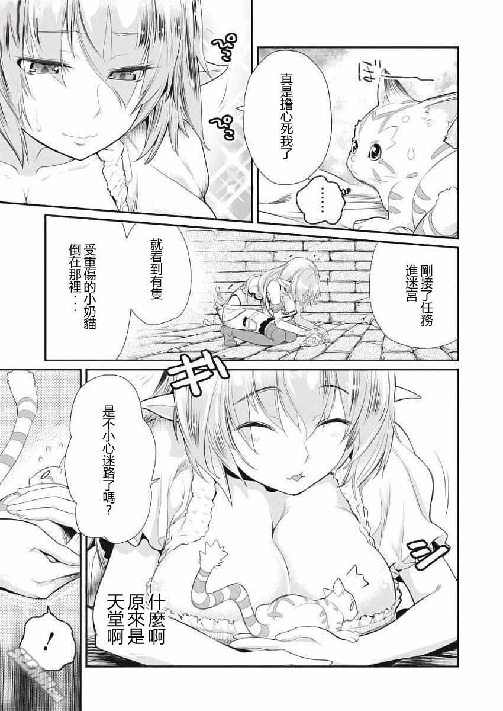
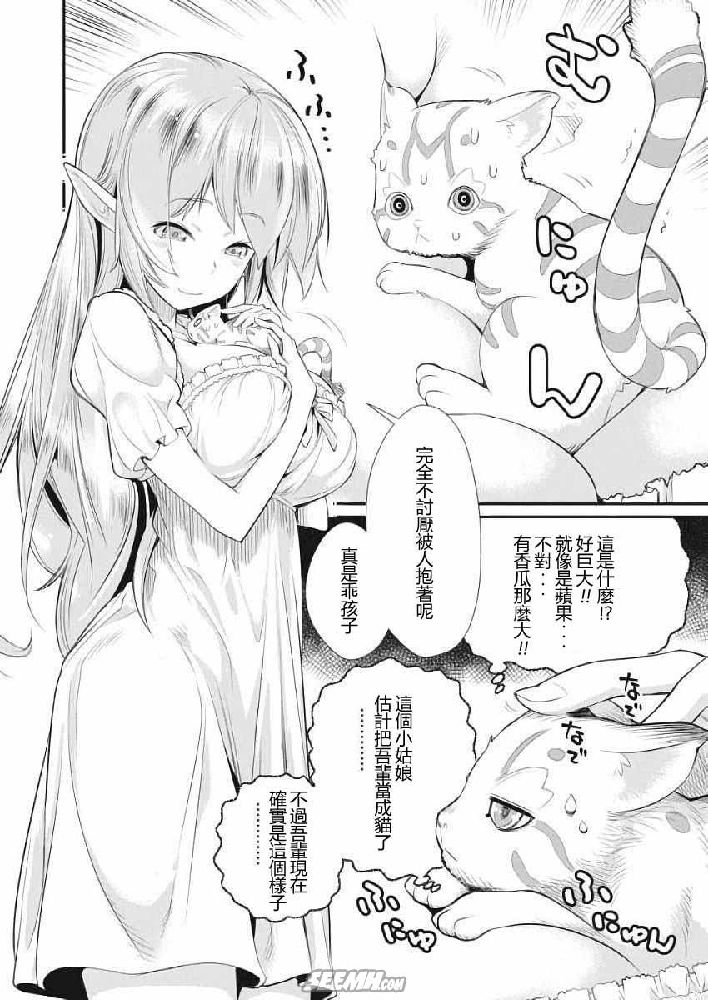
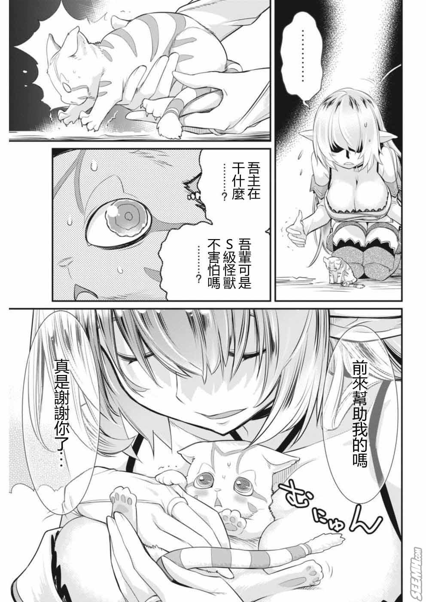
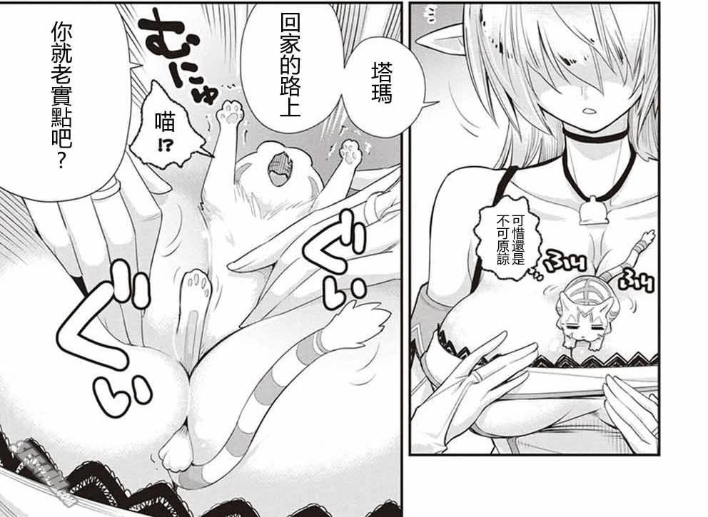
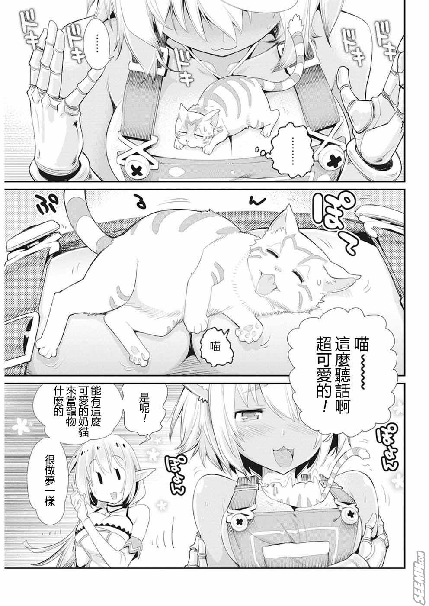

# 重生的貓騎士與精靈孃的日常

作者：哇哩咧

TID：26033

<title>1</title> <link href="../Styles/Style.css" type="text/css" rel="stylesheet">

# 1

轉生成S級魔獸幼獸的主角與巨乳精靈女主人
<ignore_js_op>

**e05c562e998824b51de745c76709015c.jpg** *(140.22 KB, 下載次數: 0)*

[下載附件](forum.php?mod=attachment&aid=NzUzMjR8YzRkNTk4MDF8MTY3NDA2Njk2OXwxODIzMHwyNjAzMw%3D%3D&nothumb=yes)

2018-10-30 21:43 上傳

外觀是巴掌大的小奶貓
<ignore_js_op>

**5fbebc2392a305be2fd510c99388a17a.jpg** *(133.44 KB, 下載次數: 0)*

[下載附件](forum.php?mod=attachment&aid=NzUzMjV8ODUzNWM0MTJ8MTY3NDA2Njk2OXwxODIzMHwyNjAzMw%3D%3D&nothumb=yes)

2018-10-30 21:43 上傳

<ignore_js_op>

**d35ab6885f660d0556e1d1b1f036e407.jpg** *(156.81 KB, 下載次數: 0)*

[下載附件](forum.php?mod=attachment&aid=NzUzMjZ8N2U5NDQ4YjN8MTY3NDA2Njk2OXwxODIzMHwyNjAzMw%3D%3D&nothumb=yes)

2018-10-30 21:43 上傳

外出常駐席
<ignore_js_op>

**9dd9c26f50104b82c137dd1bb1bbe547.jpg** *(106.1 KB, 下載次數: 0)*

[下載附件](forum.php?mod=attachment&aid=NzUzMjd8NmFjZWQ5YzJ8MTY3NDA2Njk2OXwxODIzMHwyNjAzMw%3D%3D&nothumb=yes)

2018-10-30 21:48 上傳

女主虎人鐵匠好友
<ignore_js_op>

**d74634edbe1fe43660b36e63e93c4742.jpg** *(168.49 KB, 下載次數: 0)*

[下載附件](forum.php?mod=attachment&aid=NzUzMjh8MzBiYmU1ZjB8MTY3NDA2Njk2OXwxODIzMHwyNjAzMw%3D%3D&nothumb=yes)

2018-10-30 21:54 上傳

教練，我想當貓

[https://tw.manhuagui.com/comic/29845/](https://tw.manhuagui.com/comic/29845/)

<title>2</title> <link href="../Styles/Style.css" type="text/css" rel="stylesheet">

# 2

哦⊙∀⊙！是这部漫画，想看的可以在动漫之家可以看见。 <title>3</title> <link href="../Styles/Style.css" type="text/css" rel="stylesheet">

# 3

没有猫的视角实在没多大的感觉  <title>4</title> <link href="../Styles/Style.css" type="text/css" rel="stylesheet">

# 4

感觉上算是擦边的类型吧</ignore_js_op></ignore_js_op></ignore_js_op></ignore_js_op></ignore_js_op>