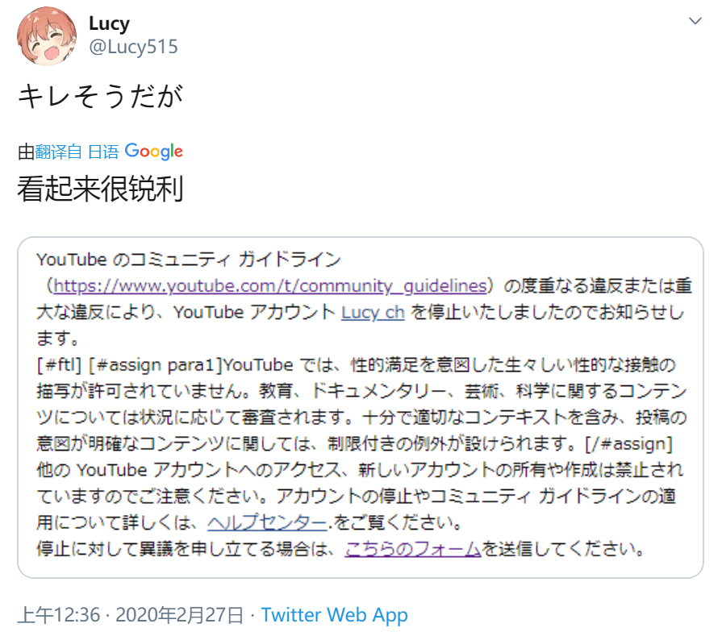
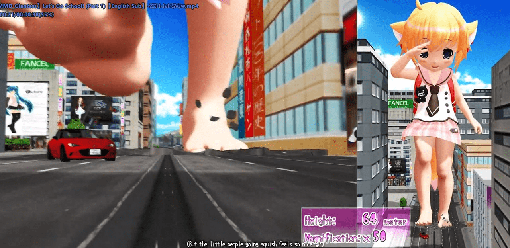

# 长年在关注列表吃灰的Youtuber终于发了新GTS MMD了

作者：duosao

TID：28154

<title>1</title> <link href="../Styles/Style.css" type="text/css" rel="stylesheet">

# 1

链接：[https://www.youtube.com/watch?v=ZZH-IvHSVJw](https://www.youtube.com/watch?v=ZZH-IvHSVJw)
这位大神上次发GTS影片好像都是一年前的事了
而且记得没错的话他貌似改过名字
当时还以为他要彻底放弃做GTS了……

如今能看到他做的新视频，我就心满意足了
看了Part 1还挺不错的，默默期待下Part 2
<title>2</title> <link href="../Styles/Style.css" type="text/css" rel="stylesheet">

# 2

有点意思，感谢楼主的分享 <title>3</title> <link href="../Styles/Style.css" type="text/css" rel="stylesheet">

# 3

siro ut啊，16年的时候消失了好久，回来之后经常上传一些音游，偶尔会做mmd，之前好像还教过如月ネネ，更新的速度也慢了好多
<title>4</title> <link href="../Styles/Style.css" type="text/css" rel="stylesheet">

# 4

以前换过好几回名字：
Siro_UT
sabun_artwork
如月ネネ
....
twitter也删了好几回

现在的twitter是这个：
[https://twitter.com/Lucy515](https://twitter.com/Lucy515)

关于这个视频倒是一段时间以前就说过（你可以看一下twitter上的WIP），不过说事务繁忙所以也没有确定的更新日期。 <title>5</title> <link href="../Styles/Style.css" type="text/css" rel="stylesheet">

# 5

ohh,坏消息，刚刚点开他的youtube主业发现被封了
<title>6</title> <link href="../Styles/Style.css" type="text/css" rel="stylesheet">

# 6

> [xfsarft 發表於 2020-2-27 00:28](https://giantessnight.cf/gnforum2012/forum.php?mod=redirect&goto=findpost&pid=427984&ptid=28154)
> ohh,坏消息，刚刚点开他的youtube主业发现被封了

wow, 刚看见那个视频就觉得虽然看上去完全是safe rating，根据youtube那个尿性可能还是有点危险，赶紧把他整个channel都备份了一下。

还好还好   (;￣▽￣)
<title>7</title> <link href="../Styles/Style.css" type="text/css" rel="stylesheet">

# 7

WTF，视频怎么就没了？？？？？
WTF，怎么视频都没了？？？？？
妈卖批我最新那期还没备份呢怎么这么快就没了？？？？？ <title>8</title> <link href="../Styles/Style.css" type="text/css" rel="stylesheet">

# 8

我操……真的是服了……
<title>9</title> <link href="../Styles/Style.css" type="text/css" rel="stylesheet">

# 9

 <ignore_js_op>[FFFFFFFFFFFF.png](forum.php?mod=attachment&aid=ODE2MjZ8MzJlODE4ODF8MTY3NDA2NjU0N3wxODIzMHwyODE1NA%3D%3D&nothumb=yes) *(310 KB, 下載次數: 1)*

[下載附件](forum.php?mod=attachment&aid=ODE2MjZ8MzJlODE4ODF8MTY3NDA2NjU0N3wxODIzMHwyODE1NA%3D%3D&nothumb=yes)

2020-2-27 00:54 上傳  

</ignore_js_op> <title>10</title> <link href="../Styles/Style.css" type="text/css" rel="stylesheet">

# 10

> [Cirno7Lover 發表於 2020-2-27 00:52](https://giantessnight.cf/gnforum2012/forum.php?mod=redirect&goto=findpost&pid=427992&ptid=28154)
> WTF，视频怎么就没了？？？？？
> WTF，怎么视频都没了？？？？？
> 妈卖批我最新那期还没备份呢怎么这么快就没 ...

twitter上也能看，不过youtube那个是高画质60fps，我来发一下吧

[https://mega.nz/#!VN0FmYDR!ywR9RlzFjueKbs9yMlkbb7XgMSjqzdrs0Q1o3u-dB_c](https://mega.nz/#!VN0FmYDR!ywR9RlzFjueKbs9yMlkbb7XgMSjqzdrs0Q1o3u-dB_c)

password: bibun_kanou

顺便来个预览图：
<ignore_js_op>

**prev.jpg** *(121.46 KB, 下載次數: 0)*

[下載附件](forum.php?mod=attachment&aid=ODE2Mjd8OTQwZmMzM2J8MTY3NDA2NjU0N3wxODIzMHwyODE1NA%3D%3D&nothumb=yes)

2020-2-27 00:58 上傳

<title>11</title> <link href="../Styles/Style.css" type="text/css" rel="stylesheet">

# 11

> [sidefx 發表於 2020-2-27 00:58](https://giantessnight.cf/gnforum2012/forum.php?mod=redirect&goto=findpost&pid=427995&ptid=28154)
> twitter上也能看，不过youtube那个是高画质60fps，我来发一下吧
> 
> https://mega.nz/#!VN0FmYDR!ywR9RlzFju ...

QAQ 由衷感谢……就是不知道他还会不会在油管发视频了
<title>12</title> <link href="../Styles/Style.css" type="text/css" rel="stylesheet">

# 12

> [Cirno7Lover 發表於 2020-2-27 01:02](https://giantessnight.cf/gnforum2012/forum.php?mod=redirect&goto=findpost&pid=427997&ptid=28154)
> QAQ 由衷感谢……就是不知道他还会不会在油管发视频了

没事，办法总会有的。Youtube不行的话还有Iwara之类的。

不过youtube对underage真的严，完全non-sexual都能ban。
像以前TinySonix那样的也会被ban，当时我就觉得很惊讶。
<title>13</title> <link href="../Styles/Style.css" type="text/css" rel="stylesheet">

# 13

> [sidefx 發表於 2020-2-27 01:06](https://giantessnight.cf/gnforum2012/forum.php?mod=redirect&goto=findpost&pid=428000&ptid=28154)
> 没事，办法总会有的。Youtube不行的话还有Iwara之类的。
> 
> 不过youtube对underage真的严，完全non-sexual ...

……哎，所以这种片子还是设个年龄限制会保险点
油管有时候就是过分焦虑了……
不过先撇开油管不说，这有没有可能是别人举报搞得……
<title>14</title> <link href="../Styles/Style.css" type="text/css" rel="stylesheet">

# 14

5°C也是他吧 我还记得他还在GS发过文 可惜找不到了 <title>15</title> <link href="../Styles/Style.css" type="text/css" rel="stylesheet">

# 15

据说现在youtube会根据观众来ban视频，就是说首先一群用户会被标记为questionable，然后不论视频是什么内容，只要这群人都去看就一律ban。

所以新视频出现的时候访问量上升，是高危时期。

不过我记得上回好像官方说过，整个channel的话这过程一般还是需要人工审核的，就是系统会列出一些可疑的channel然后由人做最终决定。

举报的话，虽然是存在这样的团体，但是我觉得一般动作不会这么快。 <title>16</title> <link href="../Styles/Style.css" type="text/css" rel="stylesheet">

# 16

> [gongzijing65 發表於 2020-2-27 01:24](https://giantessnight.cf/gnforum2012/forum.php?mod=redirect&goto=findpost&pid=428003&ptid=28154)
> 5°C也是他吧 我还记得他还在GS发过文 可惜找不到了

对，有段时间叫 5DC_MMD。

GS的他好像是自己删了，我这里理论上应该有，不过去找需要花点时间。

EX上也有人发过一些他的图：
[https://exhentai.org/g/1028428/c658e6f505/](https://exhentai.org/g/1028428/c658e6f505/)

他youtube上另一个channel还在：
[https://www.youtube.com/channel/UCfPFGuen_VLndCwx5sBNa-g/videos](https://www.youtube.com/channel/UCfPFGuen_VLndCwx5sBNa-g/videos)

<title>17</title> <link href="../Styles/Style.css" type="text/css" rel="stylesheet">

# 17

> [sidefx 發表於 2020-2-27 01:06](https://giantessnight.cf/gnforum2012/forum.php?mod=redirect&goto=findpost&pid=428000&ptid=28154)
> 没事，办法总会有的。Youtube不行的话还有Iwara之类的。
> 
> 不过youtube对underage真的严，完全non-sexual ...

啊，我竟然都不知道这些Youtube之外的网站。

赶快存一存
<title>18</title> <link href="../Styles/Style.css" type="text/css" rel="stylesheet">

# 18

YT基本上就是抓好抓滿呵啦，尤其又因為這部影片的主角部分

這位之前就是5DC_sabunartrworks，中間突然就twitter刪號yt也沒了的

我是有裝IDM，好的影片都會載下來備份，畢竟網路的東西絕對不是永久的 <title>19</title> <link href="../Styles/Style.css" type="text/css" rel="stylesheet">

# 19

> [Nagoya0519 發表於 2020-2-27 10:22](https://giantessnight.cf/gnforum2012/forum.php?mod=redirect&goto=findpost&pid=428020&ptid=28154)
> YT基本上就是抓好抓滿呵啦，尤其又因為這部影片的主角部分
> 
> 這位之前就是5DC_sabunartrworks，中間突然就tw ...

对最后一句深表如同
万一哪天网上共享的资源全没了呢
只不过真没想过刚发布的片子，还不到一天就没了……
这速度未免也太快了些……
<title>20</title> <link href="../Styles/Style.css" type="text/css" rel="stylesheet">

# 20

> [sidefx 發表於 2020-2-27 01:32](https://giantessnight.cf/gnforum2012/forum.php?mod=redirect&goto=findpost&pid=428005&ptid=28154)
> 据说现在youtube会根据观众来ban视频，就是说首先一群用户会被标记为questionable，然后不论视频是什么内容 ...

还有这种操作……我的天哪……
<title>21</title> <link href="../Styles/Style.css" type="text/css" rel="stylesheet">

# 21

油管真是nb嗷，先骗你一手播放量，然后反手一个炼铜封禁，妙啊。 <title>22</title> <link href="../Styles/Style.css" type="text/css" rel="stylesheet">

# 22

这位之前不是还做过一个只出了0.1版的一个游戏么 <title>23</title> <link href="../Styles/Style.css" type="text/css" rel="stylesheet">

# 23

> [duosao 發表於 2020-2-27 13:34](https://giantessnight.cf/gnforum2012/forum.php?mod=redirect&goto=findpost&pid=428033&ptid=28154)
> 这位之前不是还做过一个只出了0.1版的一个游戏么

那个初音游戏吧？
那段时间他本来挺活跃的，后来好象是被Pxch (那个模型的作者) 警告了（那段时间确实是有做explicit的内容），然后twitter就清空了，沉默了好一段时间。

<title>24</title> <link href="../Styles/Style.css" type="text/css" rel="stylesheet">

# 24

昨天刚下完视频就没了，我还想去下作者以前的，然后去推特看了看好像作者又开了个新号，但是找不到以前的那些视频了????
<title>25</title> <link href="../Styles/Style.css" type="text/css" rel="stylesheet">

# 25

链接挂了，我是不是错过了啥</ignore_js_op>