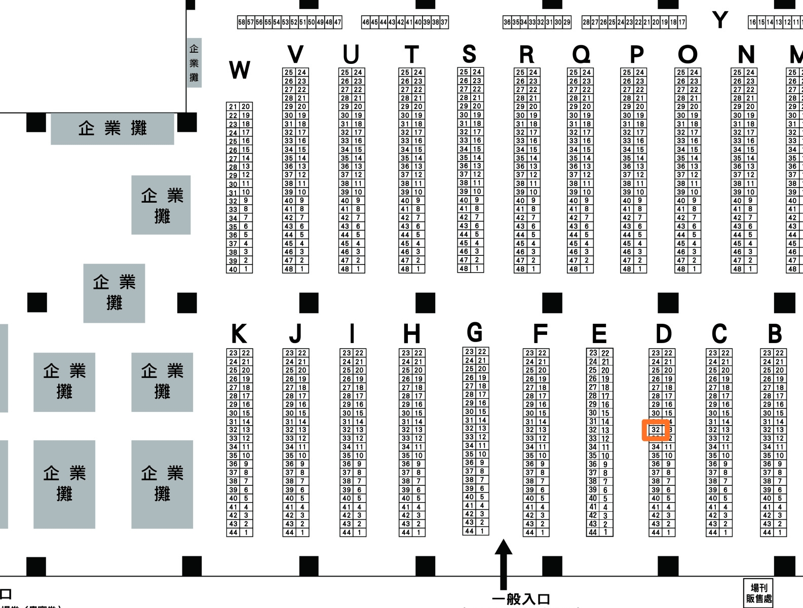

# 開拓動漫季FF36有巨大娘的攤位!!

作者：無邊落木

TID：29128

<title>1</title> <link href="../Styles/Style.css" type="text/css" rel="stylesheet">

# 1

大家好，這裡是無某

8月22日在臺北圓山花博爭豔館舉辦的第36屆開拓動漫祭「FancyFrontier36([官網連結在此](http://www.f-2.com.tw/))」，攤位名「蘿莉豹與犬神戊戌的美好日常」，攤位編號D32，位置如圖：

<ignore_js_op>

**1595522916897.jpg** *(620.6 KB, 下載次數: 0)*

[下載附件](forum.php?mod=attachment&aid=ODQxMjZ8M2IwZmEyOGF8MTY3NDA2NjQwNXwxODIzMHwyOTEyOA%3D%3D&nothumb=yes)

2020-7-25 16:04 上傳

看了下左右的鄰居攤位都是新進的(謎之音:你不也是新進的嗎?)到時候附近應該空曠不會太擠
新刊「在城市尋求眷族的犬年獸神([連結在此](https://giantessnight.com/gnforum2012/forum.php?mod=viewthread&tid=27781&extra=))」和既刊「雲豹甲車如果是個女孩([連結在此](https://giantessnight.com/gnforum2012/forum.php?mod=viewthread&tid=21044&extra=page%3D1))」以及無某，在攤位上恭候舊雨新知們大駕光臨!

已經買過犬神本數位版的，實體本奉送
這年頭還用實體本交流的實在太稀有了

另外也會帶(因為太懶所以大概不會有機會上色的)線稿過去，交換來訪同好的寶貴意見!

歡迎就近有緣的同好來拍打餵食~~

===宣傳結束===

其實這次參展另一個目的是國內市場測試，

上次擺攤，圈內和圈外光顧的比例是1:7，這次封面用了更明確的巨大娘主題梗，攤位介紹也直接打上巨大娘，

看能不能吸引新進，也給後續有想要發展實體本的創作者參考!
<title>2</title> <link href="../Styles/Style.css" type="text/css" rel="stylesheet">

# 2

*本帖最後由 無邊落木 於 2020-7-25 22:24 編輯*

> [田棒棒 發表於 2020-7-25 17:43](https://giantessnight.cf/gnforum2012/forum.php?mod=redirect&goto=findpost&pid=442792&ptid=29128)
> 所以具体有哪些巨大本呢，主要作品名？
> 
> 另外来不及去摊位，作品之后网购会有么？

「在城市尋求眷族的犬年獸神」和「雲豹甲車如果是個女孩」兩本都是巨大本，第一本有數位版。

實體本只有現場有，之後...大概也沒時間弄郵寄了

<title>3</title> <link href="../Styles/Style.css" type="text/css" rel="stylesheet">

# 3

本來就預計要去FF36 希望我能夠在不被朋友發現的情況下買到 <title>4</title> <link href="../Styles/Style.css" type="text/css" rel="stylesheet">

# 4

已經購買過數位版，
同樣身為一個GTS創作者，一定要到場支持的 <title>5</title> <link href="../Styles/Style.css" type="text/css" rel="stylesheet">

# 5

本體大概是沒法過去了，十幾個小時飛機  (; ﾟДﾟ)

到時可能會僱個人 xD <title>6</title> <link href="../Styles/Style.css" type="text/css" rel="stylesheet">

# 6

推 不過書我只敢碰電子版</ignore_js_op>