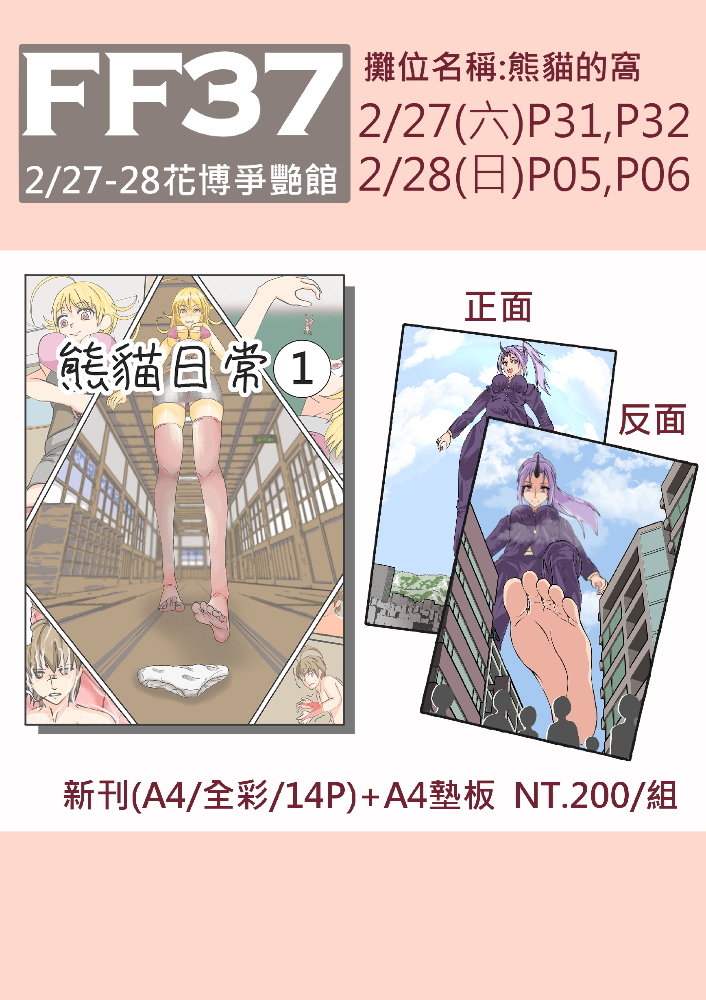

# 開拓動漫季FF37巨大娘的攤位／0301新增通販

作者：d5q25x62

TID：30313

<title>1</title> <link href="../Styles/Style.css" type="text/css" rel="stylesheet">

# 1

*本帖最後由 d5q25x62 於 2021-3-2 00:30 編輯*

大家好阿!我叫熊貓

第一次擺攤,第一次出刊,而且還是自己一個人,實在有點緊張呢

2月27日-28日在臺北圓山花博爭豔館舉辦的第37屆開拓動漫祭

攤位名「熊貓的窩」，攤位編號 2/27(P31,P32) 2/28(P05,P06)

新刊『熊貓日常1』

<ignore_js_op>

**FF37裏2.jpg** *(1.98 MB, 下載次數: 1)*

[下載附件](forum.php?mod=attachment&aid=ODczMzN8OTkxNzE0N2R8MTY3NDA2NjA5M3wxODIzMHwzMDMxMw%3D%3D&nothumb=yes)

2021-2-7 20:42 上傳

新刊試閱的部分可以到我的p站跟巴哈來觀看哦,雖然有點斷斷續續的

[pixiv](https://www.pixiv.net/users/7893543)  

[巴哈姆特](https://home.gamer.com.tw/creationCategory.php?owner=df3531687&c=454072)

===宣傳結束===

新刊的內容大概就吞食跟踩踏之類的,

整個來說口味應該還算蠻清淡的,

應該還不到R18吧,第二章應該會等FF過後在開始畫吧

攤位上還會賣一些跟巨大娘無關的吊飾,所以就不用太怕旁人的眼光拉(應該拉 

對了,到時候[無邊落木](https://giantessnight.com/gnforum2012/home.php?mod=space&uid=144&do=thread&view=me&from=space)大大也會帶他的本本來我的攤位寄賣,有興趣的同好也可以一同購買哦

等FF結束後才會開通販,都是實體本哦,

電子書的部分可能還要等我研究看看到底要怎麼用

---------------------------------------------------------------------------------------------------------------

2021/03/01 電子書通販新增

[Pudu電子書](https://www.pubu.com.tw/ebook/225627)

此電子書刊裡面"沒有"包含實體本所附贈的A4墊板圖哦

有什麼問題歡迎提問 我再看看我能不能解決

<title>2</title> <link href="../Styles/Style.css" type="text/css" rel="stylesheet">

# 2

.
收到，我先寫上我的日程表了。話說FF移師到圓山之後我一次也沒去過.... <title>3</title> <link href="../Styles/Style.css" type="text/css" rel="stylesheet">

# 3

啊台北啊……疫情原因去不了唉……等lz开通电子版的时候我再去支持一下吧这 <title>4</title> <link href="../Styles/Style.css" type="text/css" rel="stylesheet">

# 4

無某會帶本子去現場寄賣支持~!!

雖然說可能人不在攤位上，因為上回自己顧攤顧了一天導致沒買到本子啊這，這次一定要四處搜刮才行

熊貓是難得的實體本公開處刑販售啊，也很好的混在一般向裡面，請大家多多支持喔~

<title>5</title> <link href="../Styles/Style.css" type="text/css" rel="stylesheet">

# 5

> [Dante 發表於 2021-2-7 21:38](https://giantessnight.cf/gnforum2012/forum.php?mod=redirect&goto=findpost&pid=459276&ptid=30313)
> .
> 收到，我先寫上我的日程表了。話說FF移師到圓山之後我一次也沒去過....

啊但大的头像
原来是Rena吗 总算是认出来了
<title>6</title> <link href="../Styles/Style.css" type="text/css" rel="stylesheet">

# 6

汗，好想要，可惜去不了，無邊落木大大的新刊之前也想买，就是买不了（惨） <title>7</title> <link href="../Styles/Style.css" type="text/css" rel="stylesheet">

# 7

> [無邊落木 發表於 2021-2-8 01:43](https://giantessnight.cf/gnforum2012/forum.php?mod=redirect&goto=findpost&pid=459305&ptid=30313)
> 無某會帶本子去現場寄賣支持~!!

麻烦问一下，这次的展会，您的两册实体本都会带去吗，这次有发快递的打算么？

<title>8</title> <link href="../Styles/Style.css" type="text/css" rel="stylesheet">

# 8

*本帖最後由 無邊落木 於 2021-2-20 07:39 編輯*

> [yokoyo 發表於 2021-2-20 00:04](https://giantessnight.cf/gnforum2012/forum.php?mod=redirect&goto=findpost&pid=460533&ptid=30313)
> 麻烦问一下，这次的展会，您的两册实体本都会带去吗，这次有发快递的打算么？
> 
> ...

這次兩冊實體本都會帶去喔

還是以現場為主 <title>9</title> <link href="../Styles/Style.css" type="text/css" rel="stylesheet">

# 9

> [無邊落木 發表於 2021-2-20 02:02](https://giantessnight.cf/gnforum2012/forum.php?mod=redirect&goto=findpost&pid=460545&ptid=30313)
> 這次兩冊實體本都會帶去喔
> 
> 還是以現場為主

这样啊，真希望有一天能亲自去一趟展子把这两本梦寐以求的实体本给带回来
<title>10</title> <link href="../Styles/Style.css" type="text/css" rel="stylesheet">

# 10

*本帖最後由 d5q25x62 於 2021-3-2 00:30 編輯*

2021/03/01 電子書通販新增

[Pudu電子書](https://www.pubu.com.tw/ebook/225627)

此電子書刊裡面"沒有"包含實體本所附贈的A4墊板圖哦

有什麼問題歡迎提問 我再看看我能不能解決</ignore_js_op>