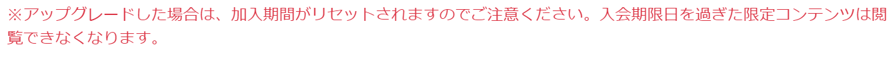

# 關於Fantia一個容易被坑到的細節[更新：部分内容不再屬實]

作者：sidefx

TID：28949

<title>1</title> <link href="../Styles/Style.css" type="text/css" rel="stylesheet">

# 1

*本帖最後由 sidefx 於 2020-9-15 19:33 編輯*

**Fantia**和**Enty**默認都是每個月的訂閲只包含當月的内容，和Patreon還有Fanbox這些不同，這一點相信用過的人都知道。

不過**Fantia**和**Enty**這兩個之間也存在几個比較容易被忽視的區別：

最重要的一個是：

**Fantia**只要是對**當前plan**進行**任何更改**，都會失去之前**全部**已經獲得的内容。
特別需要注意的是這更改不止是**取消**，還包括**降級**甚至是**升級****。**
**[ATTENTION]**
**[****updated:****2020-9-15]**
**剛剛從MUK那裏得知Fantia在****2020.07.28****有更****新，****現在這一點已經不再屬實了。**
**詳情：**[https://spotlight.fantia.jp/news/20200729_planchange](https://spotlight.fantia.jp/news/20200729_planchange)
**之前就覺得那個規則不合理，單純增加了額外的麻煩 XD**
**現在不論是升級還是降級，都不會影響低於當前tier的内容，後面一大段已經沒有意義了。**

以前**Enty**用習慣的人可能會理所當然地覺得"我改我這個月的plan和我以前的有什麽關係？"，但是這就是**Fantia**的模式。
（雖然平時都有備份，突然發現兩年的東西都看不成了，還是會嚇一跳。一開始還以爲系統出錯了，後來查了一下才知道是怎麽回事。）

需要結合這兩個規則才能得出的結論：
[https://help.fantia.jp/310](https://help.fantia.jp/310)
對某個特定内容，除了買過back number，只有一種情況可以閲覽，那就是**入會時間早於入會期限**。
[https://help.fantia.jp/292](https://help.fantia.jp/292)
加錢升級和取消一樣，會導致**入會時間清零**。
<ignore_js_op>

**f.png** *(15.87 KB, 下載次數: 0)*

[下載附件](forum.php?mod=attachment&aid=ODM1MjZ8MzA0OGNlNDZ8MTY3NDA2OTQyMHwxODIzMHwyODk0OQ%3D%3D&nothumb=yes)

2020-6-21 15:09 上傳

我是時不時會更新一下備份，但是更新頻率有點低，最新的兩個月依然需要重新購買（本來想去Y站挽回一下損失，但是那裏**Fantia**的完整性還是比較低 xD）。
雖然能來支持的應該也不會在乎多掏點了，但是還是會覺得莫名其妙吧，至少錢應該花得明明白白。
即使在更改plan的確認頁都沒有類似 “這個操作之後，你可能會失去以前的内容” 這樣的提示；特別是加錢的時候，不去查一下根本想不到吧____

也不知道是有點shaddy呢，還是說意義不明呢~

在其他地方也沒見別人提過，就强調一下好了，避免有人再被坑到：
**"Fantia換plan以前，記得備份以前的内容。"**
==========================================================================

另外再補充一個不太重要的小區別：
這兩個都有提供**back number**的功能，就是允許買入以前發佈的内容，但是兩者的back number不完全一樣。
**Enty**是會比直接訂閲的貴(但是我上回用的時候還是買一個月會同時得到下一個月的，就是説反而便宜，不知道後來改了沒有)
，然後**Fantia**是價錢一樣但是**各個tier相互不包含**。
就是説比如分**5個tiers**，如果想得到全部的内容，只買最貴的那個是不夠的，需要**5個都買；**另一方面，如果是訂閲的話，最高tier則會包含所有其他4個。
這個倒是比較自然，總的來説都是鼓勵用戶去訂閲而不是去觀望然後買以前的。
(**back number**唯一的好處是不會隨著入會時間清零而消失，不過只要記得備份，這個就沒什麽意義了。總的來説還是不划算。)

==========================================================================

<title>2</title> <link href="../Styles/Style.css" type="text/css" rel="stylesheet">

# 2

感谢提醒，这问题真的很难注意到。 <title>3</title> <link href="../Styles/Style.css" type="text/css" rel="stylesheet">

# 3

刚刚买了寺田的500日元那个....发现只能看当月的我直接心态崩了</ignore_js_op>