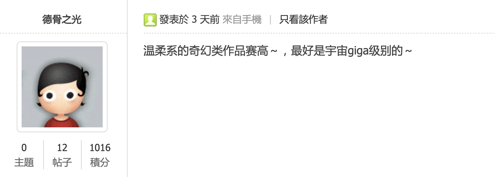
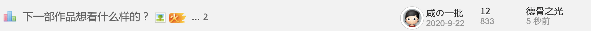

# 關於聊天區一整頁都是投票主題的事情

作者：Dante

TID：30204

<title>1</title> <link href="../Styles/Style.css" type="text/css" rel="stylesheet">

# 1

.
我們應該來開一個投票來調查你覺得這樣的現象可以接受或NG
或者票選一下最廢投票帖
講真的，我都懷疑是不是有人想在圈內搞大數據了。 <title>2</title> <link href="../Styles/Style.css" type="text/css" rel="stylesheet">

# 2

投票贴集群出现确实有点不对劲，不过发帖时间基本都是过去几年的
，一方面可能是帖子内容容易引发讨论与回复，另一方面应该也有刷经验的现象。 <title>3</title> <link href="../Styles/Style.css" type="text/css" rel="stylesheet">

# 3

如果投票贴都是由同一个人发的，确实该观察下这个用户的动机了如果都是由不同用户不同时机发的，并且内容与GTS有关联，其实完全不用在意吧 <title>4</title> <link href="../Styles/Style.css" type="text/css" rel="stylesheet">

# 4

很奇怪，突然间这些好几年前的投票贴都被挖出来了。而且每个帖子的最后回复的人都不同。

是不是因为，有什么别的行为导致这些投票贴被置顶了？

比如说有个新人看到论坛里有可以投票的帖子，就在这些老帖子里面都投了票，但是投票会导致帖子被置顶，所以就有了其他人的回复。

<ignore_js_op>

**Screen Shot 2021-01-25 at 8.25.19 PM.png** *(67.77 KB, 下載次數: 0)*

[下載附件](forum.php?mod=attachment&aid=ODY5ODB8ZjE4ZDEzZTl8MTY3NDA2NjE4MXwxODIzMHwzMDIwNA%3D%3D&nothumb=yes)

2021-1-26 12:25 上傳

没错，举个例子，这个“下一部作品想看什么样的？”的最後發表时间是2小时前，来自德骨之光。而帖子里面，最后的回复是……还是德骨之光，但是是三天前？

<ignore_js_op>

**Screen Shot 2021-01-25 at 8.27.42 PM.png** *(185.03 KB, 下載次數: 0)*

[下載附件](forum.php?mod=attachment&aid=ODY5ODF8ODExYTU4ZDB8MTY3NDA2NjE4MXwxODIzMHwzMDIwNA%3D%3D&nothumb=yes)

2021-1-26 12:27 上傳

嗯，这个帖子我正好没有投票过。我投完之后，“最後發表”就变成5秒前了，但是最后發表者还是显示是最后回复的德骨之光。

<ignore_js_op>

**Screen Shot 2021-01-25 at 8.28.28 PM.png** *(61.37 KB, 下載次數: 0)*

[下載附件](forum.php?mod=attachment&aid=ODY5ODJ8N2E4OTE4NmV8MTY3NDA2NjE4MXwxODIzMHwzMDIwNA%3D%3D&nothumb=yes)

2021-1-26 12:28 上傳

总而言之，有人给投票贴投票的时候，最後發表时间会更新，导致投票贴被顶到最上方。而最後發表人则永远是最后一个回复帖子的人。

而这个问题要怎么解决……我也不知道。因为感觉这个Bug是Discuz的问题，没法简单解决。而要让论坛出个新规矩，旧的投票贴不许投票……感觉也不太合适？

不如说是谁先投票挖坟的，从后台查得到么？

总之嗯，这个“關於聊天區一整頁都是投票主題的事情”是由Bug导致的。只要有人决定把所有的投票贴都投一遍票，就会导致这个结果。
<title>5</title> <link href="../Styles/Style.css" type="text/css" rel="stylesheet">

# 5

有人投票会让帖子顶起来是discuz正常设定，并非bug。毕竟投票本身就是希望曝光度要比一般帖子更高。真正要解决应该是靠管理员主或楼主设定截止时间，而非改代码或删帖。</ignore_js_op></ignore_js_op></ignore_js_op>