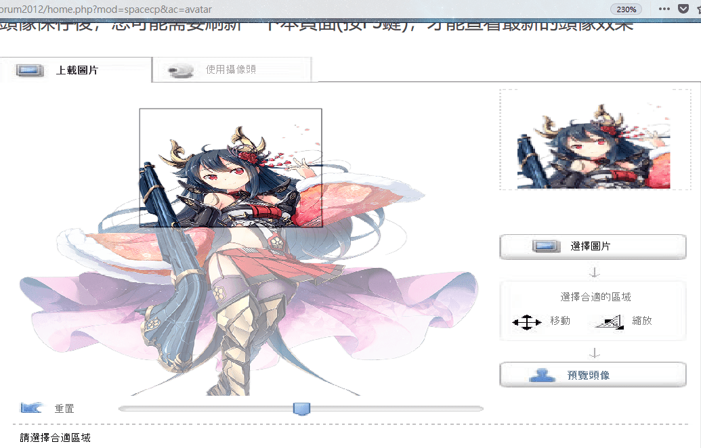
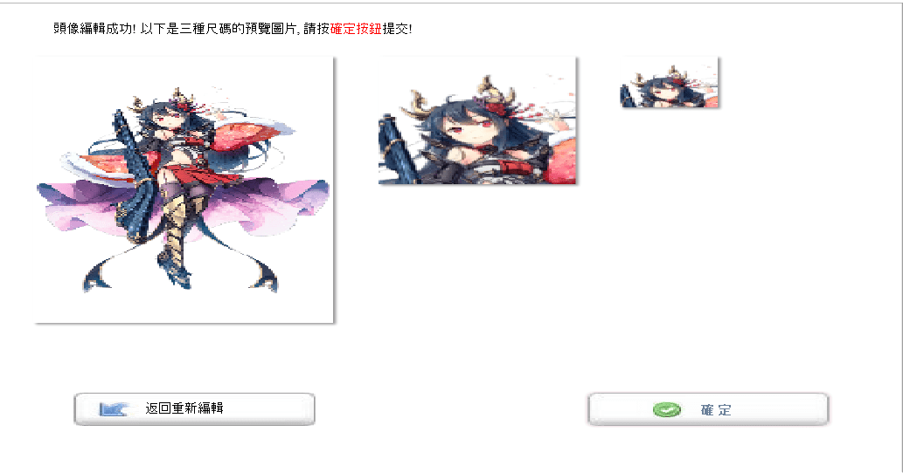
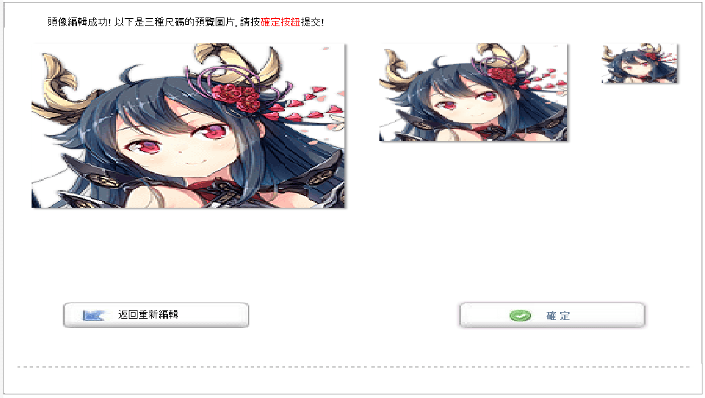

# 關於頭像，我有疑問

作者：rainodog

TID：25631

<title>1</title> <link href="../Styles/Style.css" type="text/css" rel="stylesheet">

# 1

*本帖最後由 rainodog 於 2018-8-5 20:31 編輯*

最近突然想換頭像了((絕不是因為換老婆！！
點進換頭像頁面(先放大至230%...因為太小了)，上傳圖片後......
<ignore_js_op>

**頭像1.png** *(363.97 KB, 下載次數: 0)*

[下載附件](forum.php?mod=attachment&aid=NzM1MTh8MzQ1ZjZjYmV8MTY3NDA2NzA0NHwxODIzMHwyNTYzMQ%3D%3D&nothumb=yes)

2018-8-5 20:14 上傳

嗯......
800x1350的大小變得這麼方正真的沒問題嗎......？？

點下預覽後
<ignore_js_op>

**頭像2.png** *(104.33 KB, 下載次數: 0)*

[下載附件](forum.php?mod=attachment&aid=NzM1MTl8MzU5NDgyZWV8MTY3NDA2NzA0NHwxODIzMHwyNTYzMQ%3D%3D&nothumb=yes)

2018-8-5 20:14 上傳

真的好扁，我都不敢換頭像啦～
我也早就忘了當初我這頭像是怎麼上傳的了

--請問：這樣子上傳後一切都會正常化嗎？？

------------------8/5更新------------------

即使我把圖片裁成正方形(213x213)
結果又強制壓扁......
看來是不行了吧
<ignore_js_op>

**222222.png** *(80.67 KB, 下載次數: 0)*

[下載附件](forum.php?mod=attachment&aid=NzM1MTZ8MTc2ZDlmMDZ8MTY3NDA2NzA0NHwxODIzMHwyNTYzMQ%3D%3D&nothumb=yes)

2018-8-5 20:12 上傳

<ignore_js_op>

**33333.png** *(149.56 KB, 下載次數: 0)*

[下載附件](forum.php?mod=attachment&aid=NzM1MTd8OTdiMjRiZjZ8MTY3NDA2NzA0NHwxODIzMHwyNTYzMQ%3D%3D&nothumb=yes)

2018-8-5 20:12 上傳

------------------8/5再更新------------------

**一切都是替身攻擊！**
**重複一次！**
**一切都是替身攻擊！！**
<title>2</title> <link href="../Styles/Style.css" type="text/css" rel="stylesheet">

# 2

試著把圖片先裁切成正方形再上傳吧
可能讀取圖片的ˊ時候為了強制變成正方形
並沒有裁切而是直接變形
是說論壇的頭貼功能又回來了?</ignore_js_op></ignore_js_op></ignore_js_op></ignore_js_op>