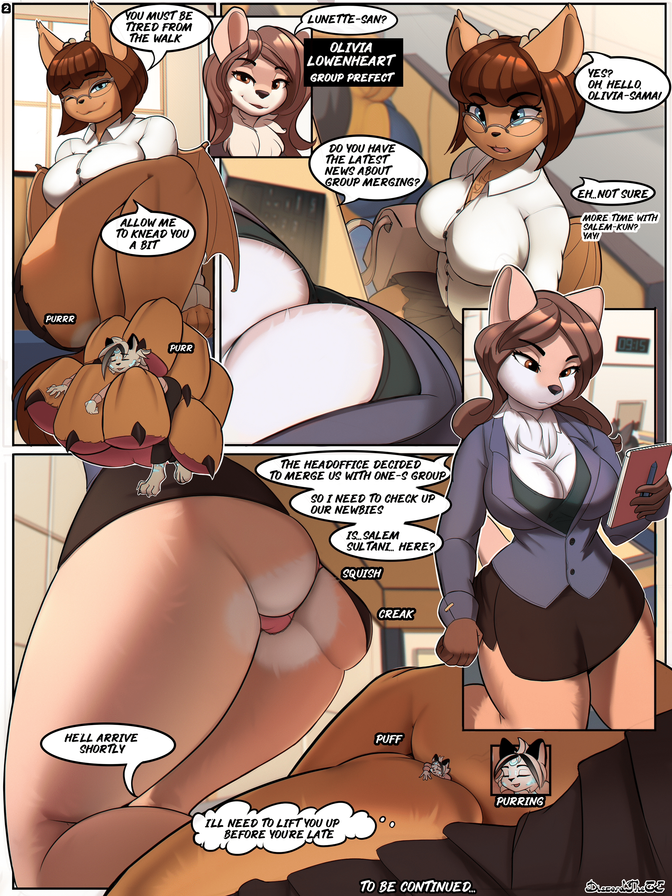
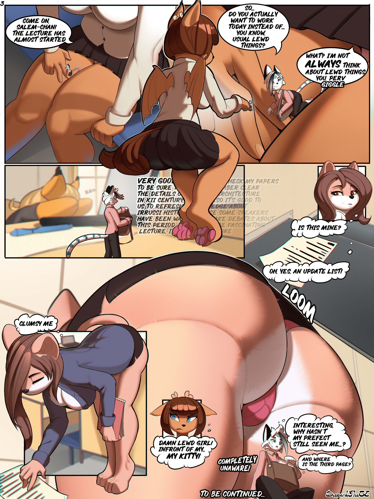
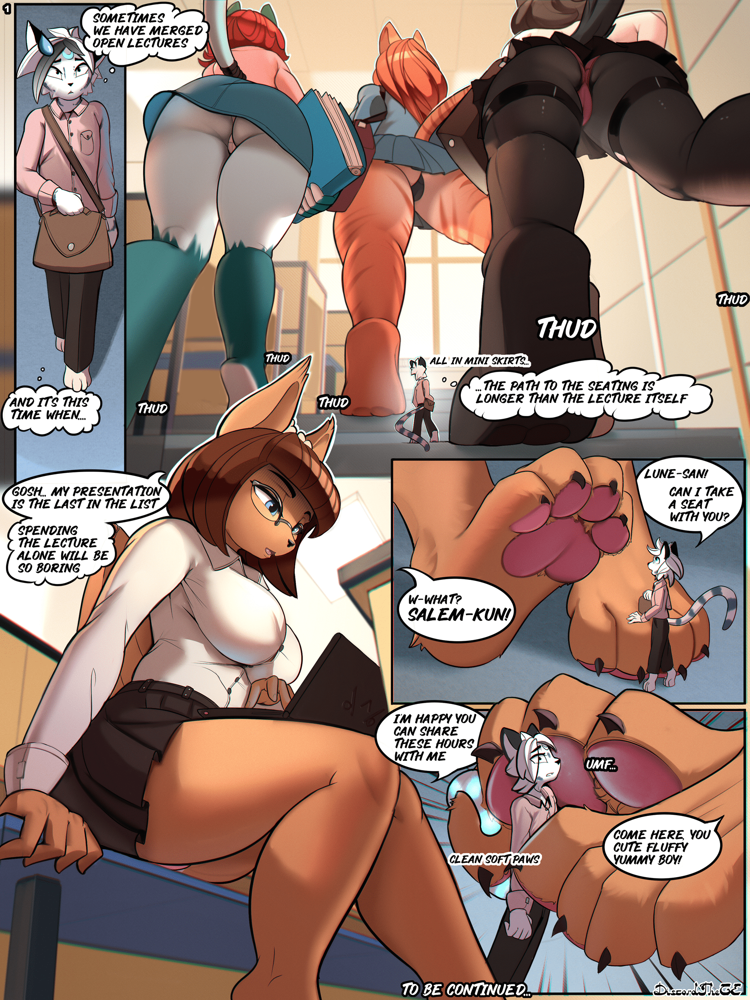

# 问一下大家关于furry的看法

作者：awds713

TID：32656

<title>1</title> <link href="../Styles/Style.css" type="text/css" rel="stylesheet">

# 1

最近在看furry类的 有些还不错 要不搬点试试？ <title>2</title> <link href="../Styles/Style.css" type="text/css" rel="stylesheet">

# 2

比如说这个 artist:notbad621 色调蛮好的 e站有人翻译了一部分 <title>3</title> <link href="../Styles/Style.css" type="text/css" rel="stylesheet">

# 3

 <ignore_js_op>[1511496-7b2e3be2fb-00000002.jpg](forum.php?mod=attachment&aid=OTM4Mzh8NzRiODM5ZTd8MTY3NDA2NTYyMXwxODIzMHwzMjY1Ng%3D%3D&nothumb=yes) *(1.08 MB, 下載次數: 0)*

[下載附件](forum.php?mod=attachment&aid=OTM4Mzh8NzRiODM5ZTd8MTY3NDA2NTYyMXwxODIzMHwzMjY1Ng%3D%3D&nothumb=yes)

2022-2-14 13:29 上傳  

</ignore_js_op> <ignore_js_op>[1511496-7b2e3be2fb-00000001.jpg](forum.php?mod=attachment&aid=OTM4Mzd8OTM5NzIxMTd8MTY3NDA2NTYyMXwxODIzMHwzMjY1Ng%3D%3D&nothumb=yes) *(920.83 KB, 下載次數: 0)*

[下載附件](forum.php?mod=attachment&aid=OTM4Mzd8OTM5NzIxMTd8MTY3NDA2NTYyMXwxODIzMHwzMjY1Ng%3D%3D&nothumb=yes)

2022-2-14 13:28 上傳  

</ignore_js_op> <title>4</title> <link href="../Styles/Style.css" type="text/css" rel="stylesheet">

# 4

还有这个twitter上搜Discord_TheGE
<ignore_js_op>

**2137738-8d8fc07dcd-00000028.jpg** *(2.59 MB, 下載次數: 0)*

[下載附件](forum.php?mod=attachment&aid=OTM4NDB8Y2Q1NTJjZTJ8MTY3NDA2NTYyMXwxODIzMHwzMjY1Ng%3D%3D&nothumb=yes)

2022-2-14 13:36 上傳

<ignore_js_op>

**2137738-8d8fc07dcd-00000029.jpg** *(2.77 MB, 下載次數: 0)*

[下載附件](forum.php?mod=attachment&aid=OTM4NDF8NWUyODBlMjh8MTY3NDA2NTYyMXwxODIzMHwzMjY1Ng%3D%3D&nothumb=yes)

2022-2-14 13:37 上傳

<ignore_js_op>

**2137738-8d8fc07dcd-00000027.jpg** *(2.99 MB, 下載次數: 0)*

[下載附件](forum.php?mod=attachment&aid=OTM4Mzl8Nzk2MmNjN2V8MTY3NDA2NTYyMXwxODIzMHwzMjY1Ng%3D%3D&nothumb=yes)

2022-2-14 13:36 上傳

<title>5</title> <link href="../Styles/Style.css" type="text/css" rel="stylesheet">

# 5

福瑞控是吧   
放到furry区吧 不喜欢福瑞的人会觉得恶心的                     <title>6</title> <link href="../Styles/Style.css" type="text/css" rel="stylesheet">

# 6

> [尼玛s 發表於 2022-2-14 18:45](https://giantessnight.cf/gnforum2012/forum.php?mod=redirect&goto=findpost&pid=494679&ptid=32656)
> 福瑞控是吧   
> 放到furry区吧 不喜欢福瑞的人会觉得恶心的

其实还好，我不是福瑞，勉强能冲。要是脸不是动物的话就完全能冲
<title>7</title> <link href="../Styles/Style.css" type="text/css" rel="stylesheet">

# 7

> [尼玛s 發表於 2022-2-14 18:45](https://giantessnight.cf/gnforum2012/forum.php?mod=redirect&goto=findpost&pid=494679&ptid=32656)
> 福瑞控是吧   
> 放到furry区吧 不喜欢福瑞的人会觉得恶心的

并不是福瑞控 只是发现有些还不错而已 <title>8</title> <link href="../Styles/Style.css" type="text/css" rel="stylesheet">

# 8

> [awds713 發表於 2022-2-14 18:48](https://giantessnight.cf/gnforum2012/forum.php?mod=redirect&goto=findpost&pid=494681&ptid=32656)
> 其实还好，我不是福瑞，勉强能冲。要是脸不是动物的话就完全能冲

比如说兽耳娘这种？ 单纯人外 兽化并不严重？
<title>9</title> <link href="../Styles/Style.css" type="text/css" rel="stylesheet">

# 9

我本人对福瑞的接受程度取决于画风和被娘化的动物品种，如果动物我不喜欢一般就冲不了 <title>10</title> <link href="../Styles/Style.css" type="text/css" rel="stylesheet">

# 10

反正发furry区的话肯定是没有问题的
话说我最早了解furry还就是在gn上（小声） <title>11</title> <link href="../Styles/Style.css" type="text/css" rel="stylesheet">

# 11

我对furry好一些，但起码得有个人的形状，纯动物真顶不住 <title>12</title> <link href="../Styles/Style.css" type="text/css" rel="stylesheet">

# 12

> [B1Zu 發表於 2022-2-14 20:28](https://giantessnight.cf/gnforum2012/forum.php?mod=redirect&goto=findpost&pid=494694&ptid=32656)
> 比如说兽耳娘这种？ 单纯人外 兽化并不严重？

兽耳的话就完全可冲了==============
<title>13</title> <link href="../Styles/Style.css" type="text/css" rel="stylesheet">

# 13

> [Carweirdo 發表於 2022-2-14 22:07](https://giantessnight.cf/gnforum2012/forum.php?mod=redirect&goto=findpost&pid=494707&ptid=32656)
> 我本人对福瑞的接受程度取决于画风和被娘化的动物品种，如果动物我不喜欢一般就冲不了 ...

物种和画风确实 可爱的能接受 要是长颈鹿大象什么的（）
<title>14</title> <link href="../Styles/Style.css" type="text/css" rel="stylesheet">

# 14

> [libido 發表於 2022-2-14 22:22](https://giantessnight.cf/gnforum2012/forum.php?mod=redirect&goto=findpost&pid=494710&ptid=32656)
> 反正发furry区的话肯定是没有问题的
> 话说我最早了解furry还就是在gn上（小声） ...

gn有furry区吗？（） 没看见过啊    我最开始是e站看过（
<title>15</title> <link href="../Styles/Style.css" type="text/css" rel="stylesheet">

# 15

> [B1Zu 發表於 2022-2-15 23:00](https://giantessnight.cf/gnforum2012/forum.php?mod=redirect&goto=findpost&pid=494891&ptid=32656)
> gn有furry区吗？（） 没看见过啊    我最开始是e站看过（

在首页最下面的「GTS特殊领域」那里，「Furry 獸女之島」
<title>16</title> <link href="../Styles/Style.css" type="text/css" rel="stylesheet">

# 16

> [libido 發表於 2022-2-16 01:42](https://giantessnight.cf/gnforum2012/forum.php?mod=redirect&goto=findpost&pid=494924&ptid=32656)
> 在首页最下面的「GTS特殊领域」那里，「Furry 獸女之島」

完蛋 发现从来没去看过极限领域，，，
<title>17</title> <link href="../Styles/Style.css" type="text/css" rel="stylesheet">

# 17

畫風好看，物種看起來像人形
Furry太吃第一眼能不能接受了，大部分還是不能
最後變成只能接受狐狸娘.. <title>18</title> <link href="../Styles/Style.css" type="text/css" rel="stylesheet">

# 18

????这个应该就要因人而已了吧能接受的就感觉还好，不能接受的就感觉不行 <title>19</title> <link href="../Styles/Style.css" type="text/css" rel="stylesheet">

# 19

furry也是分程度的，个人简单划分为：
轻度（部分兽的特征，如兽耳，这也是大多数人能接受的程度，与兽相比人的成分占据主要地位，基本能看作是人）
中度（整体出现兽的特征，如兽毛、肤色开始与兽类似而不是人，这个程度对于furry控来说还算是人（？）但对非furry控来说已经是兽了）
重度（完全是兽的形态，骨骼，尤其是头骨已经是兽的形状）
还有非兽和原生态兽不用介绍了
这个只能说因人而异了（虽然对我来说这已经是能进furry区的了） <title>20</title> <link href="../Styles/Style.css" type="text/css" rel="stylesheet">

# 20

感觉不大。。                                                                        </ignore_js_op></ignore_js_op></ignore_js_op>