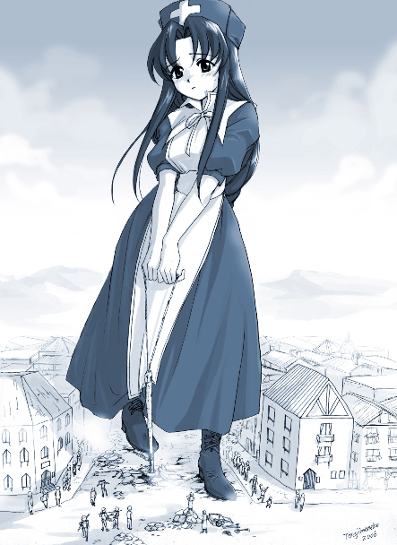

# 问个人物.......

作者：滑煞人

TID：16561

<title>1</title> <link href="../Styles/Style.css" type="text/css" rel="stylesheet">

# 1

最近浏览网站发现很多网站都有此人物的创作，求出处
<ignore_js_op>

**$CD(67TC@N2$HFL7{WU@[_G.jpg** *(264.1 KB, 下載次數: 2)*

[下載附件](forum.php?mod=attachment&aid=NDE4NzJ8M2M5OTI0ODV8MTY3NDA2NzYzOHwxODIzMHwxNjU2MQ%3D%3D&nothumb=yes)

2014-3-27 00:38 上傳

<title>2</title> <link href="../Styles/Style.css" type="text/css" rel="stylesheet">

# 2

*本帖最後由 shendanxiaogui 於 2014-3-27 00:53 編輯*

哪个网站的原创人物吧我记得。。。我去找找。。。
---

---
呜嘎，给
[http://yubanasi.jpn.org/index.shtml](http://yubanasi.jpn.org/index.shtml)
<title>3</title> <link href="../Styles/Style.css" type="text/css" rel="stylesheet">

# 3

通常这角色还会跟着个正太GT..... <title>4</title> <link href="../Styles/Style.css" type="text/css" rel="stylesheet">

# 4

正太什麼的也很棒呢 > < <title>5</title> <link href="../Styles/Style.css" type="text/css" rel="stylesheet">

# 5

不知道。。 <title>6</title> <link href="../Styles/Style.css" type="text/css" rel="stylesheet">

# 6

Yes, she is my original character Eliza.
I hope you enjoy stories and pictures.
This picture is drawn by Trajima-neko, and he mainly draws 巨大正太。 <title>7</title> <link href="../Styles/Style.css" type="text/css" rel="stylesheet">

# 7

> [yunzo 發表於 2014-3-30 22:51](https://giantessnight.cf/gnforum2012/forum.php?mod=redirect&goto=findpost&pid=219264&ptid=16561)
> Yes, she is my original character Eliza.
> I hope you enjoy stories and pictures.
> This picture is draw ...

I like this role, I hope you can create more and better works
<title>8</title> <link href="../Styles/Style.css" type="text/css" rel="stylesheet">

# 8

> [yunzo 發表於 2014-3-30 22:51](https://giantessnight.cf/gnforum2012/forum.php?mod=redirect&goto=findpost&pid=219264&ptid=16561)
> Yes, she is my original character Eliza.
> I hope you enjoy stories and pictures.
> This picture is draw ...

Surprising to meet the author in GN......
Thank for your works
<title>9</title> <link href="../Styles/Style.css" type="text/css" rel="stylesheet">

# 9

楼上都是英文....我根本看不懂 <title>10</title> <link href="../Styles/Style.css" type="text/css" rel="stylesheet">

# 10

表示閱讀毫無壓力的怎麼算？= =b

To Yunzo: Surprised see you here. Any plan about some new stories about her? (: I mean Eliza only stories....lol~ <title>11</title> <link href="../Styles/Style.css" type="text/css" rel="stylesheet">

# 11

Thanks again for reply.
I am sorry, I do not have certain plan for writing... <title>12</title> <link href="../Styles/Style.css" type="text/css" rel="stylesheet">

# 12

> [lu389771428 發表於 2014-4-6 09:39](https://giantessnight.cf/gnforum2012/forum.php?mod=redirect&goto=findpost&pid=219649&ptid=16561)
> 楼上都是英文....我根本看不懂

不会吧，这么简单的英文
<title>13</title> <link href="../Styles/Style.css" type="text/css" rel="stylesheet">

# 13

呵呵，居然还有正太。。。 <title>14</title> <link href="../Styles/Style.css" type="text/css" rel="stylesheet">

# 14

Eliza來源網址 [愉噺？](http://yubanasi.jpn.org/)
常常看到的巨大正太來源[ねこのふぐり](http://www.nekonofuguri.com/)
劇情搭載一起是蠻好玩的,有點像姊弟一同出遊
<title>15</title> <link href="../Styles/Style.css" type="text/css" rel="stylesheet">

# 15

原来这里还可以这么交流啊，但对此图没兴趣 <title>16</title> <link href="../Styles/Style.css" type="text/css" rel="stylesheet">

# 16

看帽子想到了师匠 <title>17</title> <link href="../Styles/Style.css" type="text/css" rel="stylesheet">

# 17

这是一个文静的少女唉 <title>18</title> <link href="../Styles/Style.css" type="text/css" rel="stylesheet">

# 18

哎哟，一群大神秀英语啊。 <title>19</title> <link href="../Styles/Style.css" type="text/css" rel="stylesheet">

# 19

这么说人说英语啊 <title>20</title> <link href="../Styles/Style.css" type="text/css" rel="stylesheet">

# 20

> [滑煞人 發表於 2016-7-16 18:14](https://giantessnight.cf/gnforum2012/forum.php?mod=redirect&goto=findpost&pid=300139&ptid=16561)
> 这么说人说英语啊

因为论坛不只国人，偶尔有国际友人来客串的
<title>21</title> <link href="../Styles/Style.css" type="text/css" rel="stylesheet">

# 21

> [maker13 發表於 2016-7-16 22:10](https://giantessnight.cf/gnforum2012/forum.php?mod=redirect&goto=findpost&pid=300167&ptid=16561)
> 因为论坛不只国人，偶尔有国际友人来客串的

这是国际范围的论坛？
<title>22</title> <link href="../Styles/Style.css" type="text/css" rel="stylesheet">

# 22

> [滑煞人 發表於 2016-7-17 16:40](https://giantessnight.cf/gnforum2012/forum.php?mod=redirect&goto=findpost&pid=300259&ptid=16561)
> 这是国际范围的论坛？

偶尔会有外国的友人来客串，主要还是国人
<title>23</title> <link href="../Styles/Style.css" type="text/css" rel="stylesheet">

# 23

好想看看这个网站的其他mmd视频啊，求问怎么看啊 <title>24</title> <link href="../Styles/Style.css" type="text/css" rel="stylesheet">

# 24

为什么都是一些英语大神，好厉害的样子 <title>25</title> <link href="../Styles/Style.css" type="text/css" rel="stylesheet">

# 25

不过这个人物好像在giantessburoo上见过
<title>26</title> <link href="../Styles/Style.css" type="text/css" rel="stylesheet">

# 26

确实到处都有见过（主要是因为进入素材包了么233）</ignore_js_op>