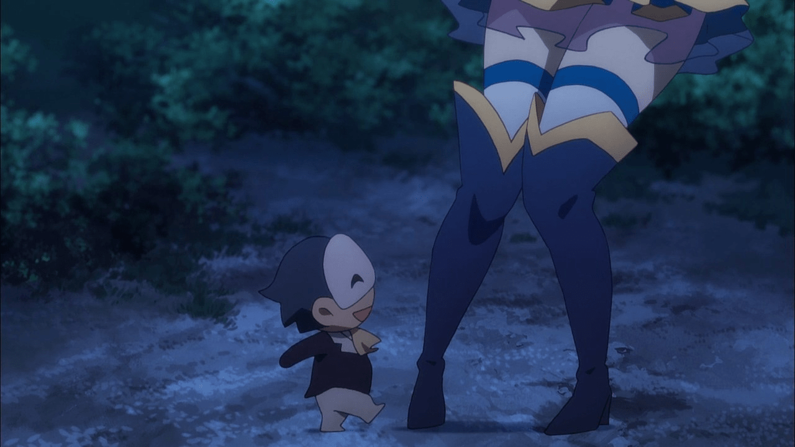

# 问个小小的问题。

作者：fxwan321

TID：25924

<title>1</title> <link href="../Styles/Style.css" type="text/css" rel="stylesheet">

# 1

一个作者旧作的翻新或一部新作，你们更渴望看哪个？ <title>2</title> <link href="../Styles/Style.css" type="text/css" rel="stylesheet">

# 2

哈哈哈 当然是全都要~                        <title>3</title> <link href="../Styles/Style.css" type="text/css" rel="stylesheet">

# 3

除去第三个选项的话可能要具体看不同文章剧情和口味分类了.....如果都一样的话.....那我选新作...毕竟作者总是越写越有经验的吧 <title>4</title> <link href="../Styles/Style.css" type="text/css" rel="stylesheet">

# 4

其實全都要這個惡搞選項就免了
身為一個創作者
很心知肚明要重製一個作品
或是拓展一個新的故事要花多大的心力
這需要的都是時間以及腦力
如果在同樣的時限下
我寧可選擇新作
舊作就當作黑歷史或是回憶吧 <title>5</title> <link href="../Styles/Style.css" type="text/css" rel="stylesheet">

# 5

完全看個案決定吧 舊作是概念有趣技術不足還是想像力太狹隘?
作者的成長是什麼方向的?
我這樣說好了，我會想看到諫山重新處理進擊的巨人前段，但不會想看到荒木重製JOJO第一部或看富監重畫幽遊白書 <title>6</title> <link href="../Styles/Style.css" type="text/css" rel="stylesheet">

# 6

非常喜欢看翻新系列，尤其是传说级作品的翻新（包括填坑） <title>7</title> <link href="../Styles/Style.css" type="text/css" rel="stylesheet">

# 7

如果老的作品因为技术问题做的不是太好但是内容很有潜力而且很有感觉的话
重置是非常欢迎的，因为从各种意义上来说，重新开始和重置都是后者更有观感，因为要补充的东西都可以被补充了 <title>8</title> <link href="../Styles/Style.css" type="text/css" rel="stylesheet">

# 8

其实冷饭不是那么容易炒的，感觉还是新作比较稳 <title>9</title> <link href="../Styles/Style.css" type="text/css" rel="stylesheet">

# 9

正如第三项，我全都要。 <title>10</title> <link href="../Styles/Style.css" type="text/css" rel="stylesheet">

# 10

啊……不过我不太清楚是什么意义上的重置，以前看过楼主的玉藻前那个的重置，感觉那种的话就不算特别期待…… <title>11</title> <link href="../Styles/Style.css" type="text/css" rel="stylesheet">

# 11

那为什么要有第三个选项，肯定是全部都要啊，嗨呀本来很纠结的。 <title>12</title> <link href="../Styles/Style.css" type="text/css" rel="stylesheet">

# 12

选择了全都要的观众们可以看做一半一半的偏好……所以还是渴望新作的人较多啊 <title>13</title> <link href="../Styles/Style.css" type="text/css" rel="stylesheet">

# 13

我觉得应该有个填坑的选项（望向文章区的一堆天坑 <title>14</title> <link href="../Styles/Style.css" type="text/css" rel="stylesheet">

# 14

*本帖最後由 phone2345 於 2018-10-18 20:23 編輯*

感覺翻舊作挺難的，尤其是已經完結的舊作。

如果是未完結的作品，覺得前面章節寫得不好，加強或重構是為了讓故事更完整，也會比較有動力；如果是已完結舊作翻新的話，除非有很大的突破，否則我覺得效益並不高，一來後續劇情讀者已經知道了，難有驚喜；而且花時間翻舊作可能不太容易獲得關注，大多數只能自我滿足。

至於什麼是重大突破，我個人認為有以下三種：
1.舊作可能排版太差，重新排版後明顯有改善者
2.在舊作的基礎上加入額外劇情，或是不同路線的故事，不但充實劇情又讓人有新東西可看者
3.原本純文字的舊作加入非文字的新元素者，例如配圖、影音動畫、體驗遊戲之類的

至於我期待大佬寫什麼好呢？當然是新作呀，不過我認為寫舊作的外傳也是挺好的喔！ <ignore_js_op>

**大佬大佬我要看新作1.jpg** *(108.19 KB, 下載次數: 0)*

[下載附件](forum.php?mod=attachment&aid=NzUyMjJ8ZGI0NzhlMDN8MTY3NDA2Njg5MHwxODIzMHwyNTkyNA%3D%3D&nothumb=yes)

2018-10-18 20:22 上傳

<ignore_js_op>

**大佬大佬我要看新作2.jpg** *(108.22 KB, 下載次數: 0)*

[下載附件](forum.php?mod=attachment&aid=NzUyMjN8ZWM0NGE2ODR8MTY3NDA2Njg5MHwxODIzMHwyNTkyNA%3D%3D&nothumb=yes)

2018-10-18 20:22 上傳

<ignore_js_op>

**大佬大佬我要看新作.jpg** *(119.73 KB, 下載次數: 0)*

[下載附件](forum.php?mod=attachment&aid=NzUyMjF8YzhkYzZmODF8MTY3NDA2Njg5MHwxODIzMHwyNTkyNA%3D%3D&nothumb=yes)

2018-10-18 20:19 上傳

大佬大佬我要看新作！

<title>15</title> <link href="../Styles/Style.css" type="text/css" rel="stylesheet">

# 15

如果能都要当然都要了啊</ignore_js_op></ignore_js_op></ignore_js_op>